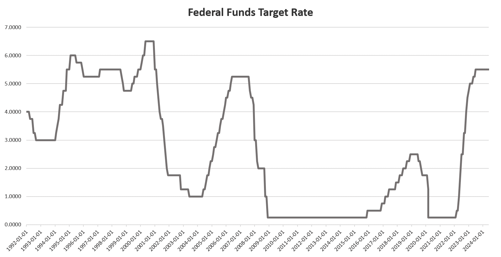
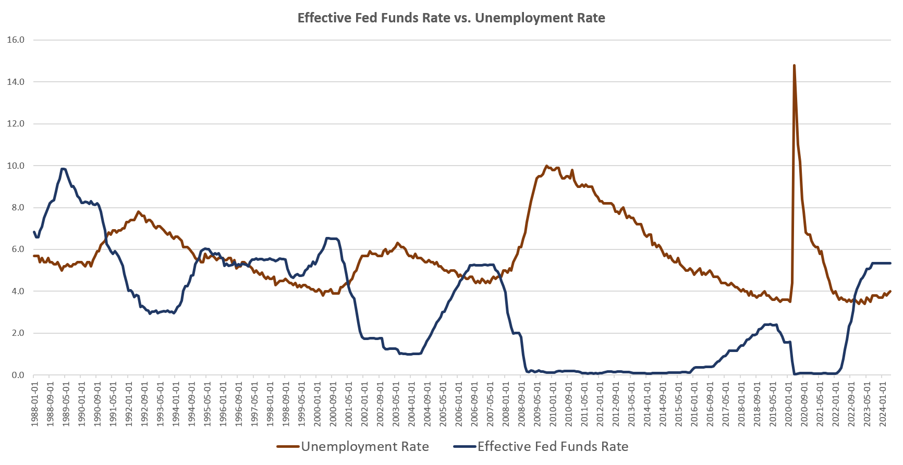
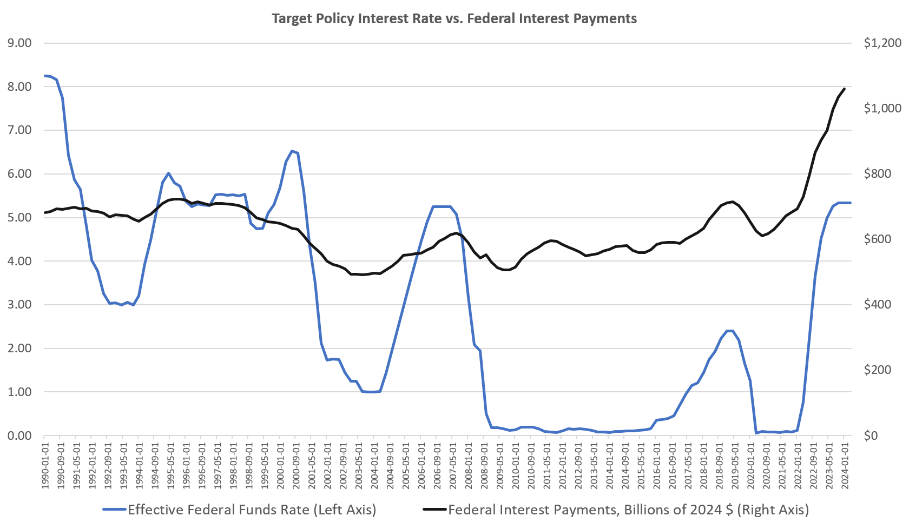

# 美联储的秘密议程 Fed's Hidden Agenda

号外：[6.17内参：战报会骗人，但战线不会](http://rd.liujiaolian.com/i/20240618)

* * *

编译 | 刘教链

教链按：本文是来自“米塞斯学院”Ryan McMaken的稿子，原标题是「美联储“软着陆”叙事背后的真实故事（The Real Story Behind the Fed’s “Soft Landing” Narrative）」。昨{2024.6.17内参：战报会骗人，但战线不会}提到，美联储对于今年的降息预期是一推再推。下半年即将到期需要置换的美债，如何找到接盘侠？可能与你想象的恰恰相反，美联储坚持高息，是为了让美债更容易卖得出去，从而帮助美国联邦政府完成赤字融资，支撑其对内社会福利和对外战争援助等巨额开支。一旦美联储按下降息按钮，回流美国的资本就会一哄而散，天量美债就会无人接盘。为了增加一个双保险，美联储已经在6月份悄然启动了放慢缩表的动作，以便于亲自下场购买美债，促进美债销售。这一点教链早在{2024.5.28教链内参：门头沟14万枚BTC异动，会造成市场崩盘吗？}中就给各位汇报过相关消息。

何谓“收割”？收割一词，由“收”和“割”组成。一收一割，先收后割。如果收上来了但没有割到，或者想割但没有收上来，那都是收割的失败。这一轮加息紧缩，美联储先是打出高息利诱加地缘动荡驱赶的组合拳，完成了“收”，把大量美元资本收回到国内，让它们回流到美债或者美股市场，现在的主要工作就是要趁着最后的窗口期，能割一茬是一茬。所谓的“割”，就是要把回流的资本给赶到美债上面去，用零成本印刷的美债白纸，换走你的真金白银。如果给“收割”换一个文雅的说法，我想应该就是奥地利经济学派大师们口中的“资本错误配置”。

文 | Ryan McMaken. The Real Story Behind the Fed’s “Soft Landing” Narrative. 2024.6.13

美联储联邦公开市场委员会（FOMC）昨天将政策目标利率（联邦基金利率）维持在 5.5%不变。自 2023 年 7 月以来，目标利率一直持平于 5.5% —— 美联储在等待，希望一切都会好起来。在周三的 FOMC 新闻发布会上，鲍威尔（教链注：美联储主席）在事先准备好的发言中继续传递他在过去一年的这些新闻发布会上通常使用的舒缓信息。他传达的总体信息是：经济温和但持续增长，就业趋势“强劲”，通胀趋缓。

鲍威尔随后将这一经济观点与美联储政策的总体叙事相结合，即FOMC将保持稳定，直到委员会认为通胀正在回归“2%的长期通胀目标”。一旦美联储“确信”目标通胀水平已经实现，那么美联储将开始削减目标利率，这将使经济重新进入另一个扩张阶段。

尽管如此，鲍威尔和 FOMC 仍坚持认为，不会出现重大颠簸，并将实现“软着陆”。也就是说，鲍威尔和美联储反复告诉公众，美联储将在拉低物价通胀的同时，确保经济继续稳健增长，就业保持强劲。

但这种叙事有两个问题：首先，美联储从未真正做到这一点 —— 至少在过去 45 年的任何时候都没有。实际情况是这样的：美联储一直否认经济衰退即将到来，直到衰退开始后才承认。然后，美联储在失业率已经开始上升之后才削减利率。

该叙事的第二个问题是，美联储的动机并不仅仅是对就业和经济状况的担忧。是的，美联储会让我们相信，它只关心对经济数据的公正解读，美联储的政策也仅以此为指导。美联储声称“数据驱动”就是这个意思。实际上，美联储关心的完全是另一件事：压低利率，以便联邦政府能够继续以低收益率借入大量资金。联邦政府越是增加其巨额债务，央行就越有压力保持低利率，并使利率走低。

是的，美联储确实害怕物价上涨，因为物价上涨会导致政治不稳定。当这种恐惧胜出时，美联储就会让利率上升。但是，联邦财政部也希望美联储为联邦政府中那些不厌其烦地进行赤字支出的精英们保持低利率。当赤字支出的“需求”胜出时，美联储就会迫使利率下降。这两个目标是直接对立的。不幸的是，如果美联储必须在两者之间做出选择，它很可能会选择降低利率和物价上涨的道路。

## “软着陆”究竟是如何发生的

让我们先来看看“软着陆”的神话。至少从 2001 年经济衰退开始，有关“软着陆”的言论就在美国媒体上屡见不鲜。例如，早在 2001 年 7 月，彭博社的作者就在猜测软着陆会有多软。最终的结果是，经济并没有软着陆，Dot-Com 公司（教链注：指互联网科技公司）很快就破产了。

在大衰退之前，“软着陆”的说法更加突出。早在 2008 年年中，经济衰退已经开始数月之后，美联储主席本·伯南克（Ben Bernanke）就预测经济会软着陆，根本不会出现衰退。在那次衰退中，失业率达到了 9.9%。

我们现在又看到了这一切。看看美联储的《经济预测摘要》（SEP）就知道，美联储官员坚持声称不会出现经济衰退，经济增长将继续保持缓慢、稳定和积极的轨迹。是的，《经济预测摘要》表明美联储将很快开始降息，但在这个幻想版的经济中，随之而来的将是持续的经济增长和稳定的就业。

但现实生活并非如此。例如，请注意，在过去的 30 多年里，美联储降息并没有结束“软着陆”，而实际上恰恰是在失业最严重的时期之前。从图中可以看出，联邦基金利率的下调是在失业率大幅上升前几个月出现的。例如，1990 年开始大幅下调利率，1991 年的经济衰退很快随之而来。同样，美联储在 2000 年底开始降息，随后失业率很快加速上升。这种情况在 2007 年再次发生，美联储降息后不久，失业率就开始上升。

当然，我并不是说联邦基金利率的下调导致了失业率的上升。我是说美联储知道经济不会软着陆，知道经济衰退即将到来。这就是为什么美联储在恐慌时按下了降息按钮，希望缩短即将到来的衰退。

这一现实表明，绝对没有理由相信美联储声称一切尽在掌握的说法，只有美联储在不戳破助长就业和消费支出的诸多泡沫的情况下，于经济衰退前，采取了足够多的紧缩措施来抑制通胀之后，才会降息。

总之，美联储是这样运作的：由于担心通胀失控，美联储将提高目标利率，并普遍“收紧”货币政策。在此过程中，美联储会坚称经济不会出现衰退，“软着陆”正在酝酿之中。但最终，经济明显大幅疲软，美联储要么在经济问题上撒谎，要么根本就是错的。这时，美联储就会采取近几十年来担心经济衰退时的一贯做法：放松货币政策，希望吹起一系列新的泡沫，创造一个新的繁荣期。

这与美联储希望我们相信的沉着、谨慎和完美控制的货币政策故事大相径庭。

## 美联储的存在是为了用宽松的货币为联邦政府提供资金  

鲍威尔说法的第二个问题是，美联储的动机并不仅仅是对就业和经济状况的担忧。虽然觉得美联储主要关注“普通人”及其就业前景是件好事，但现实情况是，美联储非常关注保持低借贷成本，以便米奇·麦康奈尔（Mitch McConnell）、南希·佩洛西（Nancy Pelosi）等人能够继续购买选票，并通过巨额赤字支出为战争福利国家推波助澜。

通过迫使利率下降来保持低借贷成本，现在比几十年来任何时候都更加重要。在过去四年中，联邦债务总额从 23 万亿美元猛增至 34 万亿美元，增加了 11 万亿美元。在利率接近于零的环境下，这也许是可以控制的。然而，当这种债务与不断上升的利率结合在一起时，利息支出就会迅速增加，并在联邦预算中占据越来越大的比重。如果政府稍有不慎，就可能面临主权债务危机。

当美联储能够在不担心通胀失控的情况下强制降低利率时，债务上升就不是什么紧迫的问题了。从图中我们可以看到，在大萧条之后，联邦债务的快速上升并没有导致利息成本的大幅增长。不过，那是在利率非常低的时期。然而，自 2022 年以来，由于美联储被迫允许利率上升，债务的利息成本急剧上升。

事实上，自 2021 年以来，利息成本已经翻了一番多。然而，我们甚至还没有看到债务增加和利率上升的全部影响。过去几年，由于联邦债务不是一次性到期，利息成本在一定程度上得到了控制。然而，到 2024 年，将有价值近 9 万亿美元的联邦债务到期。这就需要用新的债务来替代，而新债务需要以比到期债务更高的利率（即更高的收益率）来偿还。加上 2024 年新增的 2 万亿美元左右的债务，联邦政府将需要有人购买价值超过 10 万亿美元的联邦债务。这么多的债务，人们希望美联储能帮助联邦政府以某种方式阻止利率进一步上升。这就需要美联储进入市场，购买大量债务，以压低收益率。

换句话说，政治现实将意味着，无论物价通胀率是否达到 2% 的目标，美联储都必须接受新的降息措施。无论现实是否如此，美联储都会说物价上涨已经达到了“目标”。由于美联储现在以平均值和长期趋势来定义其 2%的目标，因此美联储只需说它已确定“趋势”指向价格通胀下降。

然后，没错，美联储就可以去做对联邦政府来说真正重要的事情了：通过强制降低利率来清洗联邦赤字。

昨天，杰罗姆·鲍威尔表演了作为央行政治合法性基础的惯常歌舞：声称自己正在巧妙地管理经济，同时声称自己深切关注面临物价上涨蹂躏的普通人的日常挣扎。这套把戏背后的真实情况却大相径庭。

