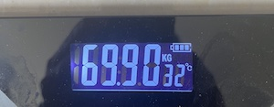

# 我和市场一起瘦身，两个月成功减掉8公斤

号外：[6.19内参：SEC不再指控ETH销售属于证券交易，Consensys如是说](http://rd.liujiaolian.com/i/20240619)

* * *

这两天加密市场“瘦身”得挺厉害。BTC还在65k稳如泰山，但是山寨们早已坚持不住了。{昨晚2024.6.19教链内参也说到，据统计目前top 115的山寨币整体上相对于2024年3月份高点回撤50%，属实是腰斩了}。

就在这两天，教链也悄然完成一项“秘密任务”：把体重降到了70kg以下。

两个月前的4月中旬，忽一天发现体重竟然达到了78kg，超出了肥胖线，于是毅然决定减肥，并在心中制定了一个目标，就是减至70kg以下。如今两个月过去，目标初步达成。

投资上能战胜市场的人，减肥上就能战胜自己。

据说从进化论的角度，35岁以后男性激素水平下降，心力和冲劲会大幅衰退。这可能也是所谓互联网大厂每年都要向社会输出大量35岁以上老员工的生物学原因。说到底，学生物不能帮你找到更高薪的工作，但是可以帮助你搞清楚为什么中年失业啊哈。

中年男性的病根儿，就是两个病：一个是穷病，一个是胖病。通常而言，瘦下来能解决80%的问题。剩下20%的问题，去囤点儿BTC仓位。

道理很简单：失去BTC，失去金钱；失去健康，失去一切。

上医治未病。年轻的时候能越早明白这个道理，趁早攒钱囤BTC，注意劳逸结合、加强锻炼，别为了老板的利润把自己的身体累垮了，就越能及早建立起健康仓位和BTC仓位，也就越早摆脱牛马生活。到了中年，身轻体快，生活无忧。想做点儿什么感兴趣的事，有充足的精力和财力去做，实现了自我生产力的完全解放。

退而求其次，就是像教链这样，亡羊补牢，时尤未晚。十五年前教链访欧时，曾一度胖到惊人的88kg。然后也引起了身体的一些小问题。再后来，若干年以后，基本恢复到75kg左右的临界水平。最后就是到了2024年3、4月份，体重又开始增长，偶尔就会感觉困乏、疲惫、不适。这一次，教链没有采取诺贝尔经济学奖得主哈耶克自由放任、相信新陈代谢系统会自我调节的思想，而是采取了有目的、有策略、有步骤的宏观调控思路，来实施减肥。

作为一个多年囤BTC，并实施“八字诀”坚持定投、逢跌加仓的长期主义者和长线投资者，教链深知减肥瘦身这种事，也要以同样的毅力和坚持，持之以恒地去做。

减肥和“八字诀”投资一样，都是讲求从小处入手，涓涓细流，点滴积累，积跬步致千里，积小胜为大胜。

你不能总想着梭哈速胜，一蹴而就。投资一把梭，肯定割肉多。减肥太冒进，总半途而废。

减肥和投资一样，你要相信和借助时间的力量。但躺着不动是肯定借不到时间的力量的。你需要知道，要做一个能够不断不断重复的小事情。这件小事情在重复次数的时间积累下会具有复利般的效应。就像BTC每10分钟就计算出一个合格的hash数值，并制造出一个BTC区块一样，永不止息，滴水石穿。

这个小事情做起来要几乎没有难度，没有门槛，没有障碍。抬手就能做。否则，你会一直停留在思想层面，而迟迟无法落实到行动。

对于减肥而言，主要就是两点：一、节食；二、运动。众所周知对吧？所谓“管住嘴”、“迈开腿”。理论人人都懂，实践却不是人人都能做到。纸上得来终觉浅，绝知此事要躬行。最重要的，还是要找到适合自己的具体做法，并行动起来，贯彻下去。

战略上要藐视“敌人”。坚定相信只要坚持节食、坚持运动，就一定能够瘦下去。就像每一次加仓时，都坚定相信BTC将来某一天，一定会高于这个加仓价。

战术上要重视“敌人”。仔细探究适合自己身体特点的方法，并且是能够长期坚持下去的方法。如果你使用的方法让自己的身体感觉特别痛苦，那么你会很难长期坚持的。而三天打鱼、两天晒网，半途而废，有始无终，都会导致你的减肥大计中道崩殂、功亏一篑。

就像最适合的单次加仓金额，那必须是假使加完仓之后就遭遇BTC暴跌，能够完全不影响你的心情和睡眠。连续加仓一年半载的，越加越低，你仍然能够继续坚持加下去，而不会两股战战。这个额度，可能才是刚刚好适合你的心理承受力的额度。太高，或者太低，都不够好。

教链所采取的具体瘦身计划，就很轻松，不极端。

首先是节食。没有断食，一日三餐还是保持。但是量要减，减到每次只吃个七八分饱，以到下一餐前会出现饥饿感为度。最关键的是，戒断碳水化合物，比如米饭、面条、馒头、包子等等，或者说，不吃主食。鸡鱼肉蛋，牛奶，豆腐，补充蛋白质，都可以少量或适量食用。喝粥（大米粥或小米粥）以补充少量碳水化合物，避免代谢性酸中毒。多吃蔬菜，补充粗纤维和维生素。感到饥肠辘辘就吃黄瓜、西红柿、胡萝卜这种随处可见、洗了就能生吃的蔬菜，搭配一些坚果类食物，来满足饱腹感。水果可以正常吃。

这个节食方案还是比较轻松的。实在熬不住就吃点儿肉开心一下。教链五一假期跑出去玩还吃烤羊腿来着，也没影响减肥。只是刚开始两周会觉得很饿，因为胃还没有适应新的食谱。坚持两周以后，胃就会慢慢适应，就不会有那么强烈的饥饿感了。

其次是运动。主要是三类运动：第一是每天（没有非常严格）的力量锻炼。就是室外随处可以做的，仰卧起坐，俯卧撑，深蹲。不用去健身房。第二是耐力锻炼，每周跑一两次5km。不需要追求速度。有时候放慢5-10分钟，会跑的更舒服，对膝盖和关节的损伤也更小。第三是全身锻炼，每周打一次羽毛球。挥拍运动是公认减缓衰老、降低全因死亡率的最佳运动种类。

可以看出，在运动方面，教链也没有上强度，只是做了一些平平无奇的正常锻炼。主要还是要考虑自己的身体状况，不要一开始就“180度大转弯”，从天天躺平突然剧烈运动，那会直接把身体搞坏，甚至住进医院，让整个计划被迫中止。

还有一点需要注意的小问题就是，为了避免在运动时出现低血糖，最好在跑步或打球前吃一块硬糖。运动饮料可以补充电解质。吃香蕉可以补充钾离子（人体钠钾泵需要）。泡腾片可以补充维生素。这些都可以作为运动的辅助饮品或食物，进行适度补充。

总结下，要说上面的两个方面，节食是起关键性作用的，运动则只是辅助作用。也就是说，如果管不住嘴，任凭怎么运动，也都是收效甚微的。可能减肥的第一步，不是去办一张健身卡，而是先卸载掉手机里的各种美食App。

就是用这套策略和方法，从4月到6月，教链成功减去了8kg的体重，折合平均每周减轻1kg。

体重一减轻，自己能够极为真切地感受到身体的状态变化，仿佛逆生长了一般，年轻十岁的感觉。

现在收官阶段，还要再接再厉，在新的重量水平上，让身体逐步建立起新的新陈代谢平衡，同步逐渐恢复正常饮食。当然，对饮食总量的控制，以及坚持运动和锻炼，还是需要继续保持下去的。

记得有一种说法，饥饿能够让人体去“消化”掉身体里的有害组织，比如肿瘤细胞，或者其他什么有害变异。

已故苹果公司创始人乔布斯曾经很喜欢引用这句格言：“保持饥饿，保持天真”（Stay hungry, stay foolish）。

如今加密市场的回撤打爆场内杠杆，洗盘震荡让很多囤BTC待涨的人感到“饥饿难耐”，但是正是在这“饥饿”的背后，是对山寨、模因、土狗等“癌症组织”的“血洗”和“手术”。也只有经过这样的新陈代谢，市场才能消除过度的泡沫和“虚胖”，重新“瘦身”，恢复健康，为未来的良性发展奠定坚实的基础。
