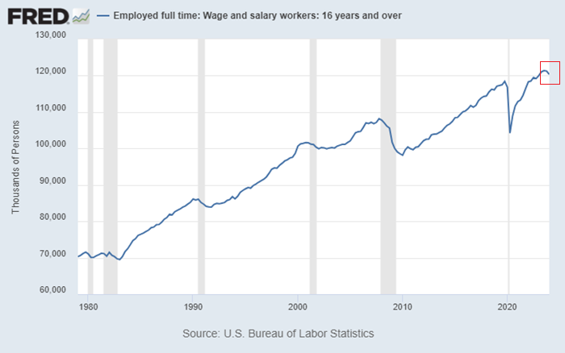
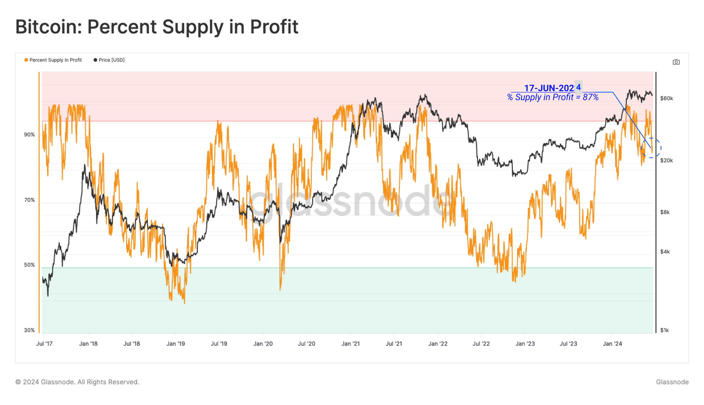
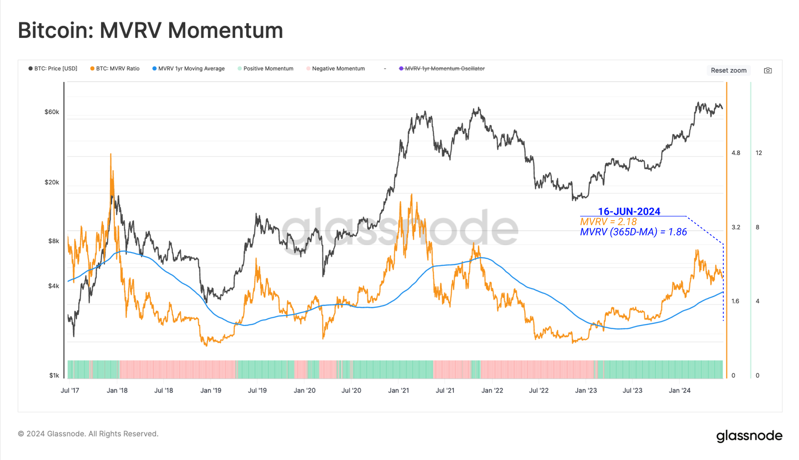

# 不上涨就是一种罪

号外：[6.20内参：周四，一次假高潮](http://rd.liujiaolian.com/i/20240620)

* * *

{周四夜，市场来了一次假高潮}。这便是昨晚内参中所提到的。美国的初请失业金人数超出市场预料。失业对美国工薪阶层是坏事，对金融市场却是利好。坏就是好。脑回路清奇。美国人失业了，但是比上周来看，失业人数却又是下降了。不失业对美国劳动者是好事，对金融市场却是利空。好就是坏。其实不是金融市场脑回路清奇，而是逻辑链条上插进了一个美联储。

美国人的就业数据，是否又面临一个拐点，处于暴跌的边缘，引领经济衰退呢？

是不是领工资，是不是离不开工资，把现代社会的人划分成了两个阶层。工薪阶层自己付出劳动，为企业创造100块钱收入，自己拿走10块钱。这10块钱叫做工资。这100块钱减去各种费用成本之后，剩下20块钱，这叫做利润。利润里面拿出10块钱按照股份数量拆分给各个股东，这叫做分红。

股东为什么有权持续分走利润？标准答案是，因为他们是出资人。但是，即便是当分红已经完全偿还了他们的出资之后，他们仍然可以持续无条件拿走完全是由工薪阶层劳动所创造出来的利润，直到永远（除非企业破产）。这就是资本主义。

你觉得这个系统设计好公平，好合理，好透明，好符合实际。这就叫资本主义意识形态。意识形态不是洗脑，而是让人们发自内心地认可一种逻辑。

金融市场是对上述逻辑的高度抽象。把工资的支付和利润的生产抽离，只剩下数字：投资，以及收益。企业抽象成一个符号，和任何金融标的并无二致。

于是你就更加不可能去审视整个收益创造和分配的过程，是否公平正义了。你能看到的只剩下：把100块钱投入XYZ，每年分红20%，类似这样的数字游戏。

然后，我们把分红20%也掩盖起来，把它变成XYZ股价的上涨。这就进一步变形成了：XYZ的CAGR（复合年化增长率）为20%。

这是一系列惊人的戏法儿。到了这一步，资本已经全然消失了。人们眼中能看到的，只有一个资产XYZ。

最后，我们让XYZ在金融市场上自由交易和买卖。如此一来，心理预期、宏观因素都会掺和进来，挑动着人们的神经，拖拽着标的的价格。它开始波动起来了。上下翻滚，浪奔浪涌。

在资本主义生产方式依然主导这个世界的时代，对于任何一个金融标的而言，不上涨就是一种罪。

3月份以来，在主流横盘震荡、山寨腰斩血洗的加密市场煎熬的韭菜们，对这句话或许格外深有体会。他们可是太盼望上涨了。他们宁愿自己有罪，也不愿意他们手里的筹码有罪。

如果这些韭菜投资的本金，还是从工资收入里省吃俭用压缩出来的，然后却又被下跌所收割，那么他们就是受到了这个资本主义系统的“双重剥削”，简直比开心打工领工资、花工资让自己快乐的工薪阶层活得更加惨烈。

总体上，资本主义这套系统能够支付给工薪阶层总体的工资，会在满足劳动力再生产（比如你自身的休息、学习，以及生育下一代打工人）的边缘游走，往往会更少。因此，想从工资里省吃俭用，攒够翻身的本钱，那是难如登天的事，必然要以牺牲其他劳动力再生产要素为代价，比如：

休息、锻炼、娱乐、学习、结婚、生娃、……

基本上，你每次从工资里节约出一点儿钱去进行所谓的“投资”，都是以牺牲上述要素中的一项或几项为代价的。

可是当你牺牲了那么多之后，你“投资”进去，却被庄家、项目方、平台、做市商玩弄于股掌之中，反复收割，最后毛都不剩一分。如果这还不叫做惨烈，还有什么叫惨烈？

这种无声的惨烈，简直都要超过待业大毛熊上前线壮烈牺牲，后方老家妻子孩子都得到大额抚恤金以及荣誉称号。毕竟，为国捐躯了，还有孩子把基因延续。当韭菜被割光了，最后真的是从这世界彻底消失。

最长的劳动力再生产时间是多久？生一个娃，养大到能干活，走向社会开始劳动赚钱，需要20-30年。

一个投资品，如果20年不能续创新高，不能做到任一买点20年后必然涨至盈利，那么这样的东西就是祸害一代人，无异于一种犯罪。

加密市场的周期更短。短到BTC的产量减半周期。4年一个周期，一个轮回。

对于作为投资标的的加密资产而言，一个币，如果穿越一轮牛熊之后不能再创新高，那就是一种失败；一个币，如果不能做到任一买点4年之后必然涨至盈利，那么这种东西就是收割的镰刀，是一种欺骗和犯罪。

据统计，至2024年6月中旬，全部BTC持仓中，87%的仓位处于盈利状态。平均未实现收益率为+120%！这显然是两个令人印象深刻的数字！

