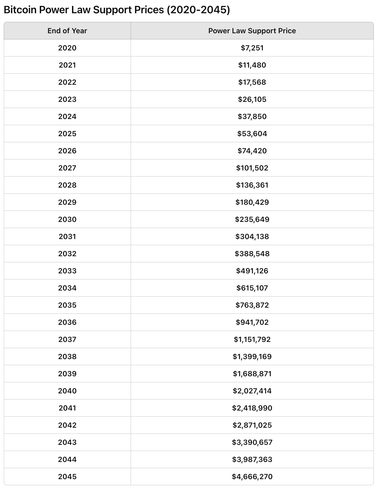

# 6.3万美刀BTC的车还能上吗？

号外：[6.23内参：BTC矿工火线抛售几十亿刀](http://rd.liujiaolian.com/i/20240623)

* * *

隔夜BTC接连下挫，一度击穿63k(6.3万美刀)。[昨夜6.23内参说到了几个导致近期行情低迷的原因，比如，仅6月份以来，BTC矿工们就以一年来最快的速度，向市场倾泻了几十亿美刀的现货]。

其实，矿工慌不迭地出货，是个好事。尤其是当矿工被迫尽快抛售其挖出的新币时。

道理很简单：

假设某矿工以4万刀的成本开采一枚BTC，并立刻以市场价6万刀卖出，那么他从BTC系统“透支”了2万刀的利润，并向BTC系统注入了价值4万刀的“负熵”。

如果他没有财务压力，不急于在6万刀抛售这枚BTC，而是暂时先囤积起来，待价而沽，那么当BTC涨到10万刀的时候他再抛售，他就从BTC系统“透支”了6万刀的利润，并向BTC系统注入价值4万刀的“负熵”。

很显然，站在BTC系统的立场和视角来看，付出2万刀的代价换来4万刀的价值，相比付出6万刀的代价换来4万刀的价值，哪个买卖更划算，是一目了然的。

当4月份产量减半发生后，该矿工开采一枚BTC的成本立刻翻倍，涨到了8万刀。但是他以6万刀市价抛售也还是亏损的。

如果他这样做，就是在从系统支取负2万刀的利润，还给系统注入了8万刀的价值。

此时他的最佳策略应该是暂时囤积，直到BTC价格涨过8万刀再图抛售。

但是，BTC的生产是在持续消耗他，这就是PoW（工作量证明）的妙处：矿工会被迫在有限的时间内抛售BTC，而无法长期持有。（PoS恰恰缺失这一特性，从而形成固化的阶级不平等）

他可以选择“置换”。即以6万刀市价抛售此前生产成本为4万刀的BTC，而把生产成本8万刀的BTC暂时囤积起来。

市场是比独立个体更高位阶的智能体。它会感知到矿工手里还有低价存货，于是就偏不迅速拉升，反而下跌，逼迫矿工消耗其库存。

什么时候低价库存消化的差不多了，有足够比例置换成了高价库存，什么时候市场才会开始转入拉升。

虽然价格领导算力，算力挂钩成本，但是价格也决然不能长期高于成本，因为那代表着市场正在和矿工长期进行不公平的交易。

长期来看，市场会把矿工的利润率压缩在一个微妙的，尽可能小而又具有一定竞争力的范围内。关于这方面，可以回顾一下教链2023.8.14文章《比特币挖矿难度的自动调节及其效果（2个真实案例）》中的数据，13年矿工CAGR仅2.4%而已。

那么，矿工去库存的阶段，BTC倒车接人，此时是一个良好的上车机会吗？从上述逻辑来看，在这一阶段上车，你就是在占矿工的便宜。

从幂律来看，现在的价格区间正处于回归线上。这是一个纠结的位置，既不是大幅低于回归线的抄底时机，也不是大幅高于回归线的抛售时机。

据网友测算，从回归线上下一个sigma，2025年底的价格区间会在54k-228k之间。如果扩大到2 sigma，那么区间范围就扩大到43k-533k。

在概率上，1 sigma = 68%, 2 sigma = 95%。即，68%的概率不超过22.8万刀，95%的概率不超过53.3万刀。

当然，不同的幂律模型因为拟合参数略有差异，所以它们之间不完全一致，这点儿误差是可以接受的。

比如另一位网友计算的支撑价格表：

从表中可见，2023年底2.6万刀，2024年底3.8万刀，2025年底5.4万刀，2026年底7.4万刀……这些位置是万难跌破的支撑位。

因此，回到最初的问题，63k BTC的车还能上吗？

这个问题的答案取决于手里的资金长短。

如果能活过3年，熬过2026年底之后不会再低于7.4万刀，那么现在6.3万刀(63k)的加仓成本显然是不太会有问题的。

