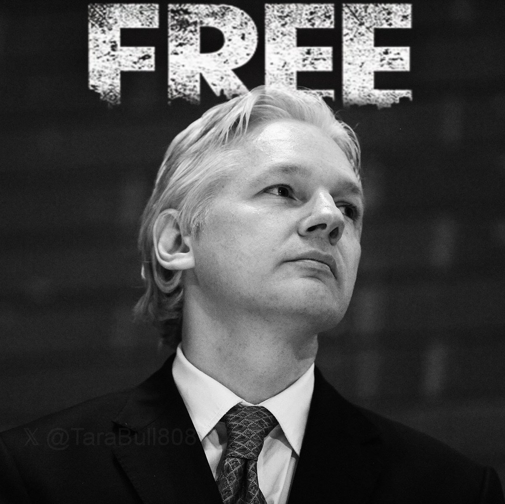

# 密码朋克反美霸权的又一次胜利！

号外：[6.25内参：Mt.Gox抛压半定量再分析，或将远小于市场预期](http://rd.liujiaolian.com/i/20240625)

* * *

隔夜BTC继续反弹至62k一线。[昨晚内参中教链再一次拉出过去半年多来对于Mt.Gox赔付的时间线，以及半定量分析，来说明一个道理，那就是有些事情本不是多大的利空，只不过是被别有用心的空头借题发挥、小题大做、借机生事、制造恐慌罢了。](http://rd.liujiaolian.com/i/20240625) 教链5月份就在内参里给大家计算过，仅凭Mt.Gox这点儿量，都不用到6万刀的深度就足以消化和吸收掉。更何况，这些传说中的筹码现在根本就还没有流出好嘛？人吓人，吓死人。

昨天大事连连。维基解密（wikileaks）官推发帖称，朱利安·阿桑奇（Julian Assange）终于获释，即将离开英国，返回他的故乡——澳大利亚。

贝尔马什（Belmarsh）最高警戒监狱的牢房仅有3米长、2米宽。阿桑奇就是被隔离监禁在这样一个狭小空间中，每天23个小时（只给1小时出监活动），5年多、1901个日日夜夜！很难想象，这是怎样一种非人的折磨！在阿桑奇身上，大英帝国和大美利坚双双撕去了所有现代文明的伪装，把他们嘴里整天拿来指责别人的“人权”吐到了马桶里，冲进了下水道。

阿桑奇是谁？他为何令当今世界“只手遮天”的全球霸主大美利坚如此害怕、痛恨，并欲除之而后快？他和比特币的发明人中本聪又有怎样的人生交集？

在2020年教链写作《比特币史话》的时候，曾用第6话一整个章节的篇幅来介绍阿桑奇以及他一手创立的泄密网站“维基解密”（wikileaks）。

「朱利安·阿桑奇，澳大利亚程序员、黑客，著名泄密网站“维基解密” (wikileaks.org)的创始人、主编、发言人。维基解密由阿桑奇于 2006 年创立，致力于帮助全世界“吹哨人”发布揭发材料，从而让不可告人的高度机密和反人类罪行大白于天下。

「阿桑奇的信条就是他曾在个人博客上说过的话：“一个组织越是秘密和不公，揭秘就越会在其领导规划机构中引起恐惧和惊慌......因为，就其本质而言，不公平的系统一定会招来反对者。而且在很多方面，他们并不占上风。大规模的揭秘，会使这一不公正的系统，在寻求以更加开放的治理形式将其取代的人们面前，变得极其脆弱。”」

阿桑奇几乎是凭一己之力，把八个大字牢牢地贴在了大美利坚的脑门子上面——好话说尽，坏事做绝。

他很早就是密码朋克组织（cypherpunk）的一员。教链在《比特币史话》第二章“密码朋克”第4-7话共四个章节介绍了密码朋克们自上世纪90年代初以来，拿起密码学武器，进行反霸权斗争的光辉事迹。

其中第4话出口军火介绍了，早在1991年，当美国程序员齐默曼（Phil Zimmermann）开发出民用级别的PGP加密算法时，美国司法部就准备治他的罪。

荒诞吗？魔幻吗？一个允许个人持枪的美国，居然不允许人民掌握128-bit的加密算法，并不惜以重罪相威胁！

这不仅是对美国宪法第二修正案（个人拥枪权）的讽刺，更是对美国民主权利的极大反讽。一个数学算法，就让帝国如此破防，“只许州官放火，不许百姓点灯”。

不，这恰恰显示出美精英统治阶级的高明之处，即重视思想控制远胜重视枪械控制。美国法律可以允许美国人民武力充沛而大脑白痴，却绝不可以让美国人民有机会用高强度加密算法在不受政府监视的情况下转递思想和事实真相。

普通人以为子弹和手枪十分危险。在美精英统治阶级看来，加密过的思想和真相，比子弹和手枪要危险一千万倍。子弹和手枪，只会让美国人民之间更高效地相互斗争和杀戮；而加密算法，却可能会让美国人民觉醒和团结起来，推倒帝国的大厦。

齐默曼耍了个花招，逃过一劫。他利用了美国宪法第一修正案（言论自由），把加密算法的源代码印在了书上，于1995年公开出版。身后的老虎张开了血盆大口，却咬在了铁甲上，只得悻悻作罢。

近30年过去，帝国的人权底线又降低了不少。更何况，阿桑奇不是美国人。他不能受到普通美国人所受的美国宪法所规定公民权利的保护，却要受到美司法铁拳“长臂管辖”的重拳出击。对于这种权利和义务严重不对等的流氓行径，阿桑奇又能找谁说理去？

阿桑奇以及支持他的力量，经过艰苦卓绝的斗争，获得了胜利。但是，重获自由的代价是巨大的。阿桑奇通过认罪，换取了释放。如果他拒不认罪，美司法部就要把他关押至死。而他的认罪，给美司法部创造了一个史无前例的成功案例：给帝国长期标榜的新闻自由套上了枷锁。美国政府可以使用1917年《间谍法》，任意全球抓捕新闻人士并治罪，只要他们「获取信息、录制图片或复制与国防有关的任何信息的描述，意图或有理由相信这些信息可能被用于损害美国或对任何外国有利。」

以后，一个外国记者，发表一篇有关美国的负面新闻，或者曝光一下美国大兵杀害平民啥的事实，算不算“损害美国”？那必须得算。美司法部就可以全球通缉这名记者，逮捕，治罪，关押。

「若批评不自由，则赞美无意义。」

阿桑奇的遭遇，是对美国新闻自由和言论自由的一记重拳。这话不是笔者说的，而是2024年美国总统独立候选人小罗伯特·肯尼迪说的：

「朱利安·阿桑奇达成认罪协议，将获得自由！我太高兴了。他是一代英雄。

「坏消息是，他不得不承认共谋获取和披露国防信息。这意味着美国安全机构成功地将新闻业定为刑事犯罪，并将其管辖范围扩展至全球非美公民。

「朱利安不得不接受这个事实。他有心脏病，本来会死在监狱里。但美国安全机构开了一个可怕的先例，对新闻自由造成了沉重打击。」

比特币的发明者中本聪对美国政府的道德水准可是太心如明镜了。

所以，当同为密码朋克一员的中本聪，得知阿桑奇要为被美国政府封杀了支付通道的维基解密网站寻求替代捐款通道，并有意采用BTC的时候，他十分冷静，并不像其他社区用户那样兴高采烈。

2010年12月5日，中本聪回帖，恳请维基解密不要尝试采用比特币。他认为，比特币目前还是一个尚在襁褓中的婴儿，维基解密带来的热度可能会毁了比特币。

但是，正如《比特币史话》第7话所写的，「比特币是一个去中心化的，无须许可和注册就可以开放使用的、对抗审查的系统，就算是发明者中本聪，也不能审查和阻止维基解密使用比特币。」

维基解密还是上线了BTC的捐款通道，并被媒体报道。

2010年12月11日，中本聪在论坛上留言说，“在任何其他的情况下获得这样的关注都更好些”，“维基解密这是捅了马蜂窝，一大群马蜂正在向我们飞过来”。自此，中本聪便从公众视野中消失了。

这些密码朋克英雄们，用各自不同的方式，在全球反霸权事业上做出了他们伟大的贡献。阿桑奇是正面进攻，斯诺登是内部爆破，齐默曼是侧翼包抄，中本聪是掘其根基。

他们都是世界人民的英雄。人民也将永远记住他们。

现在，阿桑奇正在转机从美国领土塞班岛飞往澳大利亚的最后一段旅程中。祝他旅途平安！
