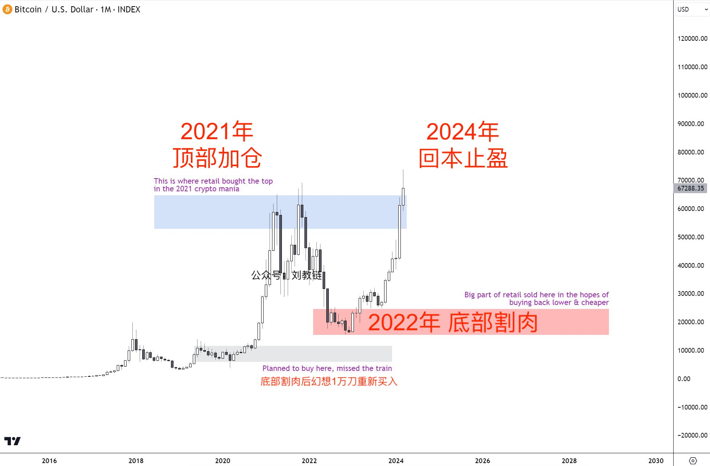
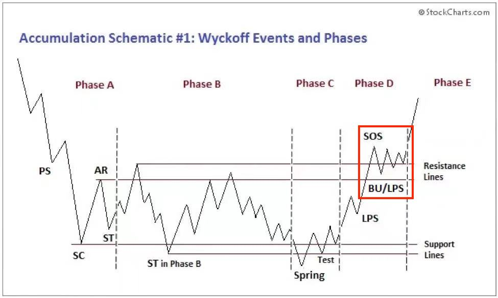

# 暴涨前夜

号外：[6.27内参：Solana已成华尔街资本新宠？](http://rd.liujiaolian.com/i/20240629)

* * *

隔夜BTC小幅升至62k一线。后退两步，拉远一点儿，看月线，6月份大概率是要收跌了，十年之约很可能要逢跌加仓。

3月份突破7万刀的时候，教链就在2024.3.26文章《比特币再破7万刀》中指出，现在的阶段，与威科夫(wyckoff)底部吸筹模式右侧突破前的洗盘震荡很是相像。

教链把3个月前的这幅图再拉出来给各位亲爱的读者朋友们看一看：

当时画这个图的时候，才刚刚伸出了一个强势信号SOS的针。现在3-6月的震荡洗盘，果然在6-7万刀这个区间增添了几根来来回回的月线，从而画出了威科夫模式的阻力位震荡“弹簧线”（下图红框位置）。

这基本上印证了3个月前2024.3.26文章里面所写的判断。

这就是勤于写投资笔记的好处了：人其实是很容易忘记事情的，即便是记得的事情，也常常会记错，把不同时间、不同事实交叉混淆。第一时间白纸黑字写下来，公开发表到不能随意修改的公众号平台上，既是一个分享交流，也是一个公开见证。这其实也算是一种区块链思维吧，哈哈～

笔记共享的目的，不是讨好读者、讨好流量，也不是争个对错或者证明什么，它唯一的用途，就是便于准确复盘，回头打开一看，哦，原来当时是那么想的呀！

老子说过，「夫唯不争，故天下莫能与之争。」

唇枪舌战之前，最好先想想清楚，自己的利益在哪里，争个对错，对自己的利益是有所帮助，还是有所损害。

昨晚[2024.6.27教链内参]说了，「一系列经济数据强化了美联储今年仍有降息空间的观点。」

黎明什么时候会到来？它不会是明天、立刻，但也决不会很慢。恰如2024.6.25《红旗还能打多久？》一文末尾所引用的那句话：

「它是站在地平线上遥望海中已经看得桅杆尖头了的一支航船，它是立于高山之岭远看东方光芒四射喷薄欲出的一轮朝日，它是燥动于母腹中的快要成熟了的一个婴儿。」

黎明之前的夜，往往是最黑、最冷、最难的。熬过去，就会迎来东方喷薄而出的红日，冉冉升起。

在震荡洗盘阶段，涨了，仓位有足够的筹码享受增值，跌了，手里有充足的现金流逢跌加仓，于是便可立于不败之地。

让那些内外投降派在我们的坚定持有和不断加仓面前瑟瑟发抖罢！我们不屈不挠的努力，必将稳步地取得一个又一个胜利。而这些持续不断的胜利，一定会把投降派埋葬。
