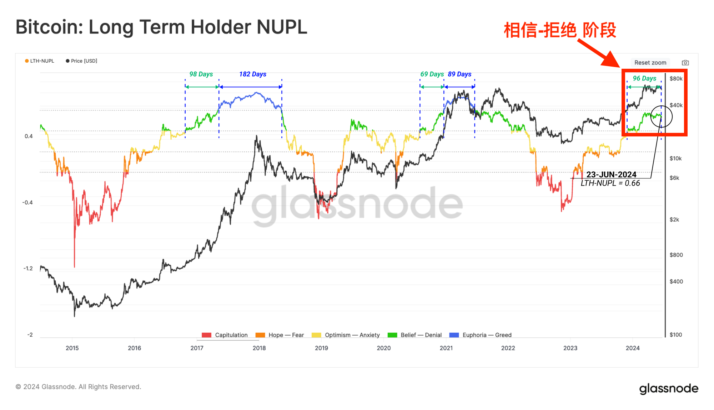
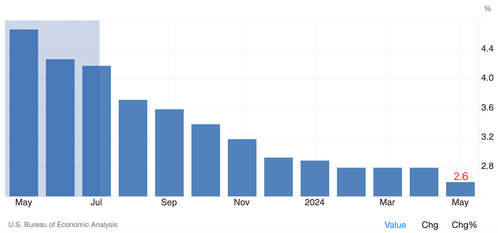
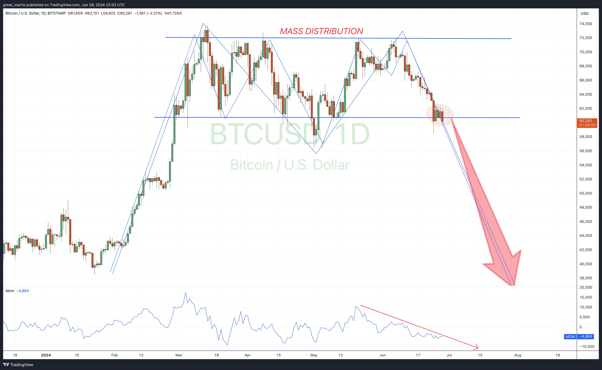
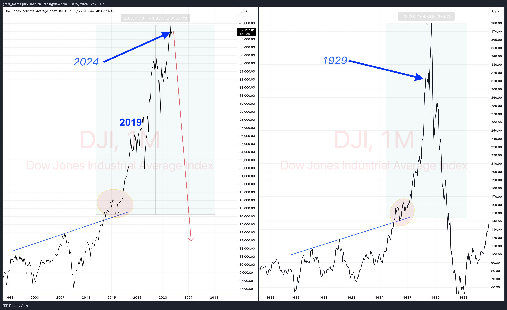

# 大空头

号外：[6.28内参：下一支撑位，55-56k？](http://rd.liujiaolian.com/i/20240628)

* * *

「这是最好的时代，这是最坏的时代；这是智慧的时代，这是愚蠢的时代；这是信仰的时期，这是怀疑的时期；这是光明的季节，这是黑暗的季节；这是希望之春，这是失望之冬；人们面前有着各样事物，人们面前一无所有；人们正在直登天堂；人们正在直下地狱。」

这是狄更斯《双城记》的开头一段。也许这也是当前BTC二级市场所处于的“相信-拒绝”（Belief-Denial）阶段的贴切注脚。

昨天[2024.6.28教链内参：下一支撑位，55-56k？]中提到了美最新核心PCE价格通胀数据出炉，从4月的2.8%下降到5月的2.6%，符合预期。虽然号称这是美联储降息决策最关注的指标之一，但是，继续下降且逼近2%控制目标的PCE数据，却与美联储近期频频有关推迟降息的强硬表态格格不入。

美联储心里是怎么想的，只有它自己清楚。市场猜来猜去，猜不透美联储的心思。

看到一个图表派的大空头The Great Martis，画了一个双头下跌、万劫不复的图，真真儿地吓死个人儿：

看多了这种图表派（或曰技术分析派）的表演，就越发知道这些东西有多么不靠谱。

这个图完全可以做一个完全相反的解释：2月底、4月底、6月底，这明明是3次测试6万刀这个支撑。三底测试，就是暴涨？

有人可能要说了，2月底3月初那一次明明是从下向上的突破呀，为什么是底部测试呢？

那这些只知道看图，不懂得BTC基本知识的人，就是蒙眼毛驴，自己把自己困在磨盘上打转转了。

4月份BTC发生过一次产量减半。以此回溯和调整减半前的历史走势，把3月份之前的底部以支撑位为对称轴，翻转到上面去，其实就相当于是高位下降，触到6万刀的底部之后，在6-7万刀区间震荡。

那么这个震荡洗盘，就是底部整理，而不是顶部整理。

教链不是说上面这么讲就是对的，而是说图表这种东西，本来就是正着反着都能找出一套看似合理的解释和说辞。最后，还是看你的心里相信什么。

这个大空头还画了一个美股即将史诗级大崩盘的图形：

人们早在2019年甚至2015年之后就开始意识到，世界经济正在步入衰退和萧条。

1929-1933年美国大萧条的凄惨景象，还有几人记得？

相比于当时失业白领不敢告诉家人，早上穿上西服、系上领带假装去上班，然后到街上垃圾桶里捡食物，今时今日的萧条程度，似乎还差得远？

美联储是要不见黄河心不死的吧？不搞到大崩盘，咬牙也要坚持高息，一步也不退。

也许你我还有一些时间，为可能到来的金融大崩溃做充分准备。

重点和难点在于，知道哪里要被毁灭，而哪里是避难所。
