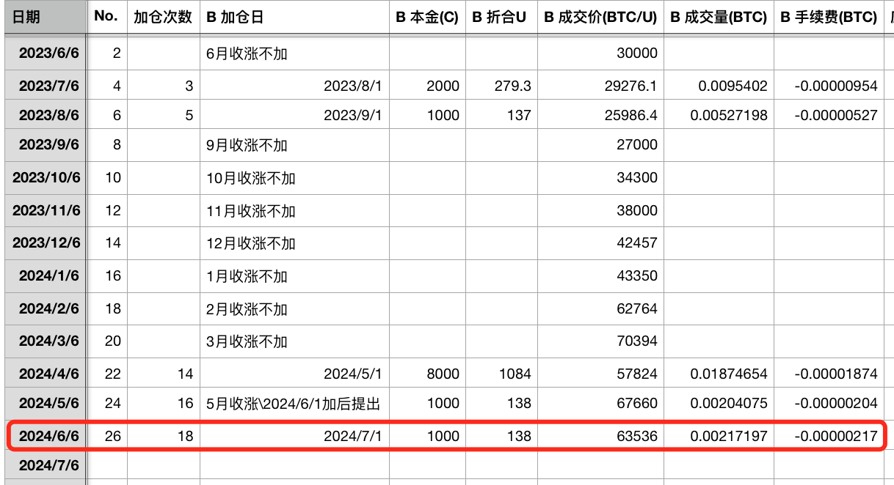
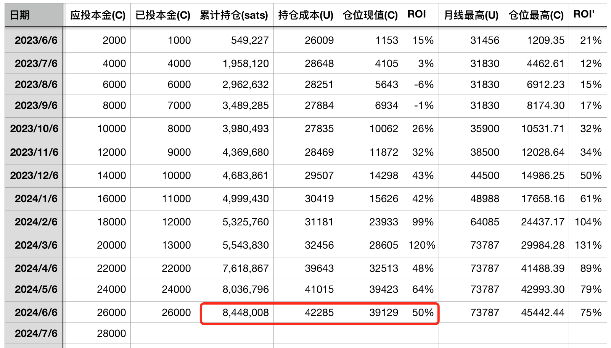
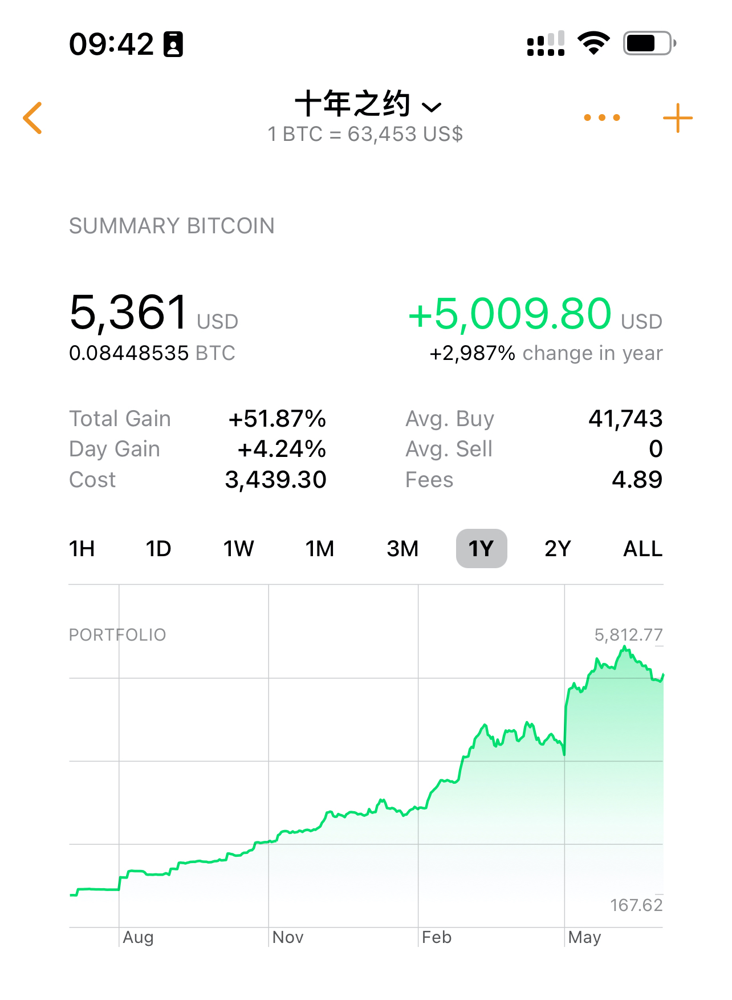
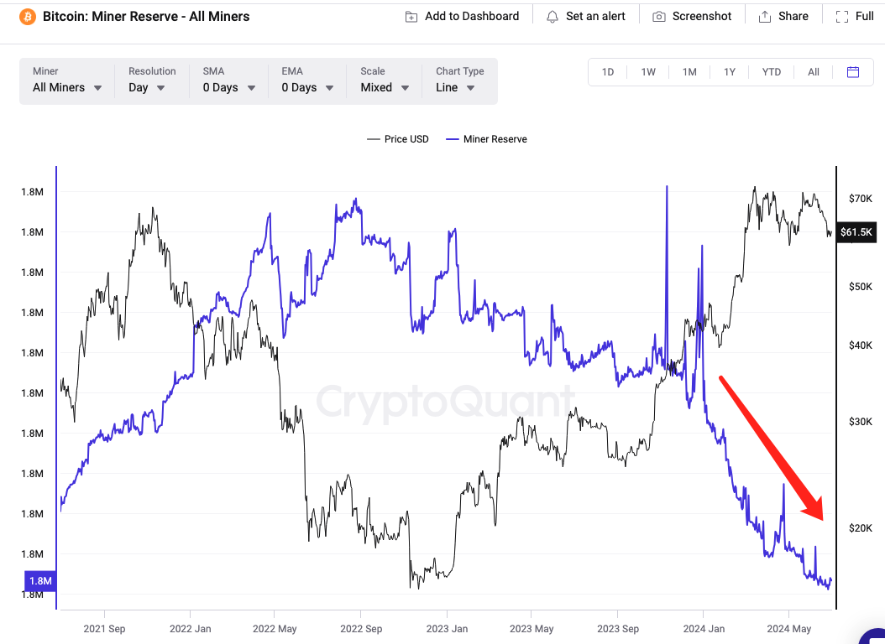

# 6万刀，“矿工底”？ —— 十年之约＃26（ROI 50%）

* * *

这是[“十年之约”实盘见证计划]第26篇报告。链上公开见证地址：1PXD6FjKCJyyFAvNzWW6sS3VQa9sWLKytu 当前余额：8,036,796 聪 (每年提币，上次提出：2024.6.1)

* * *

昨天6月份最后一天，教链在周日上午[2024.6.30内参]中介绍了BTC矿工投降的情况：「当前 BTC 矿工的投降情况已达到与 2022 年 12 月相当的水平，而 2022 年 12 月标志着 FTX 崩盘后的周期底部。」

2024年6月，最终收跌于61.7k。开盘67.2k，最高72k，最低58.4k。

6月收跌，[“十年之约”实盘见证计划]又该“逢跌加仓”了。各位亲爱的读者朋友，这是第26次汇报，第18次加仓。

今天7月1日，天刚亮，BTC就按耐不住地开始猛烈反弹。一下子就冲到了63.5k。

这直接让实际加仓价63536刀，相比于6月收盘价61.7k出现了巨大的“滑点”！整整贵了1800多刀，立亏3%，呵呵。

好在，教链取胜之道，主要靠战略，而不是战术微操。

下面的图是实盘记账。加仓记录：

持仓记录：

还有，使用第三方软件绘制的仓位价值增长图：（第三方软件数值精度略有偏差）

在本次（第18次）加仓之后，[“十年之约”实盘见证计划]累计持仓 8,448,008 聪，持仓成本 42285 刀，投资回报率（ROI）为50%。

多空声音纷纷扰扰。只要自己躬身入局，亲自实践，就根本不需要听那些空口无凭的唱多唱空。教链从自己的仓位里，就能获得对市场的最切肤、最一手的、最直接的感知，所以内心从来不会被任何外界的，看多到XX、或者看空到YY的声音，打扰了宁静。

比如，举个例子，教链只需看一眼自己手里[“十年之约”实盘见证计划]的真金白银铸就的仓位，就知道目前BTC的“铁底”大约是42285刀这个位置。这个“铁底”的硬度大概在一年左右，因为这个仓位花了1年时间铸就。有趣吧？底的硬度是用时间来衡量的。

所以，亲爱的读者朋友，你知道教链为啥在满仓穿越牛熊的大起大落中，依然能够气定神闲了吧？关键就在于，教链的信心，永远建立在“内力”之上，而从不将希望寄托或者依靠在任何看似强大的“外力”上面。

哪怕这个“外力”今天如神话般强大，譬如控制着美元印钞机的美联储，譬如掌握着地球最强武力的美国，在教链看来，它们和门前地面上弱小的蚂蚁、卑微的小草一样平等。

《老子》说，「强大处下，柔弱处上。」可以确信的是，直到美联储下台、美国崩坏的那一天，蚂蚁还在一如既往的觅食，小草也还在“春风吹又生”。

人因为自知弱小，而天生存有“慕强”的心理。每个人都是从不会走路的婴儿长大，开始学会走路。但是这世间很多人，身体上学会了直立行走，心理上却始终在地上爬。就这样爬完了一生。

爬行的人，天然就是“跪姿”。而一旦站起来走路的人，就很难再对所谓的强者下跪。

在现实世界，人们还会因为羞耻心而隐藏其跪着爬行的丑态。但是到了互联网上，热搜下面，评论区中，就呼啦啦涌出如潮的跪族。

多头的你，为什么会被空头的恐吓震慑，甚至吓得丢掉了仓位？反思一下，根源上就在于，你还不那么自信，还要靠着一根拐棍儿才敢颤颤巍巍地行走。

也即是说，你还有对某一外在强力的依赖心理。你的希望，还是寄托在虚无缥缈的“外力”之上。

正因如此，拐棍儿就成为了你心理上最大的弱点。

只要用谎言和欺骗，或者再加一丢丢实力，砍断你的拐棍儿。不敢靠自己的双腿直立行走的你，立刻就要趴在地上，跪下瑟瑟发抖。

每一次市场的深度回调，都是对多头能够站直了“不下跪”的考验。

当你看到成片的人开始跪倒的时候，也就知道，可能是到了底部了。

这就是，本文开头所说的，教链在周日上午[2024.6.30内参]中介绍了BTC矿工投降。

当教链看到矿工都开始纷纷下跪投降的时候，教链就知道了，市场很可能快要或者已经到达所谓“矿工底”了。

那么这个“矿工底”，很可能就在6万刀一线上下。

这个道理，其实和教链在2024.6.29文章《大空头》里说的「这个震荡洗盘，就是底部整理，而不是顶部整理」是一个道理。

看下面这幅图。这是矿工群体持有的BTC储备变化图：

从图中很清楚地可以看到，自从BTC在2月份冲历史新高并高位盘整，此数月余，矿工储备却在断崖式下跌。教链在图中用红色箭头标示出了储备减少的方向。

这说明什么问题？问题就是，许多矿工预计4月份的产量减半会对自己的BTC采矿业务造成财务冲击，减半之后，采矿成本将骤然上升，一下子让本来有利可图的挖矿，变成了不可逆转的亏损。

于是矿工们纷纷抛售手里的BTC储备，以对冲BTC产量减半带来的财务冲击。

甚至于，很多矿工觉得扭亏为盈无望，割肉离场，转行了。

教链听说，产量减半后，BTC的平均生产成本已经升至6万刀左右。

也就是说，效率高，进而成本低于6万刀的矿工，还能活着。而效率低，成本高于6万刀的矿工，要么再用抛售BTC储备所换回的美元再扛一段时间看看，要么就只能黯然退场。

而市场，偏就要横盘整理，并不断极限下探，就是要消耗矿工。

BTC所采用的PoW（工作量证明）的“美妙”之处（对矿工而言就是“残忍”之处），正在于PoW要持续地消耗矿工的现金流，从而迫使矿工不顾一切地抛售手中积累的BTC储备。显然，PoS等其他共识协议，并没有如此“疗效”。

迫使矿工“底部”抛售的最大意义就在于，尽可能地压榨矿工的超额利润，使其回归一般经营利润，从而避免矿工向市场收取不公平的“铸币税”。

所以“矿工底”，对矿工而言是残忍的优胜劣汰的时刻，对囤BTC者，却是低价抄底的美丽时刻。

好和坏，美和丑，善和恶，强和弱，从来都是同一枚硬币的两面，牢不可分。

