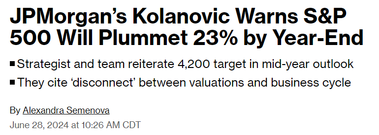

# 一次健康的回调

号外：[7.2内参：按捺不住的反弹](http://rd.liujiaolian.com/i/20240701)

* * *

前几天的6月25号，BTC突然跌穿60k，并一个猛子扎向58k，刺爆了不少埋伏在6万刀下方的多头杠杆。爆仓之后，得手后旋即鸣金收兵，日内拉回61.8k收盘。所以你看，空头也是一股有用的力量，是BTC总体力量的有机组成部分。这一力量的作用就是刀口向内，自我革命，割毒剜疮，痛打老虎。

任何一个有机体，如果不能持续自我更新，就必然会走向腐败和衰亡。而BTC每一次凶猛的回调，都是机体的一次自我更新。为了接下来更好地前进，更好地迎接更大的挑战，而做好准备。

从周线图就可以很清楚地看到，6月底一周的跌落，不过是向30周均线57.5k的“价值回归”而已。回调就放量，说明接盘十分踊跃。一次十分正常而健康的回调。

洗盘之后，轻装上阵，步入7月，开始反弹，至7月2号已迅速回升至62k-63k。恰如昨日[7.2内参：按捺不住的反弹]所言说。

7月1日文章《6万刀，“矿工底”？》已指出，如今这个底，是底不是顶，而且是由矿工投降所铸就的底。

看BTC全网哈希率（算力）回撤，现在的情况，好似2022年底BTC 16k低谷时的算力回撤之幅度。接近-8%。（见下图）

上一次，2022年底之底，是因为FTX崩盘，深熊尾声，价格跌至冰点，矿工挖矿的成本-收益比严重下降甚至转亏，被迫投降，撤出市场，从而造成了全网算力的大幅回撤。

这一次，2024年夏之底，是因为4月份的产量减半，矿工挖矿成本一夜翻倍，部分矿工迅速转亏，且返盈无望，只得投降，撤出市场，造成全网算力大幅回撤。

从月线图上看，21EMA即将向上穿越20 SMA，形成“金叉”。（下图）

回读一下2024.6.28文章《暴涨前夜》。

暴跳可如雷。能跳到多高？

看到网上有外国网友画的一幅图。这可能是教链见过的对2025年牛市目标看得最高的模型之一了。（下图）

好家伙。画图的妙处就是，想要什么图，就能画出什么图。梦想纸上有，心想图竟成。100万刀，近在咫尺，唾手可得。

如果真冲那么高，这应当算是打破了“涨幅衰退”的成见和谬论了。只是不知道，10万刀匆匆下车的那些人，眼睁睁看着错过10倍涨幅，究竟是会心中凌乱，还是会高位再接盘？

请注意，这可没有任何说这位网友的模型是正确或者靠谱的意思。当然很有可能是错误的，荒谬的。所以千万不要当作任何投资参考，切记切记。

摩根大通警告说，2024年底美股标普500指数会暴跌23%。

美国银行业在债券投资上的浮亏（未实现亏损）已经超过5000亿刀，规模是2008年全球金融危机时的7倍。

美国M2供应重新进入扩张。而历史上每次M2急速扩张，都和衰退如影相随。

美联储是否嗅到了危机的味道？

当短兵相接时，更健康的，必将给更腐朽的，造成致命一击。

与其相信敌人的仁慈，毋宁相信敌人的衰弱。
