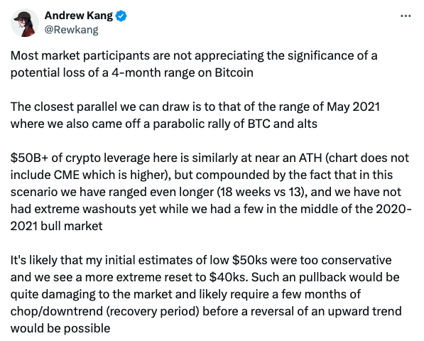
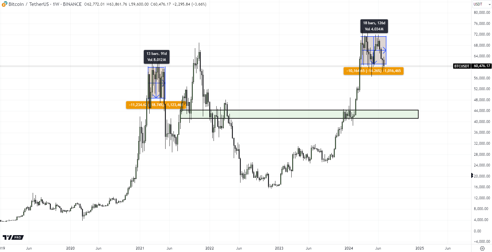
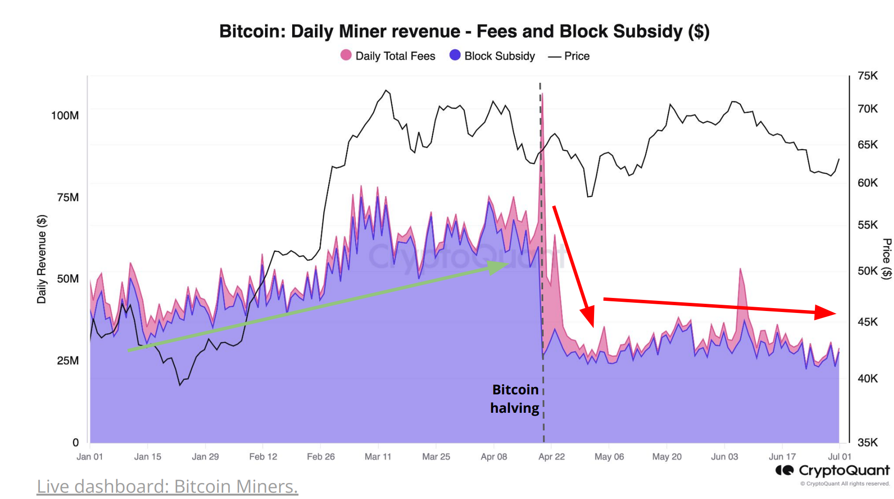

# 洗盘，4万刀还是10万刀？

上午，BTC延续[昨晚教链内参讲的“猛然坠落”](http://rd.liujiaolian.com/i/20240703)，继续坠落，至教链行此文时，已然突破6月25日插针低点58.3k，并短暂击穿58k。不过，空头这波突袭，距离2024.5.1所取得的56.5k的战线，还相去近2000刀。

行业内大小媒体都配合提前酝酿“山雨欲来风满楼”的危机重重之景。主要的素材是，Mt.Gox本月开始赔付，持续3个月的抛压基础上，又曝出美、德等政府将此前没收的大笔赃款BTC转至交易所，看起来是要准备脱手抛售。由此，抛压危机便已酝酿到位，成为一个短期的局部共识。

[昨7.3教链内参说了，今天周四，美国假日，休市一天]。空头挑这个时候出手，不是没有道理的。原因很简单，被认为是市场的顶梁柱之一的美国BTC ETF们，今天放假了。放假了，就停止了买入。空头挑这样一个假日，出人意料地发难，颇有点儿宗教国家之间打仗，挑什么斋戒日之类的防备度下降的特殊日期攻其不备的意思。

飘风不终朝。骤雨不终日。突袭多败局。玩阴的只不过图一时之快。稳扎稳打的阳谋，方为持久胜利之道。

有加密基金说，之前5万刀的底部估计太保守，现在他们看到4万刀。[1]

有数据分析报告说，矿工投降预示着底部信号。[2]

渣打银行说，下个月，也就是8月份，BTC将会再创新高，11月份美国总统大选时将突破10万刀，明年2025年末仍有望到达15万至20万刀的目标区间。[3]

看吧，这就是典型的“信仰-拒绝”阶段的市场心态。有那么一点儿精神分裂。

人们成天琢磨着，BTC究竟是要跌去4万刀，还是成功在6万刀附近再次筑底，抑或是很快就要突破10万刀？

殊不知，人类一思考，BTC要发笑。

4万刀和10万刀，在人类的感觉中，那是差1.5倍的天壤之别（ (10 - 4) / 4 = 150%）。可是，对于一个生活在对数坐标系里面的BTC而言，它们的差别实在是微不足道：

4万刀的自然对数等于10.6。

10万刀的自然对数等于11.5。

在BTC的眼中，4万刀和10万刀仅仅相差不过 8.5% 而已（(11.5 - 10.6) / 10.6 = 8.5%）。

哪怕就是1万刀和10万刀，相差也不过25%（9.2之于11.5）。10万刀和100万刀，相差则仅有20%（11.5之于13.8）。

从10万刀涨到100万刀，人类眼中的10倍涨幅，BTC眼中只是区区20%涨幅。轻轻松松的吧？

反过来，从10万刀跌到1万刀，人类眼中10倍跌幅，或者说90%跌幅，BTC眼中也不过是仅仅跌去了20%而已。毛毛雨啦！何至于寻死觅活？

照理说，5万刀成本，和10万刀成本，将来100万刀的时候，似乎也无足轻重。有时候我们也常常用这样的话安慰人。

但是，对于一个俗世之人而言，5万刀成本，意味着10万刀本金可以囤上2个BTC；而10万刀成本就只能囤1个BTC。

当BTC将来100万刀的时候，那就是200万刀身家和100万刀身家的差别。差一倍呢！

更可气的是，不管BTC未来涨到多少，都会差一倍。涨得越高，差的绝对价值量就会越大。100万刀时差100万刀，500万刀的时候就差500万刀了呢。

有些人，还没积累多少底仓呢，就整天开始琢磨着怎么卖、怎么逃顶的问题。在教链看来，这实在是属于还没学会走路，就开始琢磨着上月亮了。

霍华德·马克斯说过，买得好不如卖得好，但所有卖得不够好，都可以由买得好来弥补。

刚刚进场，还是先老老实实积累底仓吧。

初学投资，最好先练就一番低成本建仓的本领。

做好上述两点，你就比同一起跑线的人，占了先手。也就愈多了几分胜算。

* * *

[1] https://x.com/Rewkang/status/1808545114622677300
[2] https://www.theblock.co/post/303404/cryptoquant-says-extremely-underpaid-bitcoin-miners-capitulation-is-a-possible-bottom-signal
[3] https://news.bitcoin.com/standard-chartered-predicts-bitcoin-hitting-fresh-all-time-high-in-august/

* * *

[7.3内参：周三，猛然坠落，但渣打认为8月会创新高](http://rd.liujiaolian.com/i/20240703)

