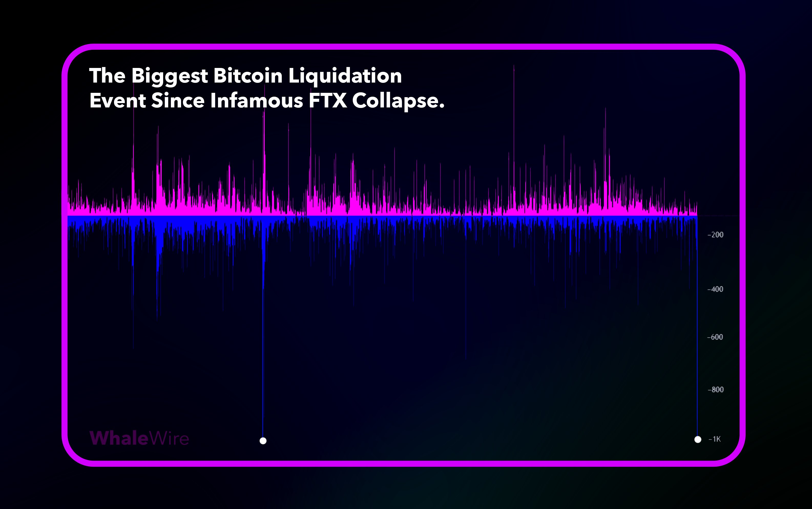

# FTX崩盘以来最大爆仓，有史以来第二大爆仓

昨日BTC向下插针，一度逼近53k。后自动反弹至今56k上方。加密市场遭遇全面血洗，恰如[2024.7.5教链内参《血流成河，七嘴八舌》]所描画。如内参中所计算，从7月2日局部高点63.8k，到7月5日最低53.3k，4日跌幅不过区区16%。这和2021年“519”从5月10日局部高点59.5k，到5月19日插针29k，10日跌幅高达51%，相比之下，“75”（7月5日）可谓小巫见大巫了。

因此，“75”能否成为齐名“312”、“519”这样的大日子，是值得怀疑的。

据说，有链上分析表明，这一次暴跌所导致的爆仓清算规模，是自2022年11月FTX崩盘以来最大的，也是BTC历史上第二大的爆仓。

2022年11月初，FTX挤兑引发雪崩，造成市场恐慌，BTC自2022.11.6局部高点21.4k，到11月10日最低跌至15.5k，5日最大跌幅超27%。就这，并没有让人们铭记其日期以为纪念。

网上有段子调侃说，找对象就找币圈人。跌15%气定神闲，跌30%云淡风轻，跌50%不动声色，跌80%沉默不语，跌90%基础上再跌90% —— 已经彻底看开，超脱一切。主打的就是一个内心稳定，波澜不惊。

爆仓规模大不大的，并不能保证令世人铭记。跌幅够大，才够得上格。

爆仓规模大，但跌幅不深，说明爆的是高倍杠杆埋伏牛市的狗大户，市场掉头杀个回马枪，血洗大户的仓位，然后再开启牛市上涨，这叫公平。否则，市场每拉高10%，囤币小散只赚10%，高倍杠杆的大户怒赚50%。5倍超额利润的大户就会产生很强的出逃动机，而他们的每次出逃，都是对场内资金的一次透支，对老老实实囤币小散的一次收割。这就很不公平。所以，开启大牛市的前提之一，必然是血洗杠杆。血洗大户的杠杆，群众是拍手称快的。这就是不将其记为灾难日的原因。

爆仓规模小，但跌幅很深。尤其是像“519”跌幅超过50%的那种，才真的是凶猛。这意味着，就算是最保守的2倍杠杆，都会被无情爆仓出局。这就不仅仅是把贪心不足蛇吞象的高倍杠杆给爆掉的问题了，而是大小蚊虫一扫光，高倍、低倍，是个杠杆几乎就都要被爆，白茫茫大地真干净。爆了那么多杠杆，规模却不够大，说明资金分散，人数众多。所以，被血洗的范围那就大得多。刻骨铭心的人数多了，日子也就被铭记和传诵开来，由此成为屈指可数的灾难日。

当然还有一个因素要考虑，那就是众多中心化交易所的真实爆仓数据，其实不是那么透明的。因而，对于这些数据分析的结果，是否能代表市场的总体情况，也不能轻易相信。还是要辩证对待。

尤其是这一次，市场上明牌的利空只不过是德国政府处理赃物和Mt.Gox赔付用户，加起来一共百来亿美刀规模的现货。对于日交易量数百亿美刀的BTC而言，消化这点儿抛盘应该说是“洒洒水”啦。这空头就借机闹出这么大动静？只能说处处透着一丝丝诡异在其中。

对投机者而言，有一句英国的古话，说这BTC仿佛金漆的鸟笼，笼子外面的鸟想住进去，笼内的鸟想飞出来；所以买而卖，卖而买，没有了局（liǎo jú）。法国也有这么一句话。不过，不说是鸟笼，说是被围困的城堡fortresse assieégée，城外的人想冲进去，城里的人想逃出来。

“不管它鸟笼罢，围城罢，像我这种一切超脱的人是不怕围困的。”
