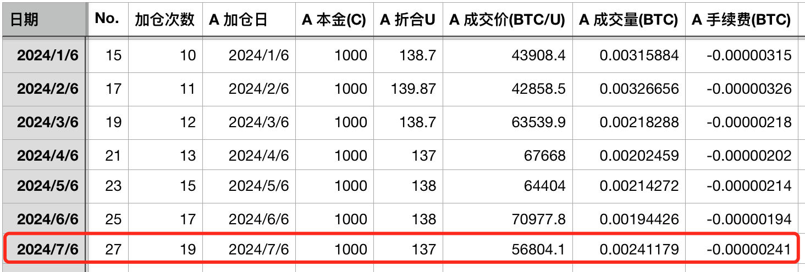
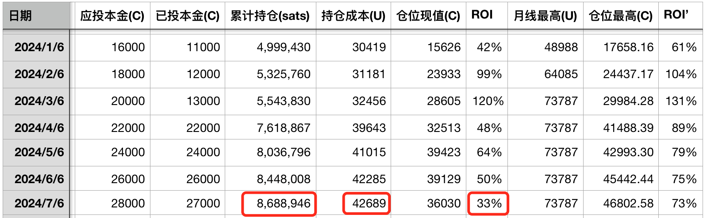

# 胜算更大了！—— 十年之约＃27（ROI 33%）

随着周末BTC的企稳回升，市场情绪有些许稳定。如今早[7.7教链内参《持有BTC的年化收益达145.9%，远超其他主流资产》]所说，市场对此番Mt.Gox赔付以及美、德政府抛售BTC的反应属实有些过大了。恰如今早内参标题所揭示的，BTC仍然是过去十数年来长期回报率最高的资产，没有之一。

就在周五BTC急向53k跌落、净化场内杠杆之际，又有不少小丑或者巨婴跳到评论区大放厥词。这世界上不只有鲜花和阳光，还有蟑螂和臭虫。而且，鲜花会败落，太阳会下山，蟑螂和臭虫却总是躲在阴暗之地，不断繁殖。

它们厚颜无耻地抱怨，或者指责，指责文章没有准确指出开仓点位、平仓点位，以便于它们大开杠杆、精准获利。可笑之极。可笑就如吃屎的苍蝇指责吃饭的人没有告诉它屎应该怎么吃才好吃。

是的，没错，教链的文章，只讲人要好好吃饭，不讲苍蝇、蟑螂和臭虫怎么吃屎。偶尔，会提醒两句，人不要吃屎。但是，绝不可能讲吃屎很香，以及，劝诱人去吃屎。

人民是伟大的，是历史的创造者。那是因为构成人民的是人，是懂得“人要吃饭”、“人要好好吃饭”这一朴素道理的人，而不是“非要吃屎”、还要“指责别人不吃屎”、以及“炫耀自己吃的屎比别人嘴里的饭还要香”的害人虫。

与害人虫的斗争是永无止境的，直至其完全消灭。

「小小寰球，有几个苍蝇碰壁。嗡嗡叫，几声凄厉，几声抽泣。蚂蚁缘槐夸大国，蚍蜉撼树谈何易。正西风落叶下长安，飞鸣镝。

「多少事，从来急；天地转，光阴迫。一万年太久，只争朝夕。四海翻腾云水怒，五洲震荡风雷激。要扫除一切害人虫，全无敌。」

教链以凌厉的笔锋，化作利刃，送与每位读者朋友。人人手握利刃，刀口向内，解剖灵魂，揪出藏在那躯壳中的苍蝇。“抓住苍蝇挤破它的肚皮把它的肠子扯出来再用它的肠子勒住它的脖子用力一拉…… 呵～！整条舌头都伸出来啦！” 然后“再手起刀落…… 哗～！整个世界清净了。”

王阳明说，人人皆可为圣人。但人心多有蒙蔽，需时时修行，扫除心头之蔽，露出本心，方可成圣。

可知心学的境界，仍以神秀之偈为限。“心如明镜台”，“时时勤拂拭，莫使惹尘埃”。

六祖慧能则有更高境界。其偈曰，“菩提本无树，明镜亦非台。本来无一物，何处惹尘埃？”

教链所写的“菩提”，根本就不是未开悟者所以为的“树”。教链所谈的“明镜”，也不是未开悟者所以为的“台”。未开悟者却以教链写的“树”不能长生不老，教链谈的“台”不能得道成仙为理由而出言不逊、怨声载道，难道不是恰恰彰显出其人不求上进，反求堕落，甘与苍蝇、蟑螂和臭虫为伍的无耻心态吗？

投机者的失败，是注定的。投机者的偶尔成功，也没有什么好炫耀和沾沾自喜的，那不过是更大失败的前奏和诱饵。偶尔失败时怨天尤人，偶尔成功时自以为是，这两种行径，都是一个人在精神道德上最卑劣的堕落。

教链在[2024.7.5文章《为什么新手总是一买就亏？》]中说过，这一波洗盘，洗掉的是年初奔着ETF和减半两大利好冲进来的新韭菜。

教链在今早[2024.7.7内参《持有BTC的年化收益达145.9%，远超其他主流资产》]中提到，BTC网络挖矿难度下调，这是把矿工投降关机的钉子钉到了板子上。

新韭菜投降了。矿工投降了。亏损的多头心态崩了，怨天尤人。赚到的空头心态飘了，疯狂嘲讽多头。

长期主义者的胜算更大了！

这让教链想起《让子弹飞》里张麻子团队给鹅城百姓发钱、发枪，试图发动群众与黄四郎作斗争的一幕。

当黄四郎从畏畏缩缩的百姓手中把钱和枪都收缴一空之后，张麻子的兄弟们以为胜利无望了，但是张麻子却表示，胜算又增加了几成！时机更接近成熟了！

当年初冲进市场的新韭菜，两眼一抹黑高位接盘站岗，此番被空头连番恐吓、反复毒打、极限施压，痛苦割肉之后，心中必然有恨，有怒。堕落者和不开悟者，把恨和怒转向了天地、神佛、他人。不堕落者和开悟者，则把这恨和怒转换成了内在的力量，提高了自己的认知，强化了自己的意志，升华了自己的灵魂，进化成了又一个BTC长期主义者。

BTC的博弈结构，本质规律是：杠杆多头该死，空头必死，矿工半死不活，长期主义者必胜。

教链一年前启动的[“十年之约”实盘见证计划]，就是长期主义者的冲锋号。

总有悟性很差的读者，喜欢自以为是地留言说，以为怎样怎样，原来不过是这么小的仓位。

这种读者，一是不懂得相对量和绝对量的问题，二是不懂得可扩展和可复制性的问题。根本上，是不懂得，一个冲锋号虽小，却可以化作千千万万个冲锋号；不懂得，星星之火，可以燎原。

一个投资策略，投资本金在一个相当宽的范围内，比如1000至1亿，其投资回报率都是一样的，这个投资策略就是可扩展的。

而如果这个投资策略，张三做和李四做，效果都是一样的，这个投资策略就是可复制的。

更严格的可复制性，应该不仅仅在空间（不同的人、不同的市场）之间可复制，还要在时间维度上可复制。即，张三在2018年开始这样做，和在2022年开始这样做，其效果都是一样的，这时候，这个投资策略就具备了时间上的可复制性。

进一步的，如果这个投资策略既是可扩展的，又具有时间、空间二重的可复制性，这个投资策略就具有了极强的普适性。

教链不知道应该用什么词语来形容这样的策略。姑且将其称之为“完备的”（complete）。

教链所研究的和所实践的，就是这样的策略，完备策略。

任何炒裸合约的策略显然都是高度不完备策略：张三开仓平仓的方法，李四照做会失败。张三今天以某方法赚了，明天可能用同样方法就爆仓了。张三拿100u开单可能胜率比较高（心态稳定），但是一旦加到10000u就总是爆仓（心态失稳）。张三用一个方法开BTC合约能赚，但是用同样方法开另一山寨就总是亏。张三可能今年爆赚，明年爆亏，五年亏光离场……

教链很清楚，那些眼睛总是关注到仓位大小的，本质上是个合约赌狗。对合约赌狗而言，100u和1万u开仓，当然大不同。赌狗根本就不懂什么叫做可扩展和可复制的完备策略。

完备策略和高度不完备策略的差别，比吃饭和吃屎之间的差别还要大。

[“十年之约”实盘见证计划]不过是一个科学实验，通过实践，检验和验证一个策略的完备性。

昨天7月6日，“十年之约”应该进行例行的加仓。这是第19次加仓。加仓价56804.1刀。投后持仓868.9万聪，持仓成本42689刀，收益率33%。

由于昨天写了另一篇文章[《FTX崩盘以来最大爆仓，有史以来第二大爆仓》]，所以本次“十年之约”第27次汇报就改到了今天这篇文章。

对于“十年之约”所要检验的完备策略而言，空头砸盘，只有创造捡到更便宜筹码的机会的好处，没有任何坏处。

从现在57.7k到“十年之约”持仓成本42.7k，还差25%多的跌幅。如果跌穿，加仓就会拉低持仓成本，赢。如果上涨，持仓价值就会上涨，收益率就会增高，也是赢。

反正都是赢，哪里还有什么好怕的呢？

让那些砸盘的空头在我们面前发抖罢，让他们去说我们这也不行那也不行罢，长期主义者的不屈不挠的努力，必将稳步地达到自己的目的！
