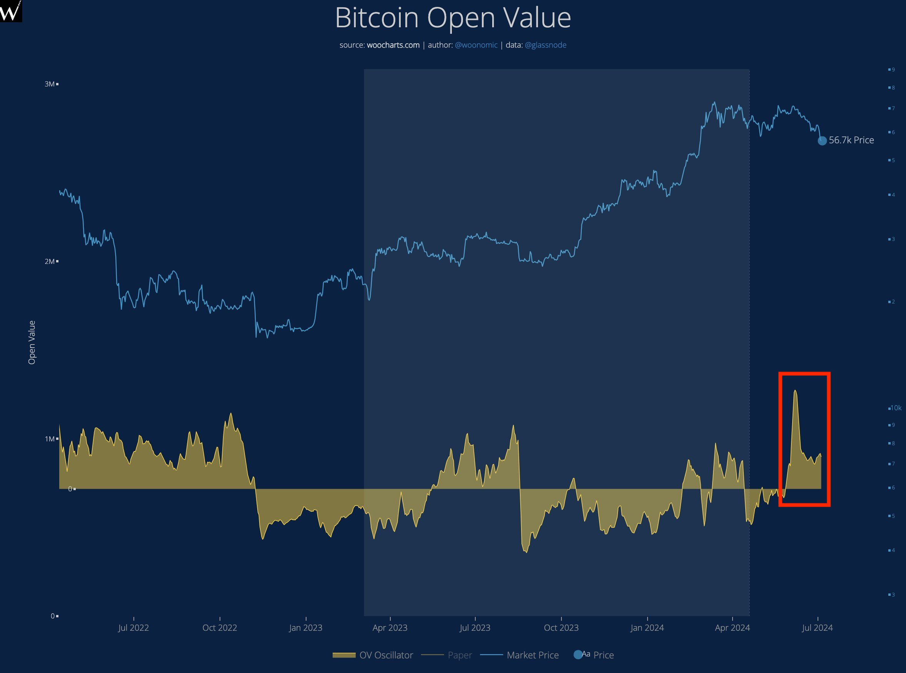
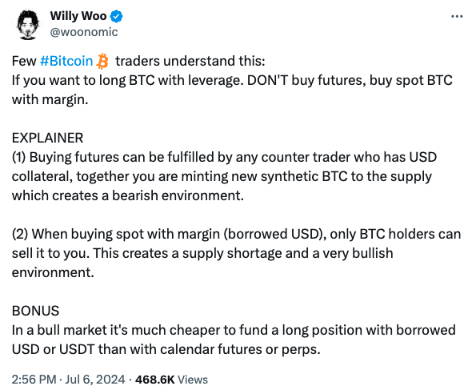
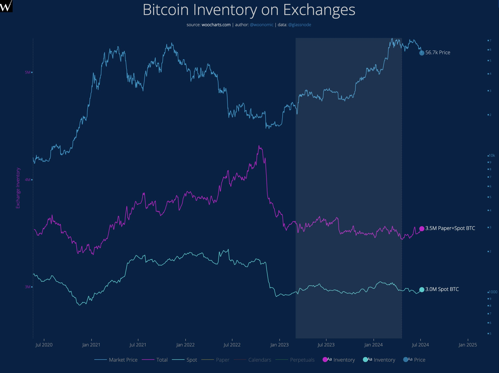
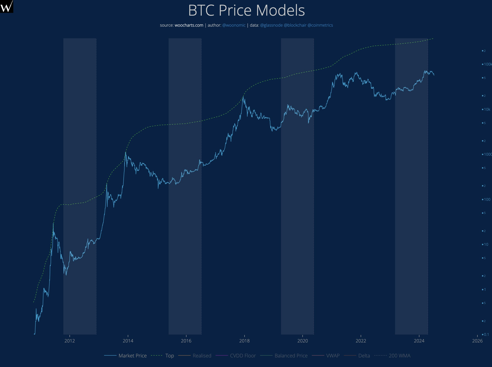

# 这一波砸盘的真正罪魁祸首

隔夜 BTC (比特币) 向55k跌落，作势回补7月5日插针后的自动反弹（53.3k-56.7k）。2024.6.15教链文章《是谁，在卖出BTC？》中介绍过Willy Woo的一个数据分析。其指示出，合约市场中存在大量的所谓“纸BTC”，即仅以美元稳定币为抵押物合成出来的“虚假”BTC，从而给BTC上涨带来了巨大的阻力。

因为美元的理论供应量是无限的，所以“纸BTC”的供应量也是无限的。大量购买力都空耗在了对“纸BTC”的买入上，从而抑制了促进市场真正上涨的购买力。

从上图中可以看出，红框处的数据显示，这一波从72k猛砸到53k，主要的力量就是大量“纸BTC”开单卖空。

据Willy Woo统计：

- 德国政府仅抛售了 9332 枚现货BTC（真BTC）

- 自最近的72k顶点以来，有高达 17万枚 “纸BTC” 被合成和卖出！

因此，Willy Woo建议，对于想加杠杆做多BTC的人，最好不要去合约市场上做多，而是借u买入现货BTC。

两点原因：

「(1) 任何拥有美元抵押品的柜台交易员都可以购买期货，同时你也在制造新的合成 BTC 供应，这就创造了一个看跌的环境。

「(2) 当使用保证金（借入美元）购买现货时，只有 BTC 持有者才能将其出售给你。这就造成了供应短缺和非常看涨的环境。」

同时，还有一个额外的好处：「在牛市中，用借来的美元或 USDT 为多头头寸提供资金要比用期货或 perps (永续合约)便宜得多。」

简单而言：

[1] 买入现货，只有真正的BTC持有者才能够卖出给你

[2] 买入合约，任何美元的持有者都可以卖出给你！

第 [2] 项的抛售力量是无限的，因为美元供应是无限的。

有网友对Willy Woo的说法表示反对。该网友表示：

「如果在期货上出现净多头敞口，不管是 perps 还是 CME，做市商都会投入更多资金购买现货并做空期货，以获取更高的资金/价差(spread) —— 将多头敞口转化为底层标的物。

「BTC价格下跌不是因为 “合成比特币”，而是因为 OG 持有者和矿工卖出的 BTC 多于买入的 BTC。」

Willy Woo反驳道：

「事实上，这是对整个系统的天真看法。你所描述的只是系统的一部分，而且是不太重要的一部分。

「(1）如果有净多头需求，流动性提供者就会参与基差交易(basis trade)，将现货流动性传送到期货上。我们公司通过一批经理人在任何时候都有 5000 万至 1.5 亿美元的基差交易，我们还跟踪了近 600 家量化公司。我们的数据显示，基差交易约占投注的 25%。

「请注意，基差交易也是净看跌的，因为利差(carry spread)是对买入资金的征税，而现货买入几乎将所有资金都转移到了市场。

「(2) 现在的主要问题是......定向交易者可以在不拥有 BTC 的情况下出售 BTC。他们可以用美元抵押卖出。

「有大量数据显示这种影响是真实存在的。

「下图清楚地表明了这一点。每当开单量增长，“可交易的 BTC” 充斥交易所时，价格就会下跌。

「2021 年的牛市是第一个没有指数失控(暴涨)的牛市，完全没有达到正常的高点。这与 “纸BTC” 的显著上涨有关，因为卖家只需用美元抵押就可以出售期货纸币... 2017 年及之前，只有 BTC 持有者可以出售，而卖方有限，因此出现了指数型失控(暴涨)。」

上述网友则继续反驳其反驳：

「1. 像 Susquehanna 这样的 MMs (做市商) 是 BTC etf 的最大持有者，他们正在利用 BTC etf 进行基差交易，因此 BTC etf 并不是最不重要的部分。他们是BTC等价物基金流入/流出的主要驱动力，而BTC市场参与者会通过对他们的虔诚追踪来判断市场情绪。

「2. 是的，期货买家需要支付资金，但这也为他们提供了现货无法获得的杠杆。如果你预计未来 12 个月内BTC价格会翻倍，那么 11% APY 的融资成本就很低了，因为这可以让买家控制比现货高 10 倍的购买力。算下来，与现货相比，他们的资本回报率要高出 8.3 倍。

基本计算：

100 美元现货 -> 1 年后 200 美元，或 100 美元利润。

100 美元 10 倍杠杆，1000 美元 -> 2000 美元 - (1500) * 11% = 1835 美元。为简单起见，我们假设当年的成本基础为线性，因此 1500美元是 1 千美元和 2 千美元之间的中间值。

1 年后，使用期货获利 835 美元，而使用现货获利 100 美元，使用相同的 100 美元起始资金，高出 8.3 倍。

「3. 这又回到了我的下一个观点，即大多数新进入BTC市场的BTC投资者都不是BTC本位者。他们有美元账单要付，希望看到美元利润。OG 持有者(注：指BTC老玩家) 似乎也喜欢美元利润，因为他们一直在抛售，我相信你已经在链上看到了。

BTC 被抛售并不是因为某些邪恶的反向交易者或合成 BTC，而是因为市场参与者已经通过他们的行动表明，他们希望看到以美元支付账单的回报 —— 而不是持有他们还不能交易的东西，并希望有一天它能上涨。

「4. 是的，期货允许投机者以美元作为保证金做空相关资产。但这与其他任何成熟的商品/指数并无不同。如果BTC真的像你这样的 maxis (最大主义者) 声称的那样有价值和稀缺，a）它应该能够承受这些正常的市场压力，因为其他任何商品/指数都会受到这些压力的影响；b）你应该庆祝这种做空行为，因为如果它们受到压倒性需求的挤压，它只会创造更高的买入压力。

「5. 问题的核心在于，你希望更多的人加入BTC信仰，因为你是早期采用者。在 ETF 之后，我认为游戏已经晚了，我们过去看到的指数型回报已经过去，除非美联储疯狂印钞，而鲍威尔到目前为止还没有表示他要印钞。

随着时间的推移，鉴于法定货币的通胀性质，BTC的价格很可能还会上涨，但如果它真的像人们喜欢比较的那样是数字黄金，我们也应该期待其稳定的波动性和与黄金相当的回报率，而对于大多数加密投机者来说，如果没有期货和期权形式的杠杆，这就不那么有趣了。」

看到这里，相信各位读者已经明白了他们双方各自的观点和立场。

但是，当立场出现的时候，也意味着讨论马上就要开始变味了。从就事论事，开始转入人身攻击 —— 不是攻击对方的外貌（互联网对线不是面对面），而是攻击对方的立场和动机。

其实仔细一看不难发现，双方是存在一个一致观点的，那就是从2021年那一轮牛市开始，有相当一部分增量资金和新韭菜，被分流到了合约和期货市场，从而造成了现货市场购买力不足。

Willy Woo通过研究数据，发现“纸BTC”的卖空阻碍了市场的暴涨。根据合约市场的规则，每一张空单，都会对应有一张多单。空头之所以能够开空，也正是因为多头跑去开多。

以前只有现货可玩的时候，新入场的投机交易者要想获利，也只能先买入BTC现货。但是现在有了期货合约，他们就可以直接开空，而不需要先买入BTC现货。

这也正是对线网友说的，自ETF之后，大多数进场的新玩家，都不是长期囤BTC的长线投资者，而是美元本位、希望天天赚美刀的投机交易者。

他们对现货BTC市场的分流，虽然抑制了BTC在牛市期间大幅偏离中值回归线的幅度，抹平了暴涨，但是，他们的投机交易也为这个市场带来了更充沛的流动性。

总而言之，就是市场更加成熟了。更加成熟，就会以相对更小的幅度暴涨暴跌。这让期待趁暴涨时狠狠收割一波的人不太爽，但是对于长期持有者而言，则恰恰相反。暴涨只会令加仓成本被大幅抬高，反倒不如稳步上涨，稳稳的幸福。
