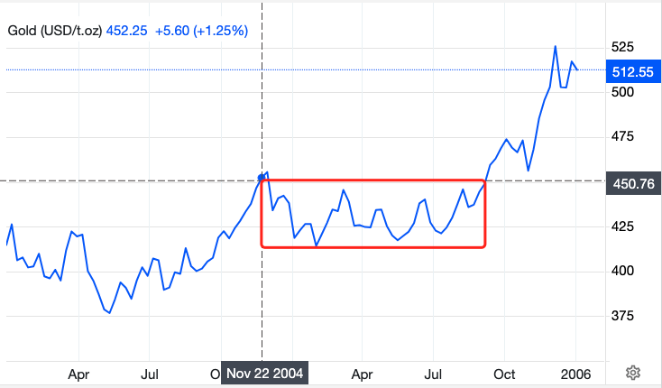

# 本轮牛市发育早熟，2024年3月为假启动，或将于2025年1月真启动

昨天[7月9日教链内参：多重迹象表明，牛市要回来了]分享了关于BTC本轮回调的百家之言，综合的结论和教链这段时间以来的主要观点比较一致，即所谓的各国政府清算抛压其实有限，那不过是空头砸盘获利所利用的素材罢了。就像鱼香肉丝没有鱼、夫妻肺片没有夫妻、老婆饼也没有老婆一样，千万不要听到个菜名就真的以为那媒体上宣传的东西真的是这盘菜的主料。

这一轮牛市来得太早。起床起猛了，容易头晕，一不小心可能还会摔个趔趄。参考往年各轮周期推算，牛市本应该在2024年底、2025年初，甚至到2025年中下旬才应该启动。可是这一次，居然在2024年初就突破了2021年的前高6.9万美刀——如果我们按照行业惯例的其中一种牛市的定义方法，即“突破前高”计算的话，我们可以认为，本轮牛市已经在2024年3月11日正式踏上了征程。

众所周知，这一次牛市提前启动，要拜两件事所赐：第一，2021年走了个双头牛，导致“前高”被大幅削低；第二，美BTC现货ETF被通过，造成大量资金涌入，加速了BTC的上行。此消彼长，这牛市就被整整提前了一年。

此次进入牛市的提前量有多么夸张呢？还真是不看不知道，一看吓一跳。下面是某位网友所绘制的图。图中蓝色条带是前几轮周期的牛市走势范围，按比例换算到这一轮绘制而成。红色曲线，则是本轮牛市发育的情况。教链用红色箭头给各位读者指示出了“突破前高”的位置所在。

从图中大家可以看到，市场是如何“戏弄”试图战胜它的人类的：

此前，为数众多的老韭菜、老炮、老KOL普遍形成一个“共识”，要趁着4月“产量减半”前后，BTC“必定”暴跌之际，“抄底”BTC。毕竟，2020年减半前，“312”大崩盘、BTC一溃千里的模样，在不少经历过那场惊心动魄的老韭菜心中留下了难以磨灭的印象。看图中蓝色条带，在3月迅速向下方的幂律支撑线逼近。更可怕的是，过往几轮周期，几乎在这个时间点，都是贴着底线在爬。

刻板印象、定势思维有多强，市场就有多打脸。看图中那红色的曲线。正是在这个过往几轮周期都是贴底爬行的“抄底良机”的时间前后，这轮周期偏偏就给你创出个突破前高、历史新高、BTC站上7万刀出来！

抄底？做你的春秋大梦去吧！今年“减半”不打折，都给老子卖贵的！哈哈哈～

这一刻，教链真心感觉BTC像是一个智慧level远高于人类的高次元生命体。“人类一思考，上帝就发笑”。这一刻的BTC，就彷佛是那个哈哈大笑的上帝，看着那绞尽脑汁想贪点儿便宜、智商水平却像幼儿园宝宝一样的可爱而蠢萌的人们。

今年不仅不打折，还TM涨价。具体贵了多少呢？让我们来看一看、估一估。

请注意这个图是线性坐标系。7万多刀创历史新高的时候，抄底线差不多是3万出头。这么粗略一估计，大概是贵了一倍！

可是你能怎么办呢？加仓吧，又怕加完就亏。不加吧，又怕错过这轮牛市。主打一个纠结。

教链常说，牛市是亏钱的时机。原因就是，牛市会大幅抬高你的加仓成本。高成本意味着买得不够好。而卖得好是极其困难的。当卖得不够好时，需要买得好来弥补。如果买得还不好，那么结局很可能就是亏损，认输离场。

有印象的朋友一定记得，3月份那会儿，这市场呼啦啦进来好多新人！这时候我们心里就应该知道，他们都是要亏钱的来了。

无论是新人新仓位，还是老人新仓位，只要是在牛市启动信号后加仓的，就要做好被毒打的心理准备。没有这个心理准备，仓位陷入一点点浮亏就哭爹喊娘，那么你的心理素质是不适合二级市场投资的，还是去存定期比较不痛苦。

如果说股市的觉悟是“腰斩”，那么币市的觉悟就应该至少是“2折斩”，甚至“归零斩”。

在这里，只有视死如归、向死而生的人，才配活下去，笑着活到最后。

速胜论，进场就想赚钱的想法是幼稚的。与之相反，投降论，即认为这轮牛市既然提前一年启动，也会提前一年结束，也就是到2024年底就要Game Over的观点，也是荒谬的。

更搞笑的是，持投降论观点的人，给出的论据居然是美联储下半年会开启降息。而降息会伴随着市场崩溃，从而送走牛市。

你觉得美联储这两年来史无前例地加息都没能送走牛市，难道它转向宽松、重启放水，竟然会送走牛市，而不是助推狂暴大牛市吗？

我们从来都是既要反对速胜论的幻想，又要批判投降论的荒谬。只有持久战，才是最正确的战略。

6个月前的2024年1月9日，教链发表文章《比特币大伏大起》，向各位读者介绍了2024年黄金ETF通过之后，开启暴涨之旅的微观细节：在ETF通过，黄金价格历史新高后，落入了横盘震荡10个月之久的箱体，充分洗盘、消化后，才再次突破箱体，开启了史诗级的大牛市。

与之走法稍有不同的是，此次BTC ETF在1月11日上市后，先冲了一个局部高点49k，随后在1月23日下探38.5k洗了一波盘，才正式开启ETF牛，用了1个半月时间，到3月11日突破历史新高，站上7万刀。在这之后，确认了历史新高的确吸引了不少增量资金闻风而至，这才不慌不忙地开启了横盘震荡洗盘。

显然，上市日49k太平平无奇，洗盘效果不佳。于是便拉至新高，开启牛市，这样高位洗盘，洗得才够力度，也才够舒服。就像你去捏脚松骨，不痛不痒那多没意思，必须痛得嗷嗷叫，那才叫舒服。这样也才能达到舒筋活血、周身放松之功效。

参考黄金ETF长达十个月的洗盘，那么BTC ETF这波洗盘，也按十个月算的话，从3月份，怎么算也要到2025年1月份了。姑且就先前瞻到2025年1月份，有效突破箱体约束，甚至突破某个关键价格水平，正式开启本轮大牛市吧。

无巧不成书的是，这个时间节奏，刚好又押准了历史的韵脚！中本聪真乃神人也。

这么说来，3月份这个所谓的牛市启动，其实是个假动作、障眼法，是一次假启动。

这就叫，「假做真时真亦假，无为有处有还无。」
