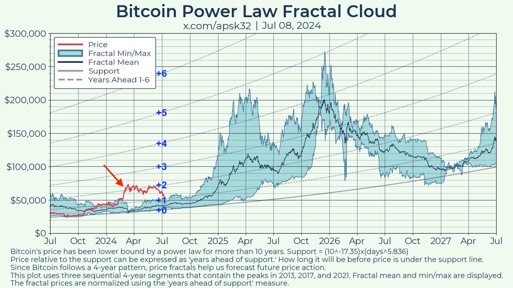
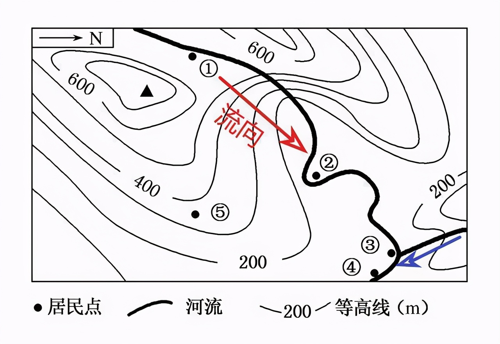
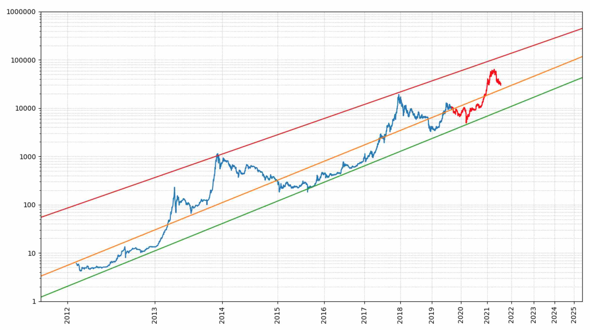
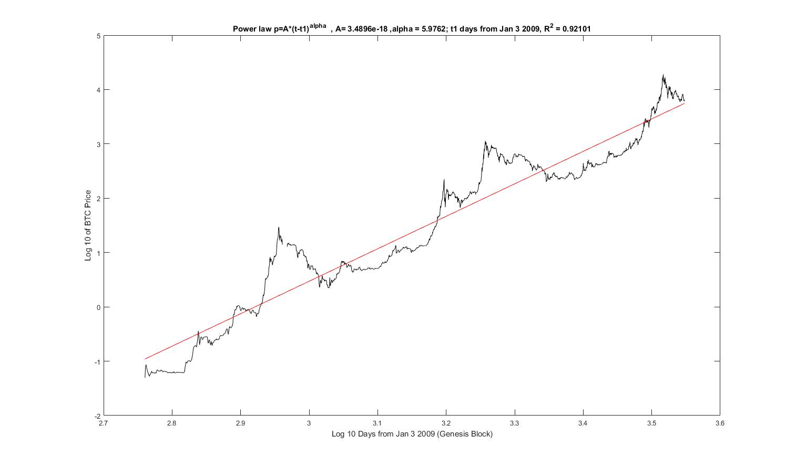

# 决定投资成败的最重要因素是（）

美联储主席鲍威尔罕见唱鸽。BTC连日修复，目前暂居58k一线。昨晚[7月10日教链内参：伯恩斯坦：2025底20万刀，2029底50万刀，2033年100万刀]综述了多家分析机构对行情的看法，其中伯恩斯坦的预判，放到幂律上其实是中规中矩的数字。而在评论QCP资本的观点时，教链引用了昨天文章《本轮牛市发育早熟，2024年3月为假启动，或将于2025年1月真启动》中引用的幂律分形图，对价值梯度S、S+1、S+2的前景进行了预估。

受篇幅所限，昨天文章只谈到了，这一轮周期，在减半前后不仅不打折，而且还涨价，让贪心等抄底的人，扑了个空。

其实再仔细看一下，这轮周期减半前“贴底爬行”的时间，是在2023年10月份，那个时候BTC几乎是贴到了幂律的底部支撑。而后，随着一系列利好的出现，尤其是现货ETF等实质性利好的落地，BTC便飞离了支撑线 —— 被教链标记为“+0”的灰蓝色弧线。我们将这条弧线记为S。2024年初ETF通过后，回踩S+1线 —— 即S上方的那条灰蓝色虚线。随后在3月份冲到了S+2线，并沿着S+2震荡前进，直到最近，似乎又在向S+1跌落。

教链在图中把S、S+1、S+2、S+3、S+4、S+5、S+6等诸条弧线，分别标注了+0、+1、+2、+3、+4、+5、+6。

这一系列的弧线，都是幂律的曲线。构成一个曲线蔟。

这个东西看上去和什么有点儿像？对了，地图。具体地说，地图中的（海拔）等高线。

地理是空间上的运动。金融是时间上的运动。

教链在图中标注的+0、+1、+2、+3、+4、+5、+6等诸条线，就好比BTC价值运动在幂律空间中的“等高线”。或者像开头说的，把 S+x 这一系列曲线蔟，叫做“价值梯度”。“等高线”此时应该叫做“等价值线”。

我们常见的幂律是放在双对数坐标系下的。在双对数空间中，幂律是一条直线。就像教链在3年前的2021年7月24日文章《比特币的价格走廊》中所展示的那张图所画的那样：

或者说，2018年9月4日幂律模型第一次在reddit网络论坛现身时，所长得样子：

其数学表达式（回归中值）为：

p = (3.4896 x 10^-18) x days^5.9762

但是，本文开头所标注的图，是一个欧几里得空间，也就是线性坐标系，那么此时幂律就变成了曲线（弧线）。

如果用“等高线”的概念来理解，那么就会看到，比如说，2024年初的6万刀，大约等价于2026年初的12万刀，因为它们都位于S+2等高线上。

不过，我们还可以从另一个角度来理解这些“等高线”，即它们的定义，或者说，它们是怎么画出来的。

在地理上，等高线是海拔相等的各点连线。海拔，顾名思义就是距离海平面的高度。显然，这里首先定义了海平面的海拔为0。

那么在金融上，或者说，在幂律上，“海平面”又在哪儿呢？

我们需要做幂律拟合，找到一个支撑位S，即教链在图中所标注的+0那条线。对于文首的图，S线的解析表达式为：

S = (10^-17.35)x(days^5.836)

请注意，不同的人去对BTC历史价格做回归拟合，所得到的表达式可能会略有差异，这很正常。

一旦找到了S线，那么以此为基准“海平面”，把距离这个基准“海平面”的“时间”——而非“高度”——相等的点相连接，就得到了“等价值线”。比如，把所有距离S线2年时间的点连接起来，就得到了S+2线。

这是什么含义？含义就是，每一个位于S+2线上的点，其距离S线的时间长度都是2年。

从这个意义上讲，幂律曲线蔟的这些“等高线”，或者说“等价值线”，其实也可以叫做“等时间线”，或者，“等时线”。

理解到这一层，就很清楚了。你加仓时所在的“等时线”意味着，再经过多少时间，S线，也就是底部支撑线，就能追上你加仓时的BTC价格。

如果我们认为，S线是BTC的“硬底”支撑位，大概率不会被跌破的话，那么，也就是说，如果你在S线上加仓，大概率是不太可能陷入亏损的了。

因此，S+1线的含义就是，如果你在S+1线上加仓，那么经过1年时间以后，S线追上了你当初的加仓价，自此以后，这笔加仓大概率是不太可能陷入亏损的了。

以此类推，S+2线的意思是，加仓点在2年以后大概率不会再亏损。

S+3约等于加仓3年后大概率不再亏损。

S+4约等于4年后回本进入长赢。

S+5约等于5年稳赢。

等等……

几点观察：

(1) 目前，6万刀大概位于S+1.5。也就是说，6万刀加仓，熬过1年半以后，大概率便永远不再可能亏损。

(2) 如果在9万刀以上加仓，那么穿越这轮牛熊，翻过山丘，熊市底部有可能依然陷入浮亏。也就是说，本轮牛市加仓，不会好于等到下一个熊市底部加仓 —— 只不过，绝大部分人都不会有耐心苦等两年。

(3) 年初7万刀高位站岗的朋友也不用担心。7万刀只是处于S+2附近，也就是说，你只要不割肉，只需坚持2年，就有很大概率会看到回本甚至盈利的希望。

(4) 历史上，BTC即便是在最狂暴的牛市顶峰，也从未突破过S+5。这意味着，就算你是在牛市最高峰接盘站岗，只要拿住不割肉，5年之后BTC都会让你回本！虽然中间要经历仓位缩水80%的极度痛苦，但是只要你咬牙挺过去了，仅仅5年就又会是一条好汉。从这一点上讲，BTC比那些动辄套人10年、15年甚至20年的股票要善良太多了。

(5) 硬底S有没有可能被跌破？从历史上看，是有可能的。从数学上看，当然也是有可能的。这就是个概率问题嘛！所以上面4点观察，说的都是“大概率”，而不是“100%”。比如，2022年底，硬底S就被短暂跌破过。S被跌破时应该怎么办？当然是大力抄底啊！此时抄到就是赚到。因为这时候不是 S+x 而是 S-x，相当于“时光倒流”了哎！

结论。回到本文标题的问题：决定投资成败的最重要因素是（）。

答案是：加仓资金的长短。

或者拟人化的说法是，加仓资金的寿命。

很多人之所以总是亏损，关键问题就是他总割肉。他为啥总割肉？可能因为他炒币的钱是拆借来的（或者挪用的其他开支款项），可能3个月、半年内就要偿还，甚至是刷卡的，下个月就要还款。这么短的资金，别说匹配S+2、S+3了，就算是走狗屎运买到了S线上，恐怕也对抗不了市场的短期波动。

不知道有没有读者朋友还记得教链在7月9日文章《各国政府抛压不用怕，本轮周期足以全部中和！》中写的一段话：「有人等着抄底，问什么时候可以加仓。教链说，对BTC而言，任何时候都是买入的机会。不要贪心不足，总想精准买到最低点。分批买入。拿上十年。」

教链说的“拿上十年”可不是随口瞎说。背后的科学依据就是S + 5 < S + 10。S + 10 = S + 5 x 2。

S+10就是穿越两轮牛熊。穿越一轮，完成回本。穿越两轮，盆满钵满。

至于其他影响投资的因素，十分复杂。外部因素，基本上属于《孙子兵法》讲的“胜可知而不可为”的范畴。心理因素，那是个人的修行。这些因素，都围绕着上面教链讲的资金长短这个最重要的核心因素发挥作用。

当然，还有一点很重要：标的。不是说必须是BTC，而是说标的必须像BTC这样，具有对时间的幂律增长性质。否则，你的资金再多、再长，也都会被血盆大口吞噬，最终血本无归。
