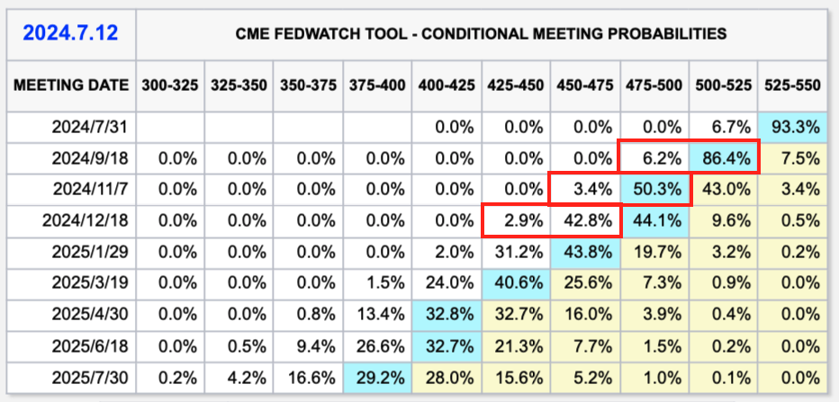
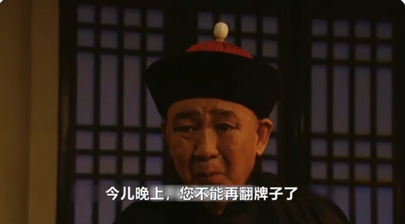
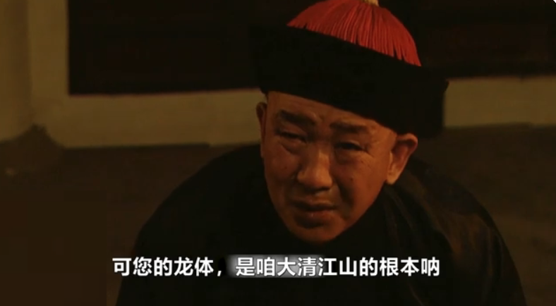

# 鲍威尔意外松口，BTC十万可期

隔夜BTC小幅回撤到57k一线。据昨[7月11日教链内参：美通胀超预期放缓，降息预期大增！]报告，美通胀大幅缓解，美联储主席鲍威尔意外松口，期货市场提高了对年内降息概率的押注，一度降息无望的悲观被三次降息的乐观所取代！

仅仅持续两年的高息，就足以让一些心理慕强的人长跪不起，以为美元可以这样一直“硬”下去。可惜大美利坚老态龙钟，已经要靠纸尿裤解决生理问题，再也不是当年那个迎风能尿三丈远的精壮少年。于是只能一边服下壮阳药，继续透支那外强中干的身体，站在背后秀硬度，却不敢下场真刀真枪干；一边雇佣网络水军，整天刷屏高呼“真棒”、“真硬”、“真厉害”，吹吹牛逼，给自己提供一些情绪价值了。

鲍威尔就像康熙帝身边的太监总管李德全一样，心如明镜儿似的。“万岁爷，今儿晚上，您不能再翻牌子了！”

觉得美元硬不硬是由美联储决定的，就和觉得男人硬不硬是由脑子决定的一样傻白甜。

固然，脑子可以决定给自己吃药。但是这药一吃起来，那就形成了依赖，于是药就不能停。而且越吃耐药性越高，越吃需求剂量越大，越吃效果越差，有效时间越短，效果消失速度越快。最要紧的是，长期吃药纵欲，掏空了身子骨儿，脱实向虚，越来越虚。气虚火旺，虚火上升，就愈发需要更多的水来解渴。这饥渴的速度，连印钱放水的印钞机都快赶不上了。

龙王下雨，都须得令，严格按照指令，几时几刻，多少点数，不能有分毫差池。若被发现擅改降水参数，就会被捉到天宫审判定罪，斩龙铡处决。

鲍威尔虽贵为全球龙王之首，但依然只是一个龙王。

美元的大水放出去了，回流的最好方式是输出商品，换回美元。但是因为身子虚了，没有那么多商品输出，无法靠这个办法把放出去的美元收回来。于是就换成了金融的玩法：输出美债，换回美元。

对沙特是输出美元，换回石油；然后输出美债，换回美元。对中国是输出美元，换回商品；然后输出美债，换回美元。

美元是媒介，美债是白条。本质就是打白条，换资源，换商品。俗称“白嫖”。

鹰对兔，美对中，白条对劳工。

后来咱们不想这么陪它玩这个游戏了，于是换了个路径让美元回流，也就是这一轮美元加息周期所发生的事情：

美对中输出美元，换回商品。中对其他第三国借出美元，换回人民币债权（资源抵押）。第三国把美元还给美（偿还对美的美元债务），换成对中的人民币债务。最后，第三国对中输出资源，换回人民币（偿还对中的人民币债务）。

结果大家也看到了，美联储以史无前例的速度疯狂加息，药不可谓不猛，并长时间维持高息，亦不可谓不持久，但却并没有把谁干趴下。

为啥？因为大家都愉快地把美元杠杆平仓，改和咱们玩没有美元的游戏了。

众所周知，空头砸盘，如果不能打爆一些杠杆、恐吓一些人割肉，不能吃到爆仓者或者恐慌者吐出来的低价筹码，那么空头是赚不到钱的，等恐慌过后、资产价格恢复，就算是白忙活一场。

龙王这次奉命在村里搞旱灾，结果有人修了纵横交错的水渠，四处送水，帮助乡亲们度过难关，避免了大家为了吃一口饭而低价贱卖土地。

现在龙王马上就要接令降雨了。

“人定胜天”就是我们坚如磐石的信念。

当美元开启降息，在美内部金融空转的收益率不再相对世界其他地方的资本收益率具有显著优势，美元洪流就会从美体内汹涌而出。美股迅速失血，触发美联储紧急进一步加大供血量，以维持住局面。这将会是一个正反馈循环。最终促使美联储超额释放大量的美元流动性。

BTC有小半只脚踩在美内部，大半只脚踩在外面。作为管道资产，汹涌奔腾的流动性，将会对其形成极大的推力。毕竟，BTC的用途之一在于价值传输。BTC的价格越高，1枚BTC所能承载和传输的价值也就越大，其使用价值也就越大。

至于大A，也将迎来它20年级别的楔形突破。

不敢迎风撒尿的，不是热血青年。不敢在熊市逆势加仓的，也不会成为牛市的赢家。

