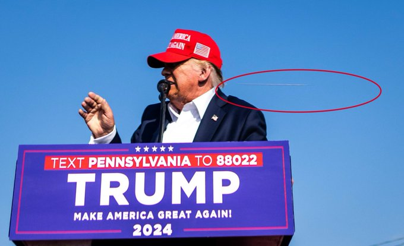
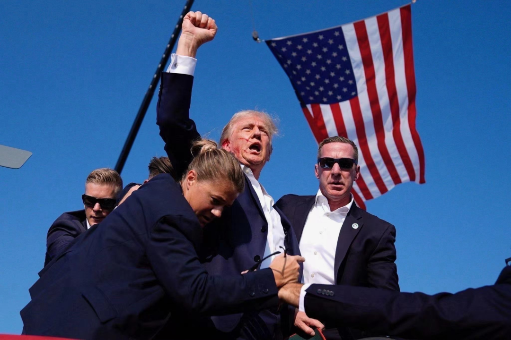

# 子弹射向特朗普，却杀死了熊市

隔夜BTC正在58-59k犹犹豫豫地上涨之际，一声枪响撕碎了宾州（Pennsylvania）特朗普竞选集会现场的气氛。演讲时摇头晃脑、肢体语言丰富的习惯在关键时刻救了他一命。所有的偶然叠加在一起，深刻地影响着历史的走向。子弹从特朗普的耳际呼啸而过，在他老当益壮的脸上留下了几缕血丝。

这是自1981年里根总统遇刺以来，首次有美国总统或候选人遇刺。

大难不死，必有后福。这一枪后，特朗普得到了下一任美国总统的保送名额；摄影界得到了一张可获大奖的照片（就是上面这张）；而加密市场赢得了牛市。大家都有光明的未来。

人生往往就是这样。勤奋、努力和忍耐决定了99.99%的事情，但往往就是那剩下0.01%交由运气决定的部分，充当了命运分岔口上的扳道工。

BTC应声上涨，一度再破6万刀。特朗普胜选概率越高，美联储降息越快，BTC上涨动力越大。这一套逻辑底层，教链在今早[「7.14内参：懂王遇刺，风云突变！」]中已经谈的比较清楚了。

历史，就是由无数的偶然串在一起，所组成的必然。

枪手射向特朗普的子弹，没有打败特朗普，却正中了熊市的眉心。仿佛枪手不是为了特朗普而来，而是为了牛市而来。

当历史的车轮已经驶上了一种必然的轨道，大多数的偶然，不过是加速或减速的催化剂罢了。

当康波萧条，美国衰退，西方右转，一颗子弹，只是那推动所有的右转更快转向极右的有力助攻之一。

翻开《比特币史话》第40话“大萧条”：百年之前，康波衰退。美国大萧条，波及几乎所有主要资本主义国家。「“农场主把牛奶倒入密西西比河”」。「许多白领到街上的垃圾桶里捡拾可以吃的食物残渣，很多之前光鲜亮丽的商人和银行家被迫摆地摊谋生。」「“千百万人只因像畜生那样生活，才免于死亡。”」「这次深厚的经济危机，促成了倡导政府干预经济的凯恩斯主义的登场，促进了自由主义者被经济危机中毫发无伤的苏联吸引而转变为马克思主义者（左翼），也推动了保守主义者（右翼）向法西斯主义（极右翼）的转化，政治光谱两极分化，意识形态不断撕裂，最终走向了战争。」1939-1945年，二战爆发。据不完全统计，二战中军民共死亡7000余万人（不含受伤未死亡人数），经济损失达5万多亿美元，是人类历史上规模最大的世界战争。

纽约邮报（New York Post）在特朗普遇刺后第一时间的稿件中，未经确证，就看似草率地猛带节奏：「The shooter, identified as a Chinese man, was...」

这句英文不需要翻译，正如前些日子大火一阵的《美国内战》（点击查看教链2024.6.1同名文章）中那几句典中典的台词一样无需翻译：「Where are you from?」「I... I am from Honkong.」「Oh, China~ (BANG)」

很快调查结果就啪啪打了美国fake news们的臭脸。枪手名叫 Thomas Matthew Crooks，标准的白人。

感谢科技的进步。为传统媒体所垄断的“第四权”在今天的移动互联网时代、数字经济时代，已经越来越被广大上网的人民群众所不断掌握的“第五权”所识破、揭穿、制衡和取代。

当不怀好意的选择性报道、暗带节奏，在人民群众汹涌澎湃的网络大记录、大传播、大讨论中无所遁形的时候，世界便比以往更加接近于“真相”。

当超主权、抗没收的BTC把日益撕裂的一个个人类彼此的利益重新融合的时候，世界便比以往更加接近于“和平”。

百年后的今天，虽然人类命运又一次走到了衰退和萧条的十字路口。但是这一次，世界也有了许多不同以往的核心变量和关键因素。人类应该有能力把握和创造自己的新的命运，不重蹈百年前不得不最终选择通过全球战争彻底去杠杆的覆辙。
