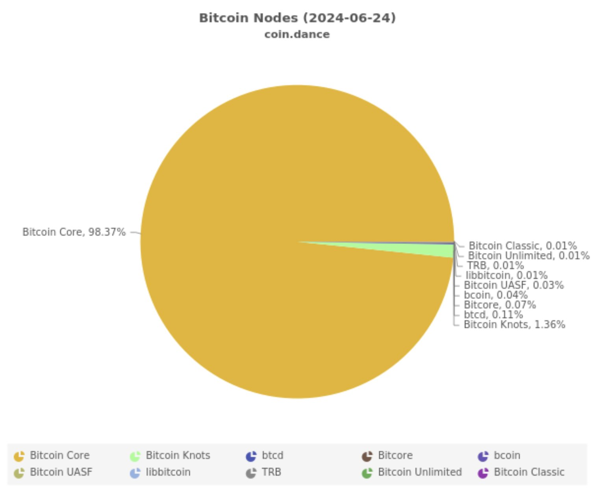
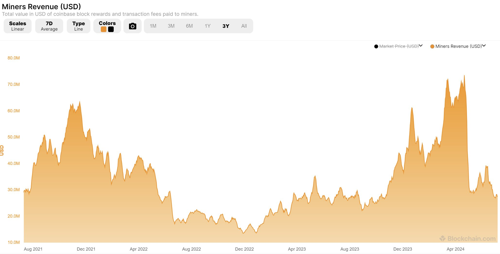

# 未来4-12年，BTC的安全模型就要崩溃了吗？

今日BTC试图冲击64k，一度站上，又被击落。Mt.Gox的赔付马上就要开始了。市场依然还是对于潜在抛压惴惴不安。教链在过去半年多时间陆续写过多篇内参谈及Mt.Gox的事情，其中[2024.5.28内参：门头沟14万枚BTC异动，会造成市场崩盘吗？]还特意进行了一下定量计算。当时推算的抛售量也就是5万枚左右，其实和德国政府前不久清仓的数量类似。感兴趣的朋友可以再去翻翻那篇内参。

昨天[7.15内参：BTC加速上攻，特朗普仍将出席]提到，长期持有者抛售似乎正在结束，这对于市场的走高肯定是十分有利的因素。

国外有个叫做Justin Bons的，前几日发了一串长长的帖子，观点耸人听闻，引起了不小的骚动和担忧。各路人士粉墨登场，借机唱衰BTC。其实看一下那个Bons的长帖，就知道他宣扬并不新鲜的BTC即将变得不再安全的论调，还是为了夹带他最后的几点“私货”：

第一，他认为BTC最终不能保持2100万上限，而是应该引入永恒通胀，以确保不断超发BTC来支付矿工。（类似PoS的经济模型？）

第二，他主张BTC应该像BCH那样采用大区块扩容，以此增大吞吐量，回归BTC支付工具的初心（咦，咋这么熟悉的调调？BSV，并打包更多交易以支付矿工。

第三，他批评现在BTC客户端市场占有率超过98%，居于垄断地位，应该开发和普及更多样化的客户端，以避免核心规则的修改权力被Bitcoin Core开发团队所独占。

即使你无法判断他关于BTC安全模型即将面临失败和崩溃的论调是否正确，但当你看到他是借由BTC失败归零的“末日预言”，以此“夹带私货”、宣扬自己的上述三点“救世思想”时，也应该能嗅出一些居心叵测的味道来。

他的一番高论，本质上与“死亡螺旋论”一脉相承，本质上并无新意：BTC产量减半，造成矿工收入锐减；矿工收入减少，被迫关停矿机；矿机关停，算力下降；算力下降，安全性降低；安全性降低，BTC价值下跌；价值下跌，价格崩落；价格崩落，矿工收入进一步减少…… 于是矿工进一步关停更多矿机算力…… 这就是一路滑向归零的死亡螺旋。

当然，相比于古典的死亡螺旋论，Bons的这番“安全崩溃论”，进行了一点儿“创新”：他否认了哈希算力在死亡螺旋中的作用，而是改称，算力高低不重要，重要的是矿工的收入，而且，他谈论的是矿工的美元收入。—— 我们得知这一点，是因为他引用了这个图表：

他用这张图表说明，矿工的美元收入减少了，因此BTC变得不再安全了。他进一步预言，在未来4-12年，BTC的安全将彻底崩溃，BTC将归零。

但是他为何要进行上述这一点儿“创新”呢？他本人给出的说法是，攻击BTC的成本才是BTC安全的决定因素，而不是哈希算力。他说，随着技术进步，哈希算力可以在不增加成本的情况下提高，但是BTC的安全性并没有同步提高。

但是，仔细想一想，难道不是BTC算力不断续创历史新高，让古典的死亡螺旋论迟迟无法兑现其预言，以至于这一论点在人们心目中快要破产了的缘故吗？

在此情况下，Bons挺身而出，提出了死亡螺旋论的修正理论 —— 安全崩溃论，试图用回避BTC算力持续增长的事实，来论证BTC已经或即将陷入安全的死亡螺旋，并由于很难实施他给出的三点救世意见，而终将在众目睽睽之下归零。

可是，虽然他用抨击囤币大户微策略的老板Michael Saylor不懂PoW安全性的策略，来试图让自己的BTC安全不挂钩哈希算力却挂钩矿工收入的理论得到巩固，但是，他依然是在循环论证。

其逻辑漏洞简直不要太明显：就算矿工只花费极低成本来运行极大的哈希算力，只要BTC系统以外的其他系统很难搞到与之匹敌的哈希算力，就很难攻击BTC系统。这就是哈希算力的相对优势所铸就的铜墙铁壁。

哈希算力的绝对值高低，或者他所说的生产哈希算力的成本的绝对值高低，其实都不重要。重要的是，BTC系统生产哈希算力的效率，相对于BTC系统以外的其他系统生产哈希算力的效率，之间的比较优势。重要的是生产关系，而不是生产力。

在这个生产关系的比较优势中，所比较的当然是哈希算力（哈希率，hashrate），而不是生产成本，更不是矿工收入。

能够使用更低的生产成本，生产出具有更大竞争优势的产物，即哈希算力，当然是更好而不是更糟的。就好比说别人制造一辆汽车需要5万元成本，你造一辆同水平的汽车只需要1万元，这显然是优势而不是劣势。这本是一个极其朴素的经济学常识，却被他神秘化而后颠倒黑白了。

如果矿工能够因为生产工艺（技术）的改进，而用更低的成本来生产同样甚至更高的哈希算力，那么，矿工就可以为此要求更低的收入。就像上面的比喻，别人5万成本造一辆车，要卖20万元，你1万元造出来，就只需要卖5万元。显然，你会获得更大的市场竞争力优势。

因此，BTC矿工要求更低的收入，而提供更高的哈希算力，这本质上就和汽车的例子类似，用更低的售价，售卖同等甚至更好的商品。这当然是极大地提高了BTC的市场竞争力优势，而不是让BTC更差。

如果技术持续进步，生产力持续提高，矿工可以要求市场支付更低的安全费用，就能提供更高的安全保障，就像更好的保镖却费用更低一样，这只会让BTC变得更好，并且，只需要更少的区块增发，以及不用那么多的交易手续费支付，就可以满足矿工的收入要求。

本质上，区块增发是所有BTC的投资者共同承担的费用，交易手续费是所有BTC的使用者支付的总费用，这两项加起来，构成了BTC矿工的总收入。矿工的总收入，决定了矿工能够长期持续运营的成本上限。

费用更少，安全更高。这才是BTC的光明未来。
