# 比特币的“21条军规”

隔夜BTC站上65k。诚如[7.15教链内参“BTC加速上攻，特朗普仍将出席”]所言，「回顾一下教链近期文章和内参，基本上都是在这一波下跌回调中不断注入积极能量，并亲自践行逢跌加仓的八字诀策略。一切都不断证明这一点：只有在下跌中对BTC之信仰愈发坚定的人，才能有资格持有打折的BTC。」BTC上攻的时候，快得让人根本来不及上车。只有坚定持有的长期主义者，才不会错过每一次快速上涨。

在教链过去五六年穿越牛熊、奋笔疾书的过程中，见过数不清失败的人。虽然说幸福的人都是相似的，而不幸的人各有各的不幸，但是所有这些形形色色的失败者，却也有那么一些共性，比如：总是在抱怨，一直在等待，从来不学习，热衷走捷径，等等。

拉出这些日子以来文章下面的评论，各种负能量扑面而来，抱怨大环境不好的有之，悲观绝望认为牛市已经结束的有之，无理谩骂发泄情绪的有之。除了“拿钱发帖死全家”的那种玩意儿之外，剩下的充满戾气的负能量评论者，之所以活得失败，与其说是他们因为失败而充满负能量，毋宁说他们是因为充满负能量而失败。

胜人者有力，自胜者强。中华民族的精神，从来都是自强不息、厚德载物。上天有好生之德，却也只助自助之人。要想取得成功，先从修炼自身做起，摒弃身体里的负能量，主动给自己注入正能量。勤奋学习，热爱劳动。工作尽责，爱国爱家。强身健体，拥抱生活。不做颓废事，不说丧气话。戒掉坏习惯，培养好习惯。胜不骄，败不馁。不以善小而不为，不以恶小而为之。

须知：积善之人，必有余庆。积不善之人，必有余殃。天网恢恢，疏而不漏。与君共勉。

以下，教链要介绍著名囤BTC大户微策略的老板Michael Saylor所总结的关于比特币的“21条军规”。这是他提出来为了解和投资比特币提供见解和指导。

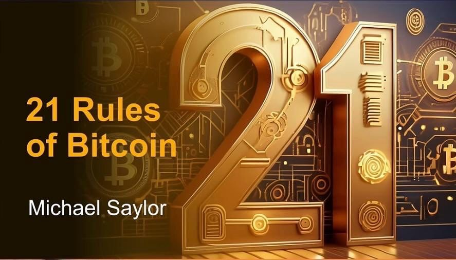

第1条：理解与批评。

了解比特币的人购买比特币，不了解的人批评比特币。如果你真正了解比特币，你就会情不自禁地购买它。批评者往往缺乏这种理解，对比特币持怀疑态度。

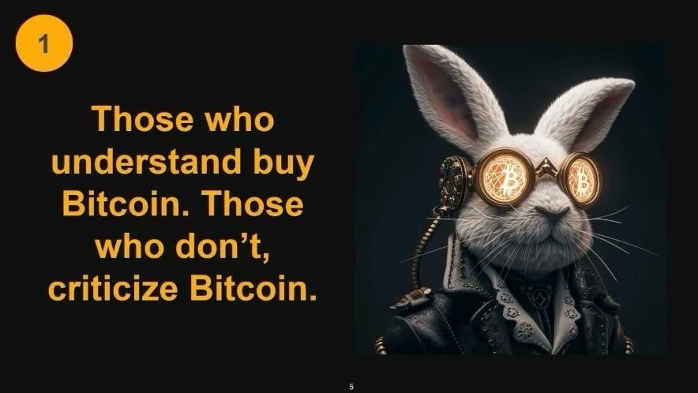

第2条：最初的反对。

每个人在支持比特币之前都会反对它。许多个人和机构最初都反对比特币。这种反对往往源于缺乏了解或害怕改变。起初，人们可能会对比特币不屑一顾，但随着深入了解，他们开始发现比特币的价值和好处。

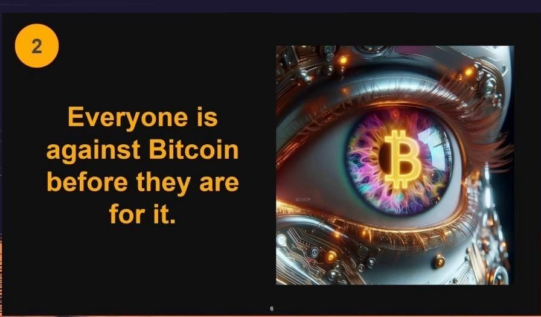

第3条：不断学习。

当你意识到你永远无法完全理解比特币时，你就掌握了它。关于比特币，无论是技术、经济还是社会影响，总有更多的东西需要学习。

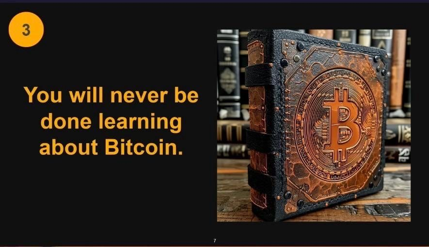

第4条：以混乱为动力。

比特币在混乱中茁壮成长。私钥的随机性和巨大可能性为比特币的安全性做出了贡献。这种混乱确保了比特币的弹性和去中心化。

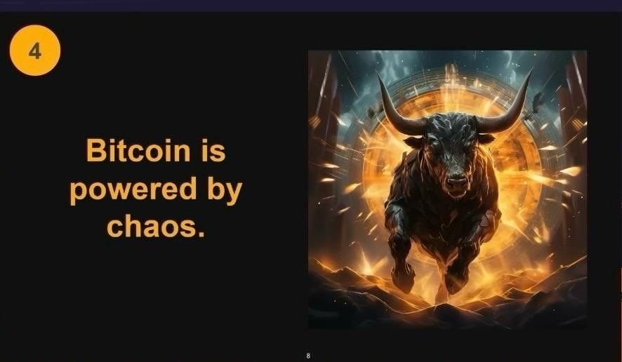

第5条：全民共赢。

比特币是赌场中唯一人人都能赢钱的游戏。传统的金融体系中，庄家总是占优势，而比特币则不同，它为所有参与者提供了一个公平的竞争环境。

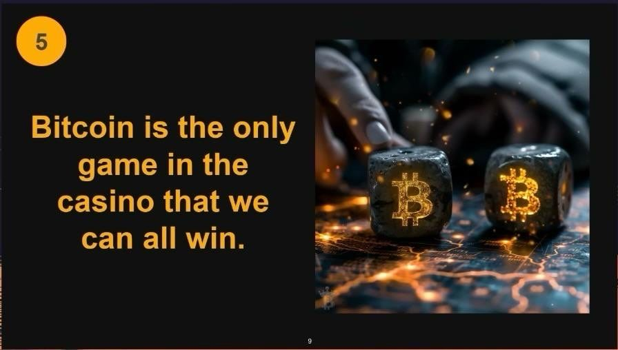

第6条：全力以赴。

如果你不穿盔甲，比特币就无法保护你。你需要全身心地投入到比特币中，才能获得它的保护作用。部分投资并不能保护你免受金融不稳定的影响。

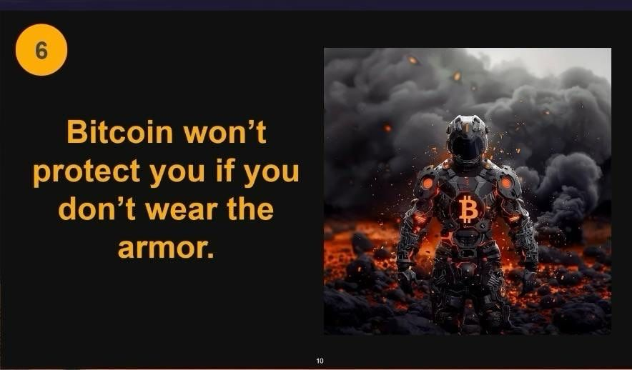

第7条：真正的所有权。

比特币是你唯一可以真正拥有的东西。比特币与实物资产不同，实物资产可以被没收或限制，而比特币由你的私人密钥保护，是真正属于你的。

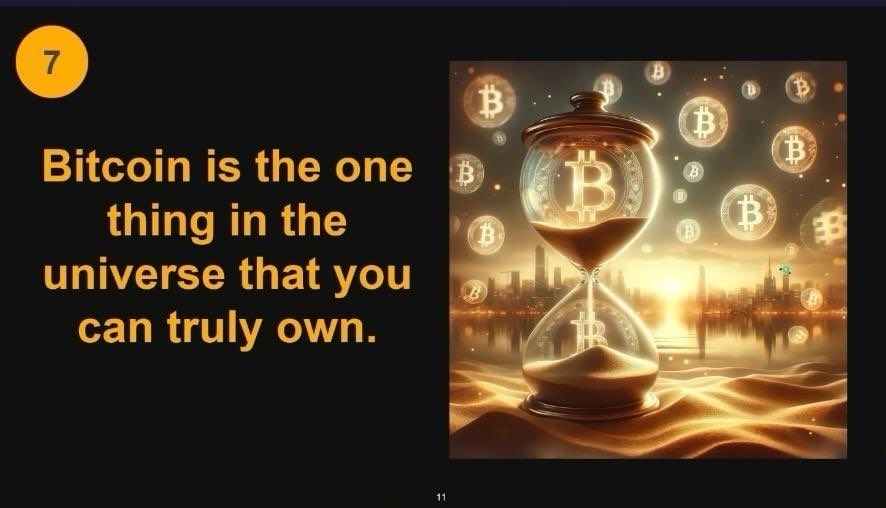

第8条：价格是应得的。

每个人都以自己应得的价格购买比特币。你对比特币的理解和时机选择会影响你所支付的价格。越早了解比特币的价值，价格就会更好。

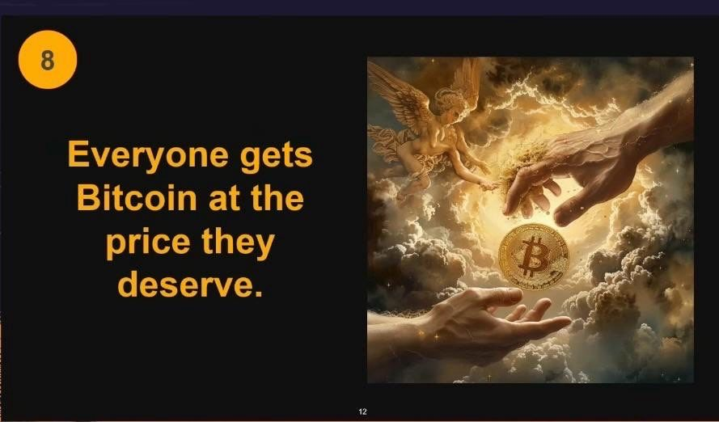

第9条：安全的投资。

用你输不起的钱购买比特币。Saylor 颠覆了传统观念，他认为比特币应该是一种主要投资，而不是投机性投资。

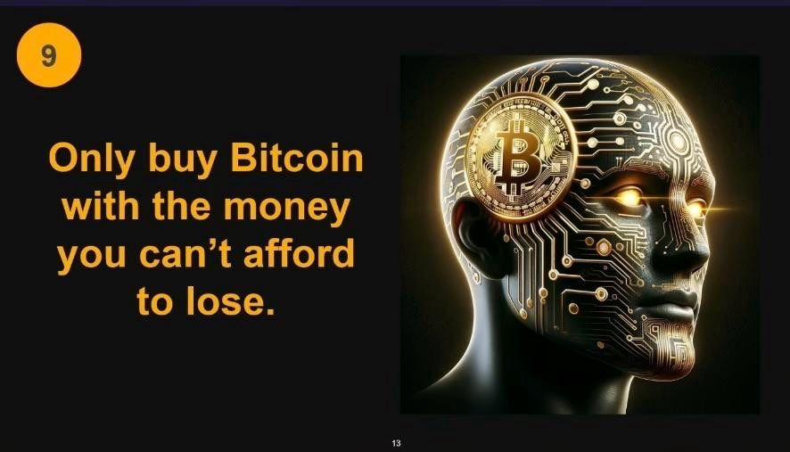

第10条：逃离“矩阵”（教链注：电影《黑客帝国》中的强大系统）。

逃离“矩阵”的门票以比特币计价。比特币提供了一种摆脱传统金融体系的方式，为您提供自由和对财富的控制。

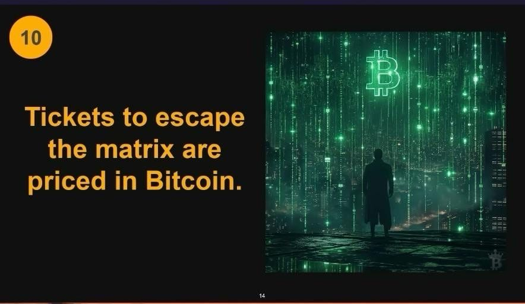

第11条：选择性洞察。
 
这意味着，只有真正需要的人才能获得关于比特币的知识和见解。处于坎蒂隆效应顶端的人，如拥有重大权力的政客或大银行的领导者，不需要了解比特币。这些人已经过得很好了，而且会继续这样下去，因为坎蒂隆效应使他们永远不会缺乏法定货币。只有那些需要它的人才会了解比特币，并理解为什么它是必要的。
 
坎蒂隆效应解释
 
让我们在这里解释一下坎蒂隆效应，以澄清：在当前的法定货币体系中，它指的是那些接近货币创造的人首先受益。新创造的货币在通货膨胀之前先惠及那些接近源头的人，使他们比其他人获利更多。这里有趣的是，人们常说，你需要大量财富才能投资比特币。然而，第11条表明，那些需要储蓄和保护自己价值的人是那些迅速理解并接受比特币的人，而不是那些在当前体系中茁壮成长的人。

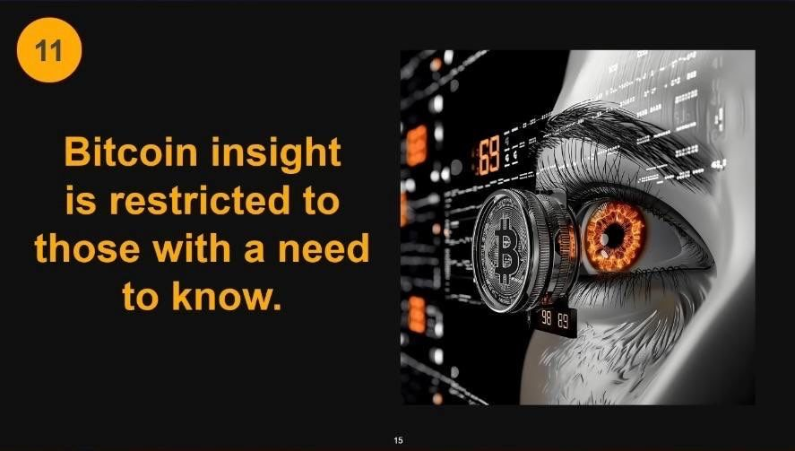

第12条：模型的毁灭。
 
这不仅适用于金融模型，也适用于政治模型。我们目前所知道的所有模型都将崩溃。就像《黑客帝国》中的“没有勺子”的类比一样。一旦你深入研究比特币，世界和金融体系的许多其他方面就会变得清晰起来，旧模型就会崩溃。

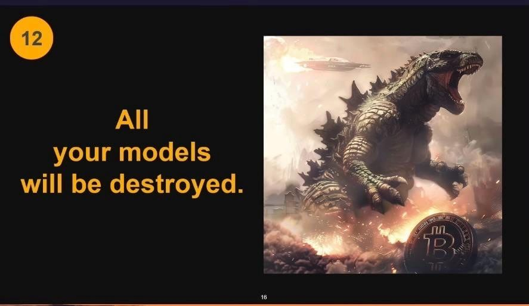

第13条：橙色药丸。
 
比特币是当前法定货币体系问题的解决方案。这种与《黑客帝国》的类比表明，比特币是我们今天面临的经济问题的解决方案。

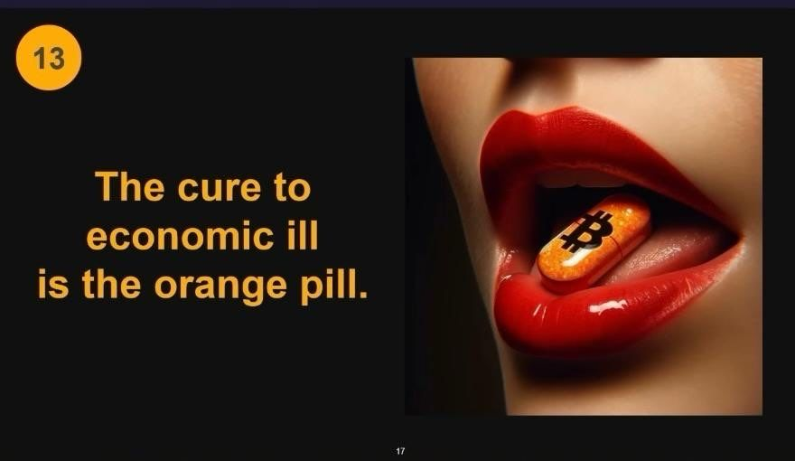

第14条：正面推广。

如果比特币像我们认为的那么好，就没有必要对抗当前的体系。强调比特币的好处，而不是攻击法定货币。

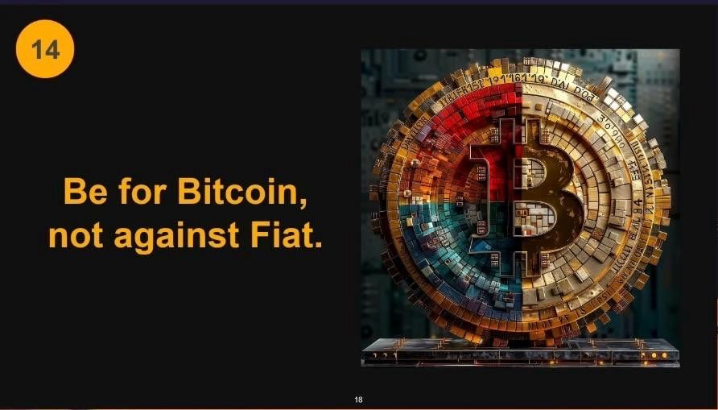

第15条：普遍的可用性。

比特币对每个人都是可访问的，包括那些你可能认为是政治或个人对手的人。没有第三方决定谁可以或不能使用比特币。

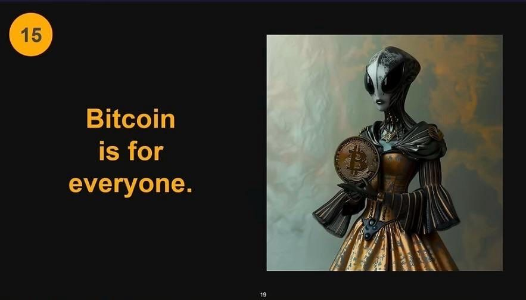

第16条：比特币思维。

停止用法定货币思考问题。当你开始将比特币视为本位时，你就会对你的投资更加挑剔。

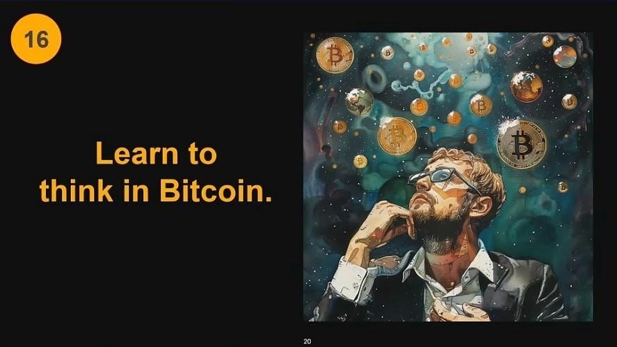

第17条：不可改变的比特币。

比特币改变了你的视角、思维和生活方式。你不会改变比特币，但它一定会改变你。

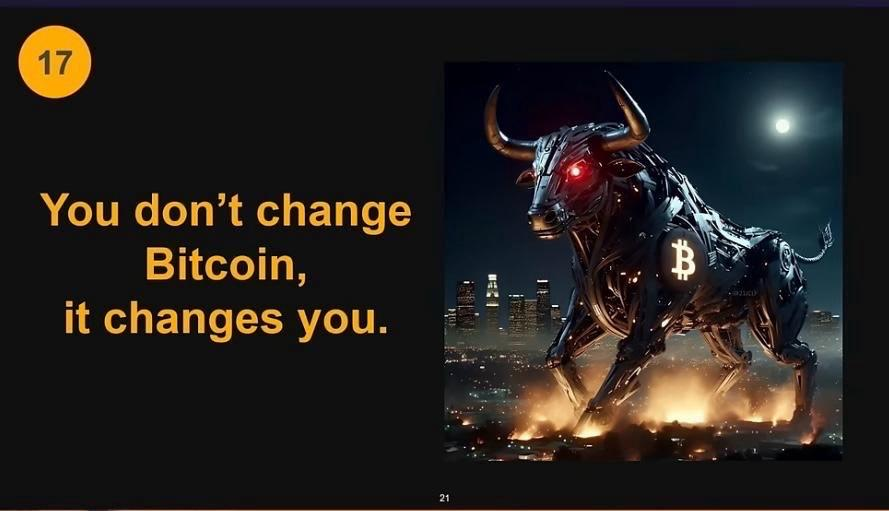

第18条：激光聚焦。

镭射眼象征着对比特币的专注。这种专注可以帮助你远离骗局和错误信息。

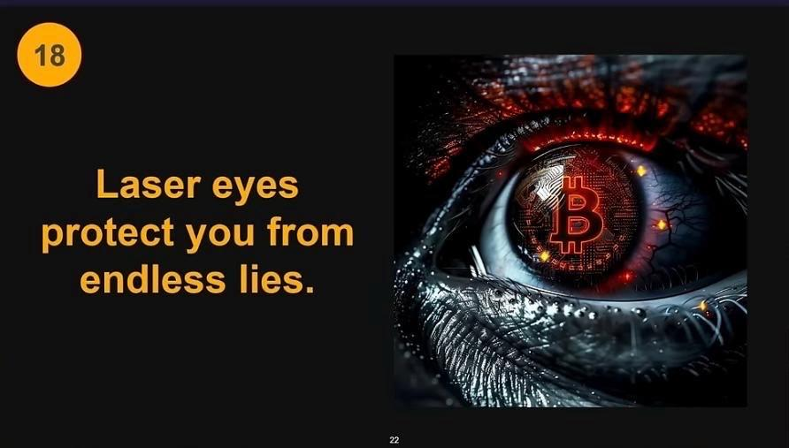

第19条：尊重比特币。

如果你不尊重比特币，你就有可能自取其辱。许多试图改变或诋毁比特币的人最终都显得愚蠢。

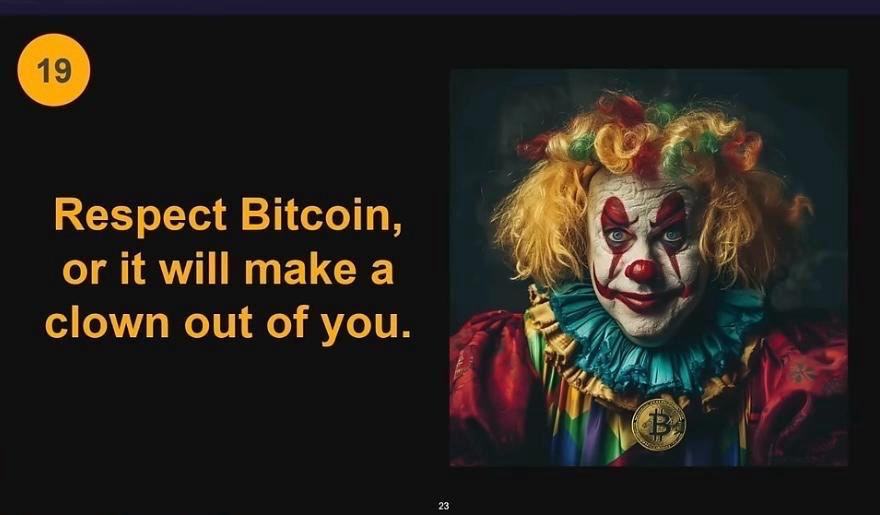

第20条：绝不出售。

不要出售比特币，尤其不要卖给大公司或政府。留着它，作为对冲法币系统和通货膨胀的工具。

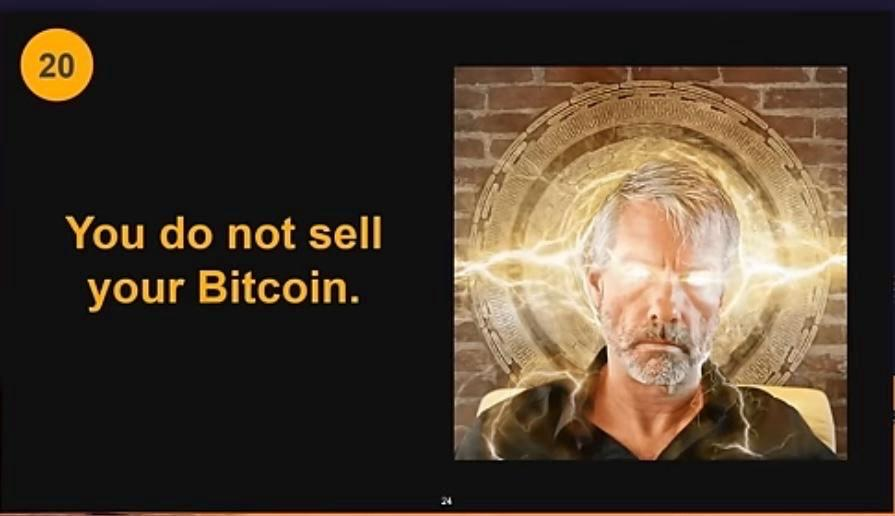

第21条：用爱传播。

用爱心和耐心传播比特币。如果你和别人谈论过比特币，这意味着你关心他们。在他们学习比特币的过程中，请给予善意的支持。

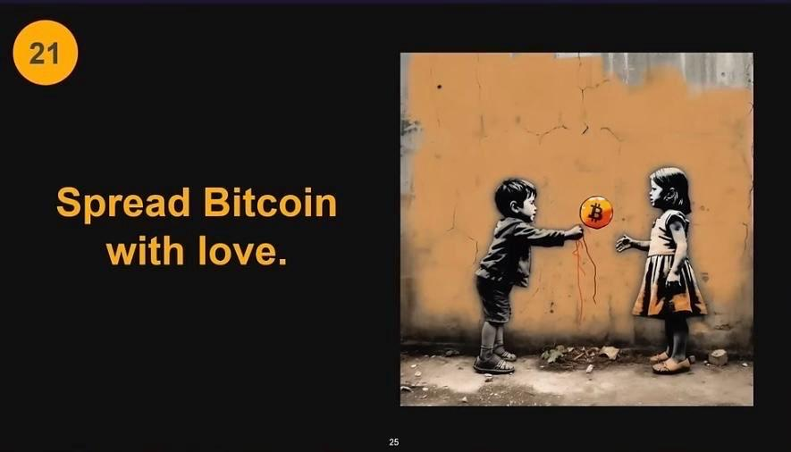

