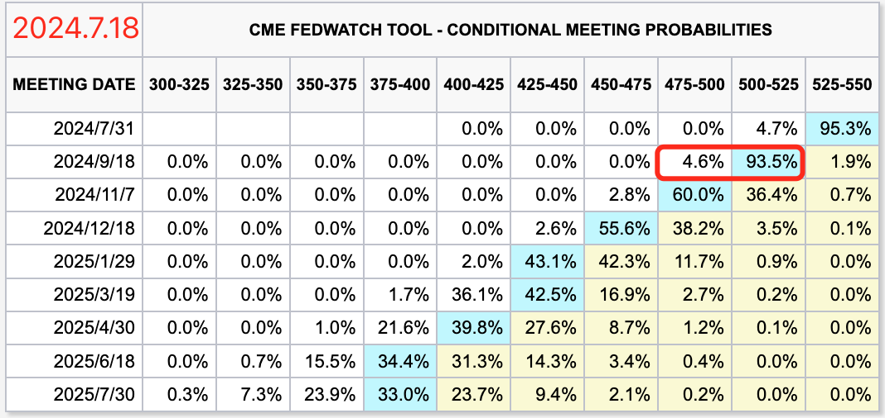

# VB反对特朗普

BTC暂时悬挂于65k下方。昨[7.17教链内参“美联储全面转鸽，黄金、BTC双双暴拉”]讲到了美联储官员纷纷转鸽。特别是鲍威尔的意外鸽派表态，更是让市场欣喜若狂，直接把9月份降息提升到了接近于“板上钉钉”的极高概率。

目前的变数是，被视为提前锁定11月总统大选胜局的特朗普在接受采访时表示，他会建议鲍威尔留任，特别是如果后者能够在一些事情上做出正确的决策的话。什么是所谓的“正确决策”呢？特朗普说了，他不希望在11月大选前降息，因为这将会把降息红利释放到尚未下台的拜登任上。

当然，变数都是短期的。长期一些来看，特朗普明确表态，应该无惧通胀、勇敢降息。加之特朗普这一次参选，180度掉转了其对加密的立场，从反对者转变成了一个支持者。同时，他带领整个共和党转向了加密友好，还选择了一个拥有加密仓位的副总统候选人和“接班人”——J.D. Vance。

这些转变令加密行业惊讶和欣喜。知名加密投资机构a16z就在近日公开表示，他们将改变此前对于特朗普的看法，转而对其进行支持。

就在这种背景下，以太坊创始人Vitalik Buterin (VB)，日前发表了长文《反对根据谁“支持加密”来选择你的政治效忠对象》(Against choosing your political allegiances based on who is "pro-crypto")[1]。

VB的主要观点是，当心政治人物的所谓“支持加密”(pro-crypto)。“加密”这个词的背后，涵盖了一系列丰富的含义。这全部的含义，未必是这名口头上表示“支持加密”的政治人物所知晓、所理解、所赞成的。

他说，“加密”(crypto)并不仅仅是“加密货币”(cryptocurrency)或者“区块链”(blockchains)。有一些十分重要而深刻的内涵蕴于其中，比如：通信的自由和隐私；自由和隐私友好型数字身份；思想自由与隐私；高质量的信息获取；等等。

最重要的是，「自由很重要，去中心化网络能很好地保护自由，而金钱是可以应用这种网络的一个重要领域 —— 但这只是几个领域中的一个重要领域。」

VB还提到了，加密必然是国际主义的。但是，保守派的领导人却往往更倾向于民族主义，筑高自家的院墙。

「如果他们也支持禁止加密信息，如果他们是一个追求权力的自恋狂，或者如果他们推动的法案让你的中国或印度朋友更难参加下一次加密货币会议 —— 这些政客要做的就是确保你能轻松地进行币币交易」，那么这种所谓的“支持加密”就是一种获取选票的花招罢了。

所以末尾，VB总结道，你不应仅仅根据政客是否表态支持加密而支持他，更应该问一个问题：他们是否是出于正确的理由而支持加密呢？

显然，特朗普是一个典型的保守派右翼领导人，他的竞选口号也是重拾美国的民族主义，从全球化中进行战略收缩，在物理上筑高边境墙，在经济上筑高关税墙，把精力和资源放在美国自己内部，“让肉烂在锅里”，以图“让美国再次伟大”。

他对加密的支持，不可能是从国际主义的角度出发的，而是从竞争主义的角度出发的。

在[7.17教链内参“美联储全面转鸽，黄金、BTC双双暴拉”]中提到，特朗普在最近接受媒体访问时曾经说过这样的话：「如果我们不做，中国就会接手，或者其他国家，但很可能是中国。中国非常重视这个领域。」

他说他要任命BTC的常年黑粉、摩根大通CEO吉米·戴蒙为新一任的财政部长，接替耶伦的位子。也许是为了打消众人的顾虑，据说他甚至表示，戴蒙已经转变了他对于加密和BTC的腔调。

其实吧，在教链看来，VB可能是有些苛求了。加密的发展，并不能仅仅靠理想主义和精英主义。有几个炒币的，心里装的是加密行业的宏图伟志？有几个挖矿的，是怀着为全人类伟大事业奉献力量的光荣觉悟？那么到了政客这里，为什么就必须要求他们对BTC、对加密的支持，就不能是“打嘴炮”、“纯忽悠”的不虔诚，而必须是如处女一般纯洁无暇的、从灵魂到肉体的全面支持呢？

BTC是金钱。而金钱几乎是人类社会里最具有包容性的东西了。金钱和宗教不一样，它不要求信徒的道德。即使你是一个恶贯满盈的罪犯、一个卑劣无耻的小人、一个人面兽心的变态，金钱都不会拒绝你对它的喜爱和使用。

中本聪本人道德高洁，但是他并没有道德洁癖，否则他也发明不出BTC。

发明BTC的人或许要有圣人的完美，维护BTC的人（比如Bitcoin Core的开发者）也许要有不计名利的奉献精神，但是其他形形色色的参与者，不能对他们的道德水准进行苛责。

毕竟，卑鄙是卑鄙者的通行证，而高尚是高尚者的墓志铭。

东方的上天不审判人的道德，西方的上帝也不审判人的道德，否则，这世界上早就应该没有那些累累恶行了。

上天和上帝只在乎一件事 —— 你的力量。

佛家说：放下屠刀，立地成佛。就算你杀人无数、十恶不赦，只要放下屠刀，就可立刻被佛门特招。原因无他，你的恶行体现了你的能量和力量，只要你愿意皈依，便是大有可用之才。而柔弱无力的所谓善良好人，就算是虔诚地念上一辈子佛经，也很难真正成仙成佛。原因也很明白，没有干过什么体现出超凡能量、力量和智慧的大事 —— 无论是善事还是恶事。

BTC所招募的，皈依挖矿的算力，便是这样的大恶，也是这样的大善。

善恶本一体，佛魔自两面。

甭管特朗普口头上对待加密的态度转变是真是假，是为了拉选票的投机行为还是真心皈依，是选前纯粹的忽悠还是当选后能够言行一致，只要他愿意把他目前所拥有的巨大能量和力量，注入到有益于BTC的利益的方向上来，那么某种程度上，就是“放下屠刀，立地成佛”的生动写照。

我们不需要对他献上什么忠诚。我们只需要对他的立场转变拍手鼓掌。听其言，观其行。

从科学角度来讲，博弈论也不对参与者进行道德评价。一个博弈结构的纳什均衡，就能决定，参与者无论怀着什么样的动机入局，最终都会被牢牢锁定。

锁定特朗普的支持加密立场的，不是VB所说的美国大选投票者们制造出来的“激励梯度”，即让特朗普感受到支持加密能够获得更多选票，而是可以与他作为美国总统所能掌握的巨大力量互相抗衡、博弈、掰一掰手腕的另外一个或多个巨大力量——比如特朗普在接受采访时直接点名的中国——也被卷入这个博弈之局，势均力敌的力量之间达到纳什均衡，让各方都无法逃脱。

博弈论，就是他们的上天上帝。

* * *

[1] https://vitalik.eth.limo/general/2024/07/17/procrypto.html
