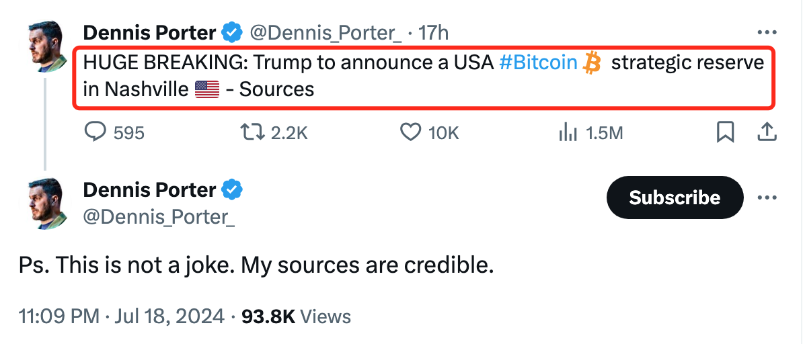
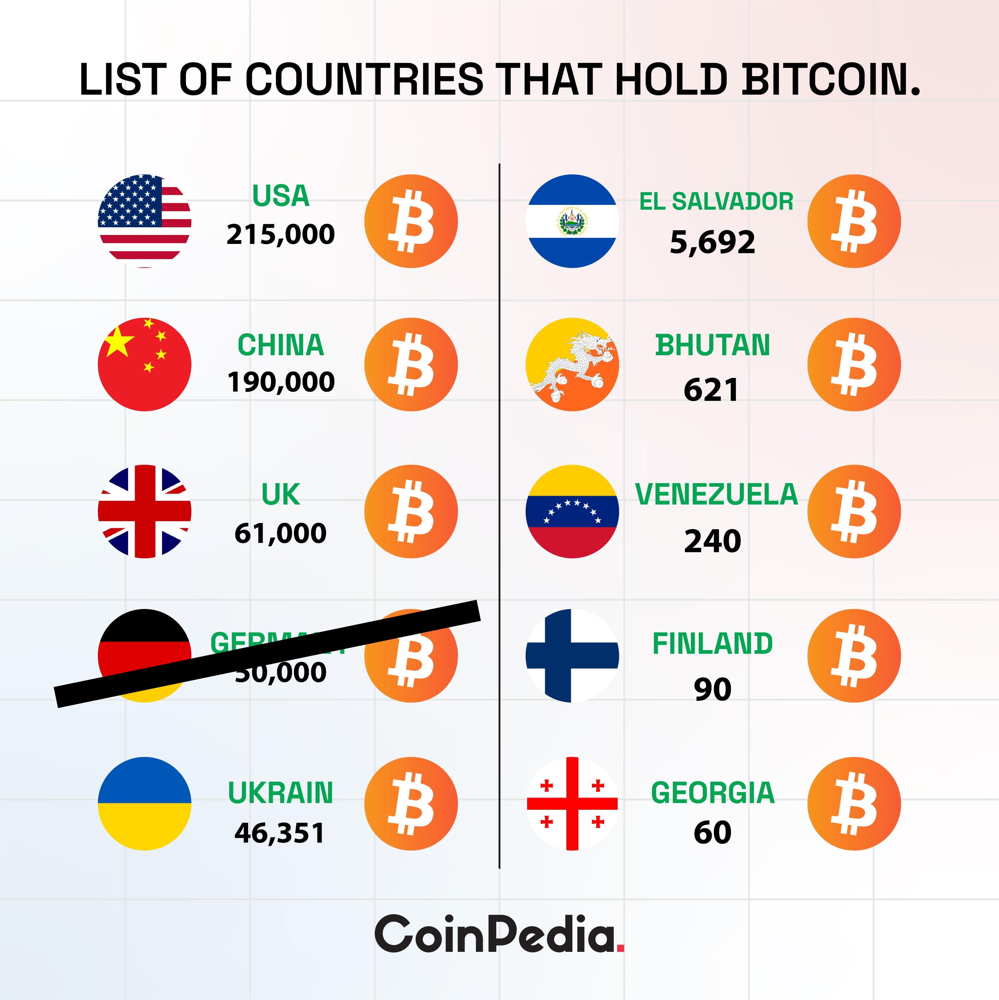

# 传特朗普或将宣布BTC为美国国家级战略储备

隔夜BTC继续承压下探63k，或受Mt.Gox赔付抛压预期影响。在[《子弹射向特朗普，却杀死了熊市》(2024.7.14)]之后，[“7.15教链内参：BTC加速上攻，特朗普仍将出席”]汇报，特朗普向媒体确认，仍将出席既定于下周四至六（7月25日至27日）在美国田纳西州(Tennessee)首府纳什维尔(Nashville)举办的“比特币2024”大会(Bitcoin 2024)。

而后，网络上就有人曝出，特朗普或将在出席比特币2024大会时宣布一个令世界震惊的计划 —— 让比特币成为美国的国家级战略储备！

如果特朗普在11月的美国大选中获胜、当选总统，如果特朗普果真要推动比特币成为世界第一大经济体、全球霸权货币发行国美国的国家级战略储备资产，我们可以想象一下这一惊人之举在全球博弈的大环境下将产生何等重量级的涟漪效应。

博弈论几乎肯定会推着中国和俄罗斯评估和跟进美国的战略。

近代中国固守白银本位，未能紧跟欧洲黄金本位的浪潮，最终硬度（S2F，稀缺性度量）较低的白银本位被硬度更高的黄金本位打败，成为中国屈辱近代史成因的诸多维度中的重要维度——货币史维度。

2024年4月20日，BTC完成了历史上第4次产量减半。BTC的S2F硬度飙升至接近120，几乎两倍于黄金（约62左右），成为我们人类的母星球——地球——上最稀缺、最硬的一种适合于当作价值存储和交换媒介的东西。

这是一次[《比特币的黄金减半》(2024.4.20)]。人类准备好了吗？大部分人根本没有意识到，2024年4月20日，小小蝴蝶轻轻扇动的翅膀，将在人类未来数千年的历史尺度上造成多么巨大的影响。奇点已至，但是[“人类尚未准备好迎接S2F大于100的巨硬资产”(2023.2.17)]。

历史已经改道。大多数人还在浑浑噩噩。

不过，历史演化是一个混沌系统。还要看历史的参与者们，如何在博弈论的框架中进行理性的选择。

上面这张图，是未经确证的世界各国BTC持仓数据。很多国家的牌，不是明牌。

很显然，前些日子清仓BTC的德国政府，已经提前“自宫”出局。（参阅[《大饼倘卖无》，2024.7.13文章]）

特朗普已经公开点名中国。他明确表示，不愿意在布局BTC这条战线上落败于后者。（参阅[《VB反对特朗普》，2024.7.18文章]）

你说我们跟还是不跟？

教链相信，无论是特朗普的MAGA（让美国再次伟大），还是我们的伟大复兴，谁都不愿意自己被一个现在还不起眼，但却蕴含着巨大能量，未来可能成为世界重要变量的一个不容忽视和低估的东西给绊倒，功亏一篑。

越理性的决策主体，比如国家，就越是会被博弈论锁定，走向纳什均衡所预测的行为结果。只有疯子，才会不顾纳什均衡的最优利益，而选择杀敌八百，自损一千。

相信我，掌握核武器的五常，尤其是上三常中美俄，没有一个会在国家级战略决策上，成为一个失去理性的疯子。如果事态走到这一步，我们应该担心的也就不会是财富问题，而是地球毁灭的问题了。
