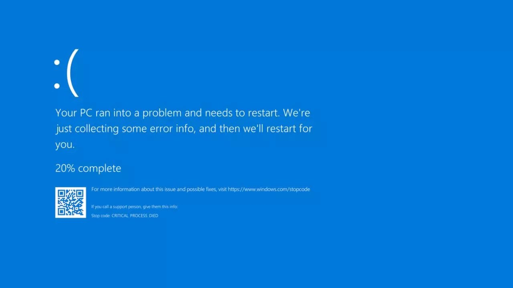
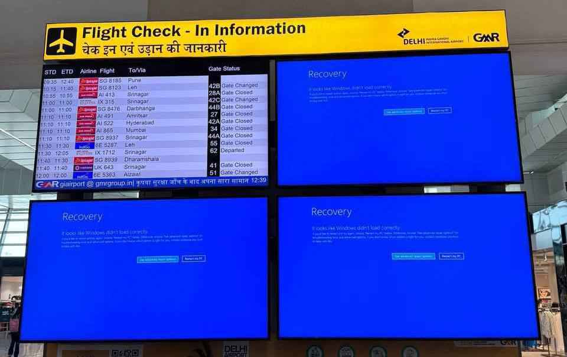
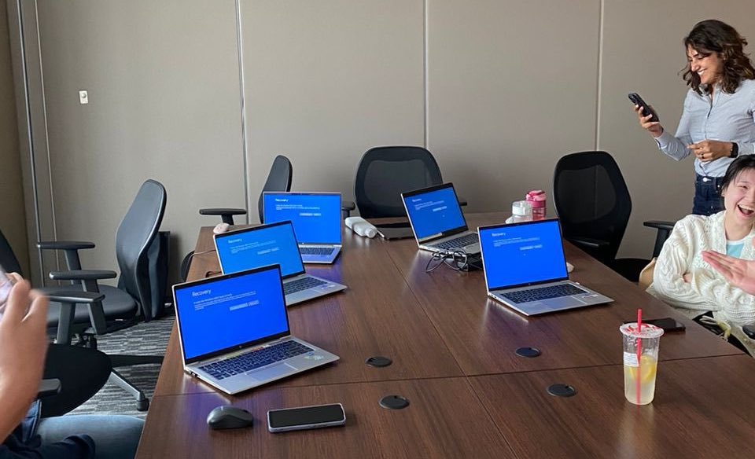
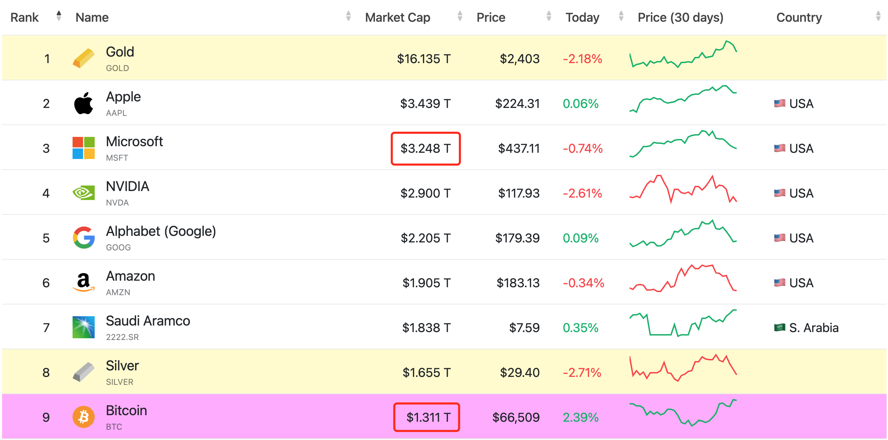

# 微软蓝屏，全球瘫痪：分布式≠去中心化

正如昨晚[7.19教链内参“研究称BTC压缩布林带或将其推升至14-19万刀”]所猜测的，BTC在周四、周五回踩测试63k支撑，在周三66k发出SOS强势信号的假设下，回踩确认支撑后就可能会继续上攻 —— 晚间，BTC果然在63k成功测试支撑位之后，急速上攻突破67k。如此，这个典型的SOS-LPS上攻模式，反过来确认了7月5日至8日那一波探低53k实属wyckoff积累模式的底部。

前两天，就在BTC热火朝天的走这一波积累反弹模式之际，市值3万多亿刀的全球IT巨头微软公司闹了一出让全世界细思极恐的“蓝屏死机”(BSOD, Blue Screen Of Death)大事件。虽然微软的windows操作系统蓝屏死机问题大家都见怪不怪了。但是这一次蓝屏，却是史无前例的全球神同步、范围广、影响大。

受此次事件波及，全球不计其数的航班停运，商超歇业，银行宕机，打工人兴高采烈地庆祝“天赐假日”…… 无数行业都同步遭遇了一次无意间的“赛博宕机”。

具体原因方面，技术细节不展开，有网友发现，通过进入安全模式，删除 C:\Windows\System32\drivers\CrowdStrike 目录下面的 C-00000291\*.sys 文件，重启即可解决问题。因此，大家很快就把矛头指向了CrowdStrike这家安全公司。

而雪崩的背后，不过是一片“无辜”的雪花落了下来：据悉，CrowdStrike向全球所有预装了其安全组件的windows电脑远程推送了一个新版本的驱动程序，而这个驱动程序里有一个会导致Windows蓝屏死机的bug…… 而几乎所有的企业级windows安装都预装了CrowdStrike的安全组件。悲剧就这样发生了。

有人惊呼：这不啻于一次世界级“赛博攻击”的重磅预演。原来全球巨头的产品里，竟然有如此“低级”的后门，可以让一个第三方公司随随便便就远程升级可导致蓝屏死机的程序代码！如果这是一架正在飞行的飞机，或者正在运行的汽车，被远程注入死机代码，岂不是要机毁人亡或者车毁人亡吗？或者在战争时，是不是可以瞬间让一个国家陷入瘫痪和混乱呢？

这是一个典型的案例，让我们得以思考和认识，分辨“分布式”(distributed)和“去中心化”(decentralized)的区别，加深理解。

全世界安装微软windows操作系统的电脑不计其数。每一台电脑都有自己独立的硬件、软件，独立运行。这是一个超大型的分布式系统。

与之相对的，全球安装和运行Bitcoin Core或者其他比特币客户端软件的主机，也有几万到几十万台之多，也是各自独立运行。这也是一个分布式系统。但我们更会把比特币网络称之为一个去中心化系统。

显然，我们从结果很容易看到，这两种系统的稳定性——稳定性也是安全性的一个维度——却是天壤之别。前者经常蓝屏死机，甚至可以突发这种地球毁灭式的全世界大范围蓝屏死机。后者却十分健壮，从不停机，甚至还能轻易从国家级攻击中自动修复（比如2021年“519”事件）。

它们的共性是独立软硬件，独立运行。但是区别是什么，以至于从结果上具有如此巨大的不同呢？

关键区别就在于比特币发明人中本聪所说的，全球Windows电脑所构成的分布式系统，是基于“信任”原则构建的，而全球比特币节点所构成的去中心化系统，是基于“去信任”原则（或者叫做“不信任”原则）而构建的。

什么叫信任原则？购买和安装Windows的用户信任微软，相信微软不是一个草台班子，不可能犯下留有让第三方随便远程搞死主机的可怕后门这样的低级错误。微软信任它的第三方合作伙伴，相信CrowdStrike不是一个草台班子，不会犯下把蓝屏死机这种bug都没有测试清楚的程序轻易通过后门远程推送给全世界的windows电脑。

可是事实上，人总是会犯错误。基于信任原则就必然导致信任链传递问题。最终只需要链条末端的一个小小的辜负，就可以导致整个链条的崩塌，触发一次全球性的灾难事件。

你可以说，罪魁祸首是中心化管理的远程控制。但是，哲学基础却在于信任原则和信任链崩塌。

比特币系统的设计哲学是：不要信任，要验证！(Don't trust, verify!)

每一个比特币新区块数据，每一个节点都要独立验证它的正确性，是否符合所有的共识原则。如果违反，那么就会丢弃这个区块。

正如中本聪在 2010 年 8 月 7 日的论坛帖子中所写的那样，“工作量证明具有一个漂亮的特性，就是它可以通过不受信任的中间人进行中转。我们不必担心一条链来自被托管了的通信。是谁告诉你一条最长链并不重要，工作量证明可以为自己代言。”（参阅《比特币史话》第八章第29话）

事实上，“不要信任”的设计哲学贯穿了比特币系统设计的方方面面和每一个层次。在数据层面如此，在代码层面也是如此。

以最流行的比特币节点客户端Bitcoin Core为例。这个软件是完全开源（开放源代码）的，而不像微软的windows那样是闭源（封闭源代码）的。这意味着，世界上任何一个人，只要愿意，都可以自由阅读和审查它的每一行代码，以便确保它没有漏洞，是安全可靠的。

Bitcoin Core的开发者和维护者不拥有任何强制任何人使用这一软件的特殊权力。你可以选择使用它，也可以选择拒绝使用它，而使用其他人开发的替代产品。

它坚持不干预原则，从来不用“难度炸弹”代码等手段绑架矿工节点，以达到对网络进行近乎于中心化控制的效果。

微软和CrowdStrike作为中心化生产力——公司制——的成功者，必然采取信任原则，它们必须“绑架”用户的信任，才能对用户实施收费。它们的商业模式正是建构在信任原则的基础之上。

比特币和区块链的“去信任”哲学天然是反公司制和中心化商业模式的，去中心化的设计哲学带给了人类全新的可能性。

今天，微软的市值3.4万亿刀，比特币市值1.3亿刀。BTC现价6.6万刀。

若比特币市值追平微软，BTC就将达到17万刀。

比特币作为范式革命的产物，其发展空间又岂会止步于一个微软公司呢？

未来无数像微软这样的中心化商业模式，都将被比特币所掀起的去中心化范式革命彻底颠覆。未来的人类文明，会在博物馆里看到今天的死机蓝屏时大惑不解，并在听到导游的介绍后哑然失笑。

「上士闻道，勤而行之；中士闻道，若存若亡；下士闻道，大笑之。不笑不足以为道。」

今天已经开始行动的BTC人，与还在嘲笑去中心化范式革命的人，可谓天地云泥之别。
