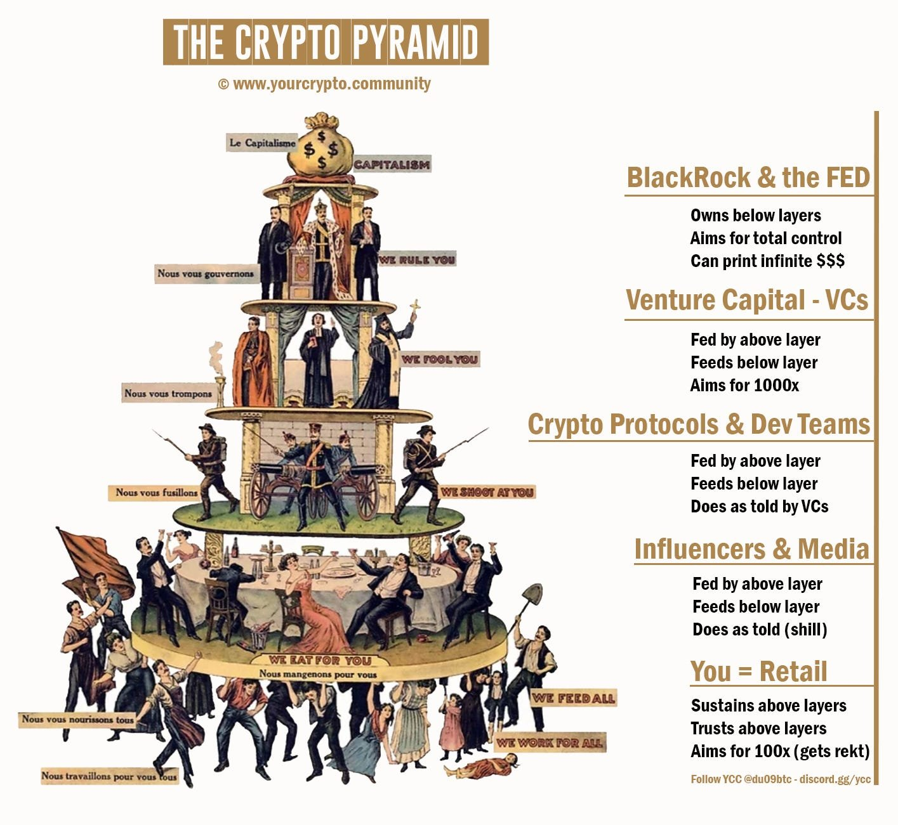

# 加密阶级金字塔：你在哪一层？

隔夜BTC突破此前的SOS强势信号，继续上行。这在今日[7.21教链内参“风平浪静的周末，BTC挺进6.7万刀”]已有综述。网上流传一张有趣的加密阶级金字塔图，如下。看看你在哪个阶层呢？

从上到下：

最高层：贝莱德和美联储

- 统治以下各阶层
- 目标是全面控制
- 拥有无限美元钞能力

次高层：风投资本(VC)

- 吃上一层的饭
- 向下层投喂
- 目标是赚1000倍

中层：加密协议和开发团队（项目方）

- 吃上一层的饭
- 向下层投喂
- 按照风投资本要求的去做

倒数第二层：意见领袖和行业媒体

- 吃上一层的饭
- 向下层投喂
- 拿钱办事（假装客观中立）

最底层：你 = 散户

- 养活以上各层
- 信任以上各层
- 目标是赚100倍（却总是被干）

看到一个网友提了个关于“何时应该卖出”的观点，感觉蛮新颖的。他说：任何时候，当你赚到了足以改变人生的钱时，就应该果断卖出。

试想，一个30万年薪的程序员，职业寿命大概在20-30年左右（即25岁至45或55岁），那么他的职业总收入预计为600-900万元。如果他的仓位价值突然急速增长突破1000万元甚至达到数千万元（即150万美刀至数百万美刀），他就可以考虑适当变现了。

当然，变现之说肯定是法币思维，而不是BTC本位思维。仅供批判性参考。

他可以把变现的资金变成资本，然后让资本为他打工。比如他拿500万配置大A某票，30多元一股，不久前刚刚分红派息，一股接近派2元，一年分红大概就是30万元，和他工作时30万的年薪相当了。

吃股息和吃BTC过生活的不同在于：

每次要吃饭，就要变卖手里的BTC，这样手里的BTC数量就一定是越来越少。

而股票分红是按照持股数分配增量的剩余价值。只要你配置的这家公司基业长青，你就可以一直吃它而不会减少手里股票的数量。

这有点儿类似于PoS存币生息。只不过，大部分PoS系统是纯金融游戏，不创造价值，分配的只能是后来者的价值，这就成了庞氏。而股票的底层资产是企业，企业吸收人的劳动，可以创造增量的剩余价值，以供分配。

不过，上面所讲的，也许依然只是表象，或者是假象。

进一步穿透进去看，当把资本以BTC形式持有和以其他资产（比如某股票）持有，本身就已经选择了不同的机会成本。

虽然持BTC、吃BTC会导致BTC持续减少，但是把BTC换成其他形式，也许它分红派息一万年也无法填平不持有BTC所带来的机会成本（即本金加分红合起来也无法跑赢BTC）。

产业资本从打工人的劳动中压榨剩余价值。金融资本又从产业资本身上压榨剩余价值。而BTC作为最高形式的金融资本，也许将会吸走全世界一切金融资本所压榨出来的剩余价值。如果这一理论成立，那么，任何形式的资本增值，都将无法长期跑赢BTC。

