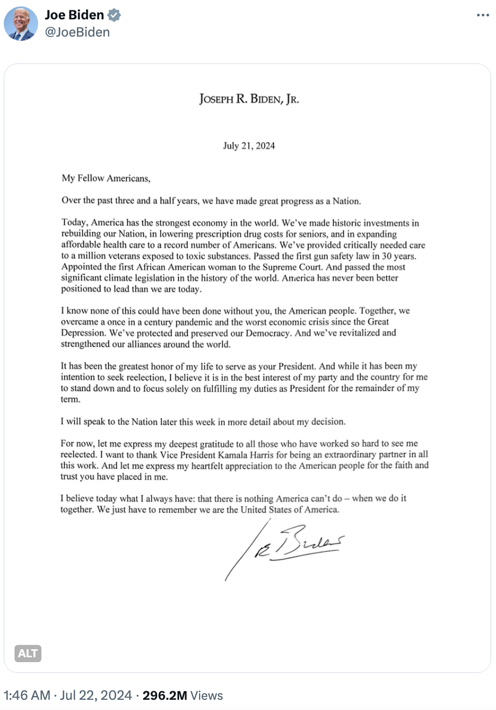

# 拜登退选，BTC冲上68k

隔夜，据称康复后要重启竞选的美现任总统拜登终于服软，正式签发个人声明，宣布退出大选。英雄迟暮，美人嗟叹。受此消息影响，BTC跳涨至68k上方，令犹豫不决的人内心又平添了几分FOMO情绪。

「小约瑟夫·R·拜登

2024 年 7 月 21 日

我的美国同胞们，

在过去三年半的时间里，我们作为一个国家取得了巨大进步。

今天，美国拥有世界上最强大的经济。我们在重建国家、降低老年人处方药成本以及扩大可负担医疗保健方面进行了历史性投资，为创纪录数量的美国人提供服务。我们为接触有毒物质的百万退伍军人提供了急需的护理。通过了 30 年来第一部枪支安全法。任命第一位非裔美国女性进入最高法院。并通过了世界历史上最重要的气候立法。美国从未像今天这样处于更有利的领导地位。

我知道，如果没有你们，美国人民，这一切都不可能做到。我们共同战胜了百年不遇的疫情和大萧条以来最严重的经济危机。我们保护和维护了我们的民主。我们振兴并加强了我们在世界各地的联盟。

能担任你们的总统是我一生中最大的荣幸。虽然我一直想竞选连任，但我认为，为了党和国家的最大利益，我退出并专注于在剩余任期内履行总统职责。

本周晚些时候，我将向全国人民更详细地介绍我的决定。

现在，让我向所有为我连任而努力工作的人表示最深切的感谢。我要感谢副总统卡马拉·哈里斯在所有这项工作中成为一位出色的合作伙伴。让我向美国人民表达我衷心的感谢，感谢你们对我的信任。

我今天相信的和我一直相信的一样：没有什么是美国做不到的 —— 只要我们一起努力。我们只需要记住，我们是美利坚合众国。」

无论各位内心是什么滋味，大家都将不得不面对一个“特朗普2.0时代”的新美国的到来。

当教链在7月14日写下《子弹射向特朗普，却杀死了熊市》的时候，敏锐的人就该觉察，这一历史轨迹已经不可避免。

历史车轮滚滚向前，不以任何人的个人意志为转移。

在文章下面拼命滴灌恶臭留言评论的家伙们，如丧考妣。特朗普上台，他们的狗粮就要断炊了。这无疑是一件大快人心的事。

我们的胜算更大了。

本周，特朗普即将出席“比特币2024大会，《传特朗普或将宣布BTC为美国国家级战略储备》（教链2024.7.19文章）。

特朗普，一个美国的爱国者，一个保守主义者，一定会给中国带来更大的外部压力，但是也必然会为中国创造更大的战略机遇。

外部压力从来都不可怕。

一只鸽子在空气中飞翔，认知偏低的它可能会抱怨空气阻力不能让它飞得更快、更高。如果它的认知能够提升，它就会意识到，空气给它提供的不仅是阻力，更是升力。如果没有空气，它不仅不会飞得更快、更高，反而会从高空中径直摔下来，摔个粉身碎骨。

人和鸽子的重要区别就在于，人可以经过自我学习而不断提高认知。

从很多读者的留言和交流中，教链能够感觉到，他们还像是只会抱怨空气阻力的鸽子。教链持之以恒地日日笔耕不辍，也是希望在自我修行的同时，能够与大家共同学习，一起进步，不断提升认知，进化成那富有智慧、翱翔蓝天的鸽子。
