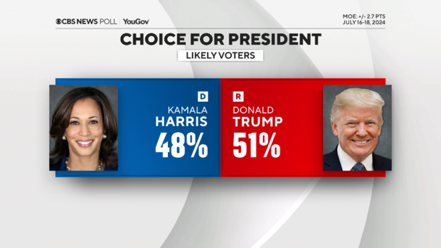
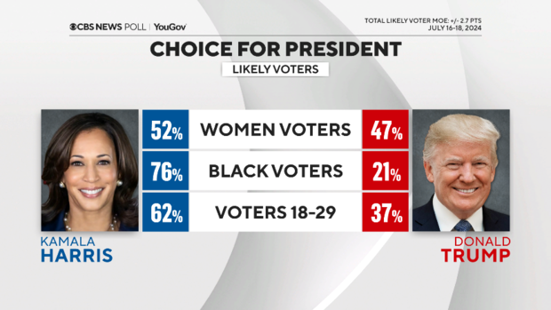
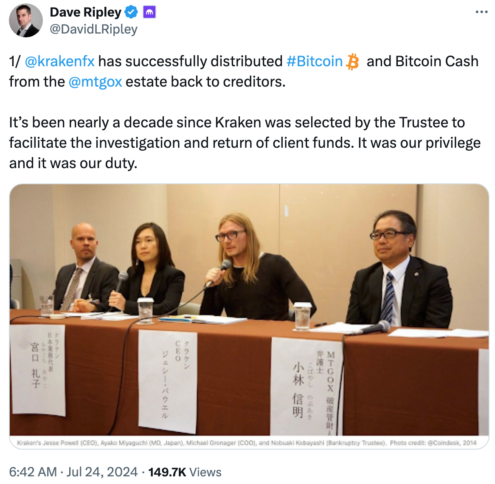
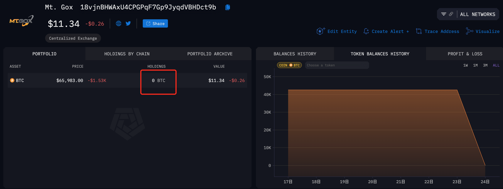
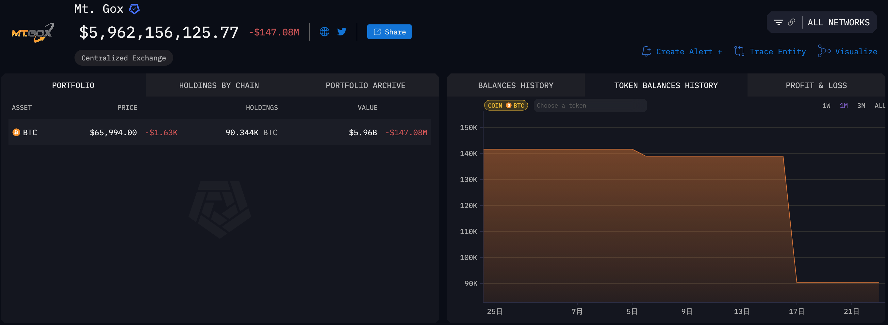
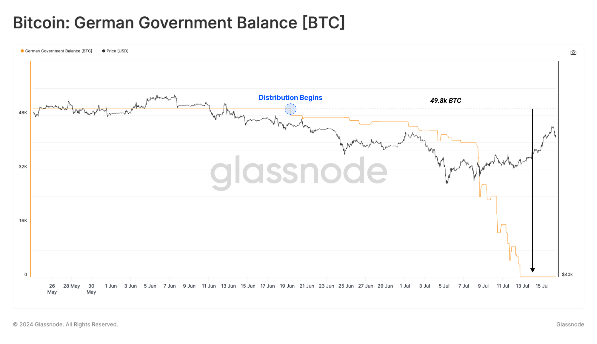

# Mt.Gox已分发4万多枚BTC，对币价影响多大？

隔夜BTC延续回调之势，一路回落至66k下方。

美国方面，民主党临阵换帅，哈里斯大笑登台，最新民调竟与人气颇旺的特朗普势均力敌，甚至有翻盘可能。

不是说哈里斯确实多厉害，而是民主党这操盘能力着实了得。如此一来，大难不死的特朗普本已握在手中的保送名额，又要平添几分变数。毕竟，当年遇刺的里根，不也痛失保送资格了么？于是加密市场所解读的特朗普利好，就遭到了弹压。

若哈里斯真的再次逆转选情，击败特朗普，进位美总统，那么动画片《辛普森一家》的情节就真的要成为神预言了。

不过，好消息是，据称哈里斯的竞选团队也将出席本周末的“比特币2024大会”。有网友调侃说，如果哈里斯抢选宣布，如果选她上台，就会推动BTC纳入美国国家战略储备，会不会很有趣？走对手的路，让对手无路可走。哈哈。

日本方面，KrakenFX CEO发帖称，已经完成向Mt.Gox受害人赔付BTC和BCH的分发。

从链上数据看，这次分发的BTC地址正是[7.17教链内参]中所提到的地址，其余额从7月23日的4.3万枚减少到7月24日的0枚。

而这4.3万枚BTC，应该是来自于此前7月17日从Mt.Gox总资产池子里拆分出来的一批。而目前池子里还剩余9万余枚BTC。

Mt.Gox的赔付分发，到底会对市场造成多大冲击呢？

让我们复盘一下前不久6月底、7月初德国政府抛售清仓近5万枚BTC的过程和市场反应。当时市场处于一个几乎没有叠加太多干扰因素的状态，是一个极佳的观察样本。

从上图可以看出，BTC在德府抛售前10多天就开始触顶转跌，提前反应了。下跌前6月6-7号的局部高点大概在72k左右。这反映出金融市场会对未来的消息进行提前反应的事实。

7月5号BTC局部触底53k时，其实德府还只是在小心翼翼地出货，还没有来得及大幅抛售呢。可见，市场会尽量让卖方卖出一个更低的价格出来。

等到7月8号德府终于开始大举清仓时，BTC只是二次回调54k，然后就随着德府清仓完毕开始大举反弹拉升了。

其实，7月5号触底53k时，市场已经对德府的这次清仓进行了充分定价（price in）。

从72k到53k，大约回撤2万刀，砍掉了1/4多。

以此观之，前日7月22号站上68k局部高点后转跌，市场已经提前对Mt.Gox此次分发做出反应。

仅以极其粗略的方法估算：德府抛售，从72k至53k，平均62.5k，乘以5万枚BTC，可知市场用于消化这部分额外抛压的承压购买力约为31.25亿刀。这次消化Kraken分发的4.3万枚BTC，，目前从68k已回撤到65k，平均66.5k，相乘得出抛压28.6亿刀。

若没有叠加其他突发因素的话，这次的回调深度想必不会比德府抛售的53k更低。原因有三：其一，总量4.3万枚比5万枚少了近15%；其二，回调起点68k比72k更低，对市场资金透支更少；其三，此次分发后持仓更分散，抛压更均匀。

不过，根据此前公告，Mt.Gox剩余的9万多枚BTC，后续还将陆续分发出去，且抛压会一直持续到10月份结束。据估计大约会向市场释放总共46亿刀的抛压。这些在教链近4个月以来的一系列内参文章中都有多方面汇报和测算，本文也就不再赘述。

