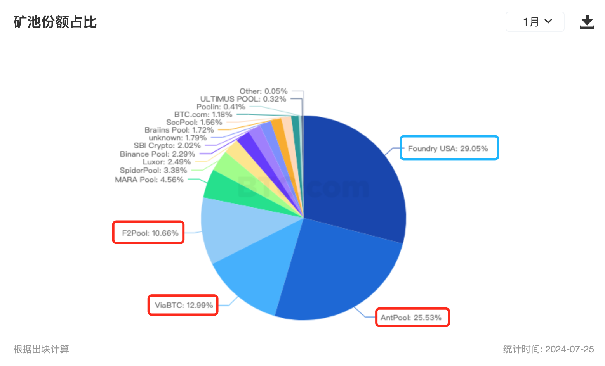
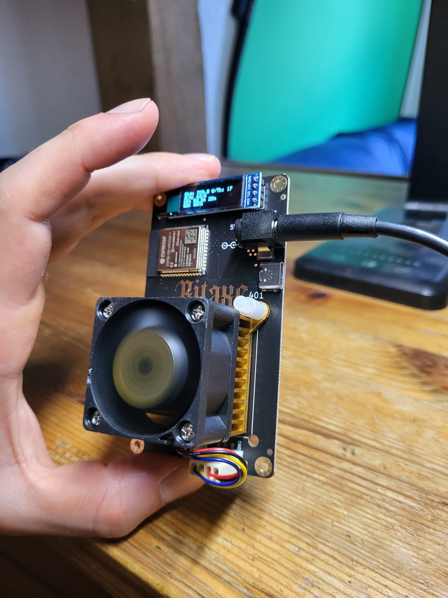
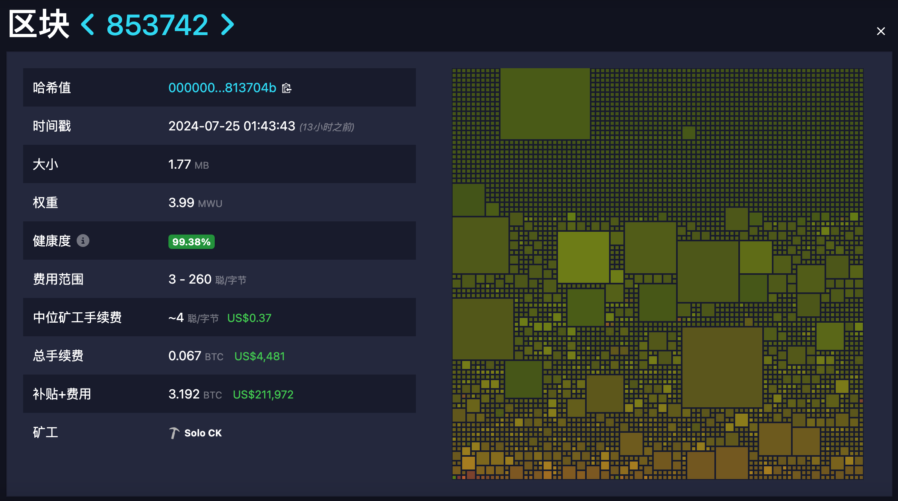
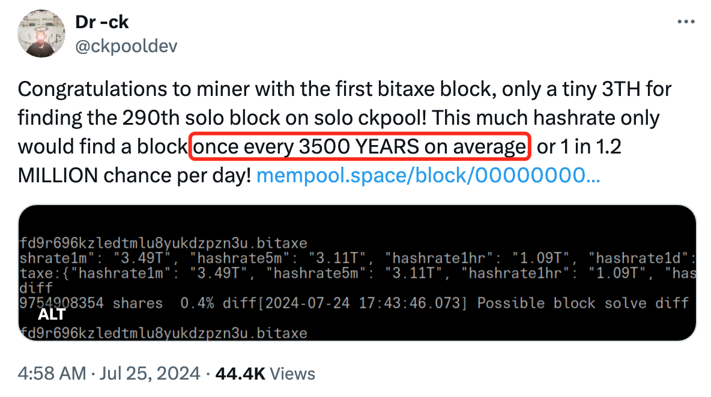

# 3500年一遇的爆块！

话说昨日前文《Mt.Gox已分发4万多枚BTC，对币价影响多大？》抛压推算余音仍在，隔夜BTC就一个猛子扎了下来，日内急跌愈3%，一度刺破64k。加密市场一片血红。

与此同时，美股市场也经历了一场大屠杀。道指、标普、纳指三大股指悉数暴跌，还跌出了标志性的意义。许多分析师认为这是美股泡沫破裂的第一枪。

昨儿[7.24教链内参“炸裂，京东竟在港发行稳定币！”]说到，「2024 年贝莱德的现货BTC ETF —— IBIT 的流入资金已超过“美股七只花”（微软、苹果、特斯拉、亚马逊、Meta、Alphabet 和 Nvidia）股票的流入资金」。

教链的内参不能割裂着看，而要串起来看。有心的朋友可能还记得，教链曾经在今年2月3号的内参“BSV被coinbase下架！”中提过，「泡沫大师格兰瑟姆，摩根大通量化策略分析师，美国银行等，都认为美股当前被严重高估，存在结构性风险，经济衰退即将到来，AI被过度炒作，美股主要由7支科技股带动，这令市场越来越极端，其主导地位与互联网泡沫越来越相似，这极大增加了抛售的风险。」

看吧，这不就卷起来了嘛？

这一轮美元周期，虽然从世界上吸了不少流动性回美国金融市场，但是还是不够吃。于是“七只花”就开始对中小盘股吸血，让美股资本分配严重倾斜失衡。到了今年初，半路杀出程咬金，现货BTC ETF上市美股了。贝莱德又那么猛，于是开始从美股市场中更大力地吸收流动性。

资本是无情无义的。资本永远追逐最安全、增值速度最快的资产栖身。终于，BTC ETF吸了半年血，ETH ETF又上了，“七只花”终于要败下阵来了。果然，打败魔法的，只有更强的魔法。

公司实体的存在目的是创造剩余价值。股票的目的是作为分配剩余价值的工具。股市的作用就是用市场化的方法分配剩余价值。现在BTC ETF进入了这个市场，也就接入了分配剩余价值的游戏。

但是，教链的文章写过，BTC本身极其纯粹，它并不生产剩余价值。所以，它来到这个市场上，就是来吸血的——吸收其他股票所带入这个市场的、由这些股票背后的公司所创造的剩余价值。

从这个角度上讲，BTC是一个剩余价值的黑洞，有极其强大的引力。按照教链提出的假说，BTC将最终吸干、榨干所有公司创造的全部剩余价值，然后，按照持有BTC的数量，分配给所有的持有者。

BTC是最高等级的金融资产。马克思设想过的，资本兼并的终点，全人类创造的所有剩余价值汇聚到一个点。资本的奇点。

最妙不可言的是，BTC作为这个奇点的载体，最为合适 —— 因为它是最去中心化的。如此千斤重担，任何一个中心化的主体，决然都承受不起。

谈到去中心化这个问题，首要的就是记账的去中心化。而记账的去中心化，关键在于记账权的去中心化。记账权的去中心化，关键又在于算力的去中心化 —— 因为BTC的机制是算力决定记账权。

最开始，BTC的发明者中本聪希望人人都能用电脑的算力来“挖矿” —— 也就是争取记账权。

但是，很快技术就进步到GPU计算。也就是今天英伟达所卖的显卡所用的计算技术。

GPU挖矿的时代转瞬即逝。很快，利益机制驱使人们用上了最顶格的算力技术 —— 定制专用芯片，即ASIC挖矿。

ASIC专用芯片矿机，加上矿池联合挖矿，让BTC挖矿时至今日已迅速进化成一个高度专业化的产业。

但这也带来了算力集中的问题和争议。这个问题一度为广大海外BTC社区的网友所诟病。为什么呢？

在2021年“519”之前，中国一度占据了超过全球80%以上的BTC算力，生产了全球绝大部分最优质的BTC矿机。

但是在2021年之后，经过了国家级别的外力冲击，BTC的算力终于变得更加分散化、更加去中心化了。下图是目前BTC矿池算力占比的分布图：

图中蓝框框出的Foundry USA是目前全球第一大矿池，美国的。这家矿池就是借着2021年的东风，迅速崛起的。可谓天时地利人和。

红框框出的F2Pool、ViaBTC以及AntPool都是中国的。国人在这个领域，仍然占据半壁江山。

事后回想，如果不是2021年国家出手，帮助BTC整治了一下中心化的问题，那么可能也就不会有2024年初美国BTC ETF的上市了。为什么？美国人肯定对算力基座掌握在中国人手里心存顾虑呀，那么他们肯定就会更难推动ETF的获批。

我们由此就对老子的哲学思想有了更深刻的领悟，更加懂得了什么叫“祸兮福之所倚，福兮祸之所伏”。

在BTC发展历史上，有不少人琢磨解决这个算力集中化、中心化的问题，琢磨地走火入魔了。

走火入魔就要误入歧途了。

一种典型的错误是，想尽办法在代码层面、软件层面限制硬件算力，对抗生产力进步，开历史倒车，试图退回GPU挖矿甚至CPU挖矿。教链觉得这个是违反历史发展规律的，是徒劳的。算力集中是人民内部矛盾，算力强大不强大，是御敌于外的敌我矛盾，孰轻孰重，岂不明了？

事实上，这十多年来，无数尝试把挖矿生产力锁死在CPU层面的项目，都失败了。教链就没看到有成功的。

这个逻辑错误，也直接影响了投资方面的判断。就像教链在2024.7.16文章《未来4-12年，BTC的安全模型就要崩溃了吗？》中所驳斥的，BTC矿工用更低的成本，运行更高的算力，这明明是一件好事，怎么就成了一件坏事，拿来作为论证BTC将要崩溃的论据了呢？这实在是深深陷入了思维逻辑误区之中。

另一个典型的错误就是，认为算力集中是PoW (Proof-of-Work)的问题，于是就想用其他的所谓共识机制来取代掉BTC的PoW挖矿机制。比如用PoS (Proof-of-Stake)质押挖矿。PoS的关键症结就在于，资本可以很迅速、批量地转化成那种虚拟的“算力”，从而篡夺记账权力。

很显然，资本（质押所用的代币）的集中，比硬件（具有物理实体的矿机）的集中，要更容易，成本更低，流动速度更快，更不容易被外部威胁发现和冲击，使其被动去中心化。

更何况，硬件这个东西，其生产速度、维护成本、折旧损坏，都是受到宇宙物理法则的制约的，其集中程度是有限的，并且熵增定律会无时无刻不对其施加着一种将其拆散的力量。因此，分久必合，合久必分。

这不，早已有人在推动开源挖矿硬件。并且已有许多生产商在制造和销售这种桌面小矿机（下图）。

看了下，香港就有公司在售，一台也就一两百刀，单机算力大概5、600GH/s。重量很轻，也就一两百克；功耗很低，USB接口供电就行。

就在今天早上，有人用这个小东西爆了一个BTC区块，赚了3.192 BTC的收入！据推算，以他用的3TH/s算力和当前全网约648EH/s的总算力来看，大概每3500年才能爆一次块（就是挖出一个正确的区块），或者说每天有120万分之一的概率能够爆块。这家伙是不是上辈子拯救了银河系，居然能在有生之年爆了一个块？

这真的是千年等一回的传说，在现实世界真实上演了！

设想未来这种迷你矿机大为普及，单片500GH/s看起来不大，但是如果星星之火燎了原呢，人民战争汪洋大海了呢，只需要全世界1/8的人，也就是10亿人人手一台，总算力就可高达500G x 10亿 = 500E！和目前这些矿工们所提供的BTC全网算力不分伯仲了。

人手两台呢？那就会高达1000 EH/s也就是1 ZH/s！

就算再有权力，也很难把20亿个单片机从10亿人手上收缴、集中吧？就算再有钱，也很难短期再造高达1 ZH/s算力的矿机并部署吧？

当资本和权力都很难迅速转化成算力和记账权的时候，充分分散的记账权就成了天然的铜墙铁壁，保卫着BTC的安全。
