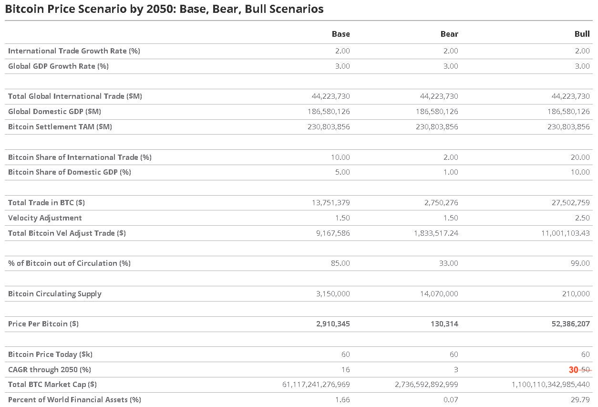

# 美国老牌资管公司推测2050年BTC价格，看牛情景或超5000万刀

隔夜BTC奋起反击，昨日测试64k支撑（短暂刺破）后，迅疾反弹，强势碾过67k。教链趁昨大跌之机，奉行八字诀逢跌加仓之心法，于65k、64k捡漏两次，补仓折扣筹码。须知，如昨夜[“7.25教链内参：市场预计美联储9月100%降息”]所报，宏观宽松已如滔天巨浪矗立眼前，且BTC当前处于幂律周期大牛市前的小牛市，每一次急跌打折都是不可多得的补仓良机。人生良机，春宵蜜意，错过一次少一次。

教链心里给自己画的黄线，70k也即是7万刀是一个关键分水岭。为何？好好追读教链文章的读者朋友或许还有印象，大概两个月前，2024.5.29，教链写过一篇文章叫做《风平浪静的牛市》，其中指出，按照幂律模型，2026年底也就是预期的下一个熊市底部，恰好就是70k。对教链而言，每一笔加仓，肯定能拿住2年以上无疑，这也就是说，所有70k以下的逢跌加仓，就会是相当安心的了。

不过还是得提个醒。为社么用“安心”这样的主观形容词，而不用“风险低”这样的客观词汇呢？因为同样的事实，对于不同的人，会有差别很大的甚至截然不同的效果和感受。吾之蜜糖，彼之砒霜。长期主义者感到安心的，在借短钱炒币者心里可能就是夜夜难眠的梦魇。故决不可一概而论。

看到创立于1955年的美国老牌资管公司VanEck发布了他们对于BTC到2050年的价格推测（见下表）。其中分了3个情景：基线情景，291万刀；看熊情景，13万刀；看牛情景，5238万刀。

从表格就能读出来分析师的推测逻辑或者说推算方法。

首先他们先估计了国际贸易额增速（2%）和全球GDP的增速（3%），在此基础上假设BTC占据的份额，推算出BTC承载的结算额，然后通过费雪方程式（教链猜测，因为他们引入了Velocity Adjustment），折算出BTC交易量，再通过假设BTC参与流通的比例，最终计算出BTC价格的估计值。

有了对2050年价格的估计，就可以从今天6万刀开始，算出所谓CGAR复合年化增长率了：基线情景，16%；看熊情景，3%；看牛情景，30% —— 注意这里，VanEck本来写的是50%的。但是，教链简单验算了一下，看牛情景的CAGR 50疑似是笔误，应该是30差不多，可能是分析师凑数的时候紧张了，LoL。

看价格的绝对数字，可能很多人要吃上一惊。但是转眼看一下CAGR，又觉得平平无奇。基线情景每年增长16%，连巴菲特的20%都打不过。更别提看熊情景的3%了，还不如30年房贷利率高。看牛情景的30%似乎还有那么一点儿意思，但是对于很多揣着一夜暴富梦冲进币圈的人而言，也还是看不上眼。

昨晚在哄娃睡觉的睡前谈话中，聊到了当今时代的经济社会的基本规律问题。我告诉娃儿，当今时代是资本的时代，经济是资本的经济。美国是资本主义社会，我们是社会主义社会，但是经济要发展，都必须积累和发展资本，靠资本赚钱，改善生活。区别只在于，资本主义是资本控制人民，社会主义是人民控制资本。但是想过上好日子，就不能抛开资本。为什么呢？因为资本的赚钱速度，比劳动的赚钱速度要快的多得多。

打工就是典型的靠劳动赚钱，只能满足温饱，不可能发财。要想致富，必须做两件事：开公司，或者搞投资，或者两个都干。搞投资，本质上就是自己不开公司，而是拿钱去支持别人开公司，然后分享收益。公司是产业资本，投资是金融资本，今天全世界的资本，都可以归于这两类。

我让娃假设了一下，他将来毕业工作后，一个月挣1万块钱工资。那么需要多少年，才能赚到1个小目标（1个亿）？他算了算，大概需要833年。

娃问我，那如果1天挣1万块呢？我说，那你算算日赚1万块，需要多少年？他很快就算出来了，这一次大概需要27年多。

我问娃：你觉得在今天，1天赚1万块的打工机会，有多少？这可是30万月薪的职位。娃想了想，说，全国能有几百万人？我说，不可能有那么多，咱们14亿人里，月薪30万（仅工资收入）往上的人，能有十几、几十万就不错了。

我又给娃出了另外一道算术题：假如你花1万块买了一些BTC，此后每年BTC翻一番，你算算第2年、第3年、…… 你会有多少钱？多少年之后会达到1个小目标？

娃很快算了起来：第2年变成2万，第3年变成4万，第4年变成8万，第5年变成16万，第6年变成32万，第7年变成64万，第8年变成128万，第9年变成256万，第10年变成512万，第11年变成1024万，第12年变成2048万，第13年变成4096万，第14年变成8192万，第15年变成16384万，也就是1.6亿，达到了1个小目标。所以只需要持有15年呀，比1天赚1万块的27年还要快很多呢！

这时我告诉娃，现实中，BTC过去十几年的增长速度，还真的差不多。回想2011年年中第一波牛市时，BTC最高大约100块，底部最低大概是不到10块钱。咱们姑且假设你的1万块是以平均40块钱的成本买入的好了。拿到今天，2024年年中，BTC现在大概6万多刀，正好差不多是40万。

从40到40万，刚刚好增长了1万倍。从2011到2024，多少年？13年。13年，你的1万块变成了1个小目标。

最后我总结：劳动赚钱慢，因为打工赚钱是加法。资本赚钱快，因为资本赚钱是乘法。你说是加法快还是乘法快？

娃心满意足地进入了梦乡。

金融问题还真的挺适合让小学生锻炼四则运算的呢。

上面练习题中的每年翻番，用金融术语说就叫做CAGR 100%。

所以我们也就知道了，在过去13年，从2011到2024，BTC的CAGR真的是超过100%的。干过5个巴菲特，真的是相当惊人了。

那么回头再看文章开头，VanEck建立的测算模型，最激进的牛市情景，CAGR也打了个三折，只有30%。嗯，可以说算是相当保守了，哈哈。

教链在多篇文章，比如2021.3.19文章《储蓄比特币给你财务自由》中，多次提及，教链心目中对未来相当长一段时期内BTC的CAGR期望值大概是40%。

为什么教链内心自己画的线是40%呢？因为按八字诀建仓，建仓期40%的CAGR，仓位的P/L（profit/loss）折算回来的CAGR'大概会是一半，也就是20% —— 刚好差不多和巴菲特的长期收益率20%持平。

教链觉得，「八字诀 + BTC」这个策略，怎么着也不能跑输巴菲特吧？否则你BTC还怎么与美股一战，和美股内卷，从美股那边虹吸流动性呢？

不过，如果以CAGR 40%奔跑26年，从2024到2050，那就要从6万刀去往3.78亿刀去了。似乎有些过于骇人。

那就说明，可能前面一些年头还能维持40%的高速增长。越是往后呢，增速就会逐渐衰减。最终到2050年，回头一算，综合折算下来，平均年化复合增长也就是个30%左右。

这也就是再次通过数学模型测算得到一个朴素的道理：BTC嘛，进入越早，拿的越久，受益越大。
