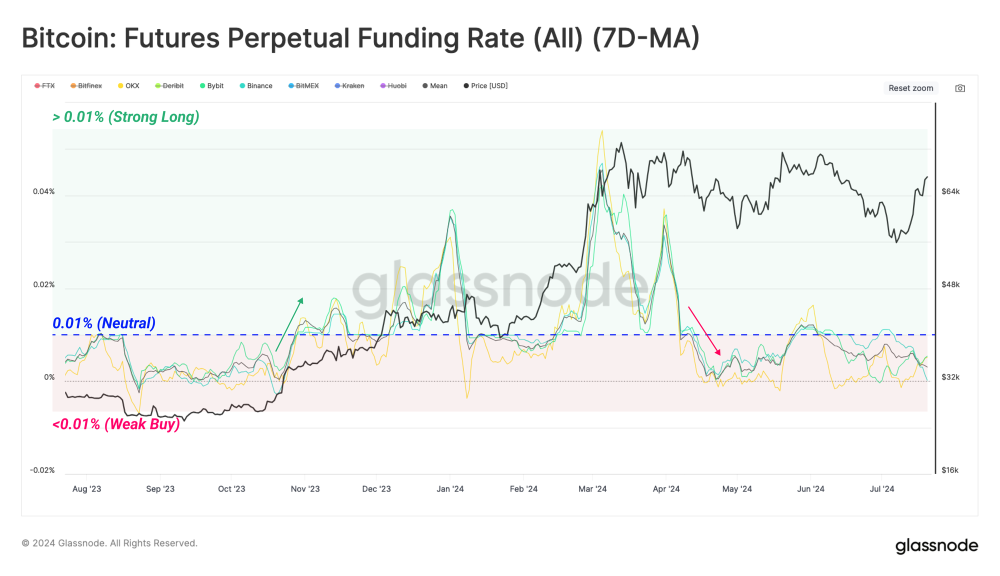
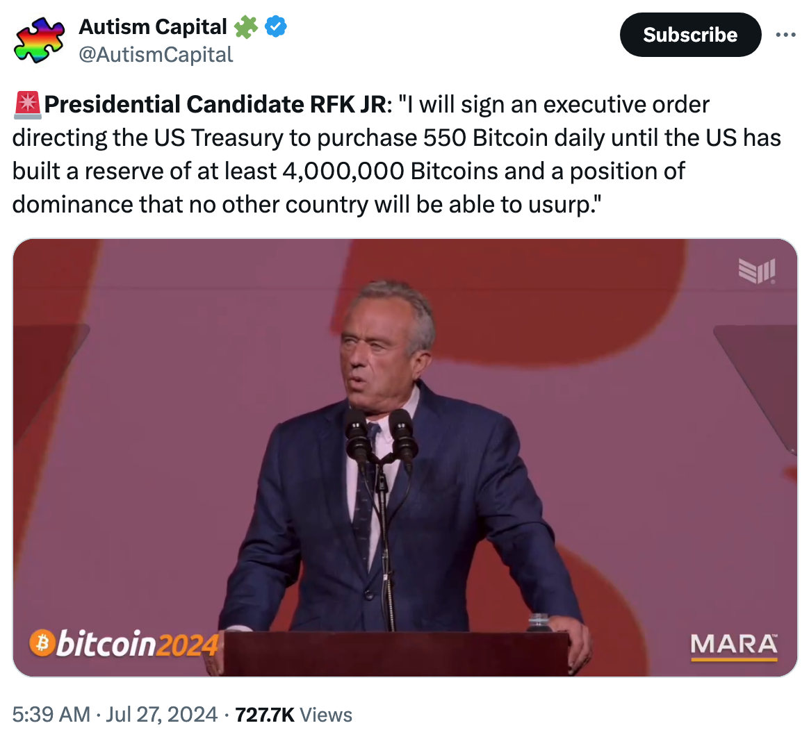
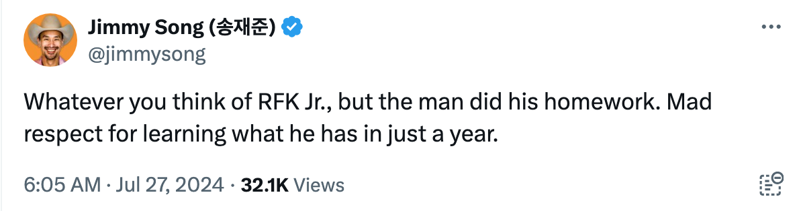

# 比特币必将进入国家储备时代

周五[“7.26教链内参：强势拉升，BTC逼近68k”]隔夜势头不减，BTC继续维持拉升势头，坚守在68k上方，与“比特币2024”大会的如期召开遥相呼应，似乎打破了加密市场“逢会必跌”的魔咒。

随着BTC价格的强势拉升，STH（短期持有者）们似乎又“行了”。他们大部分的仓位也开始恢复到盈利状态。从永续合约费率数据来看，如下图所示，其实从去年也就是2023年8月份以来，直到现在2024年7月份，基本上一直保持正费率，这显示出市场其实一直处于牛市的事实。

当然，对于费率突出到中性费率（即8小时0.01%）以上的时间段，可以认为是看牛情绪极为强烈的时期。聪明的朋友可能会想到币本位做空吃费率，但是教链觉得，10万刀或者更高以前（以下）做这种套利，赢面不够大，可能最后的结局是，吃了费率，亏了本金。

赢面不大的美国总统候选人小罗伯特·弗朗西斯·肯尼迪（RFK Jr. 以下简称小肯尼迪）出席正在召开的“比特币2024”大会并做演讲。

在演讲中，小肯尼迪说：「（如果我当选，）我将会签署一项行政命令，指示美国财政部每天购买550个比特币，直到美国建立起至少400万个比特币的储备，以及其他国家无法篡夺的主导地位。」

这番表态甚至引来了知名比特币开发者Jimmy Song的点赞：「不管你怎么看小肯尼迪，但他做了很多功课。他能在短短一年内学到如此多的知识，令人肃然起敬。」

不过，也有网友在评论区泼冷水说：「真遗憾，他完全没有（当选的）胜算。」

也有网友不同意这种悲观的论调：「如果每一个说他没有胜算的人都停止说他没有胜算，而是去给他投票，他就会有更多胜算。」

教链比较欣赏后一位网友的态度。政治是迎合观念的游戏。人们以为坚不可摧的很多东西，其实都是观念的产物。小到家庭、公司，大到社会、国家，其实都是一群人的观念。如果大部分人的观念改变了，这些东西分分钟就会改变。

观念，在加密领域叫做共识，在政治领域叫做民意，在历史领域叫做“水可载舟，亦可覆舟”。

无论是多么独裁的暴君，无论是多么强大的暴力机器，无论是多么骇人的屠刀和炸弹，都必然会在人民普遍的观念中败下阵来。

在这一点上，伟大导师马克思的这段话堪称经典：「批判的武器当然不能代替武器的批判，物质力量只能用物质力量来摧毁，但是理论一经掌握群众，也会变成物质力量。理论只要说服人，就能掌握群众；而理论只要彻底，就能说服人。」

当教链谈论“人民控制资本”时，一些悲观的人立刻就矢口否认，坚称不可能。如果每个人都摒弃不可能的观念，而是去主张自己的权利，积极实践和行使权力，当每一个士兵、每一个公务员、每一个职工、每一个农民、每一位教师、每一个学生、每一位父亲、每一位母亲…… 当一个国家的每一个人都去这么想、这么做的时候，自然就能够做到。

就像BTC减半发行、总量2100万枚这一点，从中本聪一个人脑子里的观念，成为几十、数百位早期参与者的共同观念，再到成为几百万、上千万矿工、持币者、生态参与者的集体观念，它就越来越变得牢不可摧。

这一观念掌握了数以百万、千万、未来甚至上亿群众之后，是如何变成物质力量——航母核弹都无法摧毁的物质力量——的呢？通过矿机、算力和PoW（工作量证明）。全球无敌的强大算力，就是“武器的批判”。而中本聪构思和设计的“去中心化货币”的理念，就是“批判的武器”。

为什么BTC决不能搞“去PoW化”，比如跟风搞什么PoS之类的呢？因为从哲学上，导师早就告诫过我们，批判的武器不能代替武器的批判，再巧妙的设计思想也不能代替强大的计算力量。

而成为国家储备，是BTC发展道路上又一个强有力的观念。

小肯尼迪也好，特朗普也好，哪一个具体的个人，提出和宣扬这种观念，都不重要。

历史发展的客观规律决定了，BTC发展到这一个阶段，就必然会催生和涌现出越来越多有影响力的政客，开始鼓吹和宣扬这一观念。

在教链看来，这都是历史发展的必然。

从这一点上讲，小肯尼迪有没有胜选的机会，其实并不重要，我们也无需关心或者担心。

重要的是，当一个政客开始宣扬这种观念，意味着这一观念已经获得了相当大数量的群众的认可。

于是博弈论可以肯定地告诉我们，这就一定会促使更多政客向这一观念靠拢。

当一个国家开始把BTC纳入国家储备作为国家战略竞争的要素之后，也必然会引起其他国家的警惕、评估、反思和跟进。

毕竟，在国际竞争和文明生存问题上，一朝不慎，满盘皆输，老虎打个盹，也要遭受百年耻辱。任谁都不敢轻视。

什么样的观念必将深入人心，成为历史的选择？导师已经讲的很明白了：能说服人，就能掌握群众。什么样子能说服人？彻底。

BTC彻底吗？彻底。

这一路走来，无数心怀鬼胎、想推销山寨币的形形色色的人，总是喜欢给BTC人扣什么“最大主义”的帽子，抹黑他们“极端”、“不妥协”、“封闭”、“不包容”。这些所有的扣帽子、抹黑、批评和谩骂，其实恰恰都是无上的荣耀和勋章！

正是因为BTC社区“彻底”的革命性，以决不妥协的精神，坚决捍卫BTC的纯洁性，才使其能够不断地说服人，进而掌握数以亿计的全球群众，变成最强大的物质力量，化身武器的批判，度过生死考验，碾轧挡车螳臂，最终取得货币革命的胜利。
