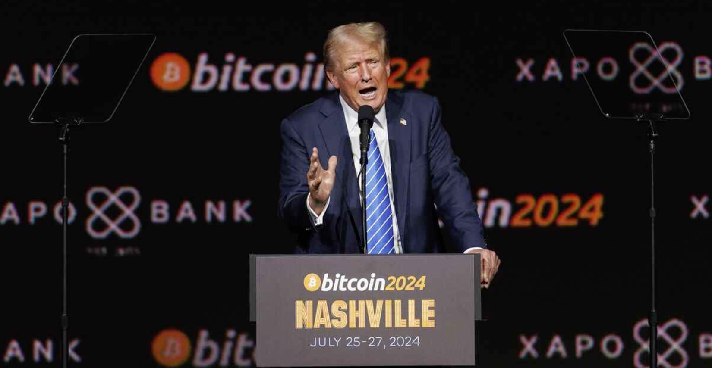
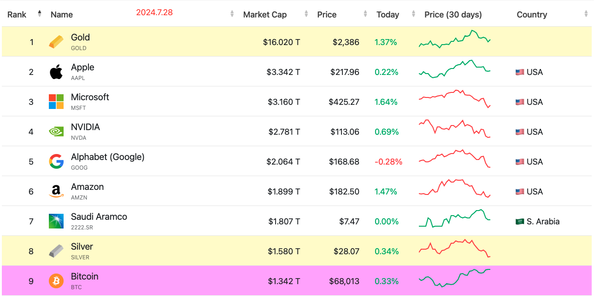

# 特朗普：比特币将超越黄金，美国须100%保留作为国家战略储备

隔夜今晨，特朗普如期出席正在美国田纳西州“省会”纳什维尔举行的“比特币2024”盛会，并进行了主题演讲。昨天小肯尼迪关于愿将比特币纳入美国国家储备的演讲，教链在2024.7.27文章《比特币必将进入国家储备时代》中已有介绍。而特朗普的到来，以及其特有的鼓动性发言，则将这一主题再次掀向新的高潮。

就在特朗普作主题发言的时候，北京时间凌晨4时许，多空双方围绕BTC展开了激烈的阵地争夺战。恰似2024.7.14教链文章《子弹射向特朗普，却杀死了熊市》所写的，这一次在“比特币2024”大会上，空头背后的势力在加密市场向BTC发起了“狙击”，一度将战线从27日69k平推到了66.6k，试图浇灭特朗普鼓舞比特币前景的熊熊烈火。

不过，多头一方迅速组织起来了阵地保卫战，并成功防守反击，坚决捍卫住了68k的防线。射向特朗普的子弹被他扭头躲过，空头对BTC的狙击也未能得逞。背后博弈之激烈，可见一斑。

特朗普说，“（比特币）就像 100 年前的钢铁工业”，“还处在起步阶段”，“总有一天，它可能会超越黄金。按目前的趋势，这完全有可能。 ”

在教链于去年底2023.12.4写下文章《比特币鲜衣怒马》时，BTC价格4万刀，市值近8000亿刀，而黄金则近14万亿刀，前者约为后者的17分之一。

今天，BTC来到6.8万刀，市值达到1.34万亿刀，已是黄金市值16万亿刀的12分之一。

如果BTC追上目前黄金市值16万亿刀，可以很轻松地计算出来，每枚BTC的价格将放大12倍，达到80多万刀。

特朗普说，“比特币和加密货币将推动我们的经济增长，巩固美国的金融主导地位，并在未来很长一段时间内增强整个国家的实力。”

他利用自己的影响力进行科普：“许多美国人不知道，美国政府是比特币的最大持有者之一。”“联邦政府拥有将近 21 万枚比特币，占总供应量的 1% 。”

然后他批评美国政府一直以来违背了“HODL”原则，进行了若干次BTC的抛售。从特朗普对加密行话“HODL”的熟练运用来看，他和他的团队应该是仔细做过功课的。

关于各国政府持有情况，各位读者可以回顾一下教链2024.7.9文章《各国政府抛压不用怕，本轮周期足以全部中和！》。其中，呵呵哒的德国政府已经清仓了。而持有量最大的美国政府如果果真会像特朗普说的那样HODL不动，那么很显然将极大减轻抛压的不确定性，绝对是一个大大的利好。

特朗普喊话：“永远不要卖掉你的比特币。”

于是他当场做了一个重大的宣布。他说，“我宣布，如果我当选，我的政府政策会是，美国将保留目前持有或未来获得的所有比特币的 100% 。”“这实际上将作为国家比特币战略储备的核心。”

特朗普激情四射：“我对每一个人的承诺是：我将成为美国需要的支持创新、支持比特币的总统。这将是一个繁荣的行业，一个伟大的行业。”

当然，特朗普的演讲中赢得最响亮掌声的，是哪一点？各位读者朋友可以猜猜。

是在他宣布“在上任的第一天，我将解雇 Gary Gensler，并任命一位新任 SEC 主席”的时候。

其实在现任SEC主席Gary Gensler上台之前，整个美国加密行业对他还是寄予厚望的。因为作为一个技术官僚，他在美国高校教授过比特币相关课程，理应更加了解加密货币。

但是，Gary Gensler的表现却是让行业大跌眼镜。虽然他在任上先后批准通过了现货比特币ETF和现货以太坊ETF，足以在加密发展史上青史留名，但是，他骨子里的因循守旧和拒绝变革，却令他不得不遭受被整个行业乃至于越来越多人呼吁下台的结局。

早在去年初2023.2.14，教链就曾在文章《他发誓要把证交会主席拉下马》中介绍过，Messari创始人Ryan Selkis就曾对Gary Gensler开炮：「我人生的新目标是结束加里·根斯勒（Gary Gensler）的政治生涯，并让他成为拜登连任失败的原因。」

在教链看来，Gary Gensler的问题并不是不懂行，也不是谨小慎微，而是他坚持使用旧法来管理新事物，以私心压制公意，这就严重违背了历史发展规律，必然阻碍行业的创新和世界的进步。具体的，就是教链在[“7.25教链内参：市场预计美联储9月100%降息”]中所剖析的，「Gensler一直坚持不需要对crypto监管单独立法，主张1933年证券法、1934年证券交易法完美适用于监管crypto，就是暗藏了秋后算账的小心思，毕竟，没有哪个crypto项目是在1933年之前做的……」

他的主张之荒谬，就如同主张用邮政的管理思路来管理email，用报纸的管理思路来管理公众号，用电视的管理思路来管理短视频，用短信的管理思路来管理微信聊天，用实体店的管理思路来管理互联网电商，……

理应偏左翼进步主义的民主党，却成了阻碍创新和技术进步的形象。而本是偏右翼保守主义的共和党，却突然转向了支持比特币、支持加密货币革命。

共和党特朗普说，“拜登-哈里斯政府对加密货币和比特币的压制是错误的，对我们的国家非常不利。这是不美国的。”

两党斗争多年，终究还是活成了对方的样子。
