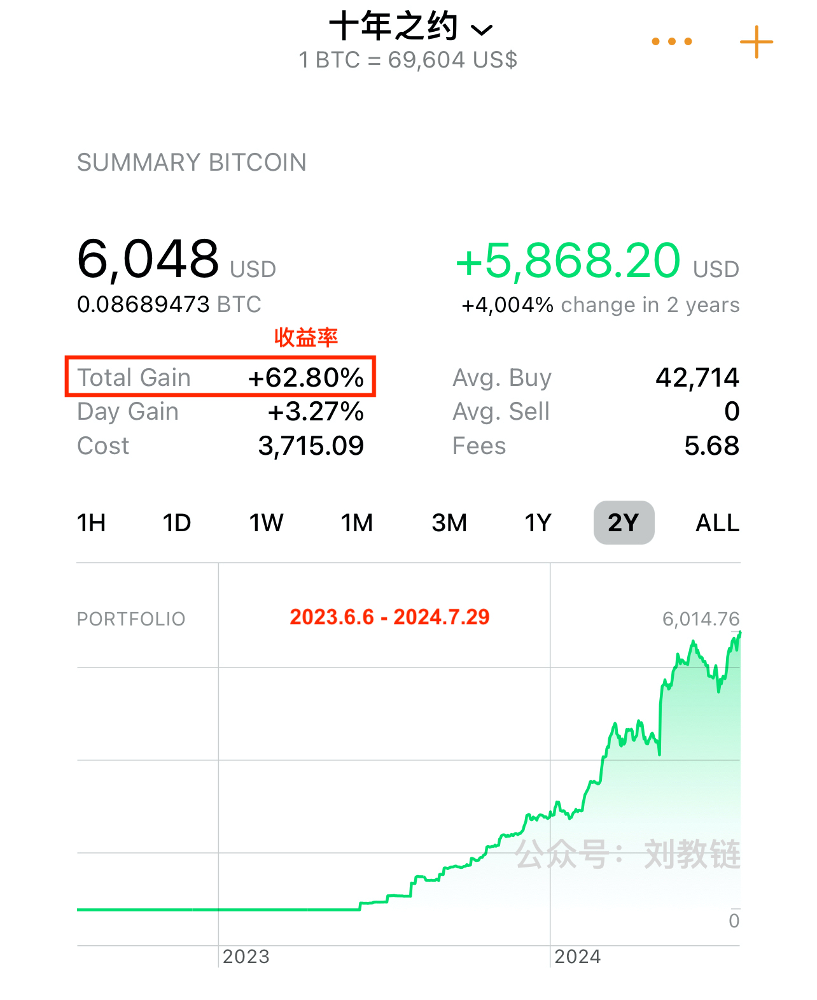
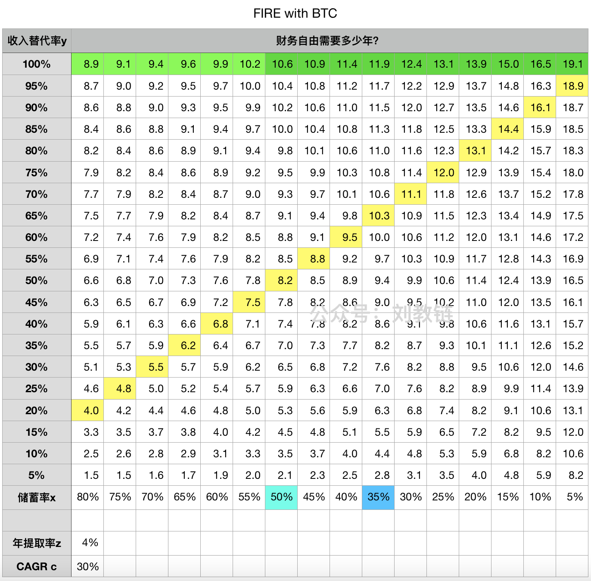
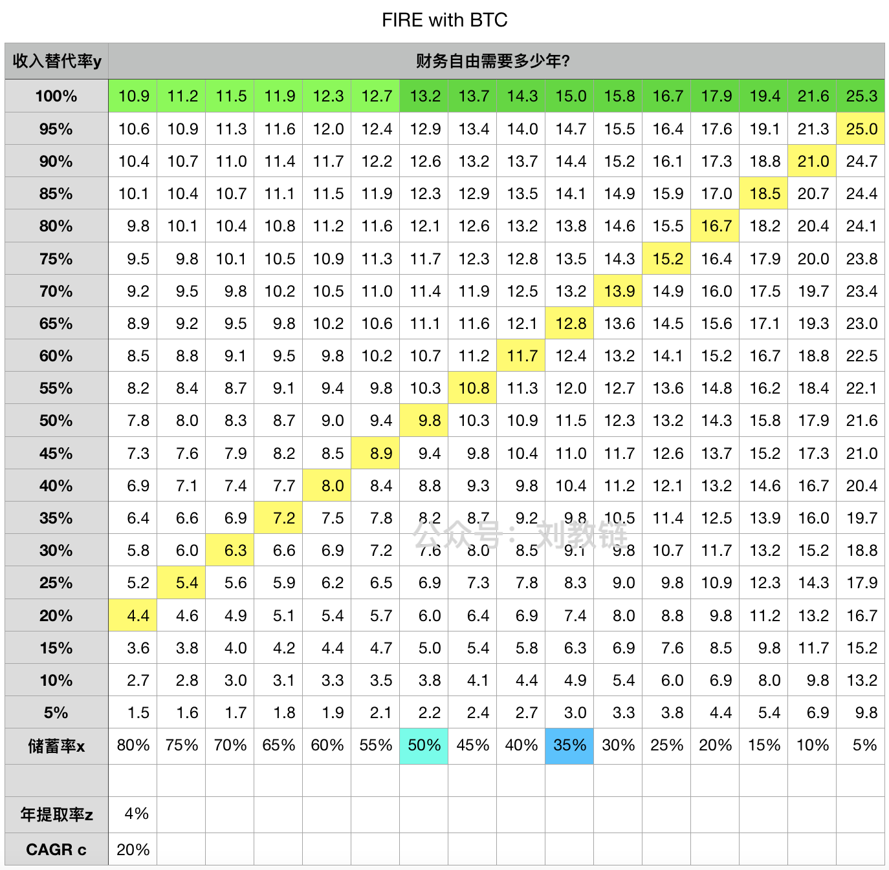
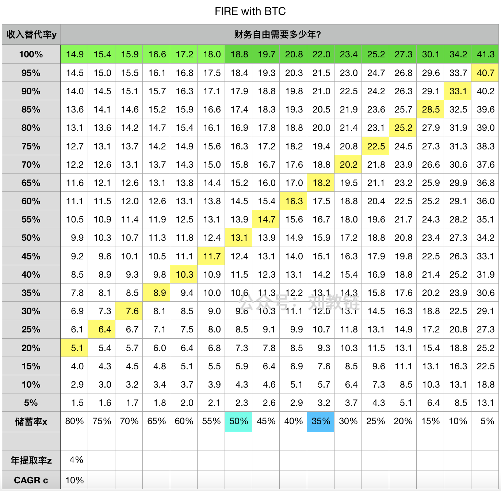

# 存够几个BTC可以提前退休？

在刚刚过去的周末，Bitcoin2024大会落幕，本次大会给与会者乃至于全世界带来了比特币世界的最强音：国家战略储备。[“7.28教链内参：美参议员要提案推动美财政部5年购买100万枚BTC”]，趋势一旦形成，就必然会沿着历史的轨迹走下去。BTC上下翻飞，昨日假摔66.6k，今日又扶摇直上，冲破69k，直取7万刀。

见此情此景，[“十年之约”实盘见证计划]的收益率也从7月6日加仓点的30%多，翻到现在超60%。从去年6月6日启动该计划以来，这才过去一年。

教链说过，心目中对CAGR的期望值也就是40%，建仓期折半20%。如今这第一年就取得了60%的成绩，算是撞了个“开门红”了。这也从侧面反映了一个事实，那就是从2023年以来，市场已经进入牛市，只不过不是大众都知道、人人蜂拥而至的狂暴大牛市，而是狂牛前的爬坡期。

“十年之约”计划坚持执行一年有余，汇报文章也写了一年有余（点开刘教链公众号首页搜索“十年之约”就能找到过去一年几十篇关于该计划执行情况的实盘总结），很多读者朋友还是不太理解它背后的思想和原理。今天就抽点儿时间来说一说，“十年之约”背后的理财智慧，俗称财商。

首先请大家思考一个问题：投资理财的目的究竟是什么？有人会说是为了暴富。错。如果一个人的目标只是钱的数量，那么他很可能过不好这一生。

我们要多想一步，为什么需要钱？是为了让自己的家人衣食无忧？是为了让自己能够自在地享受多一些闲暇的时光？是为了让自己可以随心所欲地旅行？还是为了自己能够去做自己一直想做但是却因为工作太忙而根本没有时间去做的心爱的事？

如果我们不知道什么是幸福，怎么样幸福，那么，即使给我们再多的钱，我们也不会得到幸福。甚至常常会因为钱，而让自己很不开心，反而摧毁了自己的幸福感。

只有敲开了自己心扉深处的门，弄明白了自己的幸福是什么，才不会为了多挣那仨瓜俩枣，而在自己的幸福之路上逆行狂奔。

为了钱而拼命工作，而委曲求全，而勾心斗角，而麻木不仁，而折损阳寿，那就是作了金钱的奴隶，被资本异化。我们生而为人，理应让金钱为我所用，变成我达成人生幸福目标过程中的工具和帮手。

我们的一生，有两次成人。第一次成人是年满18岁。第二次成人是财务自由。

财务自由有多种定义：

财富类杂志直接甩出充满着高不可攀的数字门槛的表格，告诉你一线、二线、三线城市分别需要多少房子、多少车子、多少存款才叫做“财务自由”。警惕这种抢夺定义权的洗脑。当你接受了资本的嘴替所给你树立的金钱数字作为奋斗目标时，你又一次上当了，落入了为钱奋斗、为钱努力的陷阱，继续成为金钱和资本的奴隶。

第二种则是会计学角度的定义。当你的净资产回报率所提供的被动收入足以覆盖你的日常开支，则定义为财务自由。比如，你的房子提供的房租，你的股票提供的分红，你的BTC每年的增长提取出一些，足够你和家人吃穿用度，这就是财务自由的状态。

还有一种则是从生产关系的角度来说的。当你可以从雇佣制工作中提前“退休”，不需要打工领工资也能维持现有生活，那么，你就实现了财务自由。

海外网友把最后这种叫做“FIRE” —— Financial Independence Retire Early（财务独立，提前退休）。

财务自由并不难。普通打工人通过努力，人人都可以实现自己的FIRE计划。简单来讲，就是三步走：

1. 选择储蓄的标的
2. 持续积累储蓄
3. 储蓄足够时，提前退休

好，现在我们需要一个定量的计算。只需要一点点儿数学。

既然是普通人都能做到的事情，那么积累储蓄所投入的本金也就必然是来自于早年的打工收入。假设每个月收入是1，其中x%可以拿来储蓄，(1-x)%要用来维持基本的日常开销。这里x%就叫做储蓄率。

又，假设储蓄标的资产的CAGR（复合年化增长率）是c，那么利用等比数列求和公式可以轻松算出，经过n年，总储蓄会积累到 x(1-(1+c)^n)/(1-(1+c))。

再设n年之后，开始每年提取z%的储蓄作为被动收入。此被动收入与原打工收入的比例叫做收入替代率，记为y%。

简单计算可以推出，n = log(cy/(zx) + 1) / log(1+c)。

代入数值，做成表格，如下：

图中，教链标上黄色高亮的斜向排列的格子里，是被动收入可以覆盖原(1-x)%日常开销所需的年头数。教链把被动收入覆盖开销叫做“相对财务自由”。

而绿色高亮的，则是被动收入可以完全替代此前打工收入所需储蓄的年头数。这时候被动收入提供的，将不仅仅生活保障，还能有所结余，用于改善生活，或者扩大储蓄。教链把这种被动收入100%替代原收入叫做“绝对财务自由”。

举个具体的例子：

你是一名月薪3000元的普通打工人。但你从进厂的第一天起，就立志通过自己的努力，早日实现财务自由。于是你省吃俭用，每个月省出一小半工资——大约有1000元——换成BTC储蓄起来……

十年半之后，如果你愿意，每年从你的BTC仓位里提取4%出来，就可以覆盖你每月2000元的日常开支了。这时候你就已经达到了相对财务自由的阶段。但你没有止步，而是继续努力储蓄BTC……

又过了两年，你的BTC仓位每年提出4%就足以取代你月薪三千的工作收入了。此时你已达到绝对财务自由的阶段。你可以选择FIRE提前退休，享受生活了。

在上面的例子中，有一个隐藏参数的假设，即BTC的CAGR是30%。

其中数字，我们是通过查看表格中储蓄率x = 35%一列而得出的。

这也是十年之约所用参数的逻辑由来：月薪三千打工人，每月存1000，十年之约一起达到相对财务自由。

脑子开窍的读者早就看出来了，其实这里的绝对数字是不重要的。总有脑子榆木疙瘩的笨蛋问，为啥每个月只投1000。这次交代的应该是很清楚了。在上面数学公式和模型表格中，只有储蓄率x，其实并没有具体的投入额度。

你月入3000投1500，月入3万投1.5万，月入30万投15万，储蓄率都是一样的，对应的都是表格中的同一列，即储蓄率x = 50%的那一列。因而实现相对财务自由和绝对财务自由所需的时间也都是一样的。

如果有读者朋友对教链三年前2021.8.21的文章《从投资小白到财务自由》还有印象的话，会记得教链提到过，对于个人，储蓄率以 10% - 50% 为宜，对于小企业，储蓄率以 5% - 15% 为宜。

对照上面的表格，教链把储蓄率 5% - 50% 时达到绝对财务自由所需的年头标注成了深绿色高亮，在 10.6年 - 19.1年 这个范围；相对财务自由，则只需要 8.2年 - 18.9年。储蓄率越高，自由地越快。

一般人咬咬牙，应该能把储蓄率做到 35% - 50%。这样的话，对于绝大多数普通人，扎扎实实地这么去储蓄，坚持两轮、两轮半周期就基本能相对自由，三轮周期以上就能绝对自由。

当然，如果对BTC CAGR 30%没有信心，我们可以调低预期。比如，下表是CAGR 20%的模型：

此时，到达绝对财务自由的时间大约需要15年。20岁工作，正好35岁FIRE。35岁裁员潮，别人失业了去送外卖开专车，你回家躺着想干点儿啥就干点儿啥，不想干啥就可以啥也不干。

或者更低的10%：（不过，下调到10%，恐怕是好好选股也就能做到了）

这时候财务自由的时间进一步被拉长到了20年左右。即使是20岁参加工作，也要熬到40岁，而中间35岁的槛，万一没能迈过去，整个计划就可能被中断。

由此大家也就能明白，从财务角度看，一份长期稳定的工作，一个铁饭碗，对于一个长期退休计划而言，是多么的宝贵。为什么擅长向社会输送大龄青年的大厂薪水虽高，却也不能阻止考公大潮，想必这也是一个方面的原因吧。

一份需要看上级脸色，随时可以被裁员的职业，不过就是一个工作。一个不需要看谁的脸色，只要想干可以干一辈子的职业，才是值得为之奋斗终身的事业。

回到主题，要FIRE，要财务自由、提前退休，需要存够几个BTC呢？

显然，具体的数字因人而异。

记得以前看过一个宗庆后老先生生前的报道，说他生活俭朴，一年开销也就是10万元。按这个标准，只需要存上大约10万/4% = 250万元的BTC，按今天6.9万刀的价格约合5个BTC就足够了。

还记得有一个努力在大A实践FIRE理念的博主，他的目标是在35岁前存够500万元的金融资产。这按照现价大约折合10个BTC。稍微算一下还可以推出，该名博主退休生活的开支需求大概是500万 x 4% = 20万/年。

还有一个海外的网友说，他觉得存够100万美刀的BTC就可以提前退休了。我们算一下，100万美刀的BTC，在今天大概就是15个BTC。每年提取4%也就是4万美刀，足以支撑每年大约30万元的开销。这已经可以过上有房有车、想走就走的生活了。

每个人应该有自己的计划。比数字更重要的，是你究竟想要过什么样的人生。

* * *

FIRE讲完了。可能很多小伙伴更关心的，是如何才能在人生漫长的几十年中安全、稳妥地存储和保管自己辛辛苦苦积攒下来的BTC呢？以及，了解更多有关web3和区块链的操作、安全等更多知识，让自己在参与这个全新领域时，不会两眼一抹黑，被黑、被钓鱼、被欺骗。那么，福利来了，教链专为零基础小白研发的“刘教链超级小白课”第4期正在火热招生中，预计会在8月份开课，现在还有名额，预报从速（联系教链报名，详见下面海报）：

更多信息，请点击本文左下角“阅读原文”，打开小白课课程材料网站浏览。
