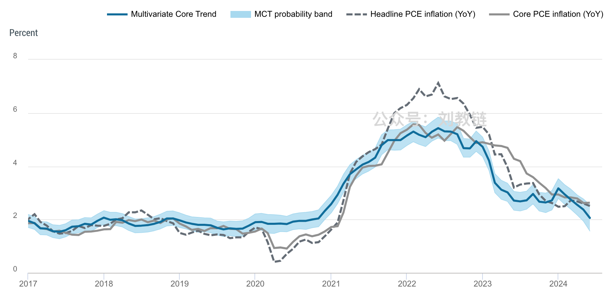
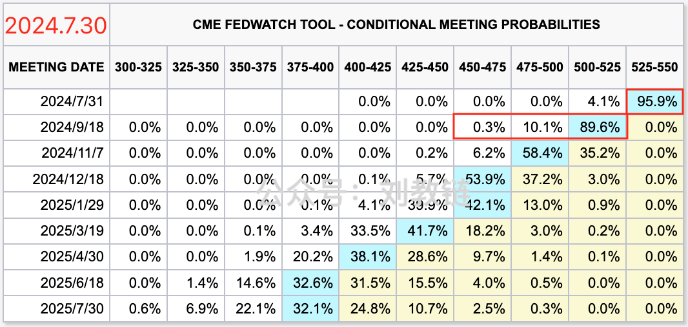
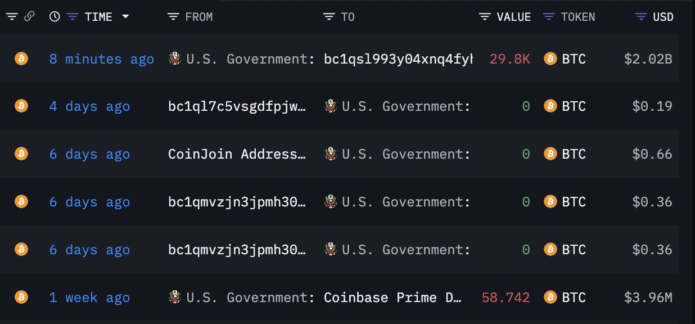
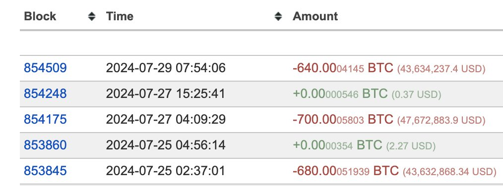

# 有此五者，投资想不赚钱都难。

昨天[“7.29教链内参：BTC兵临7万刀城下”]，一度冲破7万刀防线之后，即迅速跌落，至今早已大幅回撤至66k附近。多空交兵，龙战于野，其血玄黄。

今明两天美联储就要开会了。2024年7月份的FOMC议息会议。这是早就安排好了的日程。

没有安排好的，是风云诡谲的全球局势，暗流涌动的经济形势，错综复杂的宏观数据，以及，意外频出的美国政治。

市场上传来消息，美联储或将要修改声明，承认近期通胀有所改善，并暗示9月降息。但这也意味着美联储认为7月提前降息的必要性并不大。

图：Multivariate Core Trend of PCE Inflation
来源：纽约联储

现在看来，市场觉得7月份美联储不降息的概率依然超过95%，而9月份降息的概率则高达100%。

其实在美国11月大选前充满不确定性的政治氛围里，美联储主席鲍威尔也是左支右绌。特朗普已经在公开采访中向他抛出胡萝卜和大棒，表示如果他当选，会留用鲍威尔，但前提是鲍威尔不要在拜登任内降息，而是要把放水的利好留到他上台之后。

显然，美联储的官员们并不想提前下注。他们是厌恶风险的、稳重的金融家。他们不想像某些猴急的政客或企业家那样左右横跳。他们试图在谨小慎微的宏观决策中保持政治中立性的态度。这种微妙的心态，就会使得美联储在恰逢美国大选变局前夕做出货币政策调整，有那么一点点儿心理障碍。

而就在特朗普刚刚在上周末Bitcoin2024大会上放出豪言壮语，称[“美国须100%保留（比特币）作为国家战略储备”]之际，还在任上的拜登政府可是一点儿老脸都不给他。今晨，链上监测传出消息，美国政府刚刚又把持仓的近20万枚BTC中的一小部分，大概小3万枚约20多亿刀的BTC给移动了一下，被疑似是不是要准备抛售。

市场也是麻溜儿地借坡下驴，直接连滚带爬撤回到了66k一线进行防守。

令人惊奇的是，早前著名的日拱一卒、不断加仓的“100先生”（Mr.100），这次竟提前在美国政府动币前，大笔抛售了2020枚BTC，占其持仓总量的2.8%。

难道他这是早早就听到了什么风声？抑或仅仅是冥冥之中偶然的巧合？

管他们是出于啥动机呢。反正既然他们要当“纸手”（指拿不住的人），那就让我们“钻石手”（指坚定持有的人）来逢跌加仓好了。

逢跌加仓的胜算，不在加仓的一刻，而在加仓之前。甚至，在投下第一笔资金还要往前，在投资还并没有开始的时候，就已经注定。

兵法说，多算胜，少算不胜，何况于无算乎？

绝大多数人投资亏损，根源就在于“无算而战” —— 心里面、纸面上、电子表格里根本就没有盘算清楚、计算妥贴，就匆匆忙忙、稀里糊涂地带资进场，仓促上阵，最后只能落得个被收割一空的结局。

最起码也得先把教链这五六年来写的所有文章和内参都读一遍吧？;D

孙子兵法开篇第一句就说，兵者，国之大事，死生之地，存亡之道，不可不察也。

这就是“慎战”的思想。

慎战的思想，简单来讲就是，尽量不把战争作为解决问题的第一选项，但是如果最后所有其他选项都不行，不得不奋力一战，那么就必求一战而胜。

教链认为，投资也要坚持“慎投”的思想。

看很多猴急的人，见一个爱一个，见一个投一个，就像饿死鬼投胎、老色批转世。他们根本就不是奔着盈利去，反倒像是奔着给庄家送钱去似的。

一无慎战，二无庙算，高位接盘、低位割肉、回本止盈，便成常态。

庙算军中，而决胜千里之外。庙算投前，而决胜十年之后。

慎战第一，庙算第二，大饼第三，坚持定投第四，逢跌加仓第五。

有此五者，投资想不赚钱都难。
