# Solana，皇帝的新衣

隔夜加密市场承压Mt.Gox派发继续推进，[“7.30教链内参：关于Mt.Gox分发情况的图文介绍”]可资参考。受此影响，市场无力上攻。BTC暂时回撤至66k待命。今天，教链和大家谈一谈新公链的赛道。

早在去年底，针对Messari研报唱衰ETH、唱多SOL，教链就曾一针见血地指出，这是华尔街资本在2022年FTX暴雷被埋之后的自救行动之一环。何故？因为他们这些机构，当初被长着白皮、天然招他们信任的SBF（FTX创办人）给忽悠进了套，重仓了Solana，结果FTX（SBF开办的交易所）被CZ（币安赵长鹏）趁着2022年熊市一波嘴炮直接带走，直接导致“FTX系”的诸多资产鸡飞蛋打！

就说这诸多套牢资产中的一个，Solana，从2021年10月最高峰近260刀的高位，直接给干到了2022年12月不到8刀！最大跌幅高达97%！

这就让这帮被套死的美机构资本婶可忍叔不可忍。他们马上拿出了两个对策：

第一，开展报复行动。利用美国资本影响政治的体制，推动司法部、CFTC、财政部联合执法，把CZ给“请”到美国，罚款判刑。CZ被迫离开自己一手创办的Binance。Binance被美财政部监管。这是去年（2023年）11月份的事了。1年不到就大仇得报，深刻体现了资本主义制度的“先进性” —— 老板（资本）一发话，员工（美政府）执行力那真是杠杠滴！此一段江湖恩怨，暂且不表。

第二，开展自救行动。怎么自救？当然就是联合坐庄，炮制利好，拉升币价咯。华尔街资本炮制的策略，就是把以太坊头上公链之王的皇冠，加冕给Solana。到今年（2024年）3月份，趁着那一波的山寨潮，SOL已经成功飙升至210刀，相比于2022年12月不到8刀，上涨25倍之多。而同期ETH仅从2022年底1070刀涨至2024年3月4090刀，涨幅仅有4倍左右。

大家不妨回忆一下，为什么网上忽然很少有人谈Solana根本就不是去中心化的区块链，因为它最核心处需要一个中心化的定序器才能工作？为什么Maker的创始人Rune Christensen去年要和以太坊创始人Vitalik Buterin对线叫板，说Solana比以太坊更好？为什么头部加密投研机构Messari去年研报要明牌唱衰以太坊(ETH)、唱多SOL？为什么推特等平台上开始盛行“Solana超越以太坊”（SOL flips ETH）的言论？

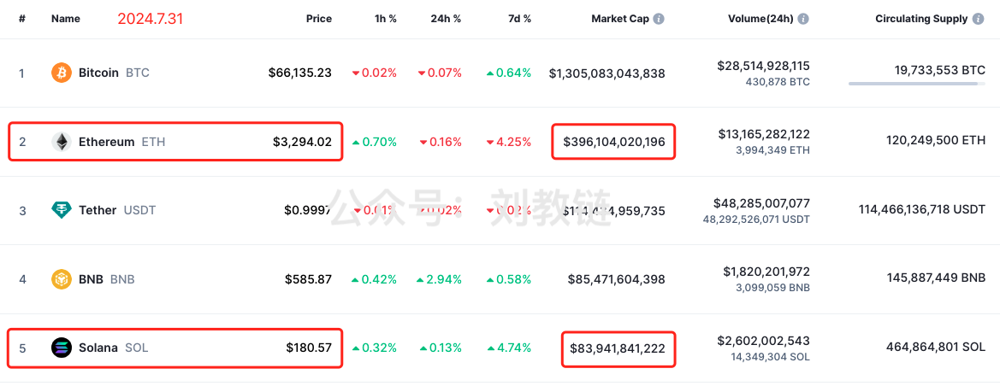

时至今日，2024年7月最后一天，Solana已跻身加密市值榜单前5，市值近840亿刀。而以太坊的市值则超3960亿刀。虽然体量上还有一个数量级的差距，但是市场中已经有很多人、很多声音，在鼓动不明觉厉的韭菜们，去相信“Solana就是下一个以太坊”、“Solana必将超越以太坊”这样的故事了。

记住，在金融市场，你看到的，往往都是别人想让你看到的。表象的虚假程度，往往和看好之声的响亮程度成正比。Solana，是否真的具备超越以太坊的潜力，是不是有可能成为下一个公链之王？或者相反，Solana的繁荣是不是人为炮制的假象，是不是皇帝的新衣呢？

下面，教链编译Flip Research的研究报告《SOL - 皇帝的新衣》，与大家分享一下，作为启发。

* * *

最近，我的推特时间线上充斥着 SOL 的看牛帖子，中间还夹杂着模因币的骗局。我开始相信，模因币超级周期是真实存在的，Solana将超越以太坊，成为主要的L1（一层链）。但后来我开始挖掘数据，结果至少可以说是令人担忧的…… 在这篇文章中，我介绍了我的发现，以及为什么 Solana 可能是一个“纸牌屋”（指资本和权力的游戏）。

首先让我们看看网友Nachi简明扼要地阐述看好SOL的观点：

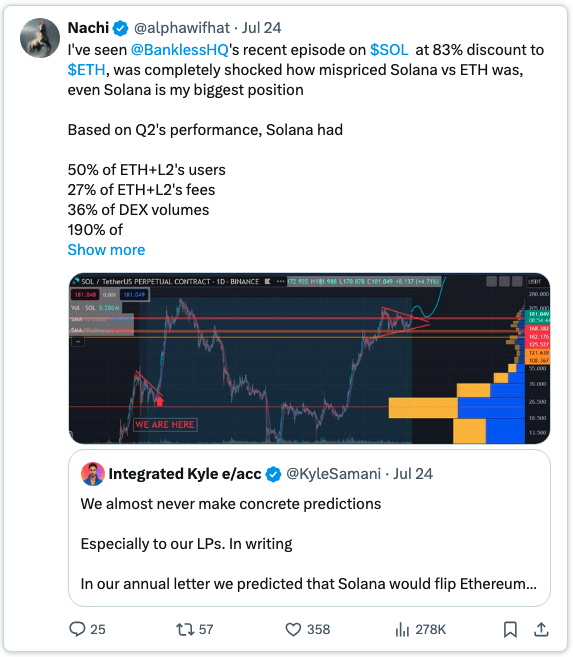

【教链注：网友Nachi看牛SOL的言论主要是这样的：

我看到 @BanklessHQ 最近关于$SOL比$ETH折价83%的报道，完全震惊于Solana与ETH的定价失误，甚至Solana是我最大的头寸 

根据第二季度的表现，Solana 有

50% 的 ETH+L2 用户
27% 的 ETH+L2 费用
36% 的 DEX 交易量
占 ETH+L2 稳定币交易量的 190

今天，SOL 的 DEX 交易量超过了 ETH 的交易量。即使把 ETH+L2 计算在内，它也在短短几周内从 36% 上升到了 57%

SOL 的 DEX 交易量迟早会翻转 ETH+L2s 和模因币，而模因币是本周期最好的 PMF（教链注：指契合市场需求的产品），还有其他指标

但是，SOL 的市值仍然只有 ETH 市值的 20%，而且还在快速增长，这在传统估值中完全是弱智的，再加上像 Firedancer 这样的催化剂，以及明年初可能获得的 ETF 批准。

……】

关于对比 ETH+L2 的指标，有四个不同的维度：
1. 用户群比例高
2. 按比例收取更高的费用
3. DEX 交易量大
4. 稳定币交易量所占比例明显更高

## 一、用户群比较：

以下是 ETH 主网与 SOL 的对比（仅对比主网，因为绝大多数费用都来自 Dencun 之后的主网，来源：@tokenterminal）：

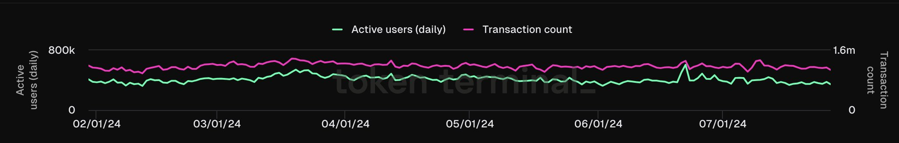
ETH用户基数+链上交易数(tx)

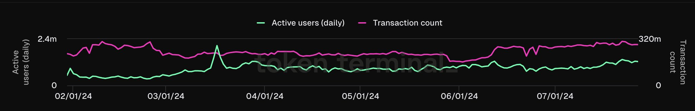
SOL用户基数+链上交易数(tx)

从表面上看，SOL 的数据很不错，日活跃用户（DAU）超过 130 万，而 ETH 为 37.63 万。然而，当我们将 tx 计数加入其中时，我发现了一些奇怪的现象。

例如，7 月 26 日星期五，ETH 有 110 万次交易，而 DAU 为 37.63万，大约每个用户每天有 2.92 次交易。而 SOL 的交易数为 2.822 亿次，DAU 则为 130 万，每用户每天的交易数高达 217 次。

我想，这可能是由于低费用允许更多的交易、更频繁的复合头寸、更多的套利机器人活动等。因此，我将其与另一个受欢迎的链 Arbitrum 进行了比较。然而，Arb 在同一天的用户访问量仅为 4.46 次。再看看其他链，结果也差不多：

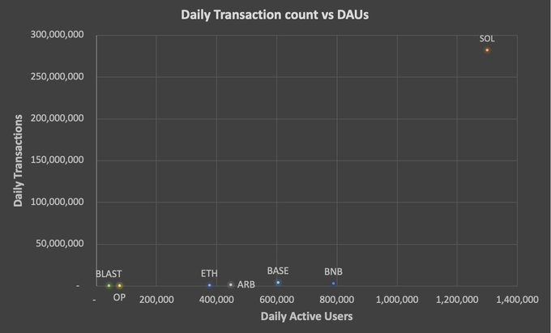

鉴于用户数量高于 ETH，我对照谷歌趋势进行了检查，谷歌趋势应该与每用户价值相当无关：

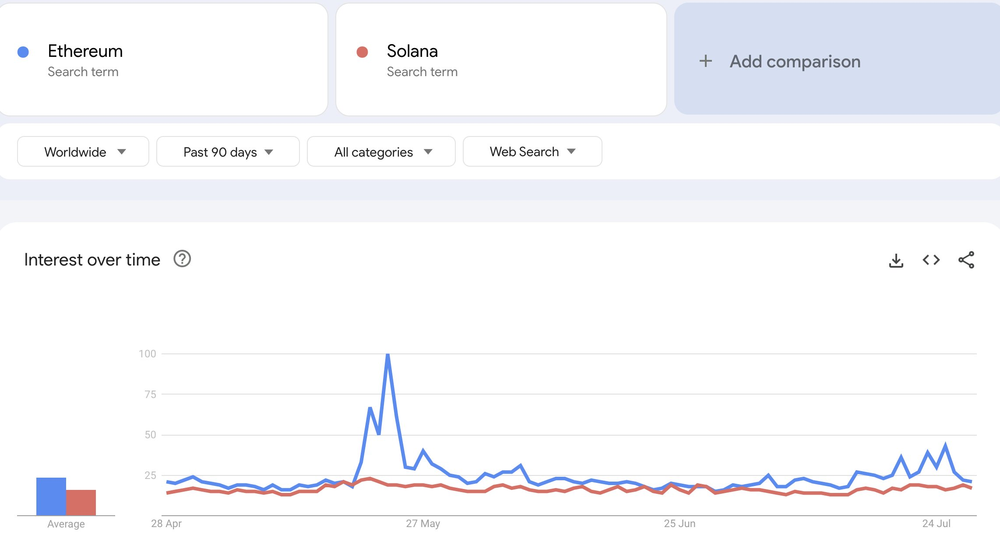

ETH一直与SOL持平或领先。考虑到 DAU 的差异，再加上所有围绕 SOL 模因币趋势的炒作，这并不是我所期望的。这到底是怎么回事？

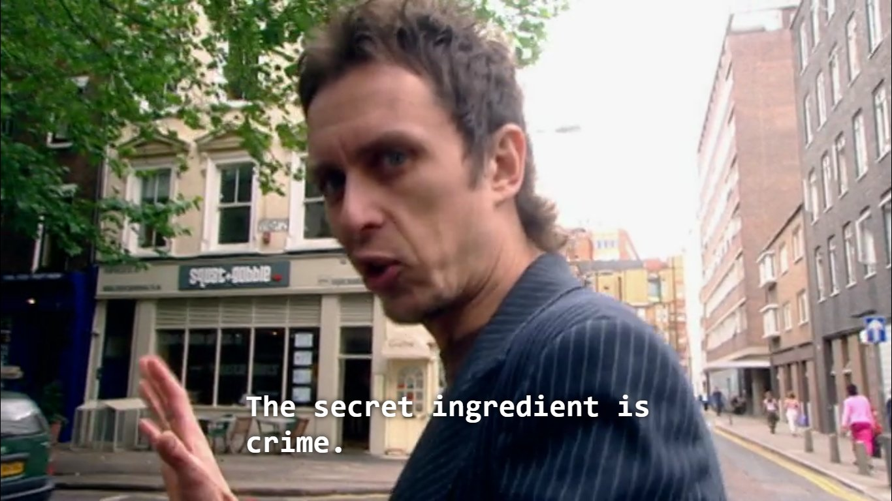
图中字幕：暴富的秘诀都写在《刑法》里。

## 二、DEX 交易量分析

要了解交易数量的差异，看看 Raydium 的 LPs 会有所启发。即使是第一眼，也能明显看出不对劲：

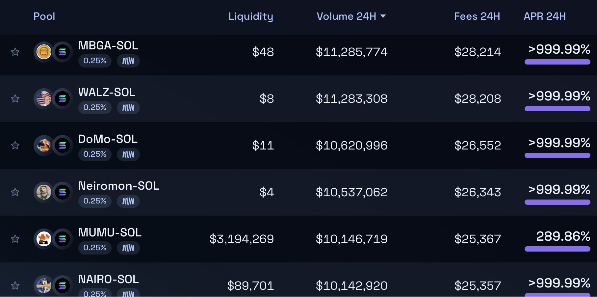

起初，我以为这只是在蜜罐 LP 上进行低流动性的洗盘交易，以吸引零星的模因币傻缺(degen)，但从图表上看，情况要糟糕得多：

每一个低流动性池都是一个仅在过去 24 小时内就抽毯子跑路(rug)的项目。就 MBGA 而言，在过去 24 小时内，Raydium 上有 4.6万笔交易、1080 万美元的交易量、2845 个不同钱包的买入/卖出以及超过 2.8 万美元的手续费。(请注意，类似规模的合法 LP $MEW 只产生了 1.12万笔交易）。

纵观所涉及的钱包，绝大多数似乎都是同一网络中的机器人，交易量数以万计。它们独立生成虚假交易量，随机产生 SOL 数量和交易次数，直到项目出现问题，然后再进入下一个项目。

在过去 24 小时内，Raydium 的标准 LP 上有超过 50 个交易量大于 250 万美元的项目，总共产生了超过 2 亿美元的交易量和超过 50 万美元的费用。Orca 和 Meteora 上的交易量似乎要少得多，而我在 Uniswap (ETH) 上很难找到这些跑路项目的任何有意义的交易量。

很明显，Solana上的项目跑路存在着巨大的问题，并产生了各种影响：

* 考虑到异常高的交易与用户比率，以及链上的洗币交易/洗币数量，似乎绝大多数交易都是非自然的。在主要的以太坊 L2 上，最高的日交易用户比是 Blast 上的 15.0 倍（该平台的手续费同样很低，而且用户都在使用 Blast S2）。作为一个粗略的比较，如果我们假设真实的 SOL 交易-用户比率与 Blast 相似，这将意味着 Solana 上超过 93% 的交易（推而广之，费用）都是非自然的。

* 这些骗局运行的唯一原因就是有利可图。因此，用户损失的金额肯定至少等于产生的费用+交易成本，每天高达数百万美元。

* 一旦部署这些骗局变得无利可图（即实际用户厌倦了赔钱），你就会发现大部分交易量和费用收入都会下降。

* 由此看来，用户、真实费用和 DEX 交易量都被严重夸大了。

我不是唯一得出这些结论的人，@gphummer 最近也发了类似的帖子：

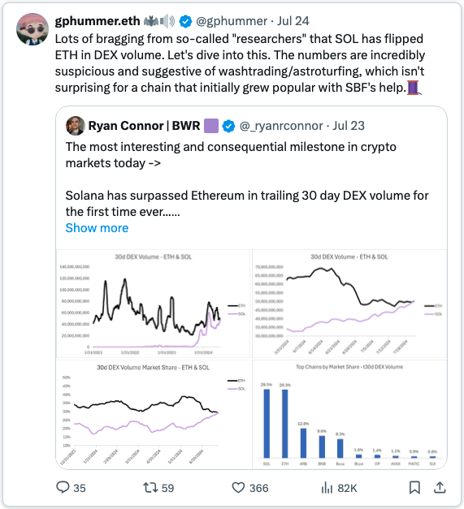
【教链注：网友ghpummer说的是：很多所谓的“研究人员”都在吹嘘，SOL 在 DEX 交易量中超过了 ETH。让我们深入了解一下。这些数字令人难以置信地可疑，暗示着刷量/营销欺骗，对于一个最初在 SBF 的帮助下流行起来的链来说，这并不奇怪。】

## 三、Solana 上的 MEV

Solana 上的 MEV（矿工提取价值）处于一个独特的位置。与以太坊不同，它没有内置的内存池；相反，像 @jitoo_sol 这样的玩家创建了（现已废弃）协议外基础设施来模拟内存池功能，从而为 MEV 提供了机会，如抢跑(front-running)、三明治攻击(sandwich attacks)等。Helius Labs 在这里详细介绍了 MEV：

https://www.helius.dev/blog/solana-mev-an-introduction

Solana 的问题在于，交易的绝大多数代币都是超高波动性、低流动性的模因币，交易者往往要设置大于 10% 的滑点才能成功执行交易。这为 MEV 获取价值提供了一个油水很大的攻击面：

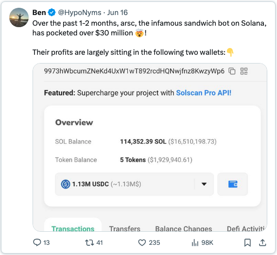
【教链注：网友Ben说的是：在过去的 1-2 个月里，Solana上臭名昭著的三明治机器人 arsc 已经赚取了 3000 多万美元🤯！】

如果我们看看区块空间的盈利能力，就会发现现在大部分价值都来自 MEV 的油水：

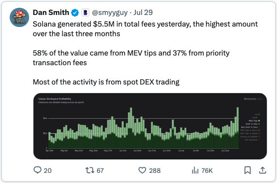
【教链注：网友Dan Smith说的是：Solana昨天共产生了 550 万美元的费用，是过去三个月中最高的一次 

58% 的价值来自 MEV 提示，37% 来自优先交易费

大部分活动来自现货 DEX 交易】

虽然这是严格意义上的“真实”价值，但 MEV 只有在有利可图时才会进行，也就是说，只要散户继续“梭哈”模因币（并净亏损），MEV 就会进行。一旦模因币开始降温，MEV 费用收入也将随之崩溃。

我看到许多 SOL 帖子都在谈论最终会如何转向 $JUP、$JTO 等基础设施投资。这很有可能，但值得注意的是，这些代币的波动性更低、流动性更高，根本无法提供相同的 MEV 机会。

老练的玩家有动力建立最好的基础架构来利用这种情况。在我的调查过程中，一些消息来源提到了这些玩家投资控制内存池空间，然后将权限出售给第三方的传言。但我无法证实这一信息。

这其中存在一些明显反常的激励机制 —— 通过将尽可能多的模因币活动转移到 SOL，可以让老谋深算的人继续从 MEV、上面谈到的模因币内幕交易以及 SOL 的价格升值中获利。

## 四、稳定币

说到稳定币的交易量+TVL（总锁定金额），还有一个奇怪的现象。交易量明显高于 ETH，但当我们查看 @DefiLlama 的稳定币数据时，ETH 有 800 亿美元的稳定 TVL，而 SOL 只有 32 亿美元。

我认为，稳定币（以及更广泛的）TVL是一个比低费用平台上的交易量/手续费更不容易出老千的指标，它显示了游戏中的参与者有多少。

稳定币的交易量动态凸显了这一点 —— @WazzCrypto 指出，一旦 CFTC 宣布他们正在调查 Jump，交易量就会突然下降：

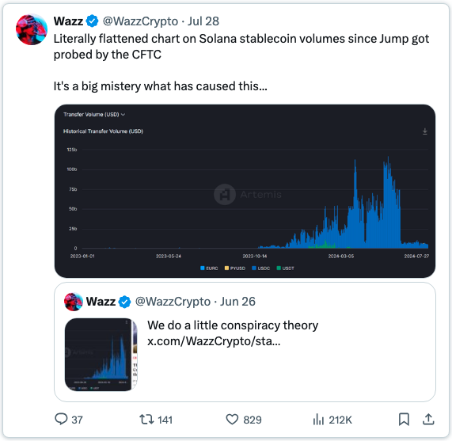
【教链注：网友Wazz说的是：自从Jump被美国商品期货交易委员会（CFTC）调查以来，Solana稳定币交易量的图表就成了字面意义上的一条水平线。这是一个很大的谜，是什么造成了这种情况...】

## 五、韭菜价值提取

除了跑路和 MEV，散户的前景依然暗淡。名流们选择Solana作为他们的首选链，结果并不乐观：

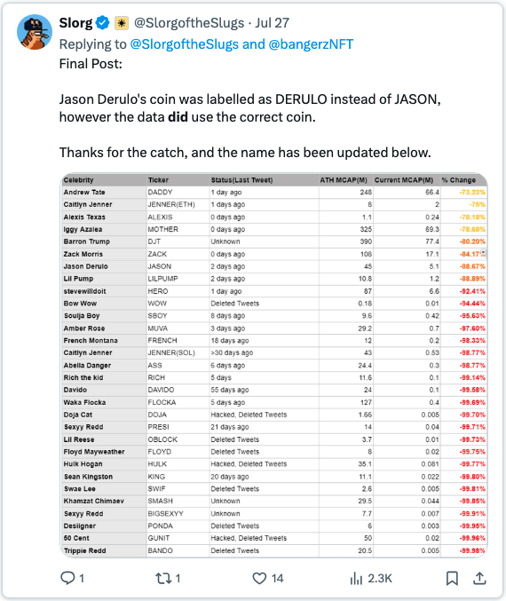
【教链注：此表展示了Solana上发行的“名人币”的惊人跌幅】

Andrew Tate的 “DADDY” 是表现最好的名人币，回报率为-73%。

在推特上快速搜索一下，就能发现内幕交易猖獗、开发者向买家倾销代币的证据：

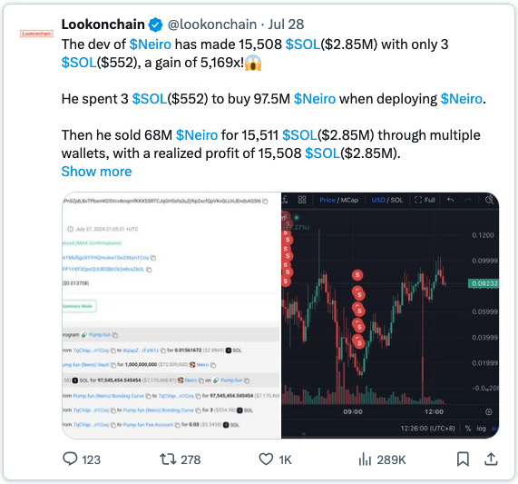

也许有人会这样反问：但是，我的推特时间线上都是在 Solana 上交易模因币赚了几百万的人。这和你说的有什么关系？

我根本不相信 KOL 在推特上发表的帖子能代表更广泛的用户群。在当前的狂热下，他们很容易进入一个生态位，推销他们的代币，从他们的追随者身上获利，然后重复一遍又一遍。这里绝对有幸存者偏差在起作用 —— 赢家的声音远大于输家，造成了对现实的扭曲认知。

客观地说，散户每天都会被骗子、开发者、内部人士、MEV、KOL 折腾走数百万，而这还没有考虑到他们在 Solana 上交易的大部分东西都是没有任何真材实料支持的模因币。很难反驳这样一个事实，即大多数模因币最终都会走向与$boden相同的道路（即：归零）。

## 六、附加考虑

市场是善变的，当情绪发生变化时，买家曾经视而不见的因素就会成为焦点：

* 链稳定性差，经常出现中断

* 交易失败率高

* 无法阅读的区块浏览器

* 开发门槛高，Rust 对用户的友好程度远不如 Solidity

* 与 EVM 相比，互操作性差。 我认为，让多个可互操作的链相互竞争，而不是受制于一个单一的（相当集中的）链，是更健康的做法。

* 从监管和需求角度看，ETF 的可能性都很低。这篇文章本身就强调了为什么在Solana目前的状态下，机构需求会很低。@malekanoms 还强调了一些我认为与传统金融相关的观点（加上 @0xmert 的反驳）：

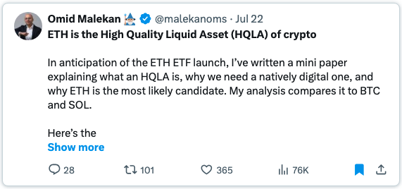
【教链注：网友Omid Malekan说的是：

ETH 是加密货币中的优质流动资产 (HQLA)

为了迎接 ETH ETF 的推出，我写了一篇小论文，解释什么是 HQLA，为什么我们需要一个数字原生的HQLA，以及为什么 ETH 是最有可能的候选资产。我的分析将其与 BTC 和 SOL 进行了比较。

以下是摘要：

**为什么是 HQLA？**

HQLA 是传统金融的一个概念，用于银行监管。它指的是那些几乎具有公认价值和深度流动性的资产 —— 银行可以安全持有并在紧要关头出售而不影响市场的资产。我将这一概念不严格地应用于加密货币，因为这种资产是我们可以用来建立一个全新的去中心化金融体系的。

原生数字 HQLA 意味着更好的去中心化稳定币、更安全的信贷和更可信的衍生品。我的分析解释了为什么这不可能是一个 dApp 代币、集中发行的稳定币/RWA 或 L2 代币。最佳候选者是 L1 的原生币。

**为什么不是比特币？**

BTC 是加密货币中最有价值、流动性最强的资产，但你却不能用它做很多事。链上没有原生 DeFi 或替代资产，比如稳定币。将其用作抵押品的唯一方法是托管或桥接到另一条链上，而这两种方法都会带来新的风险，在某种程度上有违初衷。

也许随着新契约或 L2 的出台，情况会有所改变，但我对此持怀疑态度。BTC 的灵魂在于实现另一个目的，即成为传统金融的 HQLA。

**ETH 与 SOL 之争**

Solana网络有许多吸引人的特性。但这与 SOL（资产）是两码事。从经济学角度来看，SOL 的基本面较弱，因此是一种中等质量的资产。

首先，SOL 的所有权很集中，这要归功于它的年轻、多轮风险投资、对实验室和基金会的拨款，以及它以质押方式（即PoS）上线的事实。集中会降低流动性。ETH 在几年前进行了适度的融资，只给了基金会和创始人少量资金（按当前标准），并且在合并前有多年的 PoW（工作量证明，即算力挖矿）。

其次，SOL 的通胀率相对较高，超过 5%。通胀率最终会下降，但在通胀率稳定在 1.5%之前，供应量将增长 25%。在此期间，SOL 在 DeFi 的资本成本会很高。

DeFi 总是倾向于使用原生资产 —— LST（流动性质押代币）本身会带来风险 —— 但在 DeFi 中使用原生 SOL 意味着放弃高额质押收益。DeFi 要吸引资本，就必须与质押(staking)相竞争。

这意味着 SOL 的名义利率很高。另一方面，ETH 则接近通货紧缩，其名义利率接近于零。你已经可以在行动中看到这一点：目前，在 Kamino 上借入 SOL 的成本几乎是在 AAVE 上借入 ETH 的三倍。

第三，高名义利率会导致更多的质押。为了避免稀释，SOL 的所有者如果不质押，那就太傻了，但这会阻碍流动性。Solana的质押参与率是以太坊的两倍多。以太坊持有者不会因为不质押而错过太多机会。这意味着市场上自由流通的 ETH 总比 SOL 多。

更糟的是，Solana 的 LST 生态系统支离破碎。流动性质押代币不如 HQLAs 吸引人，但人们确实在使用它们，以太坊 DeFi 中就有大量的 Lido stETH。集中于单一 LST 可能不利于链的安全性，但反过来却有利于 DeFi。这意味着可能被认为“大到不能倒 ”的资产有了更多的流动性。

第四，也许与直觉相反，Solana 的交易费用很低。这可能对用户有利，但对 SOL 的基本面不利 —— 费用是用户的成本，但也是质押者的收入。低费用意味着支付给质押者的大部分回报必须来自新币发行，也就是贬值。

发行量和费用之间的相互作用决定了加密资产的实际利率（MEV 也起作用，但不包括在我的分析中）。

ETH 的发行量很低，而手续费却很高，几乎所有的手续费都归质押者所有。这意味着它的实际收益率为正。在这方面，它甚至比比特币更好。比特币也具有很低的发行量和很高的手续费，但两者都归矿工所有，而不是持币者。

SOL 的实际收益率几乎为负。除了活动高峰期，几乎所有的收益都来自于货币供应量的增加。

ETH 也有燃烧机制。这增加了它的正实际收益率，同时也将价值返还给非质押者，从而降低了质押动机，降低了质押参与率，导致了更多的流动性。Solana曾有燃烧机制，但后来决定取消。

最后，以太坊的高额费用意味着 ETH 具有更高的便利收益率：用户会希望始终持有一些ETH（而不质押）来支付未来的上链gas费用，从而增加ETH的可用供应量。

ETH 比 SOL 具有更好的货币属性，而货币属性对于成为 HQLA 非常重要。

这是一个复杂的论证，其中有许多变动的部分，但 SOL 在 Solana 的成功中缺乏重要性，这妨碍了它作为建立在其基础上的终极资产的资格。

你甚至可以在 Solana 文化中看到这一点。连 @aeyakovenko 都认为加密经济的安全性只是一种模因。但如果这是真的，那么链的代币的基础也就成了模因。

安全->币值->安全的循环逻辑是任何加密货币的最终价值来源。这是中本聪最伟大的洞察力。

这并不意味着 SOL 不能升值，甚至不能跑赢 ETH，因为目前在加密货币中，模因和声势比基本面更重要。

但是，在以全新资产为基础重新构建的金融体系中，这些动态降低了 SOL 的重要性。

**ETH 是加密货币中的 HQLA**

随着市场慢慢意识到这一点，它作为 DeFi 币的增长速度可能会与 SOL 不相称，并有可能在某一天在价值和地位上超越比特币。金融领域的赢家通吃倾向非常强烈。

本分析是思想的前沿，因此欢迎所有评论、提问和反驳。以下是完整的分析：

https://omid-malekan.medium.com/eth-is-the-high-quality-liquid-asset-of-crypto-4d27ee77c127 】

* 最高增发 67,000 SOL/天（1240 万美元）

* FTX遗产里仍锁定着 4100 万 SOL（76 亿美元）。750 万 SOL（14 亿美元）将于 2025 年 3 月解锁，在 2028 年之前，每月还将解锁 6.09 万 SOL（1.13 亿美元）。大多数代币似乎是以约 64 美元/个的价格购买的。

## 七、结论

与往常一样，卖镐和铲子的人从Solana模因币的繁荣中获利，而投机者却被洗劫一空，而且往往是在不知情的情况下。

我认为，通常引用的 SOL 指标被严重夸大了。此外，绝大多数自然用户在链上的资金正在快速流失。我们目前正处于狂热阶段，散户的资金流入仍然超过了这些老练玩家的资金流出，从而产生了正面的观感。一旦用户对持续的损失感到疲倦，许多指标就会迅速崩溃。

如上所述，SOL 还面临着一些基本面的不利因素，一旦情绪转向，这些因素就会凸显出来。任何价格上涨都会加剧通胀压力/解锁。

归根结底，我认为从基本面的角度来看，SOL 的估值过高，虽然现有的情绪和势头很可能在短期内推动价格上涨，但长期的情况却更加不确定。

免责声明：虽然我过去曾在不同时期持有 SOL ，但目前并不持有 SOL 的实质性头寸。我在上文提出的许多观点都是我个人的推测，并非事实。我的假设和结论很可能是错误的。这不是财务建议，请务必自行调研。

