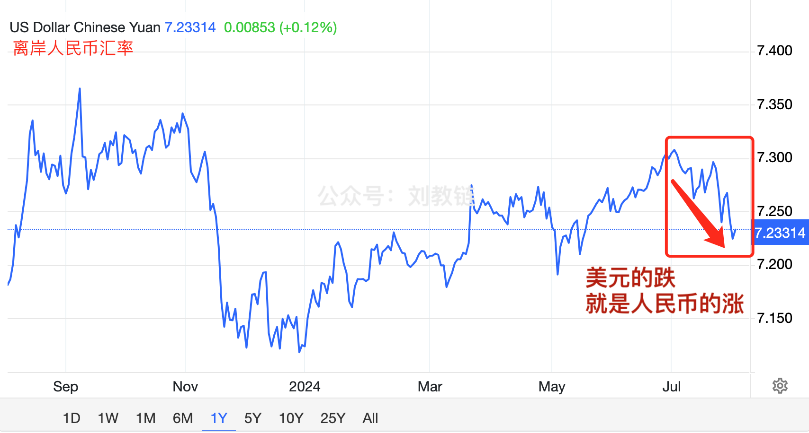

# 美联储举起白旗 —— 十年之约＃28（ROI 51%）

隔夜今晨美联储7月份议息会议结束。结论不出意外，和[“7.31教链内参：BTC挖矿难度历史新高，ETH ETF净流入转正”]中市场预计的一模一样，维持利率5.25-5.5%不变，并提前预告9月可能的降息。

说话听音儿。就业不是强劲了，而是缓和了。通胀不是真高，而是有点儿高了。不再只是关注通胀风险，而是要同时关注两方面的风险。

哪两方面的风险呢？1977年，美联储受命于国会，操纵市场以实现就业最大化、价格稳定以及中性长期利率的目标。这被称为“双重使命”(dual mandate)。

两方面的风险，一是就业变差、失业变高的风险，二是通货膨胀、物价变贵的风险。美联储能够操纵的，只有利率水平。它需要通过对利率的操纵，来实现“既要又要”的效果。这就是所谓的“双重使命”。

美联储是懂“就坡下驴”的。它是一点儿都没有和市场对抗。会前，高盛就发声说7月不降息，9月降息。这是来自大资本的声音。

目前，CME的押注概率表已经完全没有“不降息”(525-550)这一列了。目之所望，前方皆为降息。

通胀是个加速度。馒头第一年从10块涨到100块，通胀1000%。第二年从100块涨到101块，通胀就迅速下降到1%了。

在2021年通胀起来的时候，教链就说过，这一轮美国的通胀，既不是放水问题，也不是产能问题，而是供应链问题。事实上，充足的产能供应一直都在，是美国要玩贸易封锁、脱钩断链，人为阻碍国际商品流通，这才搞出了高通胀。

商品会自动去寻找需求。通路断了，就绕道走。经过两三年的建设，新的通路被建立起来，积压的商品又能源源不断地输送给美国人民了，这通胀也就自然得到了缓解。

但这物美价廉的商品重新涌入美国市场，也就肯定会冲击到美国国内的就业，从而迫使美联储去关注硬币的另一面 —— 失业率升高的风险。

左支右绌，“双重使命”就是套在美联储嘴上的马嚼子，将其牢牢控制。

眼见地这美联储要举起白旗，聪明的资本早就提前一步开溜了。于是推高了离岸人民币的汇率。美元资本跑步进入了稳如泰山的中国市场，提振了大A。昨天一根大阳线，让前段日子垂头丧气的散户一夕仿若“久旱逢甘霖”。

事实上，这个趋势从7月初就开始了。却也止不住7月大A的散户失了全部的希望，一直在底部割肉，从7月开月3000点，一路割到前天2870点下方。这个阶段就是大家熟悉的“杀散户”。散户割完了，一根大阳线就拉回了2900多点。

美联储如果彻底投降，逆转为宽松周期，美元资本必定外流，去抄底全世界的优质资产。其中，涌向中国的资金就会推高汇率，进而传导到金融市场，形成金融资产的“输入性通胀”——即资产价格上升。

十年之约，一起见证。今天是第28次记录。由于7月月线收涨（开盘61.7k 收盘66.4k），所以留存B份资金暂不加仓。

目前[“十年之约”实盘公开见证计划]收益率51%。持仓成本42.7k。

