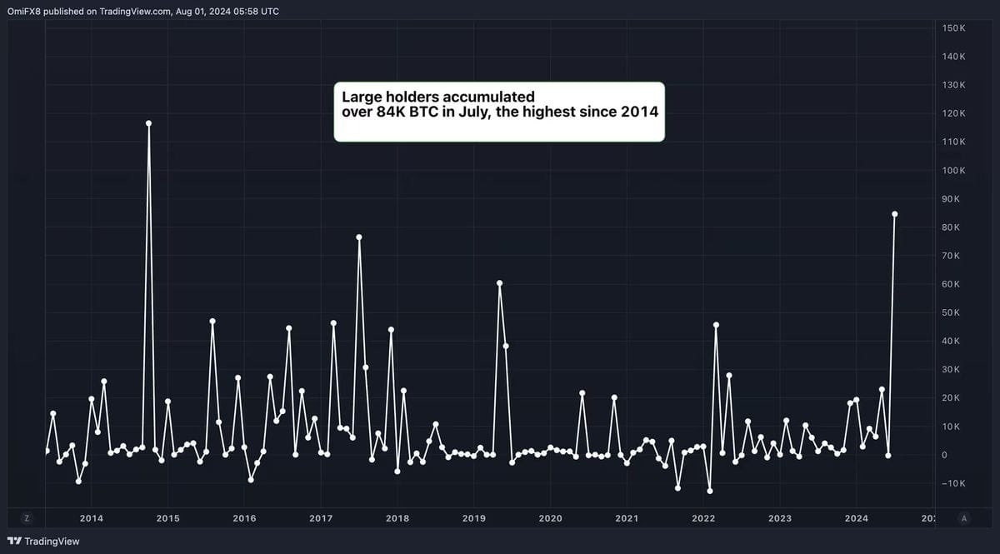
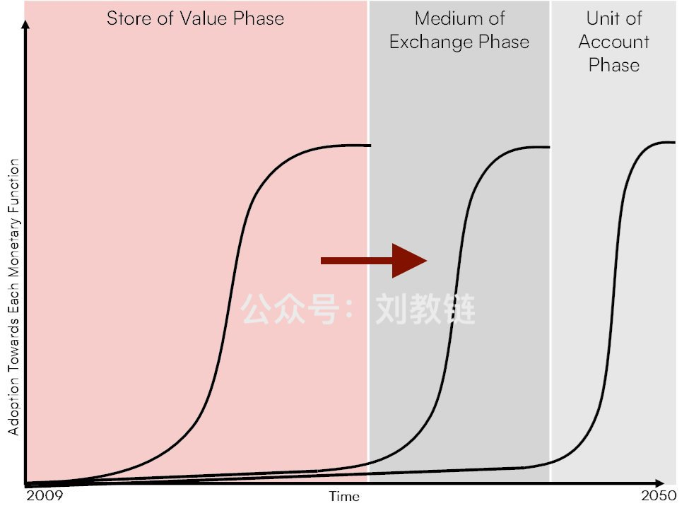
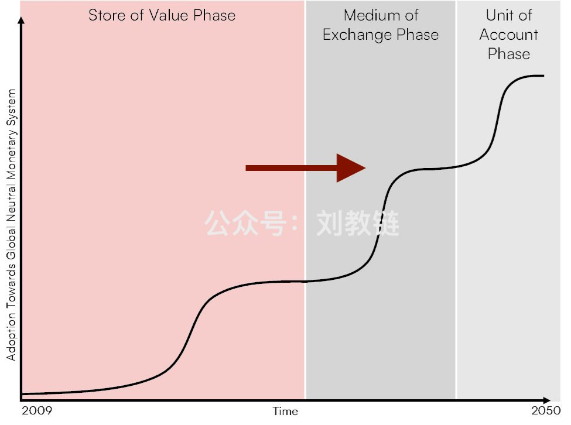

# 散户失语，巨鲸加仓，比特相变

隔夜BTC终于还是击穿63k测试了一把MA30才奋力反弹，拉回64k。刚刚过去的7月份走了一个余弦曲线，在62k开局后，先是纵身俯冲53k，然后鹰击长空，拉出一道漂亮的弧线，两番回踩拉升，直逼70k，高收66k之后，至8月首日一个俯冲，日内跌超5%，直取MA30贴地飞行，而后又是一个暴拉，脱离62k“地面”，……

这一番过山车似的行情，真真地要把坐在过山车上的散户们的小心脏要给顶到了嗓子眼儿。到后来，想喊都喊不出声了，只能心神俱悚地双手紧紧握住摇摇晃晃的抓手，看着车上不断有安全带没系牢的家伙被不断甩向空中，撞到轨道上、立柱上、树木和石头上，摔个脑浆迸裂、血肉模糊、一命呜呼。

胆子小的人，紧闭双眼，只听得周围呼啸而过的风声，以及不断传来的惨叫和呻吟声，心脏跳得都要蹦出嗓子眼了。

老韭菜却趁着这打折的良机，抓紧加仓。毕竟，7万刀以下加仓的日子，是过去一天少一天了。

据说，刚刚过去的2024年7月份，巨鲸地址累计加仓了8.4万枚BTC，是2014年以来最多的一个月。

7月打折的机会，是由这么几个利空因素综合创造的：

一、矿工清算；
二、德国政府清仓；
三、Mt.Gox赔付。

昨天[“8.1教链内参：Mt.Gox赔付进度或已完成70%”]以及前几日的内参说了，链上迹象表明矿工清算已经告一段落，BTC又成功完成了一次对核心力量的自我淘汰、自我革命，以更健康、更有力的状态迎接新的征程；德国政府已经清仓完毕，抛压已被完全消化；Mt.Gox赔付进度已经完成70%，接下来的抛压会越来越小了。

当利空出尽后，前路便只剩利好。

这一轮熊市之末、牛市之初，在6-7万刀这个区间，把Mt.Gox这个BTC前15年发展史上最大的“灰犀牛”定时炸弹给彻底拆除，对BTC下一个15年畅通无阻地发展，绝对是大大的利好。

要知道，BTC的价格每提高10倍，这颗定时炸弹的爆炸威力就要增大10倍。能在6万刀拆掉，就决不要留到60万刀的时候去拆。

向前看，以下多方面利好将推动BTC开启下一个15年的新征程：

一、美联储即将开启新一轮的货币宽松周期；
二、加密ETF被更加广泛地接受，规模继续扩大，获得更多机构和年轻投资者的青睐；
三、BTC无可避免地进入世界主要大国的政治议程；
四、随着2025年BIS允许全球各央行将加密资产计入资产负债表，G20国家开始竞相接纳BTC作为国家战略储备；
五、BTC将尝试完成一次“相变”(phase change)，从SoV(价值存储)到MoE(交换媒介)的纵身一跃。

这两年，教链不断地看到有些所谓的KOL大谈特谈什么所谓的BTC“红利消失论” —— 大概的意思就是说，BTC已经发展了15年了，到头了，从一文不值已经涨到7万刀这么贵了，也上市世界最顶级的美股市场ETF了，往后就不可能再有更大的发展空间了，云云。

其实让教链给你翻译翻译，这话里话外、明里暗里的意思呢，就是劝你这个晕乎乎的小白、傻乎乎的韭菜，别买BTC了，想发财怎么办，当然是买给你讲述这番高谈阔论的KOL所倾心推荐的某某XXX山寨币咯。

你信了，你就上当了。你买了，你就被割了。你信得越深，上当越深。你买得越多，损失就越惨重。

当然，你损失越惨重，这位推荐你买XXX山寨币的KOL呢，也就赚得越多咯。毕竟，零和游戏的公式在数学上并没有什么稀奇的：

镰刀的总收入 = 所有傻瓜的总亏损

教链必须坚定地讲，所谓BTC的“红利消失论”必然是昏话或者谎话。说这种话的人，要么是个笨蛋，那是傻，要么是个骗子，那是坏。也就是，要么智商很低，以至于无法理解BTC的相变，要么智商很高，但是要干坏事，想收割你兜里的钱。无论是蠢，还是坏，唯一正确的做法，就是不听不信、尽快远离这种人。

教链认为，因为BTC会不断地相变，所以BTC的发展红利，会在其成长期的130多年（2009-2140）里，一波接一波，一浪接一浪，一波更比一波顶，一浪更比一浪高，绵延不绝，无穷匮也。

认为BTC发展到电子黄金、价值存储就是终点，甚至认为美股ETF就是BTC事业的终点，以被传统金融接纳为最高荣耀，停止继续革命、继续奋斗，这是用静态的、机械的眼光看问题，而不是用动态的、发展的眼光看问题。由此得出的结论，也一定是脱离历史发展的客观规律，脱离事实真相的。

前些年，尤其是在2018年以前，曾有另外一种声音，认为BTC不应该先进入SoV的发展阶段，而是主张直接实现中本聪白皮书第一章节第一段落第一句所说的支付货币的愿景，让BTC直接进入支付工具的发展阶段，全然不顾合规上的法律冲突、逻辑上若无接纳何来支付的悖论，并和如今传统互联网小额支付进行正面竞争，这显然又是犯了机会主义、冒险主义的严重错误。

所以我们也看到了，对待历史上从未有过的、快速发展的新生事物，科学地探究其内在规律和发展方向，对其有正确的认知和准确的把握，是一件并不容易的事情。在这个认知和实践的过程中，往往会有一些人，会犯右倾保守主义的错误，也总会有另外一些人，会犯左倾机会主义的错误。

加密投资的成功，是建立在加密事业成功的基础上的，而断然不会有BTC的事业失败了，个人投资者的投资却取得成功的道理。因此，要想取得个人投资的成功，非得和各种错误的思想做坚决的斗争，认真地进行研究和批判，认清加密事业走向成功的康庄大道到底应该走哪条路，并坚定不移地、持之以恒地走正确的道路。
