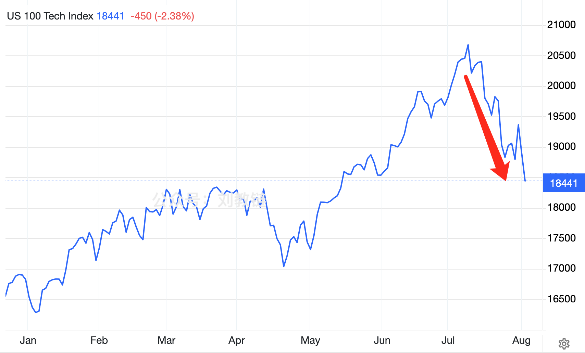

# 美股以死相逼

昨晚美国非农就业数据出来之后，全球金融市场大地震。非农就业岗位增长11.4万，弱于预期17.5万不说，关键是失业率飙升至4.3%，大幅超出预期，并触发了所谓的“萨姆法则”（Sahm rule），发出了美国经济陷入衰退的最强信号。

萨姆法则是一个经验规律：当连续3个月的失业率平均值超出上一年失业率低点0.5%时，美国经济就必然陷入衰退。这一指标有多灵呢？几乎就是十验十准，从未失手。下图呈现了萨姆法则指标自1949年以来的数据（蓝色曲线）和美国经济衰退（灰色竖纹）的对应关系。

从美股和全球市场的反应来看，人们对经济衰退的恐惧还是压倒了对美联储即将降息的欢喜。周五，美股收盘全线暴跌，标普500跌1.8%，纳指大跌2.4%，道琼斯下挫近610点。

鲍威尔虽然在7月底的议息会议上举起了白旗，但是他并没有做出立即降息的决定，而是把降息预期推迟到了9月。这一点，教链在2024.8.1文章《美联储举起白旗》中已经谈过。

仅仅过了2天时间，风云突变。意外的就业数据完美的契合了鲍威尔的“预告”。奈何美股如何全线暴跌，以死相逼，也无法时光倒流，让鲍威尔把7月底的议息会议再重开一遍，宣布8月份就立即开始降息，刻不容缓。

被网友戏称为“低血糖大战高血压”的中美金融博弈，也终于熬鹰熬到鹰崩溃，15年寒窗苦心孤诣，即将见到黎明曙光。离岸人民币对美元骤然升值，usd/cnh突破7.2关口。隐约间，冲锋号已经吹响。嘹亮的号声撕开了浓浓的黑夜。东方泛起鱼肚白。

去年教链就此终局之战写了三部曲，分别是2023.8.21《人造繁荣：财富大转移》，2023.9.19《隔山打牛：金融大崩溃》，以及2023.9.22《华山论剑：最后的决战》。

其中第一篇《人造繁荣》，指出美国因直升机撒钱而获得的虚假经济繁荣，将在2023年底、2024年初遭遇超额储蓄耗尽。经济衰退，已成定局。第二篇《隔山打牛》，谈的则是中国采取不配合美国加息的逆周期调节，主动刺破资产泡沫，并坚决捍卫汇率稳定，这就必然会对全球资本回流美国釜底抽薪，并成为推动美国走向崩溃的助力。第三篇《华山论剑》，侧重讲了美元加息周期是如何与美债超发相互配合，腾笼换鸟，稀释和收割全世界人民手中的财富。中国则抓住美元收缩的机会，把手里赚的美元借给濒临崩溃的国家还债，约定他们以后用人民币偿还，从而打断了按常规来讲各国在美元加息周期应该杠杆爆仓、崩溃破产的经典剧本的演出，换成了世界人民笑嘻嘻坐等美国高息自爆的新剧本。

我们要的也不是美国真的崩溃，而是演一出崩溃的戏。崩溃的戏一演，美股以死相逼，美国经济要衰退，要“硬着陆”，摔个粉身碎骨，美联储一害怕，就收了高息神通，赶紧降息下雨了。

戏幕开，戏幕落，谁是客？

昨天下午教链在[“8.2教链内参：比特独涨”]中解释过，为什么美联储转入降息，美元重新宽松，美股反而要崩一崩呢？内参里讲了两个原因，即预期回调和因果倒置。8.1文章《美联储举起白旗》里讲的“美联储投降，宽松周期开始，美元必定外流”则是第三个原因。

见微知著。其实从过去一段时间国内中文社区的很多大V整天念叨美股只涨不跌，评论区齐刷刷地都在刷“定投纳指”的现象上，就能预感到美股即将局部见顶了。毕竟，体量如此巨大的泡沫，靠这些刷评论区的小韭菜去接盘填线，是根本不够填的。这和卖菜的大爷大妈都开始冲进大A时，就是大A见顶的指标是一个道理。

记住，接盘的数学原理是，只有体量更大的资金和玩家进场接盘，市场才能继续上涨，如果一个市场沦落到小虾米去给大机构接盘，那么接下来就只能是惨不忍睹的下跌和收割。

BTC为什么能穿越周期一直涨？就是因为炒家给早期老炮接盘，企业又给炒家接盘，ETF又给企业接盘，后面还会有主权国家给所有人接盘……

不要再傻呵呵地相信什么“美联储一降息，美股就崩”的昏话了。这纯粹就是倒因为果、颠倒黑白。明明是美股以死相逼，美联储慌不择路，只好抓紧降息，放水救市。

欲火焚身的美股，和遮遮掩掩的美联储，就像朋友以上、恋人未满的少男少女，羞答答地相互试探，谁都不敢走出那一步。还是美股先出手，捅破了窗户纸。一旦捅破，美联储也就不用藏着掖着了。青春洁白的两具肉体，也就顺势滚在了一起。
