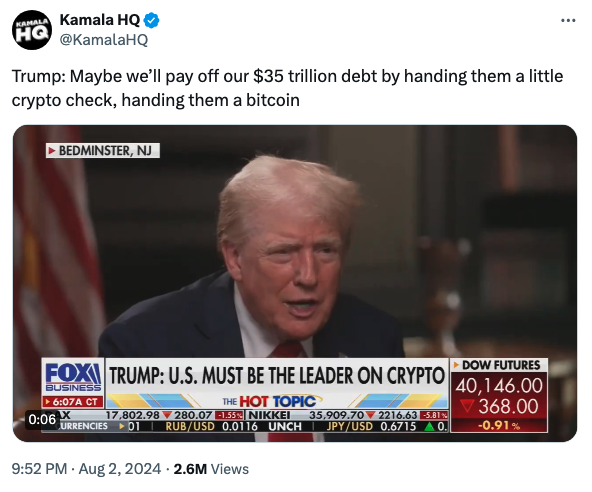

# 特朗普给出比特币迄今最牛预期：1.67亿美元

自从周五美国失业率数据触发萨姆法则，引发衰退担忧，一切皆跌，BTC也趁势回撤至6万刀一线防守。教链对这个降息前后微妙时刻的宏观态势和资金逻辑，用较长的篇幅进行了一些剖析，发表在今天上午[“8.4教链内参：一切皆跌，钱去哪儿了？底部在哪里？”]中，欢迎移步阅读。

日前，特朗普接受Fox Business采访的一段视频片段被发到网上。在采访中，他对采访记者说到，将来我们也许可以开一张小小的比特币支票，把美国如今35万亿美元的债务给偿还掉！

不得不说，特朗普真是敢想敢说啊！有网友帮他做了一道小学算术：以美国目前持有的约21万枚BTC来偿还35万亿美元的国债，意味着每枚BTC的价格将达到1.67亿美元！

1.67亿美元，这是今天现价6万刀的2700多倍，近3000倍！

不过，话说回来，过去15年BTC涨了上万倍（仅从2011年6刀到2024年6万刀就有1万倍），未来15年再涨它个3000倍，不过分吧？同样时间，涨幅只有过去同样时间的30%，很合理吧？哈哈哈～

教链刚一写下“哈哈哈”几个字，就想起了哈里斯。哈里斯，就是接替拜登迎战特朗普的那位女副总统。她因在公开场合那些突然的暴笑，而被网友津津乐道。

说起暴笑，让教链想起曾经的一位同事，一个可爱的欧洲老头。在静谧的童话北欧，二层办公小楼里，他在一楼办公室发出的爽朗大笑，便是在二楼的远处，闻之亦声如洪钟。

好玩的是，定睛看一下是谁把特朗普的这段采访片段发上网的？账号名叫做Kamala HQ。嘿，真是无巧不成书。这正是Kamala Harris（哈里斯）竞选团队的官方账号（之一）。账号置顶赫然写着自我介绍：This is the official rapid response page of Vice President Harris’ presidential campaign.（这是哈里斯副总统竞选活动的官方快速响应页面。）点开一看，十有八九都是关于特朗普的小视频。不消说，都是团队剪辑出来的，他们觉得可以给特朗普减分的所谓“黑材料”。

这么看来，哈里斯竞选团队这是把特朗普大谈用BTC偿还美债给当作证明特朗普“不靠谱”的材料了。

在对待新事物上，本应属于保守派右翼的特朗普大开脑洞，以一己之力把BTC直接送上G20国家战略储备的舞台，而本应属于进步派左翼的哈里斯，却对BTC这个看起来有些“危险性”和“颠覆性”的新玩意儿极尽嘲讽和不屑。BTC真的成了试金石，试出了两党的成色。而两党，也真的越来越活成了自己最讨厌的对手的模样。

可是纵观人类短短几千年的文明发展史，哪一次，真正大幅改善人类生产力水平，推动人类文明跨越式进步的新东西，在一开始的时候不是被各种不理解、看不起的呢？

当汽车刚刚诞生的时候，人们嘲笑这玩意儿跑得比马车慢多了。

当移动电话诞生的时候，人们嘲笑说谁脑子进水才会拎着这么大一个机器到处走来走去，只为了和远处的人说上两句话？

当互联网刚出现的时候，我们还能看到90年代比尔盖茨接受采访的那段视频。当比尔盖茨尝试解释互联网能看新闻、听音乐、聊天的时候，主持人大惑不解，说我们早就已经有收音机、电视机、唱片机和电话了呀？

现在，当人类历史上首个真正去中心化的电子货币——比特币(BTC)出现的时候，人们又再次重复着一成不变的认知模式——看不见、看不懂、看不起。

BTC既是电子化的黄金，又是消除了美联储的美元。

如果说，黄金像粒子，美元像波，那么，BTC就是光，因为它既是粒子又是波，具有波粒二象性。

人类追求的货币，本来就应该像光一样，具有波粒二象性：当作为价值存储（SoV）的时候，它体现出“粒子性” —— 价值衡量尺度，此时它叫做money（货币，金钱）；当作为交换媒介（MoE）的时候，它体现出“波动性” —— 流动性，此时它叫做currency（货币，流行）。

光既是粒子又是波，既不是粒子也不是波。BTC既像黄金也像美元，既不像黄金也不像美元。

光是人类所在宇宙的时空基准。所以，光速c在任何参照系下都是恒定不变的。这听起来有些违反普通人的直觉：你在时速300公里（约83米/秒）的高铁上以5米/秒的初速度向前抛出一个小球，小球相对地球的速度就是83 + 5 = 88米/秒。但是，如果你把小球换成光子，举起手机打开闪光灯向前发射光子，光子相对地球的速度还是那个光速c，而不会叠加高铁的速度。就算高铁跑到了光速的一半0.5c，你手机闪光灯发出的光向前的速度，无论在高铁上的你看来，还是地球上的旁观者看来，都是同样的光速c，而不是1 + 0.5 = 1.5c。

如果光速不变，那么变的是什么呢？爱因斯坦认为，随着高铁速度加快，是长度变短了、时间变慢了，是时空变化了，而不是光速变化了。这就是狭义相对论。

也就是说，对于光的速度，恒有 1 c = 1 c。

BTC是人类所在文明社会的价值基准。所以，BTC作为价值单位在任何法币参照系下都是恒定不变的。发生变化的，是法币，是参照系，而不是BTC。这个理论，还没有人仔细研究，形成体系。但是教链认为，因BTC和加密时代的出现，未来的新货币经济学，将会把这一理论作为堪比狭义相对论之于物理学一样伟大的基石理论。

其中最重要的一条就是，对于BTC的价值，恒有 1 BTC = 1 BTC。

BTC，价值之光。
