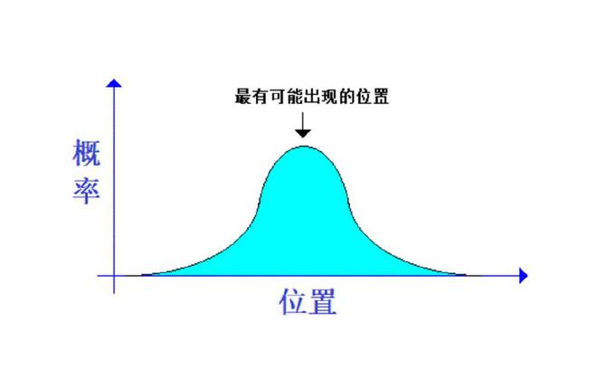
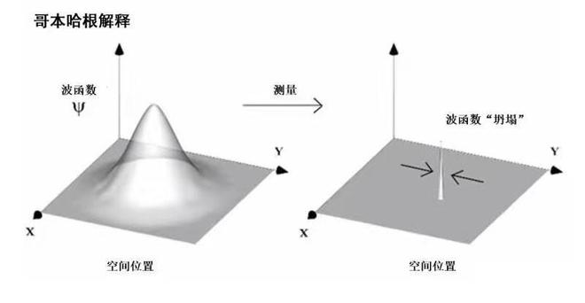
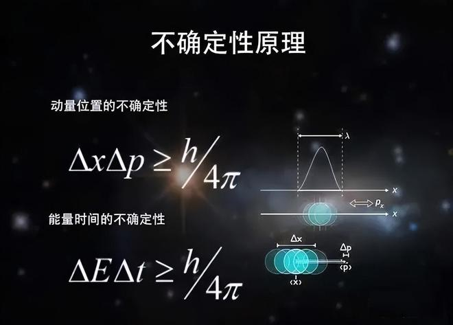
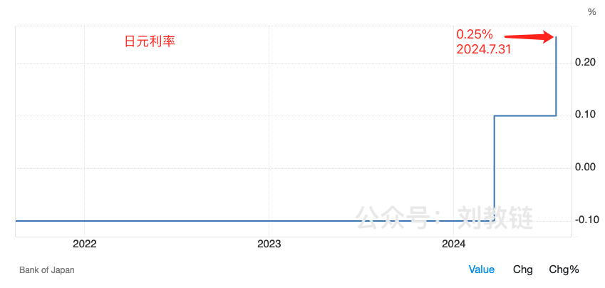
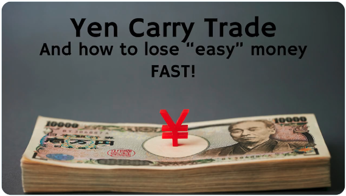
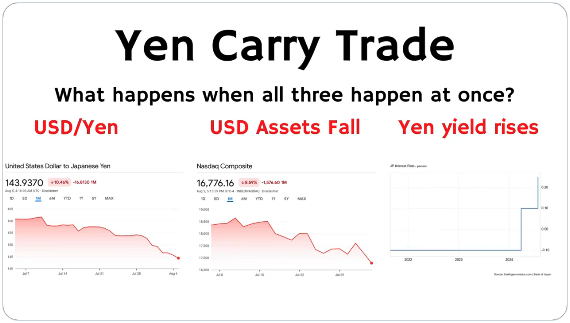
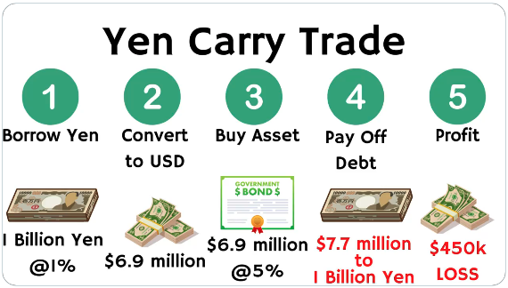

# 日元偷袭珍珠港 —— 十年之约＃29（ROI 32%）

隔夜BTC反弹回升至55k一线。教链晚间在内参中进行了复盘，[“8.5教链内参：全球暴跌之下，教链评估BTC的几个关键点位”]，对BTC价格概率分布的10000 - 15000 - 31000 - 43000 - 51000等位置进行了定性的剖析和测试。具体请移步内参正文阅读。

和量子力学理论图景下的微观粒子类似，BTC的价格是一个不确定性的存在。而“测量”——即成交，也就是观察者和粒子发生了相互作用，交换了信息——就会导致不确定性的“波函数坍缩”，从而表现出一个瞬时的测量值——即spot price（现价）。

爱因斯坦至死都不承认上帝是掷骰子来决定宇宙万物的物理学的。如果爱因斯坦炒股的话，不知道他会不会领悟到，上帝虽然不掷骰子，但是它却在和人们做交易呀！

教链因此而领悟到，在金融交易市场中，也许同样存在类似于量子力学“测不准原理”一样的原理，并在2021.3.20文章《交易市场中的测不准原理》中对这一感悟进行了概述。

在和上帝做交易的过程中，人类的能力极限被测不准原理牢牢压制。我们不可能同时把握波动中的价格和趋势，也不可能同时把握量能和时间，这不是你有没有天赋或者努不努力进步的问题，这是底层的世界本质决定了其不可能性。

领悟到这些，我们就会放弃对精准抄底或者逃顶的幻想，放弃借助合约和杠杆放大收益的错误追求。也就会理解，为什么巴菲特会给出忠告，不要使用杠杆。

8月5号的全球暴跌，根源不就是夺命margin call（杠杆接近爆仓前，系统要求追加保证金的夺命呼叫）么？

虽然异动发生在上周五8月2号晚20:30美国非农数据出炉，失业率飙升，触发经济衰退信号，但是，人们还是把目光上溯到了7月31号12:00日银决定上调日元利率，从0.1%上调至0.25%。

背后原因，还是因为日元长期以来，充当着美联储的流动性后门的作用。关于这一点，教链在2024.3.20文章《日本结束负利率，美联储是否会跪倒在渡边太太的石榴裙下？》中，就介绍过利用日元carry trade套利的逻辑，并明确写道：「当日元加息时，就会“牵一发而动全身”。对杠杆支点成本的微小扰动，可能会导致杠杆末梢资产价格的剧烈波动。」

以及，「当杠杆成本升高，催着渡边太太们抛售美元资产，美元换回日元偿还债务时，就会造成美元资产的价格大幅波动，以及日元对美元的相对升值。」

而在教链最近几个月的内参中，也曾多次提及日元加息的信息。比如，2024.4.9的[“4.9教链内参：山雨欲来风满楼”]就提到，「（美元）对日元汇率有可能突破可能促使日本当局进行干预的水平。」又比如，2024.7.15[“7.15教链内参：BTC加速上攻，特朗普仍将出席”]中提到，「美元走强，但交易员仍对日元可能再次干预保持警惕。」

结果，7月31号，就在美联储结束议息会议之前，日银先发制人，宣布日元加息。几天后，一切都应验了。日元对美元大幅升值，美股全线暴跌，引发全球金融海啸。

有分析师认为，这次日银突然加息，颇有点儿金融珍珠港事件的味道。据说珍珠港袭击发生前，美国总统得到了情报，但是他选择了无动于衷。这次日银加息，你敢说美联储提前一点儿消息都不知道？日银可是美联储钦定的小弟之一，两者之间的货币互换频率快到每天都在进行，想必政策沟通也十分密切。更何况，从时间差上看，日银加息在前，美联储主席鲍威尔和正在开会的一帮子美联储理事，完全有几个小时的时间来作出反应。但是很遗憾，他们和当年的罗斯福总统一样，选择了无动于衷。

这就十分耐人寻味。

而且，一直到8月5号黑色星期一大崩盘，鲍威尔也没有召开紧急临时会议来商议突然降息、挽救局面的意思。网上传言的美联储将召开紧急会议的消息，大抵都是假消息。在美联储官网上，并没有看到类似的消息放出。

这就和2020年疫情致美股接连熔断，吓得鲍威尔连续召开两次紧急会议进行降息救市，一次在2020.3.3，另一次则在2020.3.15，把利率从1.75%直线降至0.25%（零利率），非常不同。这一次。美股鬼哭狼嚎。韭菜叽哇乱叫。鲍威尔淡定的一批。美联储淡定的一批。

由此我们也见识到了，所谓的“priced in”（充分定价）就是扯淡。吆喝了大半年的消息，真发生的时候，一样还是能干得市场鸡飞狗跳。

也许就从来不存在所谓的priced in。即便是已经发生的，板上钉钉的事，也有人知道的早，有人知道的晚，有人知道了这样理解，有人知道了那样理解，对有的人来说是意外，对有的人来说是剧本。

就说巴菲特砍掉一半苹果仓位这事，让大家觉得他这是要先跑为敬。但实际上，人家老爷子二季度就跑了。对，正是中文财经大V们大肆忽悠大A韭菜弃“粪坑”、冲纳指的那几个月。老爷子和这帮子远渡重洋去接盘美股的韭菜们擦肩而过，互道平安。

就这提前量，你说老爷子没有从他的社会关系网络中提前嗅到点儿什么味道，我是不信的。其实韭菜的悲哀之处就在于，他们真的信了那些赚钱自大、亏钱恨国、不学无术、整天忽悠的大V，不知道卖国求财这条路的下场，其实会和卖国求荣一样凄凉。在社会主义股市当韭菜，到了资本主义股市就能当镰刀了？可拉几把倒吧。在真正的资本主义联合收割机面前，韭菜只会被安排的更加明明白白。

要跑赢巴菲特，那就不能和他玩同一个游戏。选择更透明的，更公平的游戏。比如BTC。选择升维，去和巴菲特的老板一起玩游戏。比如，去和贝莱德一起玩BTC。

在现在市场刚刚跌成这个惨样子的情况下，教链的总仓位，算上微亏的ETH和腰斩的UNI，长期CAGR还有21%，算是和巴菲特老爷子长期CAGR 20%打个平手 —— 当然，时间上还需要更久的考验，毕竟6年CAGR和30年CAGR，那也不是一个概念。

而“十年之约”见证计划仓位，今天迎来的第29次记录、第20次加仓。本次加仓价55892刀（似乎是又加高了，呵呵）。

投后持仓成本上升到43053刀，收益率回撤到32%。

十年之约的长期收益率，10年之后自然也要拿出来和巴菲特的长期CAGR 20%掰一掰手腕。

教链把“十年之约”系列整理成了一个合集，以方便感兴趣的读者朋友随时翻阅、回顾和复盘。欢迎关注【刘教链的星球】服务号，点击底部菜单“十年之约”打开合集页。

关注【刘教链的星球】服务号，不迷路▼

[“刘教链的星球”服务号卡片]

