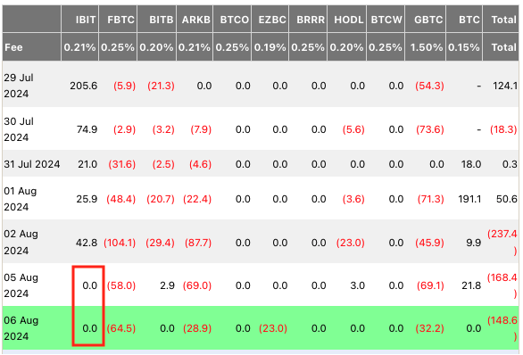
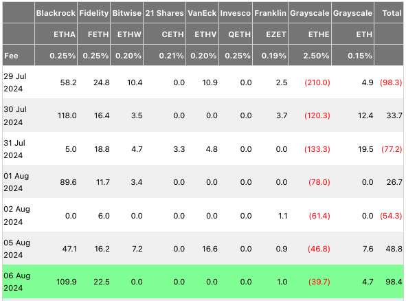
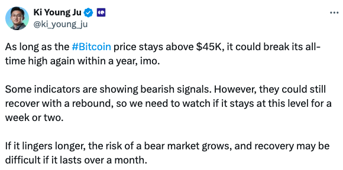
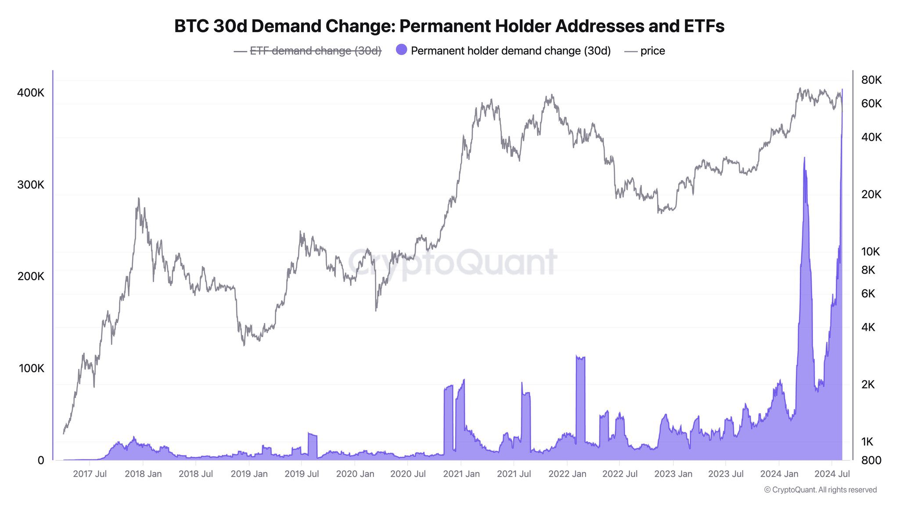
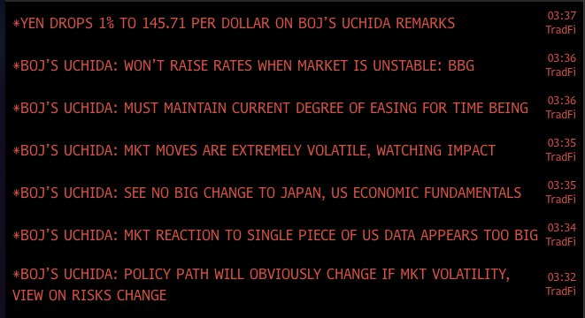

# 大跌见真金，BTC还能再创新高吗？

学生时代一穷二白时候的初恋，是最真挚的感情。官居低位或者前途灰暗时一起奋斗的同僚，是最纯粹的志同道合。创业初期或者千金散尽时能够追随的部下，是最可靠的忠诚。同理，市场暴跌时还能够长期持有的仓位，是最值得拥有的仓位；还愿意坚定持有的资产，是最有价值的资产。此所谓，患难见真情，大跌见真金。

千淘万漉虽辛苦，吹尽狂沙始到金。一路高歌的上涨，会吸引“始知天门向北开”的投资者，更会招致“贪心不足蛇吞象”的投机者、“心比天高命如纸”的赌徒，甚至还会夹杂着“浑水摸鱼好发财”的骗子。只有一次次狂风骤雨似的暴跌，爆掉赌徒的杠杆，洗掉投机者的仓位，给市场降温让骗子原形毕露，只留下最坚定、最长期的投资者。

显然，总是在恐慌、悲观、迷茫之中，才能让我们认清，形形色色人等的真面目。[“8.6教链内参：如何看BTC是检验认知水平的试金石”]，诚哉斯言。

近期加密市场和BTC的插针洗盘就是这样一次大跌见真金(BTC)的过程。在这次大洗牌中，BTC从7/29最高摸到7万刀，最低8/5插针破49k，跌幅刚刚好-30%过一点儿。拉到年内最高也是历史新高3/14的73.8k，跌幅也不过扩大到-33.7%而已。

这肯定是比不过2021年“519” -55%的回撤幅度（从4/14的64.8k到5/19的29k），更不及2020年“312” -62%的回撤幅度（从2/13的10k到3/13的3.8k）。

也许是ETF立功了？令人啧啧称奇的是，贝莱德的现货BTC ETF在此等暴跌之下，稳如泰山，连续两日愣是没有净流出。

且让我们再看一下别的资产吧。

先看一下山寨之王ETH。虽然ETH的ETF也通过了，但是刚刚通过，buff效果怎么样呢？我们来看一下这次大跌中，ETH的表现：从7/22的3563到8.5的2085，跌幅是-41.5%。拉到年内最高（但不是历史新高）3/12的4093，跌幅扩大到-49%。

那么2021年“519”呢，ETH回撤幅度接近 -60%（从5/12的4372到5/19的1764）；2020年“312”，则接近 -70%（从2/19的286到3/13的87）。

看这两天大跌中，ETH ETF的表现。妥妥的净流入！ETF buff还真是赞啊？

好，那么让我们再找一个没有ETF buff但是又经历过“312”或者“519”的资产来对照一下。

比如doge。从7/22的0.144跌到8/5的0.08，接近 -45%。拉到年内最高3/29的0.229，跌幅扩大到 -65%。作为对比，2021年“519” -72%（从5/8的0.74到5/19的0.21），2020年“312”接近-70%（从2/9的0.00364到3/13的0.0011)。

再看一个，uni。从6/17的12跌到8/5的4.7，超 -60% 的跌幅(-60.8%)。拉到年内最高3/6的17，跌幅扩大到超 -70% (-72.4%)。作为对比，2021年“519” -64%（从5/3的45到5/19的16）。当然，5/19并非低点，直到5/23-24的13，才是低点，不过跌幅并没有扩大太多，也就是扩大到超 -70% (-71.1%)而已。

所以，通过对实盘数据的回顾和复盘，我们可以很直观地得到两个结论：

一、8/5这波洗牌，洗得还是比较干净、彻底的，至少对于山寨是这样。

二、现货ETF的存在确实起到了buff或者说安全垫的缓冲作用，对于这等烈度的冲击，大概可以吸收化解掉20-30%左右的跌幅。

也就是说，如果没有ETF，达到“519”或“312”的烈度，BTC大致应该跌到3万刀左右。看到这个点位，读过[“8.5教链内参：全球暴跌之下，教链评估BTC的几个关键点位”]的朋友应该就能回想起，内参里教链说过的，3万刀这个点位，恰好就是幂律的当前robust支撑位。至于ETH，则可以大致推算到1000-1500刀上下的位置。

另外，至于说经过这样一次暴跌洗牌之后，是就此开启一路向上的行情，还是会有二次甚至三次回测的风险，其宏观因素是不确定的。历史上，2020年“312”就是前一种情况（到了2020年9月份之后，BTC就再也没有回到过4位数，即再也没有跌破过1万刀），而2021年“519”则是后一种情况。如果说，今年2024年在BTC周期上的时空位置，更接近2020年的话，那么从概率上讲，押韵“312”的可能性或许会更大一些。

或许，从现在开始的不久之后，从某个月份开始，BTC将再也不会回到如今的5位数，即再也不会跌破10万刀。（从幂律上说，应该是7万刀。只不过擅长十进制的人类对于整十、整百总是独具钟情，故而以10万刀代之。）

正如CryptoQuant的创始人说的，如果BTC能够保持住45k的话，那么它可能在一年之内就有望突破新高。

患难见真情。链上检测显示，过去30天，“永久持有者”地址持仓量又增加了40.4万枚BTC，其中包括美现货ETF增持的4万枚BTC。

然后就是，美联储无动于衷淡定的一批，被市场“针对”的日本央行抓紧开会并出来讲话了。日银副行长表示：如市场不稳将不会加息；必须将当前的宽松政策维持一段时间；目前市场很不稳定，密切关注；没有看到日美经济基本面有任何大的改变；市场对美国单项数据（指失业率）的反应过大了；……

嗯，教链觉得，这话说的，挺有美联储嘴替的味道。小弟果然就是小弟。想趁大哥不备搞偷袭，那可能得先问问驻日美军答应不答应，哈～

