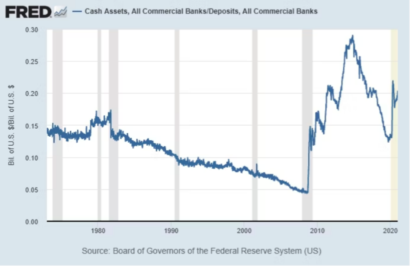
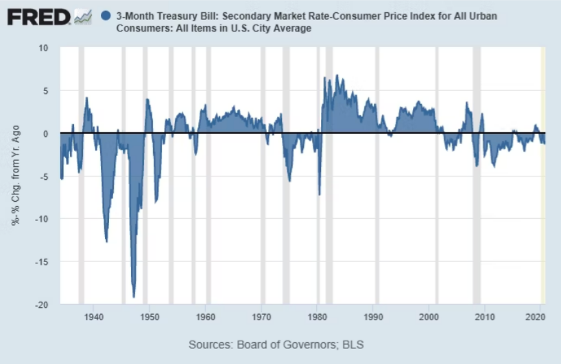

# 为什么比特币不是庞氏骗局？

早间BTC修复至57-58k区间。有朋友转我一篇大谈比特币（BTC）是庞氏骗局的帖子，问我的看法。其实早在2021.6.8教链就写过一篇文章《比特币是庞氏骗局吗？》虽然今年已经是2024年，BTC的ETF已经登陆了美股市场和咱们的港股市场，但依然架不住还是有些后知后觉、认知水平不足的人，头头是道地大谈比特币是庞氏骗局的谬论。故此，教链把美国投资人Lyn Alden在2021.1.11写的长文《为什么比特币不是庞氏骗局：逐条分析》编译如下，与教链上面2021.6.8文章互为一个补充，希望能够有助于给各位初次接触这个行业的读者朋友们解惑。

* * *

文 | Lyn Alden. Why Bitcoin is Not a Ponzi Scheme: Point by Point. 2021.1.11

我所看到的针对比特币的担忧之一是，它是一个庞氏骗局（Ponzi scheme）。这种说法认为，由于比特币网络持续依赖于新的购买者，最终，随着新购买者的耗尽，比特币的价格将会崩溃。

因此，本文通过对比比特币和具有类似庞氏骗局特征的系统，来认真审视这种担忧，看看这种说法是否站得住脚。

简而言之，无论从狭义还是广义上讲，比特币都不符合庞氏骗局的定义。

## 庞氏骗局的定义

要开始讨论比特币是庞氏骗局这个话题，我们需要一个定义。

以下是美国证券交易委员会（SEC）对庞氏骗局的定义[1]：

「庞氏骗局是一种用新投资者的资金来支付现有投资者的投资诈骗。庞氏骗局的组织者通常承诺将你的钱投入其中，在几乎没有风险的情况下获得高额回报。但在许多庞氏骗局中，骗子并不把钱投资出去。相反，他们用这些钱来支付早先投资的人，并可能为自己保留一部分。

由于几乎没有合法收入，庞氏骗局需要源源不断的新资金才能生存。当很难招募到新的投资者，或者当大量现有投资者套现时，这些骗局就会崩溃。

庞氏骗局是以查尔斯·庞兹（Charles Ponzi）的名字命名的，他在 20 世纪 20 年代通过邮票投机计划欺骗了投资者。」

他们进一步列出了需要注意的“红灯”：

「许多庞氏骗局都有共同的特征。请留意这些警示信号：

**高回报，低风险或无风险。** 每种投资都有一定程度的风险，而收益较高的投资通常风险更大。对任何“有保证”的投资机会都要高度怀疑。

**过于稳定的回报。** 投资往往会随着时间的推移而涨跌。对于无论整体市场状况如何都能定期产生正回报的投资，要持怀疑态度。

**未注册的投资。** 庞氏骗局通常涉及未在美国证券交易委员会或州监管机构注册的投资。注册非常重要，因为它可以让投资者了解公司的管理、产品、服务和财务信息。

**无牌照卖家。** 联邦和各州的证券法要求投资专业人士和公司获得许可或注册。大多数庞氏骗局都涉及无照个人或未注册公司。

**隐秘、复杂的策略。** 如果你不了解投资或无法获得完整的投资信息，请避免投资。

**书面工作问题。** 账户对账单错误可能是资金未按承诺进行投资的迹象。

**取款困难。** 如果你没有收到付款或取现困难，就要怀疑了。庞氏骗局的发起人有时会试图通过“提供更高的回报让参与者留在原地”来阻止参与者套现。」

我认为这是一组很好的信息。我们可以看看比特币有多少属性（如果有的话）。

---
[1] https://www.investor.gov/protect-your-investments/fraud/types-fraud/ponzi-scheme

## 比特币的推出过程

在逐点比较比特币与上述列表之前，我们可以先回顾一下比特币是如何推出的。

2008 年 8 月，一个自称中本聪的人创建了 Bitcoin.org。

两个月后，即 2008 年 10 月，中本聪发布了比特币白皮书。这份文件解释了比特币技术的工作原理，包括解决双重花费问题的方法。从链接中可以看到，白皮书是以学术研究论文的格式和风格撰写的，因为它提出了一个重大的技术突破，为众所周知的与数字稀缺性相关的计算机科学难题提供了一个解决方案。文中没有任何关于致富或回报的承诺。

三个月后，也就是 2009 年 1 月，中本聪发布了最初的比特币软件。在区块链的自定义创世区块中，他提供了一个带有时间戳的伦敦时报（即，泰晤士报）关于银行救助的文章标题，这可能是为了证明没有预先挖矿，并为项目定下基调。

从那时起，他花了六天时间完成工作，挖出了包含首批 50 个可花费比特币的 1 号区块，并于 1 月 9 日当天发布了比特币源代码。1 月 10 日，哈尔·芬尼（Hal Finney）在推特上公开表示，他也在运行比特币软件，从一开始，中本聪就通过向哈尔发送比特币来测试系统。

有趣的是，由于中本聪在自己推出开源比特币软件的两个多月前就通过白皮书展示了如何做到这一点，从技术上讲，有人可能会利用新发现的知识在他之前推出一个版本。

这似乎不太可能，因为中本聪是先行者，他对这一切都有深刻的理解和认识，但这在技术上是可能的。在推出项目的第一个版本之前，他泄露了关键的技术突破。在白皮书发表和软件发布之间，他回答了各种问题。他向电子邮件名单上的其他几位密码学家解释了自己对白皮书的选择，并对他们的批评做出了回应，几乎就像学术论文答辩一样。如果他们不那么怀疑，其中几位技术人员可能会从他那里“偷走”这个项目。

推出之后，一套被普遍认为属于中本聪的设备在第一年一直是比特币的大型矿机。挖矿是为网络持续验证交易的必要条件，而比特币当时并没有美元报价。随着时间的推移，他逐渐减少了挖矿量，因为挖矿在整个网络中变得更加分散。据信，近 100 万枚比特币属于中本聪，这些比特币是他在比特币早期挖出来的，他从未从初始地址中移动过这些比特币。他本可以在任何时候套现，赚取数十亿美元的利润，但在比特币项目诞生十多年后的今天，他还没有这么做。我们不知道他是否还活着，但除了一些用于测试交易的早期硬币外，他的大部分硬币都没有移动过。

不久之后，他将自己网站域名的所有权转让给了其他人，从那时起，比特币就在一个循环发展的社区中自我维持，中本聪没有任何投入。

比特币是开源的，分布在世界各地。区块链是公开、透明、可验证、可审计和可分析的。企业可以对整个区块链进行分析，查看哪些比特币在不同地址移动或停留。一个开源的完整节点可以在一台基本的家用电脑上运行。它可以审计比特币的全部货币供应和其他指标。

有了这些，我们就可以将比特币与庞氏骗局的危险信号进行比较。

## 投资回报： 没有承诺

中本聪从未承诺过任何投资回报，更不用说高投资回报或稳定的投资回报了。事实上，众所周知，比特币在诞生后的前十年是一种波动性极高的投机行为。在最初的一年半里，比特币没有任何报价，而在那之后，它的价格波动非常大。

中本聪的线上帖子仍然存在，他几乎从未谈及经济收益。他主要写的是技术方面、自由、现代银行系统的问题等等。中本聪的写作大多像一个程序员，偶尔像一个经济学家，而从来不像一个推销员。

我们必须深入搜索，才能找到他讨论比特币潜在价值的例子。当他谈到比特币的潜在价值或价格时，他非常实事求是地谈论了如何对比特币进行分类，是通货膨胀还是通货紧缩，并承认这个项目的结果有很大的变数。

为了寻找中本聪关于比特币价值的言论，我找到了以下内容：

「生产新币意味着货币供应量按计划增加，但这并不一定会导致通货膨胀。如果货币供应量的增加速度与使用人数的增加速度相同，价格就会保持稳定。如果货币供应量的增加速度赶不上需求量的增加速度，就会出现通货紧缩，早期的货币持有者就会看到货币价值的增加。」

---

「买一些以防万一是有道理的。如果有足够多的人有同样的想法，那就会成为一个自我实现的预言。如果你能像在自动售货机上投币一样毫不费力地向网站支付几美分，那么它的应用就会非常广泛。」

---

「从这个意义上说，它更像一种贵金属。不是供应量变化来保持价值不变，而是供应量预先确定，价值随之变化。随着用户数量的增加，每枚硬币的价值也会增加。它有可能形成正反馈循环；随着用户的增加，价值也会上升，这可能会吸引更多的用户来利用不断增加的价值。」

---

「也许它可以像你建议的那样，通过人们预见到它在交换中的潜在作用，循环获得初始价值。(我肯定会想要一些）也许收藏者，任何偶然的原因都可能引发它。我认为，传统的货币定义是基于这样的假设：世界上有如此之多的稀缺物品相互竞争，具有内在价值的物品一定会胜过那些没有内在价值的物品。但是，如果世界上没有任何有内在价值的东西可以作为货币，只有稀缺但没有内在价值的东西，我想人们还是会接受某个东西的。(我在这里用稀缺这个词，只是指潜在的供应量有限）」

---

「对于预期会增值的东西，理性的市场价格已经反映了未来预期增值的现值。在你的头脑中，你会做一个概率估算，权衡它持续增长的几率。」

---

「我确信，20 年后，要么会有非常大的交易量，要么就没有交易量。」

---

「比特币没有股息或未来可能的股息，因此不像股票。更像是收藏品或商品。」

—— 中本聪语录

承诺异常高或持续的投资回报是庞氏骗局的常见危险信号，而中本聪最初的比特币却没有这样的承诺。

随着时间的推移，比特币投资者经常预测价格会非常高（到目前为止，这些预测都是正确的）。尽管如此，该项目本身从一开始就不具备这些属性。

## 开放源代码： 保密的对立面

大多数庞氏骗局都依赖于保密性。如果投资者知道他们所拥有的投资实际上是庞氏骗局，他们就会试图立即撤资。在秘密被发现之前，市场无法对投资进行适当定价。

例如，麦道夫骗局（Bernie Madoff’s scheme）中的投资者以为他们拥有各种资产。实际上，早期投资者流出的资金只是从新投资者流入的资金中偿还，而不是从实际投资中赚钱。他们的对账单上列出的投资都是假的，而对于这些客户中的任何一个来说，要核实这些投资是假的几乎是不可能的。

而比特币的工作原理恰恰相反。比特币是一种分布式开源软件，需要多数人达成共识才能更改，每一行代码都是众所周知的，任何中央机构都无法更改。比特币的一个关键原则是验证而不是信任。运行一个完整节点的软件可以在普通个人电脑上免费下载和运行，并且可以审计整个区块链和整个货币供应。它不依赖任何网站、关键数据中心或公司架构。

因此，不存在“书面工作问题”或“取款困难”，这些都与美国证券交易委员会庞氏骗局的危险信号有关。比特币的全部意义在于不依赖任何第三方；它是不可改变的，可自我验证的。比特币只能通过与特定地址关联的私钥来转移，如果你使用私钥转移比特币，没有人可以阻止你这样做。

当然，周围的生态系统中也有一些坏人。依赖他人保管私钥（而不是自己保管）的人有时会因为保管不当而丢失比特币，但这并不是因为核心比特币软件出现故障。第三方交易所可能存在欺诈行为，也可能遭到黑客攻击。网络钓鱼计划或其他欺诈行为可能会诱骗人们泄露私钥或账户信息。但这些与比特币本身无关，当人们使用比特币时，他们必须确保自己了解系统的工作原理，以免陷入生态系统中的骗局。

## 没有预先挖矿

如前所述，中本聪在软件公开时几乎开采了他的所有代币，其他任何人都可以开采它们。他没有给自己任何独特的优势来比其他人更快或更有效地获取代币，而是必须花费计算能力和电力来获取代币，这在早期对于保持网络正常运行至关重要。如前所述，白皮书是在发布之前发布的，如果目标主要是个人金钱收益，这将是不寻常或有风险的。

与比特币这种不同寻常的公开和公平的推出方式形成鲜明对比的是，许多后来的加密货币并没有遵循同样的原则。具体来说，许多后来的代币都有一堆预先挖矿的概念，这意味着开发人员会在项目公开之前向自己和他们的投资者给予代币。

以太坊的开发者在向公众开放之前，向自己和投资者提供了 7200 万个代币，这超过了以太坊当前代币供应量的一半。这是一个众包项目。

Ripple Labs 预挖了 1000 亿个 XRP 代币，其中大部分由 Ripple Labs 拥有，并逐渐开始向公众出售剩余的代币，同时仍持有大部分代币，目前被美国证券交易委员会指控出售未注册证券。

除了这两个代币外，还有无数其他较小的代币被预挖并向公众出售。

在某些情况下，可以提出有利于预挖的理由，尽管有些人对这种做法非常批评。就像初创公司向其创始人和早期投资者提供股权一样，新协议可以向其创始人和早期投资者提供代币，众包融资是一种广为接受的做法。我将把这个争论留给其他人。很少有人会质疑，如果早期开发人员的项目取得成功，他们可以得到报酬，资金对早期开发很有帮助。只要完全透明，就取决于市场认为合理的价格。

然而，在反驳庞氏骗局的观点时，比特币远远领先于大多数其他数字资产。中本聪提前几个月用白皮书向世界展示了如何做到这一点，然后在可花费代币生成的第一天以开源方式将项目发布，没有预挖。

创始人几乎没有给自己比其他早期采用者更多的挖矿优势，这无疑是“最干净”的方法。中本聪必须像其他人一样用他的电脑挖出第一批币，然后除了将他的一些初始批次发送出去进行早期测试外，不会花掉它们。这种方法提高了成为基于经济或哲学原理而非严格以财富为基础的病毒式传播的可能性。

与多年来许多其他区块链不同，比特币的发展是自发的，由一组轮流的大型利益相关者和自愿的用户捐赠推动，而不是通过预先开采或预先资助的资金池。

另一方面，将大部分初始代币交给自己和初始投资者，然后让后来的投资者从头开始开采或购买，这会为批评和怀疑开辟更多的渠道，并开始看起来更像庞氏骗局，无论它是否真的如此。

## 无领导增长

比特币真正有趣的一点是，它是在没有集中领导的情况下蓬勃发展的大型数字资产。中本聪作为匿名发明者创造了比特币，与其他人合作，在公开论坛上持续开发，度过了最初的两年，然后就消失了。从那时起，其他开发人员接过了继续开发和推广比特币的重任。

一些开发人员非常重要，但他们中没有一个对比特币的持续开发或运营不可或缺。事实上，即使是中本聪之后的第二轮开发人员也大多转向了其他方向。哈尔·芬尼于 2014 年去世。其他一些超早期的比特币用户对比特币现金或其他处于不同阶段的项目更感兴趣。

随着比特币的不断发展，它开始拥有自己的生命。分布式开发社区和用户群（以及市场，当谈到硬分叉后各种路径的定价时）决定了比特币是什么以及它有什么用处。随着时间的推移，叙事已经改变和扩展，市场力量在各个方向上得到奖励或惩罚。

多年来，争论的焦点是比特币是否应该针对基础层的价值存储或频繁交易进行优化，这导致了多次硬分叉，与比特币相比，这些硬分叉都贬值了。市场显然更倾向于比特币的基础层，以优化其价值存储和广泛的交易结算网络，优化其安全性和去中心化，并允许在第二层处理频繁的小额交易。

所有其他基于区块链的代币，包括硬分叉和与全新区块链设计相关的代币，都紧随比特币的脚步，而比特币是该行业最自主的项目。大多数代币项目仍由创始人主导，通常有一个大型预挖矿，如果创始人不再参与，未来前景不明朗。一些最不靠谱的代币已经付费在交易所上市，试图启动网络效应。相比之下，比特币一直拥有最自然的增长曲线。

## 未注册的投资和无牌照卖家

危险信号清单中唯一可能适用于比特币的项目是涉及不受监管的投资。这并不意味着某物就是庞氏骗局；它只是意味着存在危险信号，投资者应该谨慎行事。特别是在比特币的早期，购买一些神奇的互联网货币对大多数人来说都是一项高风险的投资。

比特币的设计是无需许可的，在既定的金融体系之外运作，哲学上倾向于自由主义的加密文化和健全的货币。在它的大部分生命中，它的学习曲线比传统投资更陡峭，因为它依赖于软件、经济和文化的交汇。

一些美国证券交易委员会官员表示，比特币和以太坊不是证券（从逻辑上讲，它们没有犯下证券欺诈罪）。然而，许多其他加密货币或数字资产被归类为证券，一些加密货币或数字资产，如 Ripple Labs，被指控出售未注册证券。美国国税局将比特币和许多其他数字资产视为商品以进行征税。

因此，在早期，比特币可能确实是一种未注册的投资，但目前，它在世界各地的税法和监管框架中占有一席之地。监管会随着时间的推移而变化，但这种资产已成为主流。它是如此主流，以至于富达（Fidelity）和其他托管人为机构客户持有它，摩根大通（J.P. Morgan）也为其设定了价格目标。

许多没有深入研究过该行业的人将所有“加密货币”归为一类。然而，对于潜在投资者来说，研究细节并找到重要差异是很重要的。

将“加密货币”归为一类就像将“股票”归为一类。比特币在许多属性上显然与其他货币不同，它的推出和维持方式看起来更像是一场运动或一种协议，而不是一项投资，但随着时间的推移，它也成为一项投资。

从那里，人们可以研究比特币之后出现的数千种其他代币，并得出自己的结论。从善意的项目，到彻头彻尾的骗局，范围很广。然而，重要的是要意识到，即使某个地方正在发生真正的创新，也并不意味着与该项目相关的代币必然具有持久的价值。如果一个代币解决了一些新问题，它的解决方案最终可能会被重新调整为更大协议的某一层，具有更大的网络效应。同样，对其他代币的任何投资都有机会成本，即能够购买更多的比特币。

## 本章总结：显然不是庞氏骗局

比特币以最公平的方式推出。

中本聪首先在学术意义上用白皮书向其他人展示了如何做到这一点，然后在几个月后自己做到了，任何人都可以在最初几天内开始与他一起挖矿，就像一些早期采用者所做的那样。中本聪随后将软件的开发分发给其他人，然后消失了，而不是继续以魅力领袖的身份推广它，到目前为止从未套现。

从一开始，比特币就是一个开源和完全透明的项目，拥有业内最有机的增长轨迹。根据既有信息，市场已经对其公开定价。

## 庞氏骗局的广义定义

因为狭义的庞氏骗局显然不适用于比特币，所以有些人使用了更宽泛的庞氏骗局定义来断言比特币就是庞氏骗局。

比特币就像一种商品，是一种稀缺的数字“物品”，不提供现金流，但具有实用性。它们被限制为 2100 万个可分割单位，其中超过 1850 万个已经按照预先设定的时间表被开采。每四年，每十分钟区块产生的新比特币数量将减半，而现存的比特币总数将逐渐接近 2100 万个。

像任何商品一样，它不会产生现金流或股息，其价值只取决于别人愿意付钱给你或与你交易。具体来说，它是一种货币商品，其实用性完全在于存储和传输价值。这使得黄金成为最接近的可比物。

## 比特币与黄金市场

有些人断言比特币是庞氏骗局，因为它依赖于越来越多的投资者进入该领域，从早期投资者那里购买。

在某种程度上，这种对新投资者的依赖是正确的；比特币的网络效应不断增强，接触到更多的人和更大的资金池，从而不断提高其实用性和价值。

只有当比特币的市值达到并维持在非常高的水平时，它才能在长期内取得成功，部分原因是它的安全性（哈希率）与其价格息息相关。如果出于某种原因，对比特币的需求在没有达到足够高的水平的情况下永久持平并下降，比特币仍将是一种小众资产。随着时间的推移，其价值、安全性和网络效应可能会恶化。这可能会引发一个恶性循环，吸引更少的开发人员继续构建其第二层和周围的软硬件生态系统，可能导致质量停滞、价格停滞和安全停滞。

然而，这并不意味着它就是庞氏骗局，因为按照类似的逻辑，黄金就是一个有 5000 年历史的庞氏骗局。黄金的绝大部分用途不是用于工业，而是用于储存和展示财富。它不会产生现金流，只是值别人所付的钱。如果人们的珠宝品味发生变化，如果人们不再将黄金视为最佳的价值储存手段，其网络效应可能会减弱。

据估计，全球各地的黄金年产量足以满足 60 多年的各种需求。如果排除珠宝和保值需求，这相当于 500 年的工业供应量。因此，黄金的供需平衡需要人们持续将黄金视为一种有吸引力的财富储存和展示方式，这在某种程度上是主观的。基于工业需求，黄金供应过剩，价格会低得多。

然而，黄金的货币网络效应之所以能保持如此长时间的强劲，是因为它拥有一系列独特的属性，这使得它一直被认为是长期财富保值和跨代珠宝的最佳选择：它稀缺、漂亮、可塑、可替代、可分割，而且几乎在化学上坚不可摧。随着全球法定货币的来来去去，每单位货币数量迅速增加，黄金的供应量仍然相对稀缺，每年仅增长约 1.5%。

据行业估计，全球人均地上黄金储备约为一盎司。

同样，比特币也依赖网络效应，这意味着需要有足够多的人将其视为良好资产才能保值。但网络效应本身并不是庞氏骗局。潜在投资者可以分析比特币网络效应的指标，并自行确定购买比特币的风险/回报。

## 比特币与法定银行系统

根据庞氏骗局的最广泛定义，整个全球银行系统都是庞氏骗局。

首先，法定货币在某种意义上是一种人造商品。美元本身只是一种纸质物品，或表示在数字银行账本上。欧元、日元和其他货币也是如此。它本身不产生现金流，尽管为你持有它的机构可能愿意向你支付收益（或者在某些情况下可能向你收取负收益）。当我们工作或出售某物来获取美元时，我们这样做只是因为相信其广泛的网络效应（包括法律/政府网络效应）将确保我们可以拿着这些纸片，把它们交给别人换取有价值的东西。

其次，当我们在部分准备金银行系统中组织这些纸片及其数字表示时，我们又增加了一层复杂的层次。如果大约 20% 的人同时试图将他们的钱从银行中取出，银行系统就会崩溃。或者，更现实的情况是，银行会拒绝你的提款，因为他们没有现金。这种情况在 2020 年初疫情封锁期间发生在一些美国银行，并且在全球范围内经常发生。这是美国证券交易委员会对庞氏骗局的警告之一：难以收到付款。

在著名的抢椅子游戏中，有一组椅子，有人播放音乐，孩子们（其中孩子比椅子的数量多一个）开始围着椅子转圈走。当音乐停止时，孩子们争先恐后地坐在其中一把椅子上。一个反应迟钝或运气不好的孩子没有座位，因此不得不离开游戏。

在下一轮中，一把椅子被移走，音乐为剩下的孩子继续播放。最终经过多轮，有两个孩子和一个座位，然后在该轮结束时产生获胜者。

银行系统是一场永恒的抢椅子游戏。孩子比椅子多，所以他们不可能都得到一把。如果音乐停止，这一点就会变得清晰。然而，只要音乐继续播放（偶尔通过印钞进行救助），它就会继续前进。

银行收集存款人的现金，并使用其资本发放贷款和购买证券。只有一小部分存款人的现金可供提取。银行的资产包括欠他们的贷款、国债等证券和现金储备。他们的负债包括欠存款人的钱，以及他们可能有的任何其他负债，如发给债权人的债券。

对于美国来说，银行总共持有约 20% 的客户存款作为现金储备：

如图所示，在全球金融危机爆发之前，这一比例曾低于 5%（这也是此次危机如此严重并标志着长期债务周期的转折点的原因），但随着量化宽松、新法规和更多自我监管的实施，银行现在拥有约 20% 的存款余额作为储备。

同样，由美国财政部独家印制的流通实物现金总量仅为商业银行存款总额的 13% 左右，而银行实际上持有的只有其中一小部分作为金库现金。实物现金（按设计）远远不足以让相当一部分人一次性将资金从银行提取出来。

如果有足够多的人在同一时间这样做，人们就会遇到“取款困难”的情况。

按照目前的构建方式，银行系统永远不会终结。如果有足够多的银行破产，整个系统将停止运转。

如果一家银行在没有被收购的情况下破产清算，理论上来说，它必须将其所有贷款和证券出售给其他银行，将其全部兑换成现金，然后将这些现金支付给储户。但是，如果有足够多的银行同时这样做，它们出售的资产的市场价值将急剧下降。市场将变得缺乏流动性，因为没有足够的买家。

实际上，如果有足够多的银行同时破产清算，并且由于债务/贷款卖家压倒了买家，市场冻结，美联储最终将创造新的美元来购买资产以重新流动性市场，这将大幅增加流通中的美元数量。否则，一切都会名义上崩溃，因为系统中没有足够的货币单位来支持银行系统资产的清算。

因此，货币体系就像政府发行的人造商品上不断上演的抢椅子游戏，如果所有人都同时争抢这些钱，那么对钱的索取权（孩子）远远多于他们目前可用的钱（椅子）。孩子和椅子的数量都在不断增加，但孩子的数量总是比椅子多得多。每当系统部分崩溃时，就会有几把椅子加入到这一轮中以保持系统运行。

我们认为这是正常的，因为我们认为它永远不会结束。部分准备金银行制度已在全球运行了数百年（首先是黄金支持，然后是完全基于法定货币），尽管在此过程中偶尔会出现通货膨胀事件来部分重置。

在过去的几十年里，每个法定货币单位的价值都贬值了约 99% 或更多。这意味着投资者要么需要赚取超过实际通胀率的利率（目前还没有发生），要么他们需要购买投资，这会导致股票和房地产的价值相对于他们的现金流膨胀，并推高艺术品等稀缺物品的价格。

在过去的一个世纪里，国债和银行现金只是跟上了通货膨胀的步伐，没有提供任何实际回报。然而，这往往非常不稳定。在 20 世纪 40 年代、70 年代和 2010 年代等几十年里，国债和银行现金的持有者一直未能跟上通货膨胀的步伐。这张图表显示了九十年来的国债利率减去官方通胀率：

比特币是一种新兴的通货紧缩储蓄和支付技术，主要以无杠杆方式使用，这意味着大多数人只是购买、持有，偶尔交易。有些比特币银行和一些人在交易所使用杠杆。尽管如此，该系统的整体债务相对于市场价值仍然较低，你可以自行保管自己的资产。

## 摩擦成本

庞氏骗局的另一种说法是，由于比特币有摩擦成本，所以它就是庞氏骗局。该系统需要持续工作才能保持运转。

但是，比特币在这方面与任何其他商业系统都一样。健康的交易网络本身就有摩擦成本。

对于比特币，矿工投资定制硬件、电力和人员来支持比特币挖矿，这意味着验证交易并赚取比特币和交易费。

矿工承担着大量风险，也收获颇丰，他们是系统运转的必要条件。还有做市商在买家和卖家之间提供流动性或将法定货币兑换成比特币，使买卖比特币变得更容易，他们也必然会收取交易费。

一些机构提供托管解决方案：收取少量费用来持有比特币。

同样，金矿矿工投入大量资金投入人员、勘探、设备和能源来从地下开采黄金。然后，各公司将其净化并铸造成金条和硬币，为投资者保护和存储，运送给买家，验证其纯度，将其制成珠宝，将其熔化以进行净化和重新铸造等。

由于黄金行业人士的努力，黄金原子以各种形式不断流通，从最好的瑞士铸币商到高档珠宝商，再到金银交易商和“我们买黄金！”当铺。黄金的能量工作偏向于创造而不是维护，但该行业也有这些持续的摩擦成本。

同样，全球法定货币体系也有摩擦成本。银行和金融科技公司每年从与支付相关的交易费用中收取超过 1000 亿美元，充当客户资产的托管人和管理者，并作为买卖双方之间的做市商提供流动性。

例如，我最近分析了新加坡最大的银行星展集团控股。他们每季度产生约 9 亿新元的费用，每年超过 30 亿新元。以美元计算，每年的费用超过 25 亿美元。

这是一家市值为 500 亿美元的银行。新加坡还有另外两家规模相当的银行。美国最大的银行摩根大通的规模是其 7 倍多，美国有几家银行的规模与摩根大通差不多。仅 Visa 和万事达卡的年收入就约为 400 亿美元。全球银行和金融科技公司每年产生的费用总额超过 1000 亿美元。

验证交易和存储价值需要工作，因此任何货币体系都有摩擦成本。只有当交易费占支付额的比例过高时，摩擦成本才会成为问题。与现有的货币体系相比，比特币的摩擦成本相当低，二层可以继续进一步降低费用。

例如，Strike App 旨在成为运行在比特币/闪电网络上的最便宜的全球支付网络。

这也延伸到非货币商品。除了黄金，富有的投资者还将财富存储在各种不产生现金流的物品中，包括精美艺术品、精美葡萄酒、经典汽车和他们无法出租的超高端海滨房产。例如，佛罗里达州或加利福尼亚州的某些海滩，除了价值 3000 万美元的房屋外什么都没有，而且在任何时候都空无一人。我喜欢去那些海滩，因为它们通常空无一人。

这些稀缺物品的价值往往会随着时间的推移而升值，这就是人们持有它们的原因。然而，当你购买、出售和维护它们时，它们会产生摩擦成本。只要这些摩擦成本低于一段时间内的平均升值率，与持有法定货币相比，它们就是不错的投资，而不是庞氏骗局。

## 本章总结：网络效应，而非庞氏骗局

庞氏骗局的最广泛定义是指任何必须持续运行才能保持功能或具有摩擦成本的系统。

比特币实际上并不符合庞氏骗局的这一更广泛定义，就像黄金市场、全球法定银行系统或艺术品、美酒、收藏车或海滨房产等流动性较差的市场一样。换句话说，如果你对某事物的定义太广泛，以至于包括所有非现金流价值存储，那么你需要一个更好的定义。

所有这些稀缺物品除了具有价值存储属性外，还具有一些实用性。黄金和艺术品让你享受和展示视觉之美。葡萄酒让你享受和展示味觉之美。收藏车和海滨住宅让你享受和展示图形和触觉之美。比特币使你能够进行国内和国际结算支付，而无需任何第三方阻止的直接机制，从而为用户提供无与伦比的金融流动性。

这些稀缺物品的价值会随着时间的推移而保持或增加，投资者愿意支付少量的摩擦成本作为其投资的一定比例，而不是持有价值会随着时间的推移而贬值的法定现金。

是的，比特币需要持续运营，并且必须达到相当大的市值才能使网络可持续发展，但我认为这最好被视为技术颠覆，投资者应该根据他们对其成功或失败概率的看法来定价。这是一种与现有网络效应相竞争的网络效应，尤其是在全球银行体系中。具有讽刺意味的是，全球银行体系比此列表中的其他体系表现出更多的庞氏骗局特征。

## 最后的想法

任何新技术都会经历一段评估期，要么被拒绝，要么被接受。市场一开始可能会不理性，要么上涨，要么下跌，但随着时间的推移，资产会得到评估和衡量。

比特币的价格随着每四年供应减半周期而快速上涨，因为其网络效应不断叠加，而供应量仍然有限。

每项投资都有风险，当然，比特币的最终命运还有待观察。

如果市场继续将其视为一种有用的储蓄和支付结算技术，世界上大多数人都可以使用，并由围绕不可变公共账本的去中心化共识支持，那么它可以继续作为财富存储和结算网络占据市场份额，直到达到成熟、广泛采用和波动性较低的市值。

另一方面，反对者经常断言比特币没有内在价值，总有一天每个人都会意识到它是什么，它会归零。

然而，与其使用这种论点，更复杂的熊市论点应该是，由于某种原因，比特币将无法实现从全球银行体系夺取持久市场份额的目标，并列举他们持有这种观点的原因。

2020 年是一个关于机构接受的故事，比特币似乎超越了散户投资和机构配置之间的界限。微策略（MicroStrategy） 和 Square 成为主要证券交易所首批将部分或全部储备分配给比特币而不是现金的上市公司。 MassMutual 成为第一家将部分资产投入比特币的大型保险公司。Paul Tudor Jones、Stanley Druckenmiller、Bill Miller 和其他知名投资者都对比特币持乐观态度。富达等一些机构多年来一直关注比特币的机构托管服务，但 2020 年，更多的机构也加入其中，包括全球最大的资产管理公司贝莱德，表现出浓厚的兴趣。

就实用性而言，比特币允许自我托管、资金流动和无需许可的结算。虽然还有其他有趣的区块链项目，但没有其他加密货币提供类似程度的安全性来防止对其账本的攻击（无论是在哈希率还是节点分布方面），也没有足够广泛的网络效应，而以很大概率被市场持续认可为价值存储。

重要的是，比特币的增长是该行业中最有机的，它先行并迅速传播，没有集中领导和推广，这使得它更像是一种基础协议，而不是金融证券或商业项目。

