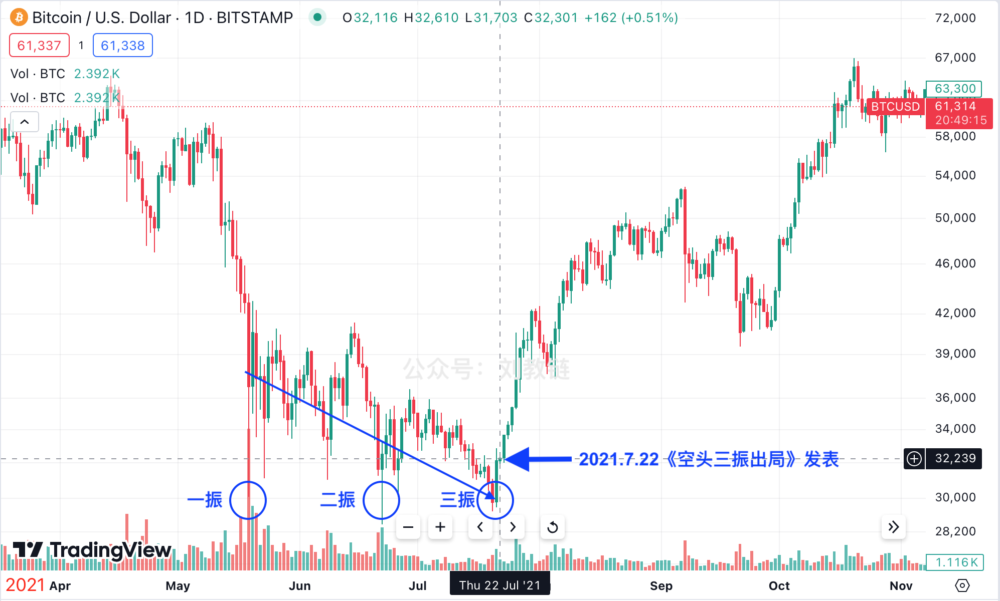
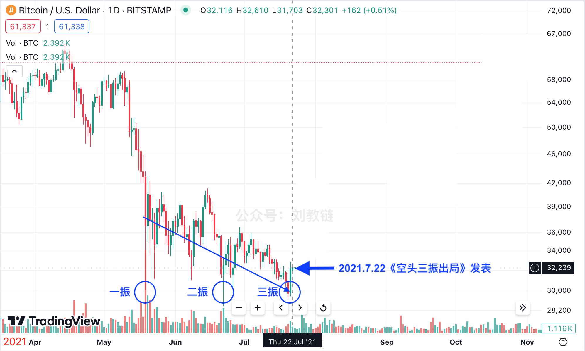
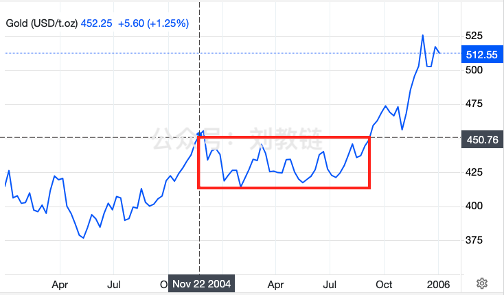
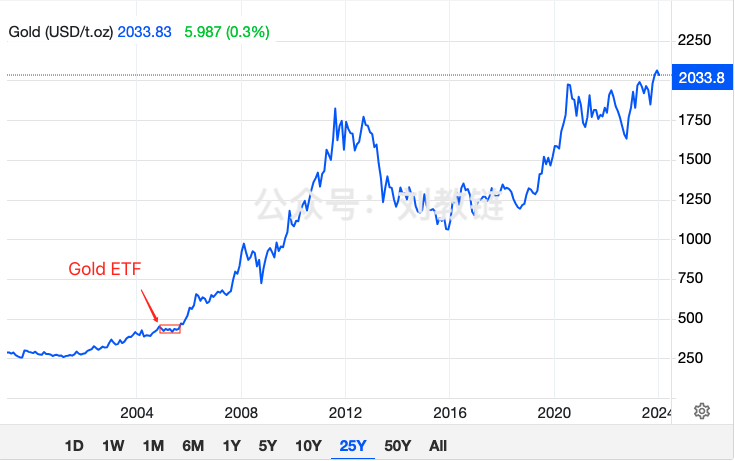

# BTC连续拉涨，击碎空头幻想

隔夜BTC继续拉涨，急破6万刀，“过了黄洋界，险处不须看”，一度逼近63k，目前暂于61-62k区间休整。从8月5日极限插针下探49k，仅仅3天多时间，就连续拉涨到了61k，总涨幅接近25%。

不知道这种3天拉涨25%的机会，一年里能有几次，一个人的整个投资生涯中又能满仓把握住几次？所以，教链在8月5号暴跌恐慌之际，于当日文章《暴跌，洗牌！》中直言不讳地写道：

> 劝人割肉，非蠢即坏。

如果一个小白，害怕之时听了割肉的鼓动，在49k清仓，那么仅仅3天后，在61k买回，就立即损失接近1/5的BTC，也就是损失了20%的仓位。5个BTC割肉，3天之后还剩4个BTC。

> 3天损失1个BTC。

而如果他不买回，那么随着BTC的继续拉涨，他的损失将越来越大。等BTC升至98k，他将损失一半的BTC。但就算BTC再次探低到49k，他可能依旧不敢买回，因为那个时候，一定会有更多的声音告诉他，BTC还将继续下跌，30k、20k、……

最后的结局，很可能是他永远失去仓位，失去BTC。

待到8月7号，教链又在《大跌见真金，BTC还能再创新高吗？》一文中，复盘2020年“312”和2021年“519”的暴跌模式，对照分析本次洗盘。文中指出：「如果说，今年2024年在BTC周期上的时空位置，更接近2020年的话，那么从概率上讲，押韵“312”的可能性或许会更大一些。」

再到昨晚[8月8号教链内参“空头是否已三振出局？”]，教链进一步对2021年“519”暴跌模式进行了细细的品味，重温了2021年7月22日所写的《空头三振出局》一文。

请注意《空头三振出局》的发表时间点。标记到K线图上来看一下：

在2021年7月22号的时候看这个图，可不是上图这样子的，而是下图这样子的：

因此，昨晚[“8.8教链内参：空头是否已三振出局？”]翻译一下就是：

> 8.5暴跌也许并非“519”，而是“722”？

这无疑是一个极为大胆的假设。

在“信仰-怀疑”阶段，多空观点的交锋必然是激烈的。

自从2024年3月13-14日BTC局部触顶73.8k之后，至今已经洗盘5个月。

如果参考当年黄金ETF上市后，局部触顶后长达10个月的洗盘期，那么目前BTC依然是“半渡”。

黄金ETF洗盘通道，在7个月前教链2024.1.9文章《比特币大伏大起》中给出了图示：

不管是三振也好，五振也罢，通过[“8.5教链内参：全球暴跌之下，教链评估BTC的几个关键点位”]中的评估测试，可以几乎肯定的是，空头对3万刀甚至2.5万刀乃至于本轮牛市已结束的幻想，是终将要随着BTC的不断续创新高而被击得粉碎的了。
