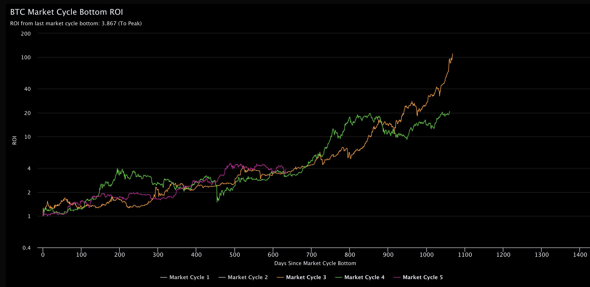

# 这一轮牛市起早了吗？

周五BTC在修复过程中遭遇了阻击，虽然日内一度逼近63k，但未能守住60k收盘。所幸今天顶住继续向上修复，再度收复60k关口，站在61k的门前。

昨[“8.9教链内参：俄罗斯加密挖矿合法化！”]提到，网友PlanB发帖说，这一轮周期的问题是，牛市启动太早了。通常情况下，BTC减半发生在积累阶段，但 2024 年的减半却发生在牛市阶段。人们一直在提前行动，但市场还没有准备好上涨。

这个网友PlanB，就是曾在2021年牛市时“三验三灵”一度封神，后又走下神坛的匿名分析师PlanB。当时他“三验三灵”时，教链曾在2021.10.15发文《年底没有下半场》，推断「当PlanB三验封神，人人迷信之时，就是他的预测失灵之日。」

当时PlanB预测2021年11月98k，12月137k。事后看来，11月69k就已经是那一轮周期牛市的局部高点了。

教链曾早在2020.12.20文章《三个预言》中推测，2021年牛市高点，保守值5-10万刀，中间值15万刀，激进值20-30万刀。实际上也仅仅是刚刚达到保守区间的中部附近而已。幂律发生了实实在在的衰退现象。

上一轮牛市还打破了一个“规律” —— 熊市不破前高。即，每一轮熊市的最低谷，不会跌破前一轮牛市的最高值。但是，2022年下半年，BTC就多次跌破2017年高点2万刀。尤其是2021年11月、12月两个月，BTC有效跌破2万刀，并几乎在18k下方、16-17k区间匍匐前进了2个月，在图形上妥妥地画出了一个“死亡之谷”。

而有些规律，以为要打破的，却完全没有打破。比如，牛市的进程，完全是时间限定的，而不是涨跌幅限定的。时间一到，牛市结束。时间一到，熊市见底。这从逻辑上其实是挺不可思议的。2021年底，BTC仅摸到了69k，而且也没有延长到2022年初，更别说一度有人提出的9月见顶。而2022年下半年的熊市，也精准地在12月底结束，2023年就开启了修复之路。简直就像时钟一样准时。

好了，那么这个牛熊时钟的节奏，这一轮会打破还是不会呢？谁都不敢说绝对会或者不会。

那么幂律衰退呢？继续衰退，还是出现相变？看似简单无比的问题，真要研究起来，恐怕是皓首穷经也难以破解其奥妙之万一。

而如果连这些基础的简单问题都不了解、不清楚，没有研究出来个一二三，就妄谈什么抄底逃顶、波段操作，可以知道是有多么不自量力，失败也就是毫不意外的结局了。

就拿周期节奏来说。什么时候是牛市，什么时候是熊市，要准确、科学地定义，都不是一个简单的问题。

教链也提到过一种牛市的定义 —— 突破前高。比如，2024年3月份，BTC突破2021年牛市高点（前高）69k，于是根据这种定义方式，BTC开启了本轮牛市。

但是，如果我们讲，2021年是一个削了顶的特殊情况，二顶叠加应该是10-15万刀，那么是不是说，BTC到70k并不是真正的牛市启动，而要到突破100k甚至150k才是真正启动呢？

所以这就取决于你心里的那条线画在哪儿。

还有人不看高度看方向。涨就是牛市，跌就是熊市。按这种定义，就更没谱了。如果涨就是牛市，那么我们可以认为，从2023年初直到2024年3月局部高点，BTC一直都是牛市。

不过，在实际交流中，很多人所说的牛熊，还真就是用的这种没谱的定义。所以，从2020年“312”触底，直到2021年11月69k高点，这是上一轮周期的牛市。从2021年11月69k高点，到2022年底16k的底部，这是上一轮周期的熊市。

当两个人为了牛熊之类的争论的面红耳赤的时候，很有可能，他们各自心中对牛熊的定义都不一样呢！可见，这些网上的争论，几乎都是纯粹的白费唇舌、浪费时间 —— 浪费本应用于赚钱的宝贵时间。

如此，很容易推测，PlanB说这一轮牛市起早了，是建立在他定义突破前高69k，即2024年3月初为本轮牛市起点的。

网友Bejanmin Cowen则换了一个视角。他没有单纯使用价格来标度，而是用ROI（投资回报率），计算BTC从上一个周期底部迄今的ROI。见下图：

可见，相比于2017年周期（橙色）和2021年周期（绿色），本轮周期（红色）迄今为止走得还是相当稳健，并没有什么出格的地方。

那么，这一轮周期的局部顶点，会是橙色的100倍（150万刀），绿色的20倍（30万刀），还是更低的10倍（15万刀）呢？
