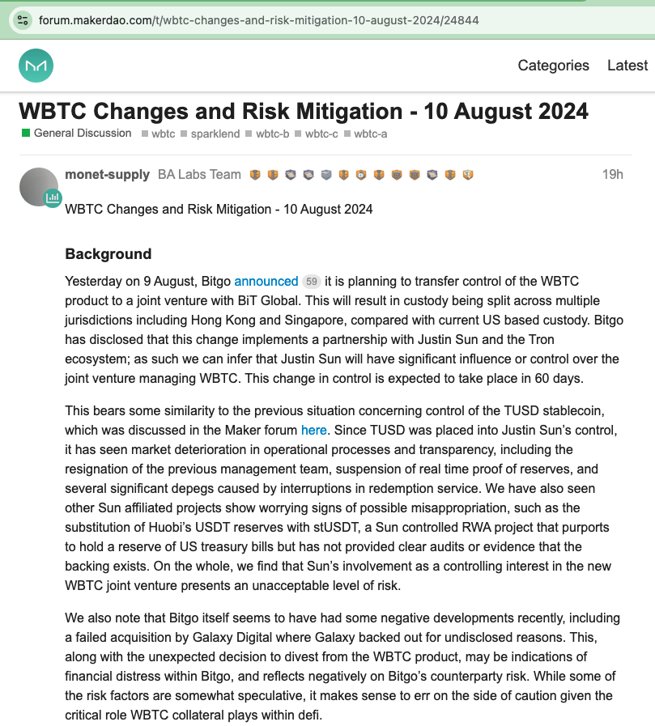

# WBTC引发巨震

隔夜的BTC继续小幅向上修复至61-62k区间。嘿，这里的黎明静悄悄。空头没了幻想，多头没了脾气。也许5年以后，行业内会流传一个笑话：我有一个朋友，他还在等2万刀的BTC。

教链在网上看到，颇有一些网友坚信BTC会跌回2万刀，甚至是1万刀。其实吧，如果能看到1万刀，就能看到1000刀；能看到1000刀，就能看到100刀、10刀、1刀…… 在看空的路上，不孤独，也没有尽头。

昨天，知名DeFi项目MakerDAO的社区发起了一个提案，提议清除Maker抵押仓中的WBTC。提案一出，引发业内巨大震动。毕竟，Maker是行业内最大的抵押借贷协议，目前还在链上管理着近50亿美刀的各类数字资产。而WBTC则是以太坊链上最大的BTC跨链资产，目前管理着超过15万枚BTC，总价值近100亿美刀。

我们还是先读一下这个提案的原文吧：

翻译一下：

「WBTC 变更和风险缓解 - 2024 年 8 月 10 日

背景

昨天 8 月 9 日，Bitgo 宣布计划将 WBTC 产品的控制权转让给与 BiT Global 的合资企业。与目前在美国托管相比，这将导致托管权分散在包括香港和新加坡在内的多个司法管辖区。Bitgo 披露，这一变化实施了与孙宇晨和Tron(波场)生态系统的合作伙伴关系；因此，我们可以推断，孙宇晨将对管理 WBTC 的合资企业产生重大影响或控制。预计此次控制权变更将在 60 天内完成。

这与之前有关 TUSD 稳定币控制权的情况有些相似，该情况在 Maker 论坛中进行了讨论。自从 TUSD 被置于孙宇晨的控制之下以来，市场运营流程和透明度不断恶化，包括前任管理团队辞职、实时储备证明暂停以及赎回服务中断导致的几次重大脱钩。我们还看到其他孙宇晨关联项目显示出可能被挪用的令人担忧的迹象，例如用 stUSDT 取代 Huobi(火币) 的 USDT 储备，stUSDT 是孙宇晨控制的 RWA 项目，声称持有美国国债储备，但未提供明确的审计或证据证明存在支持。总体而言，我们发现孙宇晨作为新 WBTC 合资企业的控股权的参与带来了不可接受的风险。

我们还注意到，Bitgo 本身最近似乎有一些负面发展，包括 Galaxy Digital 收购失败，Galaxy 因未公开的原因退出。这一点，加上意外决定撤资 WBTC 产品，可能是 Bitgo 内部财务困境的迹象，并对 Bitgo 的交易对手风险产生负面影响。虽然一些风险因素纯属推测，但考虑到 WBTC 抵押品在 DeFi 中发挥的关键作用，谨慎行事是合情合理的。

建议的措施

鉴于即将发生的控制权变更，BA Labs 认为 Maker 和 SparkLend 上的 WBTC 抵押品整合会带来较高的风险。 BA Labs 建议稳定促进者提出以下立即行动以限制 WBTC 风险的增长，这些行动将纳入 8 月 12 日星期一即将举行的下一次执行投票中：

核心保险库：
WBTC-A DC-IAM 线（最大 DC）：从 5 亿减少 5 亿到 0
WBTC-B DC-IAM 线（最大 DC）：从 2.5 亿减少 2.5 亿到 0
WBTC-C DC-IAM 线（最大 DC）：从 5 亿减少 5 亿到 0

SparkLend：
禁用 WBTC 借贷
将 WBTC LTV 从 74% 降低到 0%

如果 Bitgo 或其他负责人无法令人信服地证明维持当前的抵押品集成是安全的，我们将考虑进一步建议更改参数以保护协议并降低交易对手风险，直至并包括可能完全取消所有 Maker 和 Spark WBTC 抵押品集成。」

* * *

对加密行业的复杂关系和发展历史不太了解的朋友，可能会对这些名词和概念感到一头雾水。教链简单给读者朋友们捋一下：

首先，大家需要先搞明白一个问题：即你的BTC什么情况下才是真正属于你的BTC？

答案是，在你自己掌握且只有自己掌握的私钥所对应和控制的比特币地址里面的BTC，才是真正属于你的BTC。

打个比方，“地址”是保险柜编号，“私钥”是开保险柜的钥匙。更详细的，可以再温习一下教链2021.9.28文章《小科普：地址，私钥，助记词》。

测验题：你在某交易所账户里有3个BTC。请问你拥有几个BTC？正确答案是：0个。

WBTC的情况，比交易所账户的情况，要更加复杂一些。

WBTC也是所谓的“数字资产”，也是放在“保险柜”（地址）里的，也是用你自己手里的“钥匙”（私钥）控制的。不过和上面BTC的情况不同：

1. 装WBTC的保险柜，和装BTC的不是同一批保险柜。装BTC的保险柜，是橙色的；而装WBTC的保险柜，是蓝色的。这批蓝色保险柜，有另外一个名字叫做“以太坊”（Ethereum）。
2. WBTC的里面并没有真正的BTC。它只是一张“白条”，锁在蓝色保险柜里的白条，而已。

打个比方，若说BTC是电子黄金，那么WBTC就是电子纸黄金。

可见，即便是通过私钥和地址来亲自拥有的资产，也未必是真正的底层资产。

测验题：你在以太坊地址里有1000个USDT。请问你拥有几美元？正确答案是：0美元。

加密行业充斥着令人迷惑的概念。就比如说“跨链”这个术语。常见的叙述是这样的：你把1个BTC跨链到以太坊，于是在你的以太坊地址里有了1个WBTC。

事实的真相是：BTC从来都只能存在于比特币的橙色保险柜里。BTC绝不可能被“跨”或者“转移”到别的区块链（别的颜色的保险柜），比如以太坊里面去。

所谓“把BTC跨链到以太坊”，真实发生的故事是：

1. 你把真正被你拥有的、在你自己的橙色保险柜里的BTC取出来，交给了一个公司（比如上文提到的BitGo）所管理的另一个橙色保险柜里。这个步骤完成后，你失去了你的BTC。
2. 这个公司，也被称作托管人，会在以太坊上凭空开具出一张“白条”，即WBTC，数量大致和你在上一步骤中交给该公司的BTC数量相等（扣除了手续费），然后把“白条”WBTC放入了你在以太坊上的蓝色保险柜中。这个步骤完成后，你得到了“白条比特币”——WBTC。

可见，你手里的WBTC是否还能换回BTC，全赖托管人是不是诚信可靠。显然，持有和使用WBTC，就必须时刻面对第三方风险。这是无法避免的代价。

WBTC的设计机制是，采用（1）可靠托管人；（2）多托管人的策略来降低第三方风险。

可能有大聪明的朋友会说，通过技术手段自动化托管，完全消除托管人的参与，不就可以避免第三方风险了吗？很可惜，行业发展的曲折道路，给了人们血泪教训：所谓消除托管人参与的自动化代码，终究是逃不过黑客的魔爪。

代码漏洞，黑客盗币。第四方风险成了悬在每个人头上的达摩克利斯之剑。其风险竟要远超第三方风险。结果就是，迄今为止，WBTC仍然是把BTC跨链到以太坊上最受欢迎、容量最大（托管BTC数量最多）的跨链协议。

教链甚至不无悲观地猜测，设计实现一个全自动化的、100%可靠的去中心化跨链协议的难度，可能不亚于重新发明一个BTC。换言之，成功概率接近于0。

好了，现在大家明白这个BitGo作为WBTC背后的一个重要托管人，他的业务转让行为，对WBTC的安全——实质上是背后BTC的安全，会造成何等巨大的影响了吧？

何况，它拟转让的对象，疑似被业内名声充满争议的孙哥把持，这就更加引起了社区对于资产安全的极大忧虑。

中本聪发明BTC的初心是什么？消除对于受信任第三方的依赖。

不要相信人性。不要相信红口白牙的承诺。不要相信任何人。

唯有链上持有的真BTC，才是消除了一切受信任第三方的安全持有。

教链曾在2021年牛市期间跨链了一些WBTC放到Maker里面做抵押，不过后来在2021年底就全部平仓撤出了。目前不持有任何WBTC。

有句话叫做，君子不立危墙之下。与君共勉。
