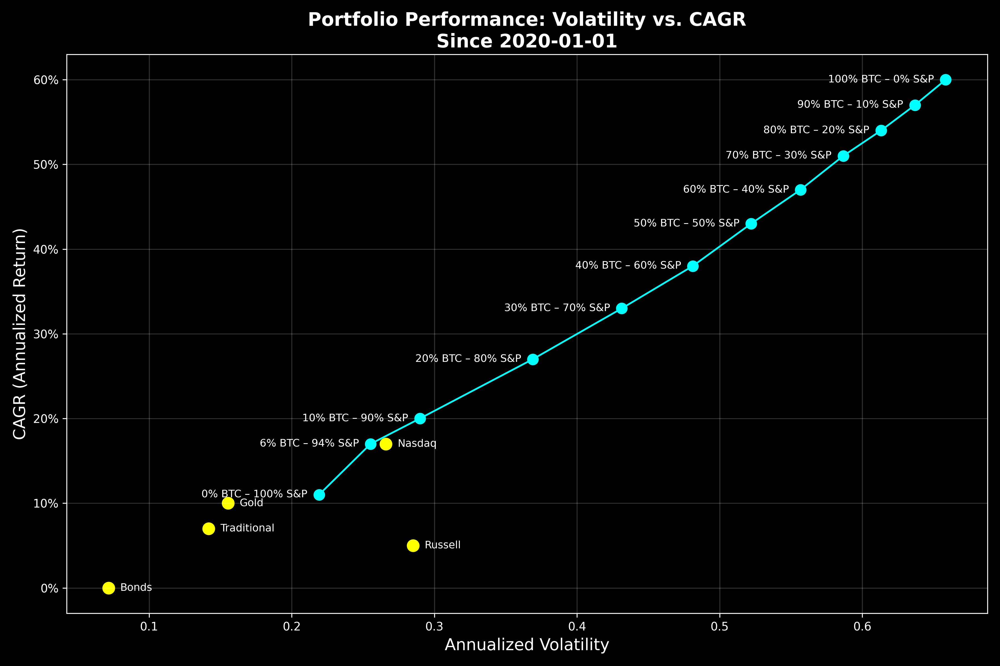

# 标普500 + 6% BTC > 纳指

昨天下午4点左右BTC冲击62k未果，而后一路下跌，至今晨失守6万刀，目前暂时降至58-59k区间暂守。教链看了一圈，除了昨天文章《WBTC引发巨震》中提到的最大跨链资产WBTC控制权被转交疑由孙宇晨控制之实体而引起业内不满和激烈反应外，并无其他负面消息。由此可见，这一波从62k到58k下跌的锅，恐怕不得不让孙哥扛起来了。

上周三立秋。这立秋一到，天气立刻就显出凉意。不仅是天气秋意渐浓，连加密公链，也是凉的不行。昨[8.11教链内参说，以太坊的gas fee（燃料费）都低至1 gwei了]，可见链上活跃度之低，生态之凉凉。不知是应该为扩容似乎不再是个问题而欣喜，还是应该为潮水退去原来大家都在裸泳而羞耻，呵呵呵～

早上和娃谈起苹果公司创始人Steve Jobs曾经引用过的格言：Stay hungry, stay foolish。我给娃解释说，stay就是保持，hungry就是饥饿，stay hungry就是保持饥饿。所谓保持饥饿，就是说人不能吃太饱。人吃太饱会怎么样？娃说，人吃太饱就会撑得慌。我说，对，吃太饱撑的就会作(zuō)，会失去进取的精神，所以任何时候都不要满、不要过。

而foolish就是愚蠢，stay foolish是什么意思？娃说，保持愚蠢？这个怎么解释呀？我说，保持愚蠢，就是告诫我们，不要当大聪明，自作聪明，往往会栽大跟头。就说在金融市场上吧，千万不要觉得自己比别人聪明，觉得自己能买在低点、卖在高点。娃说，越是觉得自己聪明，往往就越是会高买低卖。我说，对咯，所以我们一定要深刻地了解自己的愚蠢，踏踏实实地去做事，不要有投机取巧的心理，这才是真正的大智若愚。

人吧，贵有自知之明。教链在加密周期起起伏伏，一路走来，不说远的，就说最近几年，从2018到2024这6年，遇到多少大聪明的朋友，在教链的社群里非要抖个机灵、较个高低、显个高明，基本上，一轮牛熊，就消失在历史的漫漫长河之中。

凡自作聪明扬言自己能够战胜市场，而没有被市场战胜并淘汰的，这些年来，教链就没有见到过。各种狂妄自大、花样作死，而最后求仁得仁、死得其所的，教链见的却是数不胜数。

你见得越多，就越敬畏这个市场。人外有人，天外有天。而人外之人，及至最外之人，也仍在天之下。

越是成熟的投资者，反而就越是大智若愚的。比如，鲍威尔、耶伦这样的，大多也都是采用经典的60/40投资组合，来打理自己的家庭财富。

人啊，其实有时候会陷入一种奇怪的心态里面去。大部分人买汽车，或者买家电，都会挑最畅销、最多人买的、排行榜上有名的大品牌，经过大多数人验证过的产品。但是到了买投资产品的时候，就突然花样作死，非要去买小众的股票、山寨币，总觉得自己有那个超越大多数人的聪明劲儿、眼力劲儿，还有祖坟冒青烟儿的好运气，像进了潘家园古玩市场捡到大漏一样，发掘出暴富密码！

如果你问这些怀着暴富幻想瞎买的人，他们为啥不买主流——比如BTC，而是去赌运气？他们几乎异口同声，给出同一个理由，或者借口，那就是，BTC已经太贵了，没有多少增长空间了，回报率已经不高了，所以，必须要买下一个潜力品种，才能实现暴富梦想。

这么回答的人，有一个算一个，就是没脑子，根本没有认真思考过这个问题。显然，他们之所以都会给出如此雷同的答案，就是因为他们都一样懒于思考，全都是听别人洗脑，被灌输了这么一个理由、借口和逻辑。

这个借口的逻辑其实很荒谬。投资品作为一个产品，投资回报率（收益）和实现可能性（风险）的比值就好比是产品质量。上述逻辑的荒谬之处，就好比会认为9块9包邮的产品质量，比畅销正品的质量还要好。

有网友做了这么一张图。把2020年至今，几种典型投资品的“产品质量”，也就是年化复合增速（CAGR）和年化波动率（Annualized Volatility）做成了一张图。把各投资产品放在坐标系中，来观察他们的位置，对比他们的产品质量。如下：

从图中我们可以直观地看到，债券（Bonds）属于低波动、低增长的品种，黄金（Gold）波动性和增长率都要显著高于债券，而股票（标普500指数 S&P、纳指 Nasdaq）则都属于高波动、高增长的品种。

其中，标普指数比较拉垮一些，以超出黄金一个身位的波动率，只换来几乎一样的增长率。显然，风险-收益是不匹配的。

纳指要好一点儿，虽然波动率更高——风险更大，但增长率也更高。

最菜的是罗素指数（Russell），波动率比纳指还要高，收益率比黄金还要低。

这三个美股不同指数的对比，很显然揭示了一个道理，那就是美股的头部效应特别明显，靓丽的增长全靠少数头部科技股拉动，大量的长尾中小股都是垃圾。

大者更大，强者更强。这种高度的资本集中化趋势和极强的马太效应，体现为美股市场的结构性失衡，这已经打破了一些固有的认知——比如，《创新者的窘境》所讲的，小企业在创新方面总是能够成功挑战大企业的内部创新；又比如，奥地利经济学派所讲的，自由市场下，大量小企业的自发创新，效率高于大企业和计划性的创新。

显然，美国经济现在从实质上已经是一个高干预的凯恩斯经济。干预之手，就来自于“美元-美债”体系。一切都围绕着金融指挥棒在翩翩起舞，只求能打动更多看官的心，春宵一刻值千金。创新，不过是舞娘身上诱人的薄纱，只为能收割更多看客（韭菜）兜里的银子罢了。

通过60/40配置股票和债券，可以降低波动率（风险），获得不错的收益率（回报）。从图中也能看到，这个策略的风险和回报都略低于黄金。

好了，最后的晚餐。BTC上桌了。

如果把BTC和标普指数混合配置，可以从图中看到，6%的BTC加上94%的标普500，可以在承受低于纳指的波动性风险的同时，获得相似的回报率。即，本文标题所写的公式：标普500 + 6% BTC > 纳指。

另外，随着BTC/S&P组合中，BTC的成分比例越来越高，我们也会得到更高的波动性风险，以及更高的回报。

最棒的是，这几乎是线性的。也就是说，BTC可以让你做到，承受多一分风险，就享受多一分回报。

相比之下，太多的所谓投资品种，恨不得让你承担尽量多的风险，却收获尽量少的回报，甚至赔掉底裤。

孰优孰劣，一目了然。
