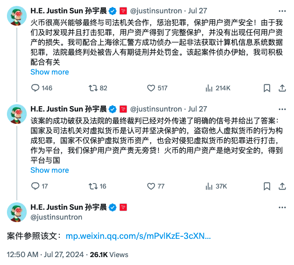

# 离大谱！某大所出品的钱包软件竟被植入盗币后门！

隔夜BTC继续艰苦修复，逼近60k关口。最近，刘教链超级小白课4期班正在授课中，其中一个重点就是安全问题。在社群进行公有链实践的过程中，大家也会格外热心于尝试各种第三方出品的钱包软件（App）。但是，教链今天要讲的这个钱包软件被植入盗币后门的案例，却又一次刷新了我们的认知。

刷新认知的地方在于，该案例再一次向我们证明了一个道理，再怎么看起来可靠、可信的大平台、大公司，它所出品的软件都有可能存在无意的漏洞，甚至是人为的后门，进而导致作为用户的我们，面临严重的资产损失风险。

想象一下，如果全球最大加密交易所币安以官方名义推出了一款钱包App，竟然植入了盗币的后门，该有多么可怕？

这次的案例，并非发生于币安，而是当年曾与之齐名的另一家大所。综合公众号“平安徐汇”的案情披露文章《谁动了他价值百万的虚拟币》和孙宇晨的推特，网友们推测，涉案公司就是火币，而这款被植入盗币后门的钱包软件就是火币钱包（后更名为iToken）。

教链结合案情披露，捋了一下时间线：

* 2021年7月 - 火币员工张X在另一平台的钱包软件中植入私钥助记词窃取后门
* 2022年5月 - 火币钱包更名为iToken
* 2022年10月 - 孙宇晨高价收购火币（含iToken）
* 2023年3月 - 火币三员工刘A、董B、张C（下简称刘董张）在iToken钱包中植入了窃取私钥助记词的后门
* 2023年4月 - 张X盗走了用户欧某钱包地址里的资产
* 2023年5月 - 用户欧某打开iToken钱包，发现资产丢失
* 2023年8月 - 用户欧某自行搜集到关于iToken钱包盗币后门相关线索，报案
* 同月 - 刘董张到案；但是调查后发现，并非这哥仨偷走了用户欧某的币。公安机关顺藤摸瓜，抓到了张X
* 2024年4月 - 刘董张各被判处有期徒刑3年，罚金3万元。张X被判处有期徒刑3年，罚金5万元。

仔细品味一下这个案情经过，我们会发现一些耐人寻味的细节：

用户欧某可不是一个电脑小白。他有能力反解软件，进行网络追踪，靠一己之力抓到刘董张的后门和马脚，并把线索证据提交给公安机关。这计算机水平，远超社会平均水准，甚至可以算得上超越99.9%的人的电脑高手了。

但就是这样一个电脑高手，却对加密安全有那么一点点儿认知不足，甚至是严重不足。

在教链看来，他至少犯了四个严重错误：

（1）重要资产为什么不放在冷钱包？

把私钥助记词导入到联网的钱包软件中，是最致命的错误。

教链知道，很多朋友就是直接拿某某钱包App来生成助记词。这样的方法，可能在第一时间就已经泄密了 —— 如果这款钱包App发生了类似该案的情况的话。

（2）如果常动资产，为什么不用硬件钱包，把私钥助记词和钱包软件隔离？

如果他懂得做私钥隔离的话，就算钱包软件被反复植入后门，也根本偷不到他的私钥助记词。

（3）为什么要把同样的私钥助记词先后导入多个钱包软件，严重增大暴露面？

他是在iToken发现丢币的，但却不知道他的私钥助记词被两批“黑客”同时给偷走了。只不过，另一个小偷先下手为强，领先一步，把他的币给转走了。而这个小偷，却不是通过iToken偷的，却是另一个钱包软件。这显然说明了，欧某把同一套助记词，在两个（或以上）的钱包软件中进行了导入。

教链观察到，有相当多的人，不愿意承受记录或记忆多套助记词的麻烦，于是就一套助记词到处使用。直接的问题就是，一旦泄露，你自己都记不起来，有可能在哪里泄露的了。

雁过留痕。一旦你曾经把私钥助记词导入过某个钱包软件中，即使你很快删除了这个软件，也永远再也无法100%确信，在这个暴露点没有谁偷偷存储、泄露、盗窃你的私钥助记词。

（4）教链谨慎怀疑用户欧某使用了从非正常渠道下载的钱包软件。

仔细看案情，真正造成用户欧某丢币的，是被张X动了手脚的“另一平台的钱包软件”。但究竟是哪个平台的哪一款软件，竟然成了一个被大家有意无意忽略的谜。

从字面意思上看，张X动手脚的时候，还是火币的员工。而“另一平台”，那说的应该就不是火币。张X作为火币员工，理论上不会具备能力在另一平台官方发布钱包软件的工作流程中动手脚，从而在官方发布的软件中提前预埋后门。那么，由此推测，张X只有可能是在该钱包软件发布后，植入后门，然后自行分发，进行钓鱼。

如果真的是这样的话，那么用户欧某很可能是从非官方渠道下载的这个“另一平台的钱包软件”，殊不知这已经被张X提前动了手脚。当然，由于案情披露不够详尽，所以这些只是推测。

教链看到经常有人在社群里向别人索要各种钱包软件的安装包。这是一个极其错误，对自己的资产安全极其不负责任的做法！

千万千万不要从第三人手中下载钱包软件！

因此，这个案例给我们的启示是，加密安全是一个全新的知识领域，就算是传统意义上的计算机高手，如果不刷新自己的认知、认真学习的话，也会存在巨大的盲区，从而做出错误的操作，导致自己宝贵资产的丢失。

另外一个启示就是，不要盲目信任所谓的大公司、大平台。有句很俗的话叫做这世界就是一个草台班子。区块链技术的特点，使得大型中心化机构更难以控制底层员工的行为。

在风高浪急的加密市场冲浪，我们每个人都要认真学习知识、建立正确观念、谨慎安全操作，做好自己资产的第一守护人、第一责任人。
