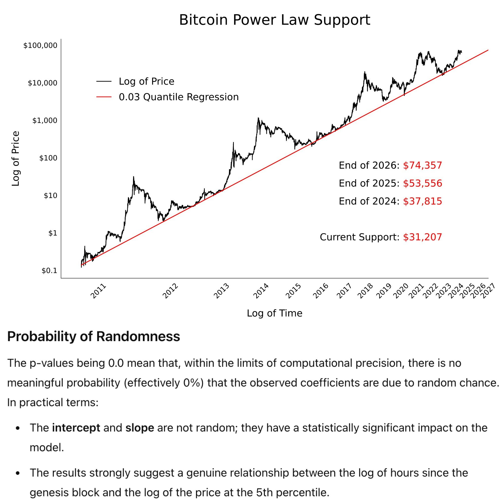
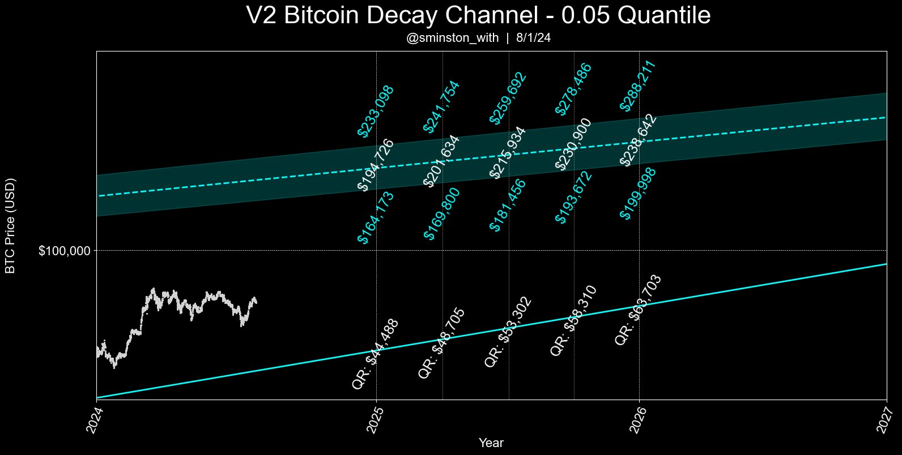
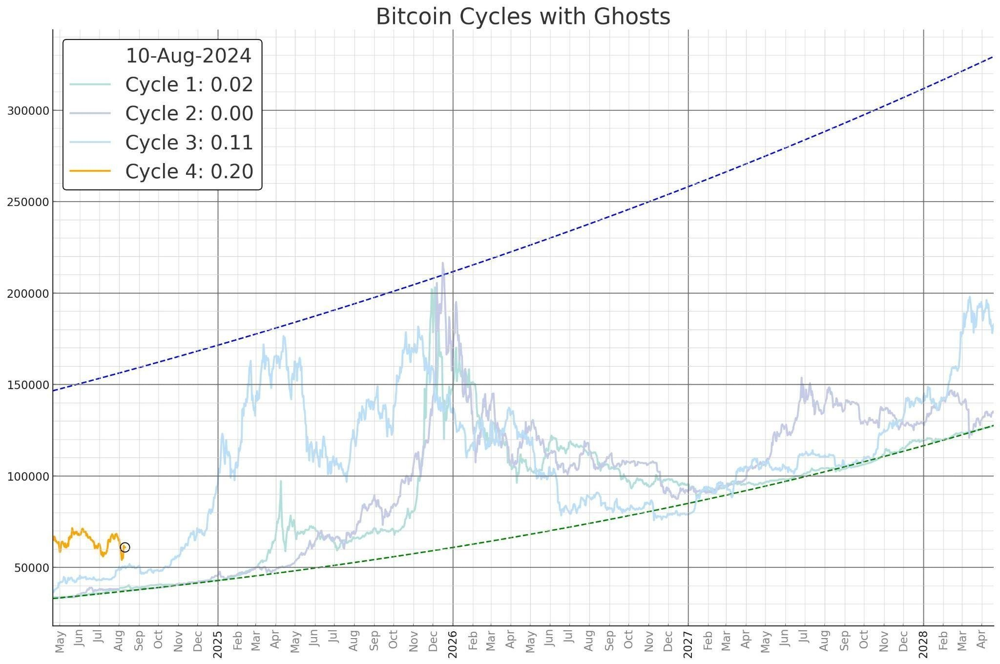

# 垃圾时间才是黄金时间

隔夜BTC又回升到了60k上方。8/5这波插针后修复真带劲儿，直接就把押注回补下影线的空头们给干沉默了。教链瞅了一眼，现在永续合约费率还是负的，空头们还在咬牙死守，宁可给多头付钱，也不愿意平仓认输。是条汉子！那就慢慢亏费率吧，呵呵。

最近的行情是有点儿磨人。恐怕是在熬到9月17-18号美联储下一次议息会议开完之前，市场都会摆出一副死猪不怕开水烫的样子。很多人把这种时间称为“垃圾时间”。但是教链不这么看。教链认为，垃圾时间才是黄金时间。恰如教链在昨天[“8.13教链内参：Arthur Hayes：流动性牛市即将到来”]中第一章节所写的：

「多头和空头大多在垃圾时间停了下来，无所事事。但是，未雨绸缪的人，执行[八字诀]的人，知道垃圾时间其实才是最宝贵的时间。机会总会出人意料地出现。而只有那个在众人以为的垃圾时间里，默默积累的人，才有资格抓住未来突如其来的机遇。」

远见卓识的人，总在重大战略性机遇到来之前做足准备。厚积薄发的人，总是能够日积月累地不断积累自己的实力和胜率。

缺乏实力、不知胜负的人，才会痴迷于预测市场的短期涨跌、目标价位、进出信号。有实力、知必胜的人，从来不在乎这些 —— 他们只在乎，自己的准备是不是更充分了，自己的实力是不是更强了，自己的胜率是不是更高了。

故兵法曰，胜可知，而不可为。

统计学用铁一般的事实告诉我们，BTC过去十多年的增长，绝非随机的偶然，而是历史的必然。其沿幂律增长的统计显著性近乎100%（p值近乎0）。

收起空口无凭的喊多唱空，收起感性盲目的主观臆测，收起别有用心的攻击诋毁，没有一个BTC的反对者，能够摆出统计学的、数学的铁证，否定上述事实。

数学是宇宙终极的真理。

如果承认这一点，那么很容易发现，对于可投入2年以上的资金，7万刀以下都会是绝佳的买点。

今天，现在，BTC仅仅6万多刀。

很多人嫌贵。很多人还在等更低。很多人终将在等待中蹉跎岁月。

今年过后，大概率将不会再有35k以下的BTC。

因为2025年很可能要走牛市，所以市场根本不会给你2年时间慢慢建仓。

一段时间以后，市场就会把加仓成本拉高。只有拉高，才能让更多人高买，并在牛市过后的回撤中陷入亏损。

在加密之旅中会遇到各种各样的问题，但是多囤点儿BTC，基本上就能解决99%的问题。
