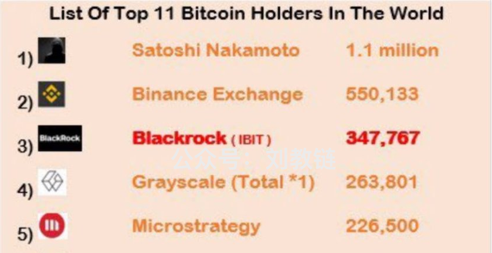
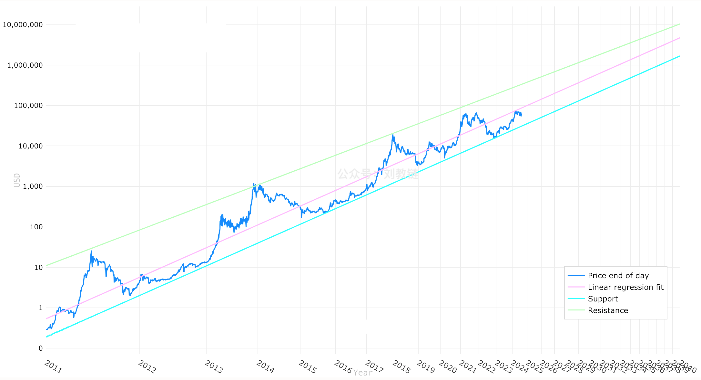
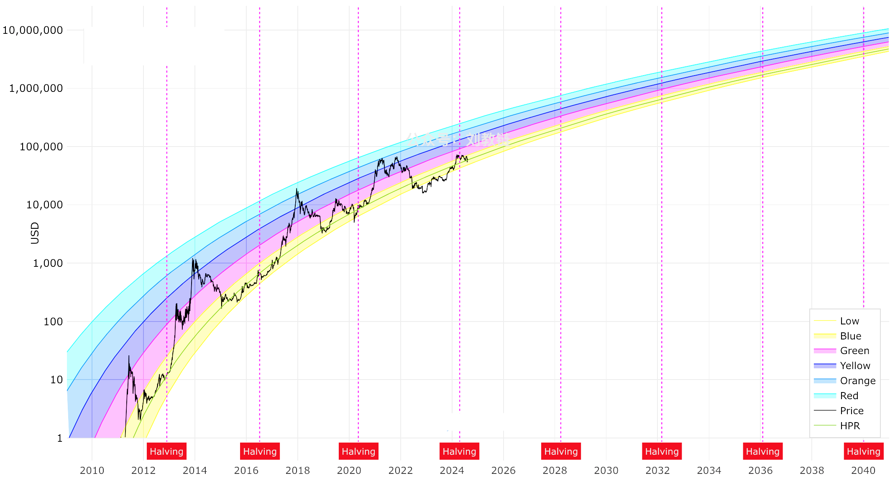
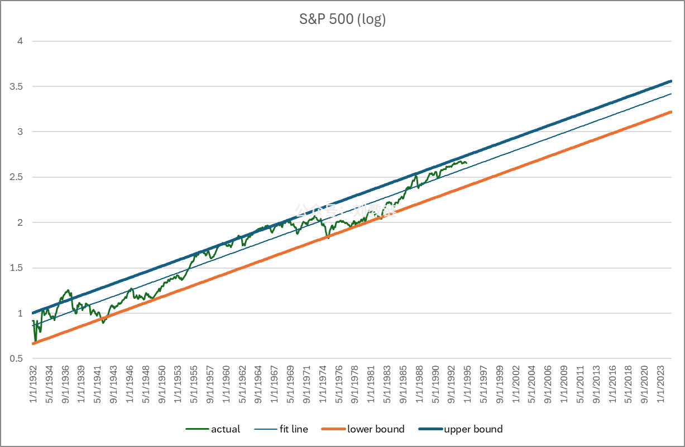
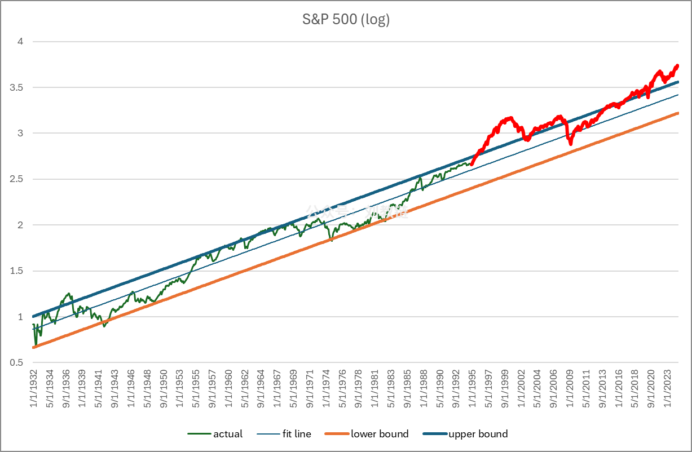

# 比特相变，君子豹变

隔夜美CPI数据出炉，消费者通胀年率2.9%，超预期回落，首次回到2时代。叠加[“8.14教链内参：美PPI不及预期，贝莱德称美联储将在9月降息”]，美元降息周期的脚步声已经越来越近了。受此利好影响，美股各指数、大A今天全线上扬。而BTC却在昨日冲击62k未果后跌落，今日更是回落到58k一线。

要说还是华尔街专业玩家进场，控盘水平真是没得说。贝莱德的ETF已经累积了近35万枚BTC现货。全体美现货BTC ETF总持仓已经快赶超中本聪了。现货价格依然被控的死死的。天知道这些大资本要吸多少货才会放开缰绳，任由市场策马奔腾！

现在6万刀左右是高还是低？那取决于用什么参照系。按照最初的[幂律]模型来看，2025年1月1日的低值3.5万刀，中值10万刀，高值37.8万刀。以此作为参照，则现在处于中值偏低的位置。

但是，幂律是双对数坐标系。也就是说，要实现相当量级的指数增长，需要的时间也要相应地指数级延长。比如，从10到100的10倍，需要100天的话，那么从100到1000的10倍，就需要1000天。

换句话说，增长速度是越来越慢的 —— 在线性时间坐标系下观察的话。

这个问题和人类的认知心理和生理因素也有关系：人对于金钱的增长欲望，是指数级上升的。当你从10万赚到100万所产生的获得感，需要从100万赚到1000万才能达到同等水平 —— 虽然，后者赚的钱（900万）是前者（90万）的10倍！

人拥有的财富越多，越不容易体验到收获的快乐。一个拥有1亿资产的富人，相比于一个拥有1万资产的穷人，富人需要比穷人多赚1万倍的钱，才能勉强获得同等的满足感。

由于这个原因，人类对于投资价值指数级增长的欲望是天然的，而幂律却需要更长的时间才能实现同等数量级的增长，这是人类欲望难以忍受的！

换句话说，人类的欲望是超幂律的。它希望能够在线性的时间内实现指数级的价值增长！

把幂律的时间轴改成线性坐标轴，我们就得到了彩虹图：

从图上很容易看出，随着时间的增长，价值增长在数量级水平上是越来越少的。甚至于在2022年底到2023年初这一段时间，市场实际运行区间竟跌出了彩虹图的下限。

在1932年到1994年的60多年中，美股标普500指数实现了线性时间、指数增长的极佳拟合（虽然相对BTC而言，绝对速度有点儿低）。见下图：

但是，当你在此后30年按照前60年的价格走廊制定高抛低吸的交易策略时，就会很快被甩下车。因为后来的标普500脱离了这个走廊，飙到了更高的水平。换言之，发生了“相变”。

相变这个概念，是教链从物理学借用过来的。相变（Phase Transition）的本意，是指物质在外部参数（如：温度、压力、磁场等等）连续变化之下，从一种相（态）忽然变成另一种相，最常见的是冰变成水和水变成蒸气。

BTC会不会发生相变，什么条件下发生相变，什么时候发生相变，向什么方向相变，我们并不能准确预知。但是我们一定要保持头脑和认知的灵活性。像易经中说的，君子豹变。不要让经验主义、教条主义、本本主义，禁锢了自己的思想。随时做好迎接大变局的准备，紧紧握住BTC，抓住新时代的新机遇。

