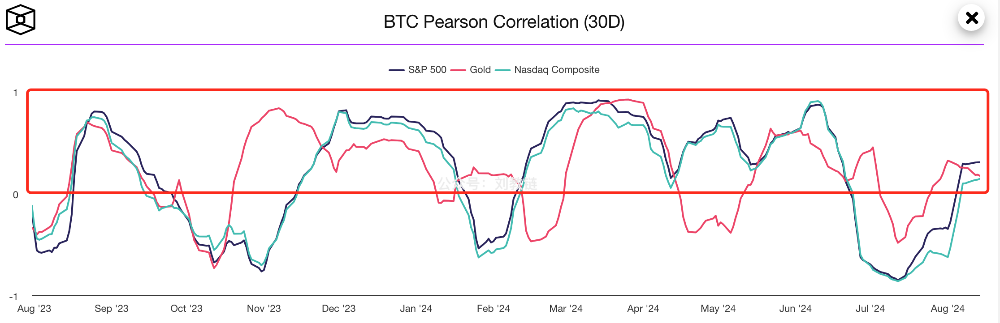
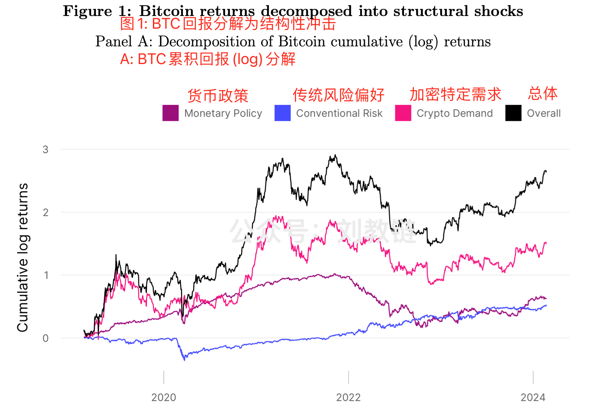
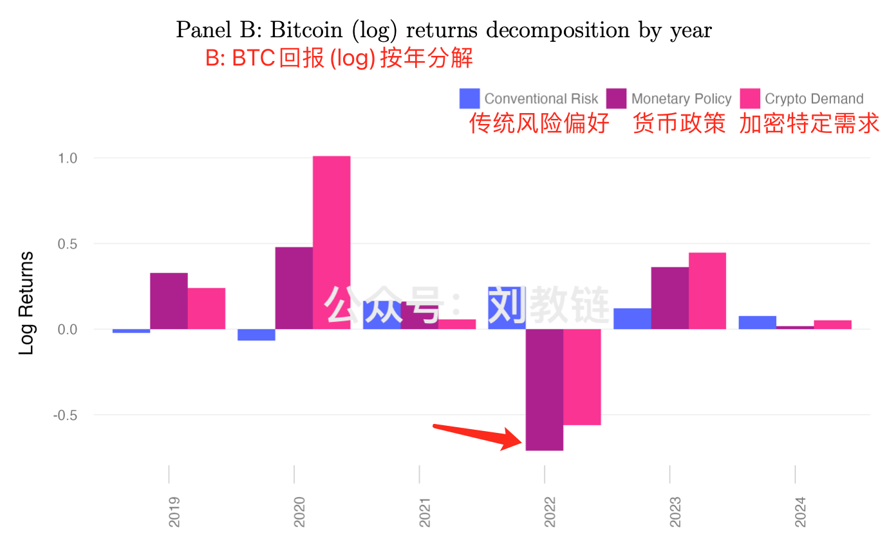
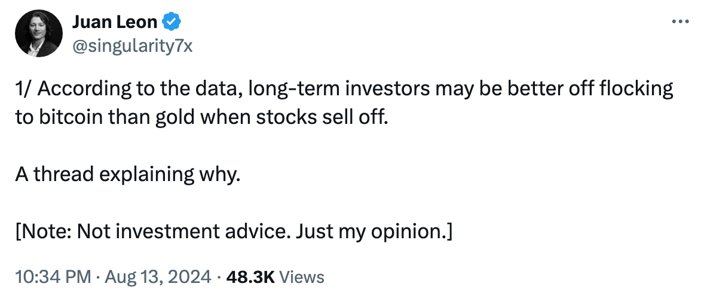
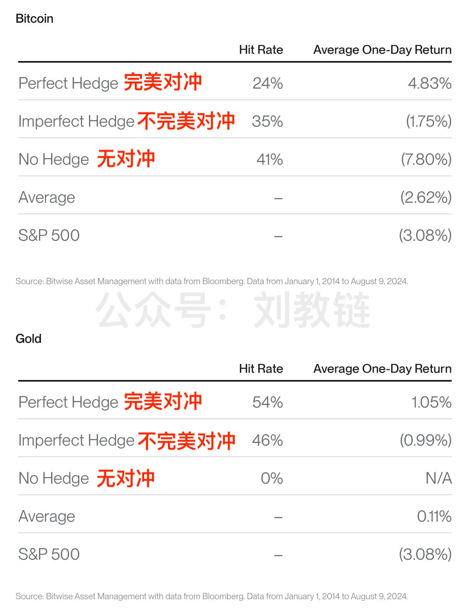
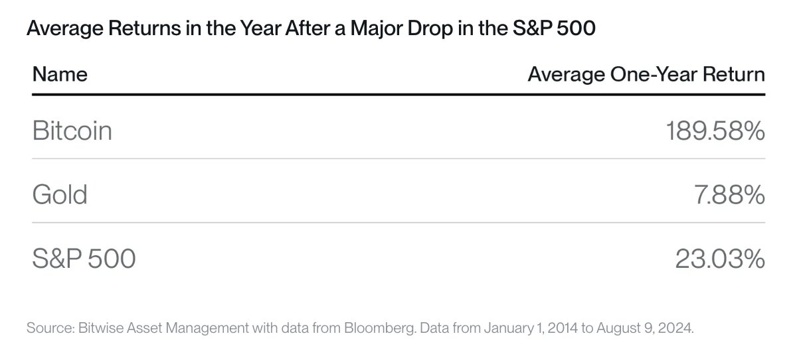

# 反直觉！是什么因素在影响BTC价格？

昨日傍晚[“8.15教链内参：索罗斯清仓英伟达，是卖飞还是神之逃顶？”]一语成谶：内参中汇报了两个信息，一、「美政府将大约1万枚罚没自丝绸之路的BTC转入了交易所」，二、「前两次每次（转入操作）都引起了5%左右的回撤。」今早一看好嘛，BTC高开低走，从59.7k回落到最低56k一线。

昨晚内参教链还拉了个BTC与黄金、标普500和纳指的30日皮尔逊相关系数的图线。所谓皮尔逊相关系数（Pearson Correlation），就是协方差（Covariance）与标准差（Standard deviation）的商。相关系数等于1时，为完全正相关；相关系数等于-1时，为完全负相关；相关系数越接近0，相关度越弱。

教链拉这个图线出来，是为何回应关于BTC近期走势好似纳指的问题。通过数据的计算，我们可以看到，其实二者并非一直正相关；目前也并不是相关性较强的时期。

有些反直觉。我们的眼睛很多时候会欺骗我们，这时候就往往需要借助于数学和统计分析的工具，来帮助我们获得更客观、真实的图景。

关于BTC跟随美股的说法，教链依稀记得大概是从2021年起甚嚣尘上的。从那时起，教链就时不时地会在文章和内参里提一句，BTC长期并不会和美股强相关，所有观察到的相关性都只是短期的暂时现象。

2023年2月11号的时候，教链还发文介绍过[纽约联储的一篇研究报告，研究的课题就是BTC和宏观经济的脱钩]。

奈何太多人还是会凭自己的裸眼观察，和并不可靠的记忆力，来轻易得出BTC和美股相关的结论。当然，由于这种谬误实在过于常见和根深蒂固，以至于无论如何科普也不可能消除，所以这个认知差异或许足以构成投资上的劣势，从而让克服这一偏见的人，可以从他们身上赚走超额利润。

日前，Uniswap Labs的顾问、哥本哈根商学院的研究者、Circle的研究员联合发表了一篇研究论文，题目叫做《是什么驱动了加密资产的价格？》[1]。

说是加密资产，其实论文主要研究的对象就是BTC。毕竟，其他山寨死得太快，根本就没有足够充足和连续的数据可供研究。

论文采用向量自回归模型（VAR），对三个主要的价格冲击因素进行了分析：

1. 传统货币政策的冲击 —— 其实主要就是美联储的货币政策，比如扩表缩表、加息降息
2. 传统风险偏好的冲击 —— 这个主要就是美股；通常认为，美股涨，反映出市场风险偏好上升，美股跌，风险偏好下降；而美元黄金则相反，反映出避险偏好
3. 加密特定需求的冲击 —— 对加密资产本身的独特风险偏好，与其他资产无关

研究再一次揭示，BTC价格驱动因素中，加密特定需求冲击是影响最大的，其次是传统货币政策冲击，偶尔也会造成很大影响（比如2022年下半年），影响最小的，反而是传统风险偏好冲击，也就是美股相关因素。

从图中可以很明显看到，美股相关的风险偏好因素对BTC价格的驱动力是最弱的，其次是宏观货币政策，最强驱动力还是加密特定需求。

这个研究结论无意中佐证了教链内参的内容安排，还是蛮科学合理的。在每期教链内参中，教链会以加密行业的独特信息为绝对重心和主体，加以分析、研判和点评；其次关注的焦点，也是每期内参的第一部分，会汇编报告最新的宏观因素，主要是美联储的货币政策、美元指数、黄金等；偶尔，会提及一些关于美股的信息，基本上频次不高。

有读者可能还不知道如何阅读教链内参 —— 订阅教链的星球会员，即可畅享免费不限次阅读全年内参，并获得每年年底重磅研究报告抢先阅读权限，以及每季度参加教链私董会，通过现场或直播直接听取教链对市场的最新解读，并实时互动交流。

[星球订阅二维码]

通过该研究，我们还可能看到，为什么要关注美联储的货币政策。因为宏观风险冲击，在个别时候也会成为最强驱动因子。比如2022年下半年：

回顾2022年下半年，美联储以史无前例的速度快速加息，叠加缩表，造就了BTC跌破“2017前高”2万刀、最低探底16k的壮举！

从这次的研究来看，其主要的“罪魁祸首”，虽与加密市场本身去杠杆因素，如Luna/UST暴雷、FTX破产等因素有关，但最大的影响者，还是美联储的快速紧缩。

如此说来，当今年下半年美联储行将结束紧缩周期，重新开启宽松周期之后，BTC的下一个大牛市，是不是已经跃然纸上了呢？

昨[“8.15教链内参：索罗斯清仓英伟达，是卖飞还是神之逃顶？”]也说了，据美SEC文件最新披露，高盛、摩根士丹利等美国大资管机构都已经纷纷建仓贝莱德现货BTC ETF产品，积极布局接下来的加密牛市了。

随着贝莱德等机构的BTC ETF成功上市，美国政府转向加密友好，加密特定需求这个驱动因素，也将对于牛市的推波助澜，起到重要的作用。

Bitwise高级投资策略师Juan Leon说[2]，对长期投资者而言，当美股清算暴跌时，是逢跌加仓BTC（而不是黄金）的绝佳时机。

他分析了BTC和美股的相关性表现，得出如下两个结论：

一、BTC不是美股很好的短期对冲工具。

意思是说，当美股下跌时，BTC并不总是会上涨，从而表现出避险特征。有时候，它会不动；有时候，它也会下跌。

这一回顾其实很符合上面教链介绍的研究结论，即BTC和美股的短期相关性其实很低。

从上表数据看来，相比而言，黄金反而更像是美股的一个短期对冲工具。

二、拉长时间，逢跌加仓BTC总是会给你惊喜。

比如，每当标普500回撤超过2%，就加仓BTC，持有一年后的平均回报率可达惊人的近190%。而对黄金实施同样的逢跌加仓策略，一年期平均回报率只有区区不到8%，甚至还不如加仓标普500指数本身的23%。见下表：

熟悉教链的[“八字诀”]的朋友们都知道“逢跌加仓”。只不过，八字诀中原意的逢跌加仓是指逢BTC暴跌时额外补加仓位。看了Juan Leon的分析，教链得到一个启发，原来还可以逢美股暴跌时，加仓BTC，这样来把八字诀之逢跌加仓变成一个对冲策略。

从这个角度讲，BTC可以看作是美股的长期对冲。

---
- [1] https://papers.ssrn.com/sol3/papers.cfm?abstract_id=4910537
- [2] https://x.com/singularity7x/status/1823367443865014630
