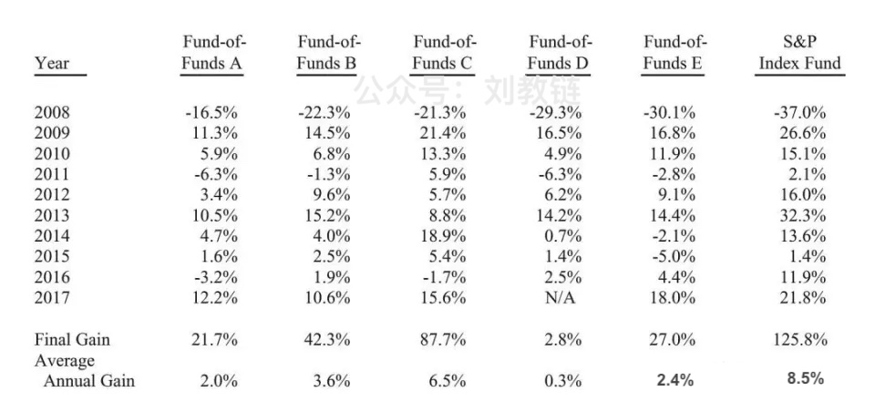
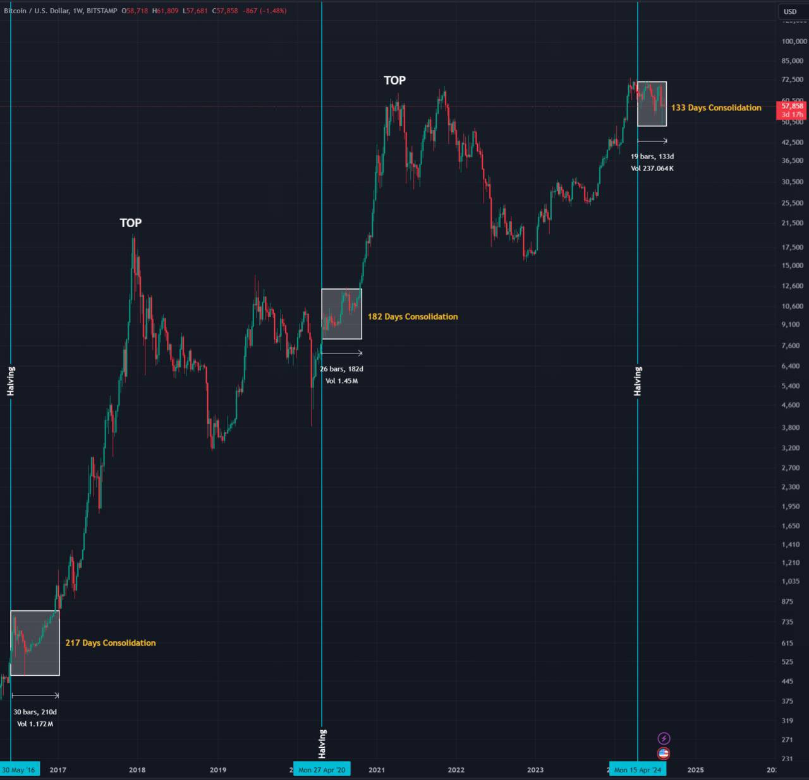

# 静静等待，奇迹自来

今日BTC小幅回升至59k上方。昨日[“8.16教链内参：践行普通人皆可复制的赚钱方式才是正道”]进行了一点儿赚钱之道层面的讨论。哪个少年没有年轻气盛、目空一切过？这种系统性的认知缺陷，恰恰成为了被利用、被收割的关键点。放下自我，放弃自负，收起好胜之心，往往才是真正持续盈利的开始。

由此教链想到了关于有效市场的争论。大概20年前教链和华尔街某对冲基金经理讨论此问题，对方的观点教链至今仍然记得很清楚。他认为，市场并不总是有效的，但是市场又在不断变得更为有效。一个模型，在不为人知的时候，可以从市场中获得超额收益。随着知识的扩散，人人都掌握并使用该模型之后，它也就逐渐失效了 —— 换句话说，市场变得更有效了。

现在回想，这种观点应该仍归于无效市场理论。因为知识是无穷无尽的，一个模型失效了，总会再找出新的模型。模型无穷无尽，市场永远不可能对所有的模型充分有效。因此，市场每时每刻都存在无效的地方，问题只是在于你能不能找到这种套利机会。

但是，统计数据和实证检验却揭示了一个血淋淋的、铁一般的事实：连美国最优秀的基金经理们，也鲜有能通过主动寻找超额收益机会，长期跑赢闭眼选择大盘指数的业余投资者。

2005年，股神巴菲特通过亚马逊创始人贝佐斯投资的一个管理长期赌注的非盈利组织Long Bets正式向全美基金经理发起挑战。这个挑战是，10年时间，由华尔街投资精英管理的主动基金，跑不赢无人管理、几乎没有费用的标普500指数基金。华尔街主动基金通常是2%管理费、20%提成，而指数基金则只有万分之三的年费。

直到2017年，基金经理泰德才成为第一位敢于迎战者。他选了5支FOF (Fund of Fund)基金，囊括了全美最好的上百位最优秀的基金经理。挑战时间从2018年1月1日起，到2017年12月31日止。

结果让人大跌眼镜：整个华尔街最顶尖的基金经理们，10年总收益36.3%（CAGR 2.96%），大幅跑输标普500指数10年总收益125.8%（CAGR 8.5%）。

这个真实无比的故事能够给我们什么启发呢？也许最大的启发就是，做投资和做业务很不一样。做业务往往是勤奋和汗水决定回报，很多时候就是填人、填时间，所以才有那么多老板和打工人以凌晨的办公室灯火通明、996无休止加班为荣。但是做投资却常常相反，越是主动操作，越是勤奋地开单平仓，越是花很多时间高买低卖，越是在市场里消耗自己的情绪，时而兴奋，时而沮丧，时而不由恐惧，时而满怀希望，最后的结果却往往越是糟糕，不仅不能收获很好的盈利，反而会招致更大的亏损。

教链的投资策略是完全公开透明的，每个关注并持续阅读教链文章的读者朋友都知道，而且任何一个普通人、业余投资者都可以复制。过去，现在，将来，也总是有年轻气盛、目空一切的读者，不屑BTC，不屑八字诀，不屑长期主义，他们往往就像上面和巴菲特对赌的自认为优秀和顶级的华尔街基金经理，不需要太久，只需要2、3轮周期，穿越几次牛熊，就被BTC远远地甩在了身后。

教链突然好像有些悟透了有效市场悖论：也许人的思维偏见真的是很难改变的。而这种固执的偏见，造成了人的认知缺陷。市场是有效的，有效在于市场会原原本本地暴露每个人的偏见和缺陷，从而反映在他们的盈利或亏损上。如果你能克服这种偏见和认知缺陷，那么你就有办法稳定地战胜这些存在偏见和认知缺陷的人。市场也是无效的，因为市场的本质就是组成市场的每一个人，而每一个人都有自己或大或小的偏见和认知缺陷，因此市场作为一个整体就必然是到处存在偏见和缺陷的。对于一个敏锐的洞察者而言，这些偏见和缺陷就是绝佳的套利机会。

我们可以看到，即便是BTC产量减半这种完全可预见、板上钉钉的事情，也不会在BTC上线的第一天就被充分定价（price in）。即便是BTC已经发展了15年，也仍然没有被充分定价。否则，我们也许就不应该看到如此明显的周期，以及每一轮周期那如钟表一样精准重复的模式。

前一次2016年产量减半，减半后经过217天震荡整理，才开启轰轰烈烈的牛市进程。

上一次2020年产量减半，减半后经过182天震荡修复，才正式确认一骑绝尘的狂暴拉升。

这一次2024年产量减半，减半后至今已经过130多天震荡消化。若按180-220天的经验来看，也许还有50-80天，登月火箭就要发射。

火箭发射升空时，唯一决定成败的，只是仓位有无、大小而已。

静静等待，奇迹自来。
