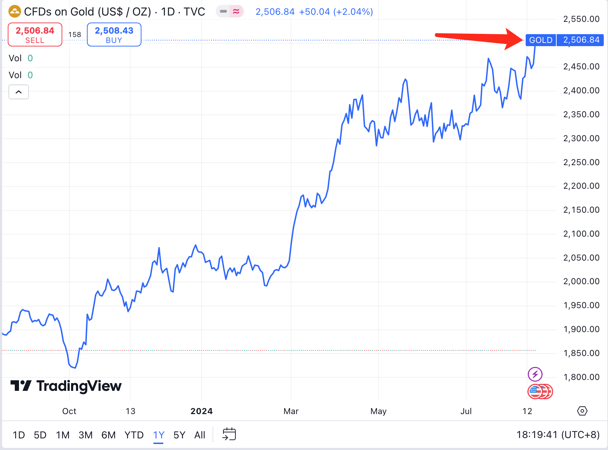
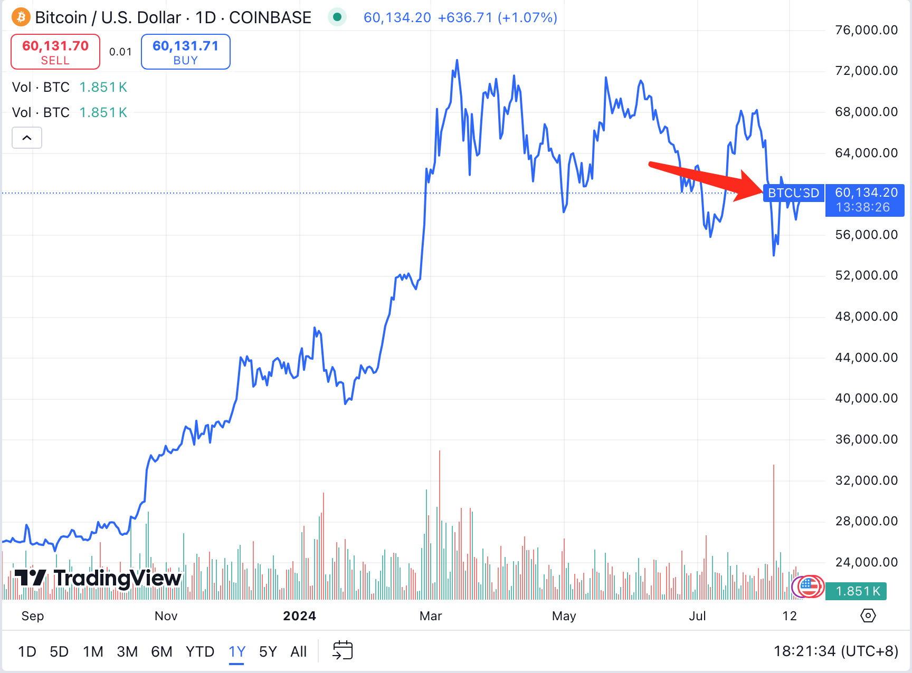
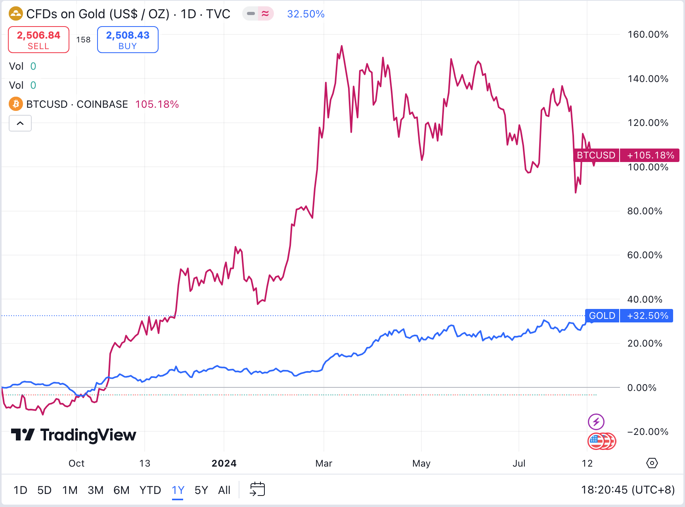

# 涨30%的牛市，涨100%的熊市？

BTC周末接连收复失地，目前已回升至6万刀附近。周五8月16日那奇怪的一跌，看起来和教链在当日文章《反直觉！是什么因素在影响BTC价格？》中所讲的原因颇为一致，今日[“8.18教链内参：美元疲软，比特坚韧，黄金强势创新高”]似乎是确认破案，很可能就是因为美政府抛售了那1万枚BTC所造成的一次反常插针。从接近6万刀最低下探至56k，刚好也匹配前面文章和内参中所说的5%左右的跌幅。

说周五的下跌反常，是因为中美股市当时都在涨，唯独BTC带动加密市场在跌。在当日晚间[“8.16教链内参：践行普通人皆可复制的赚钱方式才是正道”]当中，教链也已经直接点明，“看起来加密市场这两天的下跌，纯粹是加密独特因素”。

及至今日[“8.18教链内参：美元疲软，比特坚韧，黄金强势创新高”]，教链报告说，黄金收盘终于突破了望眼欲穿的2500刀关口，再下一城，续创历史新高。资本不顾金价高企也要冲，这凸显了试图避险对冲美元衰退的决心。

加息并不能抗通胀。加息只会造成更大的通胀。这是站在货币的角度说的。也是站在长周期的角度说的。加息的本质是什么？让钱凭空生出更多的钱（利息）。说白了就是金融空转。100块钱本金，5%利息，过一年就变成105，这不就妥妥多出来5块钱么？

为什么短期加息会造成抗通胀的假象？因为杠杆。假设正常水平下有10倍杠杆。100块钱货币投放，市场上变成1000块。加息后打爆一些杠杆，强迫杠杆率下降到5倍。1000块钱的泡沫就破裂成500块钱了。

不过，当加息周期结束，杠杆率重新恢复成10倍。500块钱拿了利息变成525块钱。放大杠杆变成1050块钱。这钱就比一个周期前的1000块多了50块钱。这就是通货（货币）的膨胀。

这个金融空转的过程就是财富重新分配的过程。加息周期减少的500块，是把这一批人兜里的500块给消灭掉了。而到了降息周期增加的550块，却是给了另一批人。

你如果是第一批人，那你就是被美元周期收割的韭菜。你如果是第二批人，那你就是借助美元周期收割韭菜的赢家。

昨天教链文章《静静等待，奇迹自来》中，讲了一个故事，股神巴菲特和华尔街最优秀的基金经理们对赌的故事。

本质上，巴菲特嘲笑基金经理们10年时间跑不赢大盘（标普500指数），是指他们根本无法通过在二级市场上奋力搏杀、主动出击获得持续的alpha（超额收益）。

巴菲特赢了。你悟到了，积极作为往往是无益的，不如老老实实买指数。这只是第一层。

你有没有想过，巴菲特本人就是美股市场上最耀眼的那个alpha？他的伯克希尔·哈撒韦数十年如一日的持续跑赢大盘？

所以，对于第二层的领悟就是，巴菲特的嘲笑，另一个层面的理解就是，基金经理们根本就没有领悟到真正跑赢大盘的方法。

这个方法就是跳出市场的低维度厮杀，站在周期之上，成为第二批人。

也就是说，巴菲特的alpha并非来自于市场之内，而是来自于市场之外。

那么对于普通人，如何才能站到周期之上、市场之外？

克服市场有效性。克服认知偏见。

黄金突破2500刀，再创历史新高。人人都在极度看牛黄金。

BTC自3月份创下历史高点73.8k后，半年时间震荡下行，陷于6万刀一线苦苦挣扎。人人都在极度看熊BTC。在今日[“8.18教链内参：美元疲软，比特坚韧，黄金强势创新高”]中也有对当前市场恐慌情绪的叙述。

但是，如果拉长到一年时间来看，被极度看牛的黄金，涨了30%，被极度看熊的BTC，涨了100%。

涨30%的牛市，涨100%的熊市，人们的感受何以偏差如斯，市场的情绪何以古怪如此？

我们大致可以猜到，市场中大部分的人，都是短线玩家或者新手，他们对于一年这么长的时间，完全没有任何感知。

朝菌不知晦朔，蟪蛄不知春秋。大鹏扶摇直上九万里，大椿以八千岁为春、八千岁为秋。这就是境界的区别。

乘天地之正，御六气之辩，以游无穷。克服偏见，提高认知，虽不足以战胜市场，但足以战胜无效的人。
