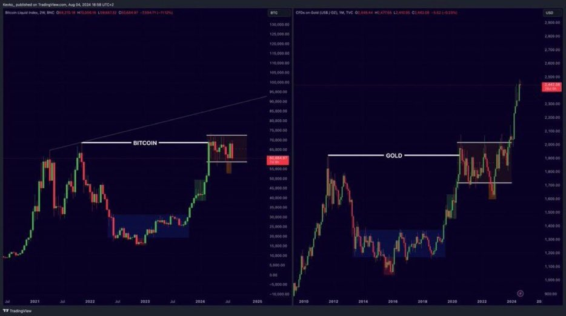
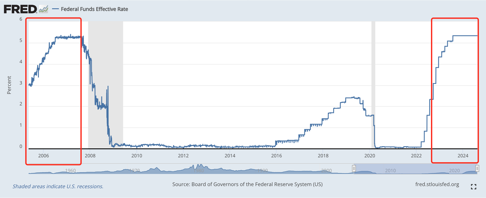
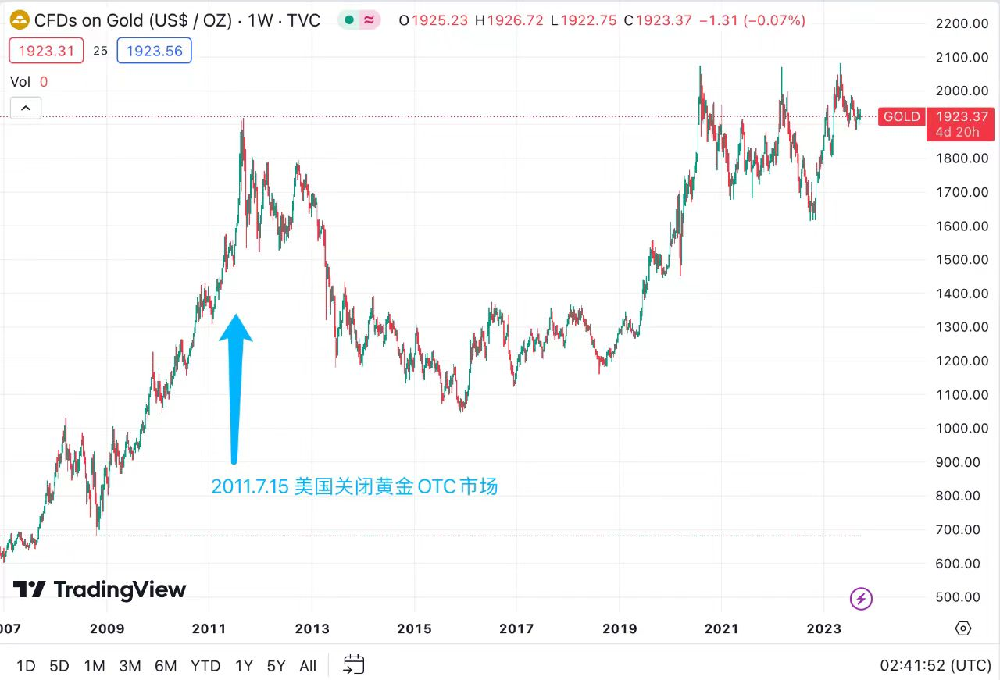
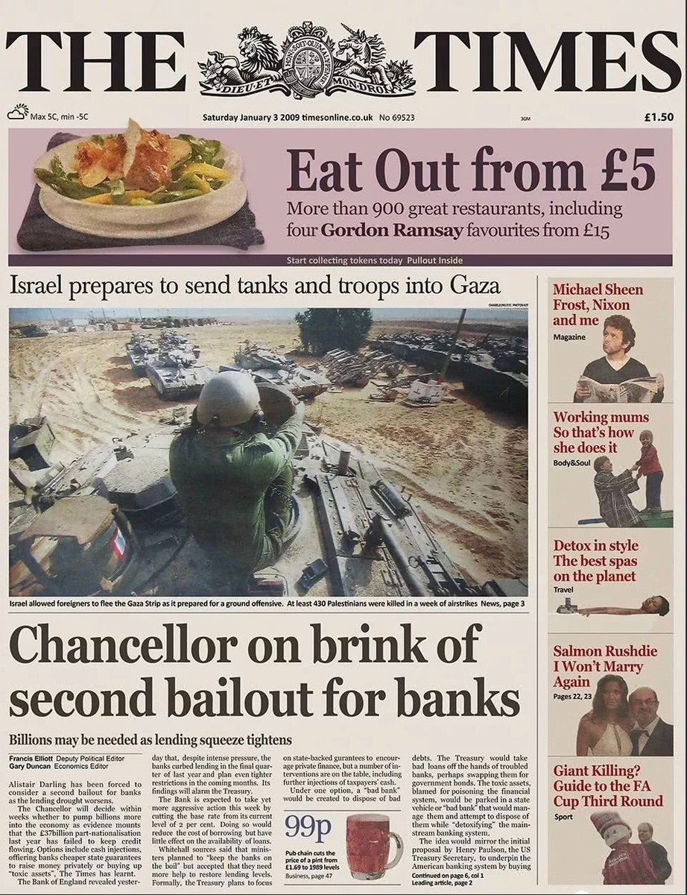
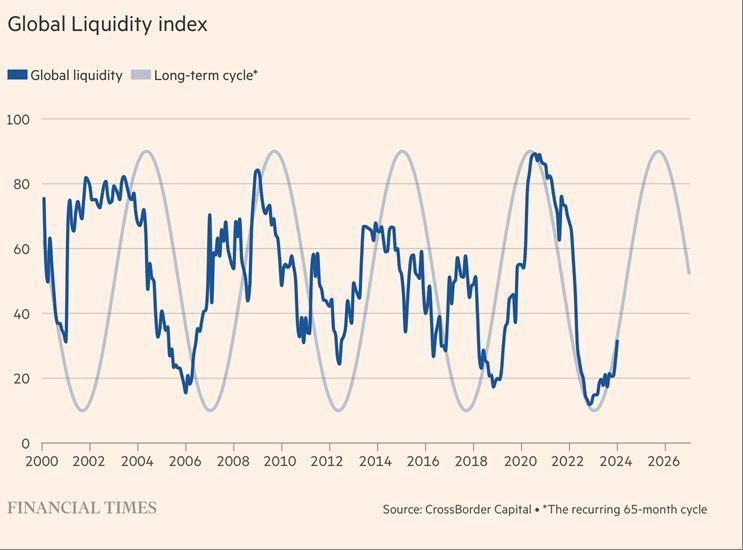

# 宏观流动性即将进入再扩张周期

隔夜BTC未能站稳6万刀一线，骤然回撤至58k上方。昨[“8.18教链内参：美元疲软，比特坚韧，黄金强势创新高”]提到，「现在市场情绪的确也是处于极度恐慌的状态」。

以教链的观察，现在的情况是，多头沉默，空头含泪，拿山寨的清空了仓位，拿BTC的也半仓防守。满仓顶住，甚至于别人恐惧我加仓的汉子，看起来是不多了。

黄金突破历史性的2500刀，似乎强势宣告2012-2020的U型底阶段，黄金空头打压黄金的彻底失败。谁是黄金最大空头？当然就是阿美莉卡。

显然，在2021-2025的宏观周期上，BTC似乎有重复2012-2024黄金U型底右侧强势信号整理后向上突破的态势。

若如此，则BTC只用6年，就走完了黄金12年血泪之路。

看着神似2006-2007年的宏观利率周期，教链不禁陷入了沉思……

忆当年，2007年高息只维持了一年，就爆发了次贷危机继而引发全球金融海啸。美联储仓皇失措，利率打着滚儿地跌到了零。

耳边忽若传来儿歌欢唱：小老鼠，上灯台，偷油吃，下不来，叽里咕噜滚下来！

小老鼠，上灯台，偷油吃，下不来，叽里咕噜滚下来……

教链以手轻拍，脑海中跟着节奏唱了两遍，不由地大为开怀。

原来人类最顶级的智慧，都写在了儿歌和童话故事里。

人类生产力长周期增速也就是2%，即价值增量的创造速度平均只有每年2%。因此，从终极意义上讲，任何超过2%的回报率，无论冠之以何等冠冕堂皇的理由，都是存量价值和财富的转移，换言之，是一群人对另一群人的收割。

目前美元5.5%的无风险高利率，远超2%，这定然是一种对全世界的收割。一切否认收割的论证都是苍白的，诡辩者要么是收割的受益者，要么就是纯粹的傻子，因为这是数学，不容辩驳的数学。

有人可能单纯只是不喜欢“收割”这样赤裸裸的词汇。其实也可以把它换成比较文雅和高级的词汇，比如获得投资的alpha，诸如此类。

但是美元体系其实连最后的2%也没准备留给韭菜们。这就是美联储长期通胀控制目标设定在2%的原因 —— 用2%的通胀，对冲掉长周期生产力增速，也就是，吸收掉增量价值。

2007-2012，黄金先是顶着美联储加息，开始一再攀升，然后随着2008年美联储举起白旗，利率骤降，加速飙升。

见势不妙，美国在2011年7月推出法案，关闭黄金OTC市场。黄金十年牛市见顶，应声回落，跌入U型谷之深渊。

恰恰是到了2016年美联储重启加息时，黄金U型谷左侧下跌见底，开始回升。

随着2020年疫情大事件打断，美联储加息未半而中道崩殂，黄金趁机收复失地，走出U型谷。

及至2022年美联储再续加息路径，黄金已爬出U型谷，开始顶部整理。

现在又到了高息维持一年有余之后的2024，黄金结束3年整理，向上强势突破，一雪前耻，扛着美元衰退的大旗，策马奔腾！

也许是黄金在上一个加息周期（收割周期）作为美联储失败对冲的惊艳表现启发了中本聪。2008年10月的最后一天，中本聪公布了他的新发明——BTC的白皮书。2009年1月，BTC正式上线运行。

而BTC的去中心化、数字化特点，使得它有可能克服黄金被美国通过立法予以限制和打击的缺点。

打不过，那就交朋友。江湖上叫做不打不相识。人类社会的底层逻辑就是这么纯粹。从小学时代就要学会，被欺负了一定要干回去，跪下去你就是永远被欺负的那一个，还会被所有人看不起。

2024年，美中先后通过了BTC ETF的上市。

现在，美联储又一次站在了岌岌可危的失败边缘。

衰退，还是萧条，就在美联储一念之间。

宏观货币周期即将逆转，新的再扩张周期已无法压抑，马上就要扑面而来。

这一次，BTC能否复刻黄金当年的惊艳表现，乘风破浪、扶摇直上？

没有收割到足够存量财富的美元，当再扩张后，就要原形毕露，相对于BTC和黄金，发生迅速的贬值。
